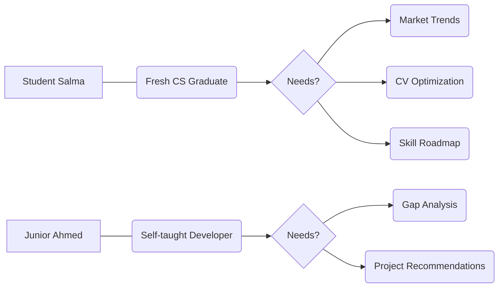
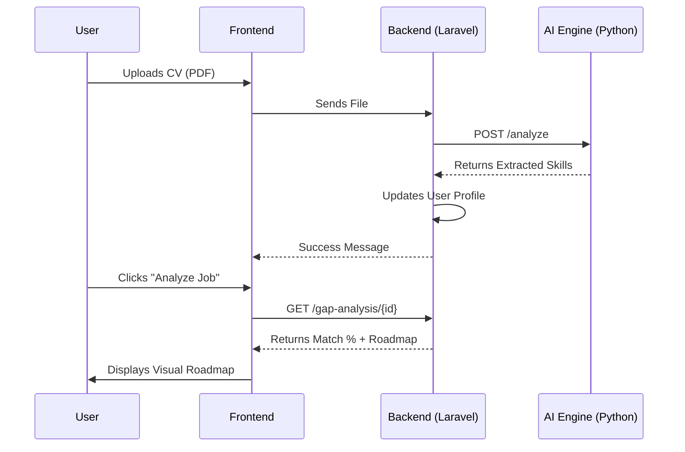
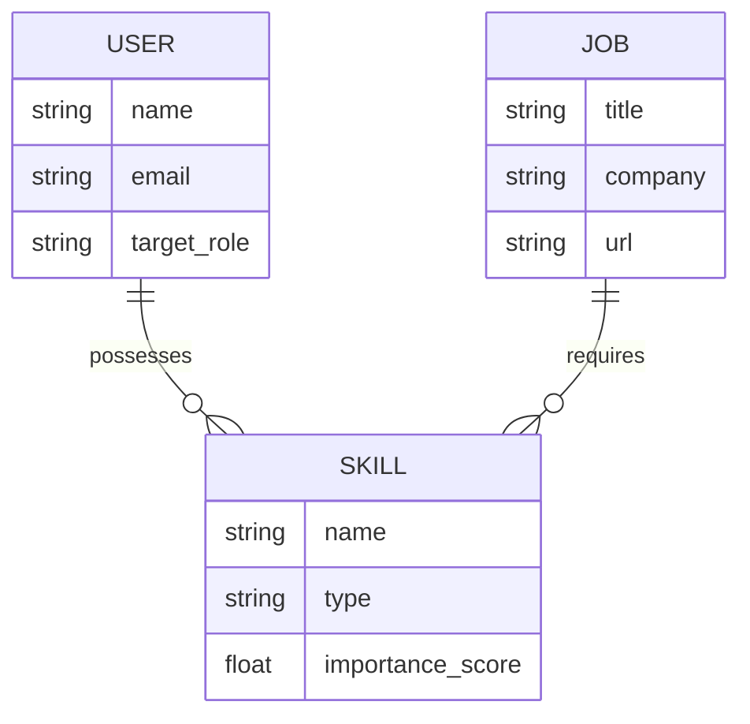

# 🧭 CareerCompass: Product Requirements Document (PRD)

**Project Name**: CareerCompass  
**Version**: 1.0  
**Status**: Draft (Graduation Project 2026)  
**Authors**: Graduation Project Team  

---

## � 1. Executive Summary
CareerCompass is an AI-driven career guidance platform designed to bridge the gap between academic qualifications and industry requirements. By utilizing **Natural Language Processing (NLP)** and **Real-time Market Analytics**, the platform empowers job seekers—especially fresh graduates—to identify their skill gaps, track market trends, and navigate a personalized learning roadmap toward their desired roles.

---

## ❗ 2. Problem Statement
The current job market transitions too fast for traditional educational curricula to keep up. Fresh graduates often face "The Experience Trap" and a "Skill Mismatch," where they are unaware of the specific technical stack or soft skills currently in demand. Existing job boards offer listings but lack the **intelligent analysis** to tell a user *why* they aren't a fit and *how* to become one.

---

## 🎯 3. Goals
- **Empowerment**: Provide users with a clear percentage match for any job listing.
- **Data-Driven Insights**: Aggregate live data from multiple global and local sources (Wuzzuf, Adzuna, Remotive).
- **Automation**: Automate CV parsing and skill extraction to reduce manual profile setup time by 80%.
- **Market Alignment**: Offer a "Trending Skills" dashboard updated every 48 hours to reflect real-world demand.

---

## 👥 4. Target Audience
1.  **Fresh Graduates**: Looking for their first role and needing guidance on what to learn.
2.  **Career Switchers**: Professionals moving into tech who need to identify transferable skills.
3.  **Hiring Managers (Indirect)**: Benefit from candidates who are better aligned with market needs.

---

## 👤 5. Personas


1.  **Salma (The Explorer)**: A final-year CS student who knows "Java" but doesn't know what modern web companies in Egypt actually require.
2.  **Ahmed (The Bridge Builder)**: A self-taught developer with projects but no clear way to measure if his skills match "Senior" vs "Junior" requirements.

---

## ✨ 6. Features
- **AI CV Analyzer**: PDF text extraction and NLP-based skill discovery.
- **Multi-Source Hybrid Scraper**: Intelligent dispatcher for API and HTML-based job sources.
- **Dynamic Skill Roadmap**: Categorizes missing skills into "Essential", "Important", and "Nice-to-have".
- **Market Intelligence Dashboard**: Real-time stats on skill demand and role popularity.
- **Admin Management UI**: Dashboard to monitor scrapers and manage target job roles.

---

## ⚙️ 7. Functional Requirements (FR)
| ID | Requirement | Description |
| :--- | :--- | :--- |
| **FR1** | CV Analysis | System must extract technical and soft skills from uploaded PDF files. |
| **FR2** | Gap Analysis | System must calculate a match percentage between user profile and job requirements. |
| **FR3** | Job Scraping | System must support fetching jobs from Wuzzuf, Adzuna, and Remotive. |
| **FR4** | Skill Creation | System must automatically add newly discovered skills to the database. |
| **FR5** | Authentication | Users must be able to register and login via JWT/Sanctum tokens. |

---

## 🚀 8. Non-Functional Requirements (NFR)
- **Scalability**: Backend must handle background scraping via Redis/Supervisor without affecting UI performance.
- **Performance**: CV analysis should return results in under 2 seconds.
- **Security**: All API endpoints must be protected by token-based authentication.
- **Availability**: Dashboard statistics should be cached (Redis) to ensure high-speed loading.

---

## � 9. User Flow


---

## 🖼️ 10. Wireframes (Conceptual)
```markdown
+-------------------------------------------------------+
| CareerCompass Dashboard          [ Profile ] [ Logout ] |
+-------------------------------------------------------+
| [ Upload CV ] -> (Parsing Progress...) -> [ 12 Skills ] |
+-------------------------------------------------------+
|  Trending Skills (Live)  |     My Top Matches         |
|  1. React (85%) [High]   |  1. Junior Dev @Tech (90%) |
|  2. Laravel (70%) [Med]  |  2. Web Designer (65%)     |
+-------------------------------------------------------+
|        [ Skill Roadmap: Learning Priority ]            |
|  [!] Essential: Docker, AWS   [*] Nice-to-have: Figma  |
+-------------------------------------------------------+
```

---

## �️ 11. Tech Stack
- **Frontend**: React 19, Vite, Tailwind CSS, Lucide Icons.
- **Backend**: Laravel 12, PHP 8.4, Laravel Sanctum, MySQL 8.
- **AI Engine**: Python 3.11, FastAPI, spaCy (NLP), PDFMiner.six.
- **Infrastructure**: Redis (Queue/Cache), Supervisor, Nginx.

---

## 📊 12. Database Schema (PRD View)


---

## ⚠️ 13. Risks
- **Data Source Changes**: Scraper may break if Wuzzuf changes its HTML structure (Mitigation: Use `undetected-chromedriver` and fallback APIs).
- **AI Accuracy**: CV parsing might miss non-standard formatting (Mitigation: Dual-mode extraction - NLP + Fuzzy matching).
- **Rate Limiting**: External APIs might block high-frequency requests (Mitigation: Randomized delays and Redis job spacing).

---
*End of PRD Document*
