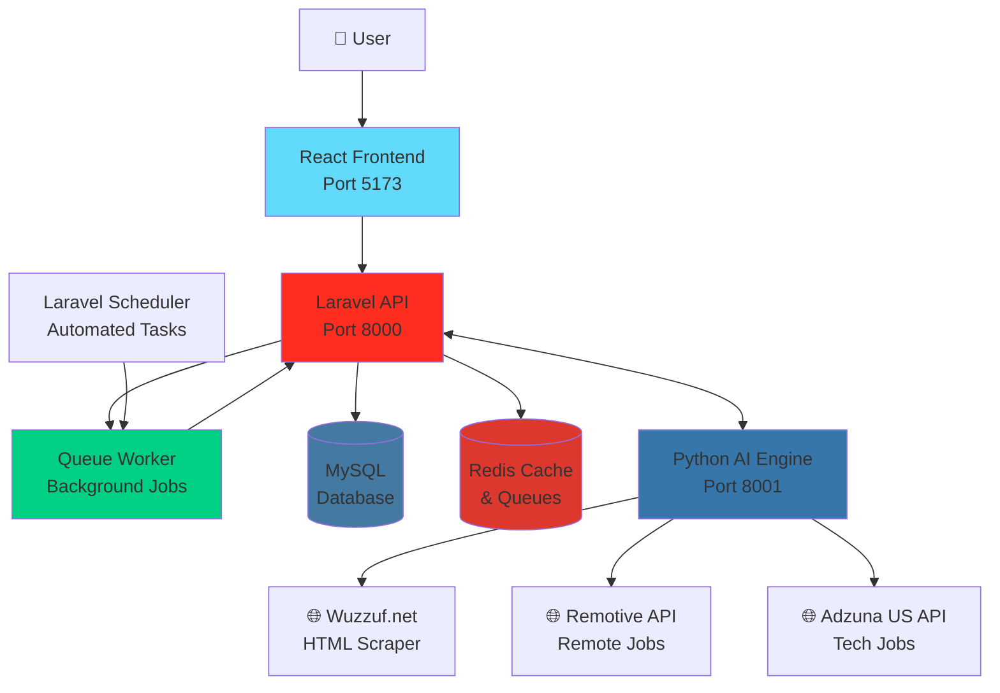
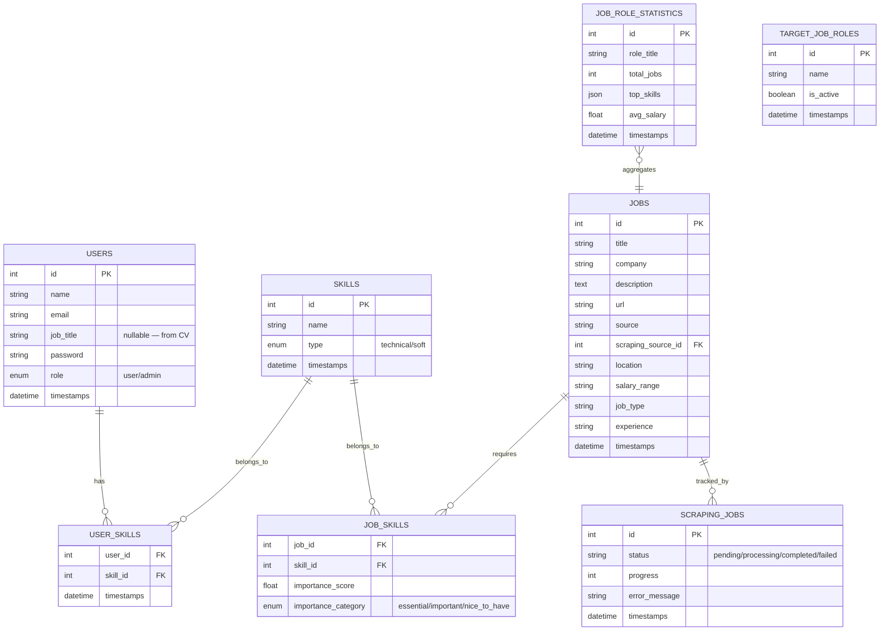
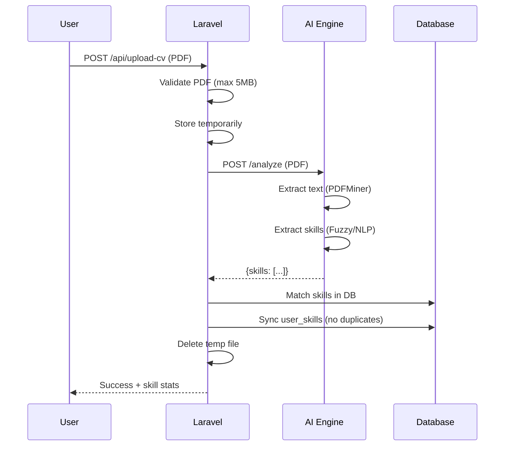
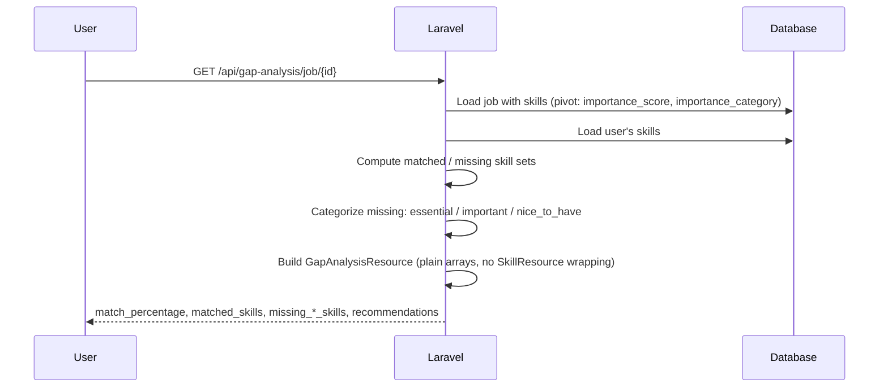
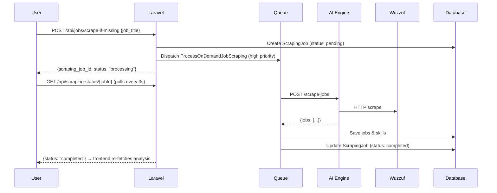

# CareerCompass 🧭

> **Graduation Project**: AI-powered career guidance platform using microservices architecture with React frontend

## 📋 Overview

CareerCompass is an **advanced AI-powered career development platform** that combines intelligent CV analysis, real-time job market scraping, and smart skill gap analysis to help users make data-driven career decisions. The platform features:

- **Market Intelligence System**: Automated job scraping with skill importance ranking (Essential/Important/Nice-to-have)
- **On-Demand Job Data**: Real-time job scraping with background queue processing and live status polling
- **Smart Gap Analysis**: Priority-based skill roadmap with market demand insights
- **Modern Architecture**: React frontend, Laravel backend with queue workers, Python AI engine, and Role-Based Access Control (RBAC)

---

## 🏗️ Architecture



### Components

| Component        | Technology      | Port | Purpose                                           |
| ---------------- | --------------- | ---- | ------------------------------------------------- |
| **Frontend**     | React 19 + Vite | 5173 | User interface, dashboard, authentication         |
| **Backend API**  | Laravel 12      | 8000 | User management, authentication, business logic   |
| **Queue Worker** | Laravel Queue   | -    | Background processing for scraping & calculations |
| **AI Engine**    | Python/FastAPI  | 8001 | CV parsing, skill extraction, job scraping        |
| **Database**     | MySQL           | 3306 | Data persistence                                  |
| **Cache/Queue**  | Redis (opt)     | 6379 | Fast caching and queue management (production)    |
| **Scheduler**    | Laravel Cron    | -    | Automated market data updates (every 48 hours)    |

---

## 📁 Project Structure

```
CareerCompass/
├── frontend/                 # React 19 + Vite Application
│   ├── src/
│   │   ├── api/
│   │   │   ├── client.js                   # Axios client (base URL, auth headers)
│   │   │   ├── endpoints.js                # All API endpoint definitions
│   │   │   └── scrapingSources.js          # Admin scraping sources API helpers
│   │   ├── components/
│   │   │   ├── Button.jsx                  # Reusable button component
│   │   │   ├── Card.jsx                    # Reusable card wrapper
│   │   │   ├── ErrorAlert.jsx              # Dismissible error banner
│   │   │   ├── ErrorBoundary.jsx           # React error boundary
│   │   │   ├── LoadingSpinner.jsx          # Full-screen / inline spinner
│   │   │   ├── Navbar.jsx                  # Scroll-aware glassmorphism nav (Framer Motion)
│   │   │   ├── ProcessingAnimation.jsx     # Animated CV-processing overlay
│   │   │   ├── ProtectedRoute.jsx          # Auth route guard
│   │   │   └── SuccessAlert.jsx            # Dismissible success banner
│   │   ├── hooks/
│   │   │   ├── useAsync.js                 # Generic async state handler
│   │   │   ├── useAuthHandler.js           # Auth token management
│   │   │   ├── useOnDemandScraping.js      # Trigger on-demand scraping
│   │   │   └── useScrapingStatus.js        # Poll scraping job status
│   │   ├── pages/
│   │   │   ├── admin/
│   │   │   │   └── AdminSources.jsx        # Admin — scraping source management
│   │   │   ├── user/
│   │   │   │   ├── Applications.jsx        # Job Application Tracker (Kanban-style statuses)
│   │   │   │   ├── Dashboard.jsx           # Main dashboard
│   │   │   │   ├── GapAnalysis.jsx         # Priority-based skill gap analysis
│   │   │   │   ├── Jobs.jsx                # Job listings + inline gap analysis + apply button
│   │   │   │   ├── MarketIntelligence.jsx  # Market trends & trending skills (route: /market)
│   │   │   │   └── Profile.jsx             # User profile management
│   │   │   ├── Home.jsx                    # Landing / welcome page
│   │   │   ├── Login.jsx                   # Login page
│   │   │   ├── NotFound.jsx                # 404 page
│   │   │   └── Register.jsx                # Registration page
│   │   ├── App.jsx                         # Root component + routing
│   │   └── main.jsx                        # Entry point
│   ├── public/                             # Static assets
│   ├── package.json                        # NPM dependencies
│   ├── vite.config.js                      # Vite configuration
│   ├── tailwind.config.js                  # Tailwind CSS config
│   ├── FRONTEND_DOCUMENTATION.md           # Frontend docs
│   └── DEVELOPER_GUIDE.md                  # Development guide
│
├── backend-api/              # Laravel 12 Application
│   ├── app/
│   │   ├── Http/
│   │   │   ├── Controllers/Api/
│   │   │   │   ├── AuthController.php              # Registration, login, logout
│   │   │   │   ├── ApplicationController.php       # Job Application Tracker (CRUD)
│   │   │   │   ├── CvController.php                # CV upload & analysis
│   │   │   │   ├── JobController.php               # Job browsing, scraping, on-demand, recommended
│   │   │   │   ├── GapAnalysisController.php       # Enhanced gap analysis with priorities
│   │   │   │   ├── MarketIntelligenceController.php # Market statistics & trends
│   │   │   │   └── TargetJobRoleController.php     # Target job roles management & scraping trigger
│   │   │   ├── Middleware/
│   │   │   │   └── IsAdmin.php                     # Role-Based Access Control (RBAC) guard
│   │   │   ├── Requests/
│   │   │   │   └── CvUploadRequest.php             # CV validation (5MB PDF)
│   │   │   └── Resources/
│   │   │       ├── GapAnalysisResource.php         # Gap analysis JSON formatting
│   │   │       ├── JobResource.php                 # Job JSON formatting
│   │   │       └── SkillResource.php               # Skill JSON formatting
│   │   ├── Jobs/
│   │   │   ├── ProcessMarketScraping.php           # Automated market data scraping
│   │   │   └── ProcessOnDemandJobScraping.php      # On-demand job scraping
│   │   ├── Console/Commands/
│   │   │   ├── ScrapeJobs.php                      # Manual scraping command
│   │   │   ├── TestScrapingSources.php             # Diagnose all scraping sources
│   │   │   └── CalculateSkillImportance.php        # Skill importance calculation
│   │   └── Models/
│   │       ├── User.php                            # User model + skills relation
│   │       ├── Skill.php                           # Skill model
│   │       ├── Job.php                             # Job model with importance
│   │       ├── JobRoleStatistic.php                # Market statistics per role
│   │       ├── ScrapingJob.php                     # Scraping job tracking
│   │       ├── ScrapingSource.php                  # Scraping source config model
│   │       └── TargetJobRole.php                   # Target job role config model
│   ├── database/
│   │   ├── migrations/
│   │   │   ├── *_create_skills_table.php
│   │   │   ├── *_create_jobs_table.php
│   │   │   ├── *_create_job_skills_table.php
│   │   │   ├── *_add_skill_importance_to_job_skills.php
│   │   │   ├── *_create_job_role_statistics_table.php
│   │   │   ├── *_create_scraping_jobs_table.php
│   │   │   ├── *_create_scraping_sources_table.php
│   │   │   ├── *_add_source_id_to_job_postings.php # Adds scraping_source_id FK
│   │   │   ├── *_create_target_job_roles_table.php # Dynamic job roles table
│   │   │   └── *_create_user_skills_table.php
│   │   └── seeders/
│   │       ├── SkillSeeder.php                     # 84 predefined skills
│   │       ├── ScrapingSourceSeeder.php            # 3 active scraping sources
│   │       └── TargetJobRoleSeeder.php             # Default target job roles
│   ├── routes/
│   │   ├── api.php                                 # API endpoints
│   │   └── console.php                             # Scheduler configuration
│   └── TESTING.md                          # API testing guide
│
├── ai-engine/                # Python FastAPI Service
│   ├── .env                                # Adzuna API credentials (not committed)
│   ├── main.py                             # FastAPI app entry point
│   ├── parser.py                           # PDF text extraction
│   ├── extractor.py                        # Enhanced skill extraction (NLP + fuzzy)
│   ├── scraper.py                          # Job dispatch + frequency analysis
│   ├── api_fetcher.py                      # Remotive & Adzuna US API fetchers
│   ├── html_scraper.py                     # Wuzzuf HTML scraper (undetected-chromedriver)
│   ├── test_scraper.py                     # /test-source FastAPI router
│   └── requirements.txt                    # Python dependencies
│
├── docs/
│   ├── FRONTEND_INTEGRATION.md             # React components guide
│   └── PRODUCTION_DEPLOYMENT.md            # Production setup guide
├── start_all.bat             # Windows launcher (4 services + queue worker)
├── CareerCompass.postman_collection.json   # Postman API collection (40+ endpoints)
└── README.md                 # This file
```

---

## 🚀 Getting Started

### Prerequisites

Make sure you have the following installed on your system:

- **PHP** 8.1+ with extensions: `pdo`, `pdo_mysql`, `mbstring`, `xml`, `curl`, `zip`
- **Composer** 2.x - [Download](https://getcomposer.org/)
- **Node.js** 18+ and npm - [Download](https://nodejs.org/)
- **Python** 3.11+ - [Download](https://www.python.org/)
- **MySQL** 8.x - [Download](https://dev.mysql.com/downloads/installer/)
- **Git** - [Download](https://git-scm.com/)

### Installation

> **💡 Quick Tip**: After installation, you can use `start_all.bat` (Windows) to launch all services at once!

#### 1️⃣ Clone Repository

```bash
git clone https://github.com/yourusername/CareerCompass.git
cd CareerCompass
```

#### 2️⃣ Setup Database

Create a MySQL database for the project:

```sql
CREATE DATABASE career_compass;
```

Or use your preferred MySQL client (phpMyAdmin, MySQL Workbench, etc.)

#### 3️⃣ Frontend Setup (React + Vite)

```bash
cd frontend

# Install dependencies
npm install

# Configuration (optional)
# Edit src/api/client.js if backend is not on http://127.0.0.1:8000
```

The frontend will automatically connect to the Laravel API at `http://127.0.0.1:8000/api`.

#### 4️⃣ Backend API Setup (Laravel)

```bash
cd backend-api

# Install PHP dependencies
composer install

# Create environment file
cp .env.example .env

# Generate application key
php artisan key:generate
```

**Configure `.env` file** - Open `backend-api/.env` and update:

```env
# Database Configuration
DB_CONNECTION=mysql
DB_HOST=127.0.0.1
DB_PORT=3306
DB_DATABASE=career_compass
DB_USERNAME=root
DB_PASSWORD=your_mysql_password

# Queue Configuration (use 'database' for development, 'redis' for production)
QUEUE_CONNECTION=database

# AI Engine Configuration
AI_ENGINE_URL=http://127.0.0.1:8001
AI_ENGINE_TIMEOUT=60

# Frontend URL (for CORS)
FRONTEND_URL=http://localhost:5173
```

**Run migrations and seed database:**

```bash
# Create database tables
php artisan migrate

# Seed with 84 predefined skills
php artisan db:seed --class=SkillSeeder

# Or run both at once
php artisan migrate:fresh --seed
```

#### 5️⃣ AI Engine Setup (Python + FastAPI)

```bash
cd ai-engine

# Create virtual environment
python -m venv venv

# Activate virtual environment
venv\Scripts\activate        # Windows
source venv/bin/activate     # macOS/Linux

# Install Python dependencies
pip install -r requirements.txt

# Download spaCy language model (Required for dynamic NLP skill extraction)
python -m spacy download en_core_web_sm
```

---

## ▶️ Running the Application

### 🎯 Option 1: Automated Launcher (Windows Only - Recommended)

The easiest way to start all services on Windows:

```bash
# From the project root directory
start_all.bat
```

This will launch **five** separate terminal windows:

- **Frontend** (React) - http://localhost:5173
- **Backend API** (Laravel) - http://127.0.0.1:8000
- **AI Engine** (Python) - http://127.0.0.1:8001
- **Queue Worker** (Laravel) - Background job processing
- **Scheduler** (Laravel) - Automated periodic tasks

### 🔧 Option 2: Manual Start (All Operating Systems)

Open **four separate terminal windows** and run each service:

**Terminal 1 - Frontend (React + Vite):**

```bash
cd frontend
npm run dev
# Frontend available at http://localhost:5173
```

**Terminal 2 - Backend API (Laravel):**

```bash
cd backend-api
php artisan serve --port=8000
# API available at http://127.0.0.1:8000
```

**Terminal 3 - AI Engine (Python + FastAPI):**

```bash
cd ai-engine
venv\Scripts\activate        # Windows
# OR
source venv/bin/activate     # macOS/Linux

uvicorn main:app --reload --port 8001
# AI Engine available at http://127.0.0.1:8001
```

**Terminal 4 - Queue Worker (Laravel):**

```bash
cd backend-api
php artisan queue:work --queue=high,default --tries=3 --timeout=300
# Queue Worker processing background jobs
```

### 📅 Optional: Activate Scheduler (Automated Market Updates)

The scheduler automatically runs market scraping every 48 hours and skill importance calculations daily.

**For Development Testing:**

```bash
cd backend-api
php artisan schedule:work
# Scheduler daemon will run scheduled tasks at their defined times
```

**For Production (Linux/macOS):**

Add to crontab (`crontab -e`):

```bash
* * * * * cd /path-to-your-project/backend-api && php artisan schedule:run >> /dev/null 2>&1
```

**For Production (Windows):**

Use Task Scheduler to run `php artisan schedule:run` every minute.

> **Note**: The scheduler runs:
>
> - Market scraping: Every 48 hours at 02:00 AM
> - Skill importance calculation: Daily at 04:00 AM
> - Both tasks use `withoutOverlapping()` to prevent concurrent executions

### ✅ Verify Everything is Running

Once all services are started, check the following URLs:

| Service     | URL                              | Expected Response       |
| ----------- | -------------------------------- | ----------------------- |
| Frontend    | http://localhost:5173            | React login/register UI |
| Backend API | http://127.0.0.1:8000/api/health | `{"status": "ok"}`      |
| AI Engine   | http://127.0.0.1:8001            | `{"message": "ok"}`     |
| AI Engine   | http://127.0.0.1:8001/docs       | Swagger UI              |

---

## 🔌 API Endpoints

### Authentication & Health (Public)

| Method | Endpoint        | Description                 |
| ------ | --------------- | --------------------------- |
| GET    | `/api/health`   | Health check (version info) |
| POST   | `/api/register` | Create new user account     |
| POST   | `/api/login`    | Login and get token         |

### User & Skills (Protected)

| Method | Endpoint                | Auth | Description                                                                                     |
| ------ | ----------------------- | ---- | ----------------------------------------------------------------------------------------------- |
| GET    | `/api/user`             | ✅   | Get current user                                                                                |
| POST   | `/api/logout`           | ✅   | Logout (revoke tokens)                                                                          |
| POST   | `/api/upload-cv`        | ✅   | Upload CV → calls `/parse-cv` Python endpoint → returns `job_title`, `experience_years`, skills |
| GET    | `/api/user/skills`      | ✅   | View user's skills                                                                              |
| DELETE | `/api/user/skills/{id}` | ✅   | Remove a skill                                                                                  |

### Jobs (Public + Protected)

| Method | Endpoint                       | Auth | Description                                                          |
| ------ | ------------------------------ | ---- | -------------------------------------------------------------------- |
| GET    | `/api/jobs`                    | ❌   | Browse all jobs (paginated)                                          |
| GET    | `/api/jobs/{id}`               | ❌   | View single job details                                              |
| GET    | `/api/jobs/recommended`        | ✅   | Get AI-recommended jobs based on user's skills                       |
| POST   | `/api/jobs/scrape`             | ✅   | Trigger job scraping (`query`, `max_results`, `use_samples` in body) |
| POST   | `/api/jobs/scrape-if-missing`  | ✅   | On-demand scraping with status polling                               |
| GET    | `/api/scraping-status/{jobId}` | ✅   | Check scraping job status                                            |

### Application Tracker (Protected)

| Method | Endpoint                 | Auth | Description                                    |
| ------ | ------------------------ | ---- | ---------------------------------------------- |
| GET    | `/api/applications`      | ✅   | List all tracked job applications              |
| POST   | `/api/applications`      | ✅   | Save/track a job (updateOrCreate — safe dedup) |
| GET    | `/api/applications/{id}` | ✅   | Get a specific application with job details    |
| PATCH  | `/api/applications/{id}` | ✅   | Update application status or notes             |
| DELETE | `/api/applications/{id}` | ✅   | Remove application from tracker                |

### Gap Analysis (Protected)

| Method | Endpoint                            | Auth | Description                                       |
| ------ | ----------------------------------- | ---- | ------------------------------------------------- |
| GET    | `/api/gap-analysis/job/{id}`        | ✅   | Analyze match with job (essential/important/nice) |
| POST   | `/api/gap-analysis/batch`           | ✅   | Batch analyze multiple jobs                       |
| GET    | `/api/gap-analysis/recommendations` | ✅   | Get priority-based skill roadmap                  |

### Market Intelligence (Protected)

| Method | Endpoint                             | Auth | Description                           |
| ------ | ------------------------------------ | ---- | ------------------------------------- |
| GET    | `/api/market/overview`               | ✅   | Get market overview statistics        |
| GET    | `/api/market/role-statistics/{role}` | ✅   | Get statistics for specific job role  |
| GET    | `/api/market/trending-skills`        | ✅   | Get trending skills with demand data  |
| GET    | `/api/market/skill-demand/{role}`    | ✅   | Get skill demand breakdown for a role |

### Admin — Scraping Sources (Protected)

| Method | Endpoint                                  | Auth | Description                      |
| ------ | ----------------------------------------- | ---- | -------------------------------- |
| GET    | `/api/admin/scraping-sources`             | ✅   | List all scraping sources        |
| POST   | `/api/admin/scraping-sources`             | ✅   | Create a new source              |
| PUT    | `/api/admin/scraping-sources/{id}`        | ✅   | Update a source                  |
| DELETE | `/api/admin/scraping-sources/{id}`        | ✅   | Delete a source                  |
| PATCH  | `/api/admin/scraping-sources/{id}/toggle` | ✅   | Toggle active/inactive status    |
| POST   | `/api/admin/scraping-sources/test`        | ✅   | Run diagnostics on all sources   |
| GET    | `/api/admin/job-roles`                    | ✅   | List all target job roles        |
| POST   | `/api/admin/job-roles`                    | ✅   | Create a new target role         |
| PATCH  | `/api/admin/job-roles/{id}/toggle`        | ✅   | Toggle target role active status |
| DELETE | `/api/admin/job-roles/{id}`               | ✅   | Delete a target role             |
| POST   | `/api/admin/scraping/run-full`            | ✅   | Trigger full market scraping     |

### AI Engine Endpoints

| Method | Endpoint              | Description                                                            |
| ------ | --------------------- | ---------------------------------------------------------------------- |
| GET    | `/`                   | Health check                                                           |
| GET    | `/skills`             | List all predefined skills                                             |
| POST   | `/analyze`            | Analyze CV and extract skills                                          |
| POST   | `/parse-cv`           | **Phase 1** — Extract job_title, experience_years, and skills from PDF |
| POST   | `/extract-text`       | Extract raw text from PDF                                              |
| POST   | `/scrape-jobs`        | Dispatch scraping across active sources                                |
| GET    | `/scrape-jobs/status` | Scraper service status                                                 |
| POST   | `/test-source`        | Probe a single source (used by Artisan)                                |

---

## 📊 Database Schema



### Skills Management

- Initially seeded with **84 predefined skills** (66 technical, 18 soft).
- **Dynamic Skill Creation**: The system now dynamically extracts new skills from job descriptions using NLP and creates them on-the-fly during scraping.

---

## 🔄 System Flows

### CV Upload Flow



### Gap Analysis Flow



### On-Demand Job Scraping Flow



---

## 🧪 Testing

### Test All Scraping Sources

The fastest way to verify every source is healthy:

```bash
cd backend-api
php artisan scrape:test-sources
```

Expected output — **3/3 sources passed**:

```
  Testing: Wuzzuf Laravel Jobs [html]       ✔ SUCCESS
  Testing: Remotive Software Dev Jobs [api] ✔ SUCCESS
  Testing: Adzuna US Tech Jobs [api]        ✔ SUCCESS
  Results: 3/3 sources passed.
```

### Test Laravel API

See [TESTING.md](backend-api/TESTING.md) for detailed testing instructions.

**Quick Test:**

```bash
# Register user
curl -X POST http://127.0.0.1:8000/api/register \
  -H "Content-Type: application/json" \
  -d '{"name":"Test User","email":"test@example.com","password":"password123","password_confirmation":"password123"}'

# Login and get token
curl -X POST http://127.0.0.1:8000/api/login \
  -H "Content-Type: application/json" \
  -d '{"email":"test@example.com","password":"password123"}'

# Run gap analysis for job ID 1
curl -X GET http://127.0.0.1:8000/api/gap-analysis/job/1 \
  -H "Authorization: Bearer <token>"
```

---

## ✨ Features

### ✅ Complete System (Phases 1-21)

- [x] **Phase 1: Project Setup** - Git, Laravel, Python structure
- [x] **Phase 2: Database Design** - Migrations, models, relationships, seeders
- [x] **Phase 3: AI Engine** - CV parsing, skill extraction (PDFMiner + spaCy + Fuzzy matching)
- [x] **Phase 4: Backend API** - Auth (Sanctum), CV upload, skill management
- [x] **Phase 5: Job Scraper** - Wuzzuf scraping, sample jobs, storage & deduplication
- [x] **Phase 6: Gap Analysis** - Match calculation, batch analysis, recommendations
- [x] **Phase 7: Frontend Dashboard** - Complete React/Vite UI with authentication & all features
- [x] **Phase 8: Market Intelligence** - Automated scraping, skill importance ranking, market statistics
- [x] **Phase 9: Production Optimizations** - Retry logic, memory chunking, auto-polling, rate limiting
- [x] **Phase 10: Bug Fixes & Stability** - `GapAnalysisResource` fix, empty-CV validation, URL normalization
- [x] **Phase 11: System Expansion & Scraping Resilience** - Multi-source scraping admin UI, `scrape:test-sources` command, Adzuna US + Remotive integration
- [x] **Phase 12: Cleanup & Hardening** - Removed debug artifacts, fixed Adzuna API (US endpoint, UA spoofing, credential env-vars), deduplicated frontend API files, cleaned orphaned pages
- [x] **Phase 13: Dynamic Job Roles & End-to-End Scraping Update** - Implemented dynamic target job roles (`target_job_roles` table), added role management and manual "Run Full Scraping" triggers to Admin Dashboard, fixed jobs-to-sources database relationship bugs (`scraping_source_id`), ensuring data integrity and ease of remote configuration.
- [x] **Phase 14: Dynamic Skill Data Management** - Replaced hardcoded skill lists with dynamic NLP skill extraction in the AI engine and implemented on-the-fly missing skill creation in Laravel jobs, ensuring comprehensive skill data attachment.
- [x] **Phase 15: CV Persistence & Smart Gap Analysis** - In-place upgrade: pdfplumber+spaCy CV parsing (`/parse-cv`), fuzzy+weighted skill matching, `critical_skills`/`nice_to_have_skills`, `persistUserProfile()` (saves `job_title` to users via `auth('sanctum')` + syncs matched skills via `syncWithoutDetaching`), `findRecommendedJobs()` (up to 6 LIKE-matched jobs), SVG `MatchGauge` + `SkillCard` components, Recommended Jobs grid in `GapAnalysis.jsx`. `CvController` switched from `/analyze` → `/parse-cv` and now returns `job_title` + `experience_years` in the upload response.
- [x] **Phase 16: Unified Scraping Management UI** - Integrated Wuzzuf, Adzuna, and Remotive configuration with a new React dashboard UI for seamless remote management of Scraping Sources and dynamic Target Roles.
- [x] **Phase 17: Job Application Tracker & Recommended Jobs** - Added a full-featured Application Tracker (`ApplicationController`, `Applications.jsx`) with 6 status stages (saved → applied → interviewing → offered → rejected → archived), plus an AI-powered Recommended Jobs endpoint (`GET /api/jobs/recommended`) that matches jobs to user skill profiles.
- [x] **Phase 18: Personalized Recommended Jobs on Jobs Page** - Added `GET /api/jobs/recommended` endpoint (`JobController::getRecommended`) that reads the user's persisted `job_title`, strips seniority prefixes, LIKE-queries `job_postings`, and returns top 10 matching jobs. Fixed route conflict by adding `->whereNumber('id')` constraint to the public `/jobs/{id}` wildcard. Added `🎯 Recommended For You` horizontal-scroll snap carousel to `Jobs.jsx` with skeleton loaders, apply buttons, and gap analysis integration.
- [x] **Phase 19: Premium UI Redesign** - Completely overhauled the frontend visual design with Framer Motion animations, scroll-aware glassmorphism Navbar, role-based admin Settings icon, new `ProcessingAnimation.jsx` overlay, renamed `/market-intelligence` route to `/market`, and applied premium Tailwind design tokens across all pages.
- [x] **Phase 20: Full Frontend Integration & Market Intelligence Dashboard** - Completed end-to-end integration of the Jobs Portal and Applications Tracker: fixed `PUT → PATCH` mismatch in `applicationsAPI`, forwarded `params` in `jobsAPI.getJobs()` to enable search, added per-card **📌 Track** button with toast feedback in `Jobs.jsx`, fixed null-safety and gap-analysis route in `Applications.jsx`, added optimistic status updates and a refresh button. Rebuilt `MarketIntelligence.jsx` as a fully interactive recharts dashboard with animated stat cards, a Top-15 Trending Skills BarChart, filterable skill type pills, a skill card grid with demand progress bars, and a Role Skill Demand section with a searchable results chart and skill-category breakdown. Updated `Navbar.jsx` so the user avatar pill navigates to `/profile` with a hover dropdown (Profile + Logout) and a mobile `View Profile` shortcut.
- [x] **Phase 21: Security, Structure & Branding Updates** - Implemented robust Role-Based Access Control (RBAC) securely segregating admin utilities and user areas. Restructured frontend pages into dedicated `/admin` and `/user` directories for a scalable architecture. Enhanced backend API validations for improved data integrity, and updated site branding with a custom SVG favicon and appropriate document titles.

### 📈 Market Intelligence System

- **Automated Job Scraping**: Scheduled every **48 hours at 02:00 AM** with `withoutOverlapping()` protection
- **Daily Skill Calculation**: Runs at **04:00 AM** to update skill importance after scraping
- **On-Demand Scraping**: Real-time job data on user request with **live status polling**
- **Skill Importance Ranking**: Categorizes skills as Essential (>70%), Important (40-70%), or Nice-to-have (<40%)
- **Market Statistics**: Trending skills, role-specific demand, salary ranges
- **Queue Processing**: Background job handling with **3x retry logic** and exponential backoff
- **Smart Prioritization**: High-priority queue for on-demand requests
- **Memory Optimized**: Processes 100 records at a time for large datasets
- **Rate Limited Scraping**: Random delays (0.5-2s) to prevent IP bans

### 🎯 Enhanced Gap Analysis & Personalized Jobs (Phases 15-17)

**Smart CV Parsing:**

- **`/parse-cv` Endpoint**: pdfplumber + spaCy NLP extracts `job_title`, `experience_years`, and skills from PDF
- **CV Persistence**: `auth('sanctum')->user()->update(['job_title' => ...])` in `CvController` persists detected title immediately on upload
- **Extended Upload Response**: `POST /api/upload-cv` now returns `job_title` and `experience_years` alongside skills

**Smart Gap Analysis:**

- **Fuzzy Skill Matching**: `normalizeSkillName()` handles variants like `Vue.js` ≡ `VueJS`, `NodeJS` ≡ `Node.js`
- **Weighted Match Score**: High-importance skills carry proportionally more weight toward `match_percentage`
- **Critical / Nice-to-Have Split**: Missing skills split into `critical_skills` (importance > 60) and `nice_to_have_skills` (≤ 60)
- **Inline Recommended Jobs**: Up to 6 real jobs from `job_postings` matching detected title in every gap analysis response
- **SVG Match Gauge**: Animated circular gauge (green ≥75% / amber ≥50% / red <50%) — no external library
- **Priority-Based Roadmap**: Skills categorized as Essential 🔴 / Important 🟡 / Nice-to-have 💼
- **Batch Analysis**: Compare skills against multiple jobs simultaneously

**Personalized Jobs Page:**

- **`GET /api/jobs/recommended`**: Reads user's `job_title`, strips seniority prefix, LIKE-queries `job_postings`, returns top 10
- **Route-Conflict Fix**: `->whereNumber('id')` on `/jobs/{id}` prevents `recommended` being swallowed as an ID
- **🎯 Recommended For You Carousel**: Horizontal snap-scroll carousel in `Jobs.jsx` with skeleton loaders and gap analysis integration

### 🚀 System Optimizations (Production-Ready)

**Backend Reliability:**

- **Retry Logic**: 3 automatic retries with 100ms delays for HTTP failures
- **Intelligent Retry**: Only retries on connection errors and 5xx server errors
- **Exponential Backoff**: Progressive delay multiplier for failed requests
- **Failed Job Tracking**: Automatic status updates in database for monitoring
- **Empty CV Guard**: Returns user-friendly 422 error if no skills are extracted from CV

**Memory Management:**

- **Chunked Processing**: Processes 100 records at a time instead of loading all
- **Optimized Queries**: Prevents memory exhaustion with large datasets (100k+ jobs)
- **Efficient Skill Calculation**: Reduces memory usage by ~90% for importance calculations

**Frontend UX:**

- **Auto-Polling Hook** (`useScrapingStatus`): Polls backend every 3 seconds with cleanup on unmount
- **On-Demand Scraping Hook** (`useOnDemandScraping`): Encapsulates trigger + status lifecycle
- **Real-Time Updates**: Live status transitions (pending → processing → completed/failed)
- **"Gathering Live Data" UI**: Animated spinner, progress bar, and status messages
- **Callback System**: `onCompleted` and `onFailed` handlers for flexible UI logic
- **Error Boundaries**: React `ErrorBoundary` component prevents full-page crashes

**Scraping Safety:**

- **Rate Limiting**: Random delays (0.5-2 seconds) between processing job cards
- **IP Ban Prevention**: Human-like scraping patterns with randomized delays
- **URL Normalization**: Query parameters and tracking fragments stripped before deduplication

### 🎨 Frontend Pages & Components

**Pages:**

- `Home.jsx` - Landing / welcome page
- `Dashboard.jsx` - Main dashboard with skills overview
- `Login.jsx` / `Register.jsx` - Authentication pages
- `Jobs.jsx` - Job listings with inline quick gap analysis and Apply button
- `GapAnalysis.jsx` - Full detailed gap analysis with priority roadmap
- `Applications.jsx` - Job Application Tracker with Kanban-style status pipeline
- `MarketIntelligence.jsx` - Interactive recharts dashboard: stat cards, Top-15 Trending Skills BarChart, skill card grid, Role Skill Demand search with results chart and category breakdown
- `Profile.jsx` - User profile management
- `NotFound.jsx` - 404 error page

**Reusable Components:**

- `Navbar.jsx` - Scroll-aware glassmorphism navigation; user avatar navigates to `/profile` with hover dropdown (Profile + Logout); role-based admin icon; Framer Motion mobile drawer
- `ProcessingAnimation.jsx` - Animated CV-processing overlay component
- `ProtectedRoute.jsx` - Redirects unauthenticated users
- `ErrorAlert.jsx` / `SuccessAlert.jsx` - Dismissible banners
- `ErrorBoundary.jsx` - Catches and displays React render errors
- `LoadingSpinner.jsx` - Configurable full-screen or inline spinner
- `Button.jsx` / `Card.jsx` - Design-system primitives

**Custom Hooks:**

| Hook                  | Purpose                                      |
| --------------------- | -------------------------------------------- |
| `useScrapingStatus`   | Polls scraping job status, fires callbacks   |
| `useOnDemandScraping` | Triggers on-demand scrape and manages state  |
| `useAsync`            | Generic async state (loading / data / error) |
| `useAuthHandler`      | Manages token storage and auth headers       |

### 🔒 Security Features

- **Role-Based Access Control (RBAC)**: Segregated functionalities using robust middleware (`IsAdmin`) to protect admin endpoints and frontend routes based on user role.
- **Strict Validations**: Complete data validation using Laravel FormRequests for both user actions and admin scraping configs to maintain strict data integrity.
- **SQL Injection Prevention**: Uses Laravel's Eloquent ORM and parameterized queries
- **Race Condition Handling**: `withoutOverlapping()` for scheduled tasks + DB transactions
- **Input Sanitization**: All user inputs validated via Laravel Form Requests
- **XSS Protection**: React auto-escapes JSX content
- **Secure Authentication**: Laravel Sanctum token-based API authentication
- **Rate Limiting**: API endpoints throttled to prevent abuse and DoS attacks
- **CV Validation**: Empty-CV check returns descriptive 422 before saving any data

### 🚧 Future Enhancements

- [ ] **Learning Resources** - Link skills to courses (Udemy, Coursera)
- [ ] **Career Paths** - Multi-step job progression planning
- [ ] **Skill Proficiency** - Track beginner/intermediate/expert levels
- [ ] **Job Alerts** - Email notifications for matching jobs
- [ ] **Mobile App** - React Native implementation
- [ ] **Admin Panel** - Manage users, jobs, and skills (Admin/ directory reserved)

---

## 🛠️ Technologies

### Frontend

- **React 19** - Modern UI library with hooks
- **Vite** - Lightning-fast build tool and dev server
- **Tailwind CSS 3.4** - Utility-first CSS framework
- **Framer Motion** - Production-ready animation library (Navbar, page transitions, stat cards)
- **Recharts 3** - Composable charting library (Market Intelligence BarCharts, RadarCharts)
- **Axios** - Promise-based HTTP client
- **React Router DOM 7** - Client-side routing
- **Lucide React** - Beautiful, consistent icons

### Backend

- **Laravel 12** - Modern PHP framework
- **MySQL 8** - Relational database
- **Laravel Sanctum** - API token authentication
- **Guzzle HTTP** - HTTP client for AI Engine communication

### AI Engine

- **FastAPI** - High-performance Python web framework
- **PDFMiner.six** - PDF text extraction
- **spaCy** - Industrial-strength NLP library
- **BeautifulSoup4** - HTML/XML parser for web scraping
- **httpx** - Async HTTP client (Remotive & Adzuna API fetching)
- **FuzzyWuzzy** - Fuzzy string matching (default skill extraction)
- **python-Levenshtein** - Fast string similarity calculations
- **python-dotenv** - Loads API credentials from `ai-engine/.env`
- **undetected-chromedriver** - Bypass anti-bot detection for HTML scraping
- **Uvicorn** - Lightning-fast ASGI server

### Tools & DevOps

- **Git** - Version control
- **Composer** - PHP dependency manager
- **npm** - JavaScript package manager
- **Pip** - Python package installer
- **Postman** - API testing and documentation

---

## 📝 Development Notes

### Key Design Decisions

1. **Microservices Architecture**: Separates concerns — Laravel handles business logic, Python handles AI/ML
2. **Sanctum over Passport**: Simpler token-based auth for SPA/mobile apps
3. **Fuzzy Matching Default**: Faster than NLP, good enough for most cases
4. **Sample Jobs**: Enables testing without actual web scraping
5. **Duplicate Prevention**: URL-based primary, title+company fallback; query parameters stripped
6. **Plain Array Serialization in GapAnalysisResource**: Skills are returned as plain arrays rather than wrapped in `SkillResource::collection()` to avoid type mismatch (controller produces plain PHP arrays from `->map()`, not Eloquent models)
7. **Pivot Timestamps**: Track when skills/jobs were added

### Environment Variables

**Laravel (`backend-api/.env`):**

```env
AI_ENGINE_URL=http://127.0.0.1:8001
AI_ENGINE_TIMEOUT=60
QUEUE_CONNECTION=database
FRONTEND_URL=http://localhost:5173
```

**Python AI Engine (`ai-engine/.env`):**

```env
ADZUNA_APP_ID=your_adzuna_app_id
ADZUNA_APP_KEY=your_adzuna_app_key
```

> **Note**: Register free at [developer.adzuna.com](https://developer.adzuna.com/) to get your credentials. The Remotive source requires no credentials.

---

## 🐛 Troubleshooting

### Frontend Issues

**Development server won't start:**

```bash
cd frontend
rm -rf node_modules package-lock.json  # or rmdir /s /q node_modules on Windows
npm install
npm run dev
```

**Cannot connect to backend API:**

- Ensure Laravel is running on port 8000
- Check `frontend/src/api/client.js` for correct `baseURL`
- Verify CORS is enabled in Laravel (already configured)

### Laravel Server Won't Start

```bash
cd backend-api
php artisan config:clear
php artisan cache:clear
php artisan route:clear
composer dump-autoload
```

### Gap Analysis Returns 500 Error

- Make sure `GapAnalysisResource.php` uses the `toArray_()` helper (not `SkillResource::collection()`)
- Clear caches: `php artisan cache:clear` and `php artisan config:clear`
- Ensure the user has uploaded a CV and has at least some skills on their profile

### AI Engine Import Errors

```bash
cd ai-engine
deactivate

rm -rf venv  # or rmdir /s venv on Windows
python -m venv venv
venv\Scripts\activate  # Windows
# OR
source venv/bin/activate  # macOS/Linux

pip install -r requirements.txt --upgrade
```

### Database Connection Error

- Check MySQL is running: `mysql -u root -p`
- Verify `.env` database credentials in `backend-api/.env`
- Ensure database exists: `CREATE DATABASE career_compass;`
- Run migrations: `php artisan migrate:fresh --seed`

### Scraping Source Fails Diagnostic

```bash
cd backend-api
php artisan scrape:test-sources
```

- **Wuzzuf fails**: Check internet connection; HTML selectors may need updating in `html_scraper.py`
- **Remotive fails**: Public API — just check internet connectivity
- **Adzuna fails (HTTP 400)**: Ensure `ai-engine/.env` has correct `ADZUNA_APP_ID` / `ADZUNA_APP_KEY`, and restart the Python server after any `.env` changes
- **Adzuna returns 0 jobs**: Python server needs a restart to reload `.env` credentials

### Port Already in Use

**Port 8000 (Laravel):**

```bash
# Windows
netstat -ano | findstr :8000
taskkill /PID <PID> /F

# macOS/Linux
lsof -ti:8000 | xargs kill -9
```

**Port 8001 (AI Engine):**

```bash
# Windows
netstat -ano | findstr :8001
taskkill /PID <PID> /F

# macOS/Linux
lsof -ti:8001 | xargs kill -9
```

**Port 5173 (Vite):**

```bash
# Usually auto-assigns to next available port
# Or manually specify in vite.config.js
```

---

## 📚 Documentation

- **Frontend Integration Guide**: [docs/FRONTEND_INTEGRATION.md](docs/FRONTEND_INTEGRATION.md) - React hooks & components for Market Intelligence
- **Production Deployment**: [docs/PRODUCTION_DEPLOYMENT.md](docs/PRODUCTION_DEPLOYMENT.md) - Redis, Supervisor, deployment guide
- **API Testing Guide**: [backend-api/TESTING.md](backend-api/TESTING.md)
- **AI Engine API Docs**: http://127.0.0.1:8001/docs (Interactive Swagger UI - when running)
- **Postman Collection**: Import `CareerCompass.postman_collection.json` for 30+ ready-to-use API requests

---

## 🤝 Contributing

This is a graduation project. For questions or collaboration:

1. Fork the repository
2. Create a feature branch (`git checkout -b feature/amazing-feature`)
3. Commit your changes (`git commit -m 'Add amazing feature'`)
4. Push to the branch (`git push origin feature/amazing-feature`)
5. Open a Pull Request

---

## 📄 License

MIT License - See LICENSE file for details

---

## 👥 Authors

- **Student Name** - Graduation Project 2026
- **Supervisor** - [Name]

---

## 🙏 Acknowledgments

- Laravel Community
- FastAPI Team
- spaCy NLP Library
- Wuzzuf (job listings source)

---

## 📦 Quick Start Summary

### For Windows Users (Easiest):

```bash
# 1. Setup database (in MySQL client)
CREATE DATABASE career_compass;

# 2. Install all dependencies
cd frontend && npm install
cd ../backend-api && composer install
cd ../ai-engine && python -m venv venv && venv\Scripts\activate && pip install -r requirements.txt

# 3. Configure Laravel backend
cd backend-api
cp .env.example .env
# Edit .env with your database credentials
php artisan key:generate
php artisan migrate:fresh --seed

# 4. Start all services with one command!
cd ..
start_all.bat

# ✅ Done! Visit http://localhost:5173
```

### For macOS/Linux Users:

```bash
# 1. Setup database
mysql -u root -p
CREATE DATABASE career_compass;
EXIT;

# 2. Install dependencies
cd frontend && npm install && cd ..
cd backend-api && composer install && cd ..
cd ai-engine && python3 -m venv venv && source venv/bin/activate && pip install -r requirements.txt && cd ..

# 3. Configure Laravel
cd backend-api
cp .env.example .env
# Edit .env with database credentials
php artisan key:generate
php artisan migrate:fresh --seed
cd ..

# 4. Start services (4 terminals)
# Terminal 1: cd frontend && npm run dev
# Terminal 2: cd backend-api && php artisan serve --port=8000
# Terminal 3: cd ai-engine && source venv/bin/activate && uvicorn main:app --reload --port 8001
# Terminal 4: cd backend-api && php artisan queue:work --queue=high,default --tries=3
```

### 🧪 Test Your Setup:

1. **Register** a new account at http://localhost:5173
2. **Login** with your credentials
3. **Upload CV** to extract skills automatically
4. **Browse Jobs** from the dashboard
5. **Analyze Gap** to see your skill match percentage and priority roadmap
6. **Market Intelligence** to see trending skills in the job market
7. **Get Recommendations** for skills to learn next

### 📮 API Testing (Optional):

Import `CareerCompass.postman_collection.json` into Postman for comprehensive API testing.

---

**Last Updated**: March 2026
**Project Status**: ✅ **Phase 21 Complete — Security, Structure & Branding Updates**
**Components**: Frontend (React 19 + Vite + Framer Motion + Recharts) + Backend API (Laravel 12) + Queue Worker + Scheduler + AI Engine (FastAPI)
**API Endpoints**: 45+ total (Laravel APIs + Python APIs + Market Intelligence + Admin Source APIs + Application Tracker)
**Scraping Sources**: Wuzzuf (HTML) • Remotive API (free) • Adzuna US API — all 3 verified with `scrape:test-sources`
**Key Features**: Role-Based Access Control (RBAC) • CV Analysis • Multi-Source Job Scraping • Gap Analysis • Market Intelligence Dashboard • Skill Importance Ranking • Real-time Polling • Scraping Source Management • Dynamic NLP Extraction • Application Tracker • Recommended Jobs • Premium Animated UI • Interactive Recharts Charts
**Optimizations**: 3x Retry Logic • Memory Chunking • Auto-Polling • Rate Limiting • Scheduler Automation • GapAnalysis Bug Fix • Adzuna UA Spoofing • Env-based Credential Management • On-the-fly Data Creation • PUT→PATCH Fix • Search Params Forwarding • Optimistic UI Updates
