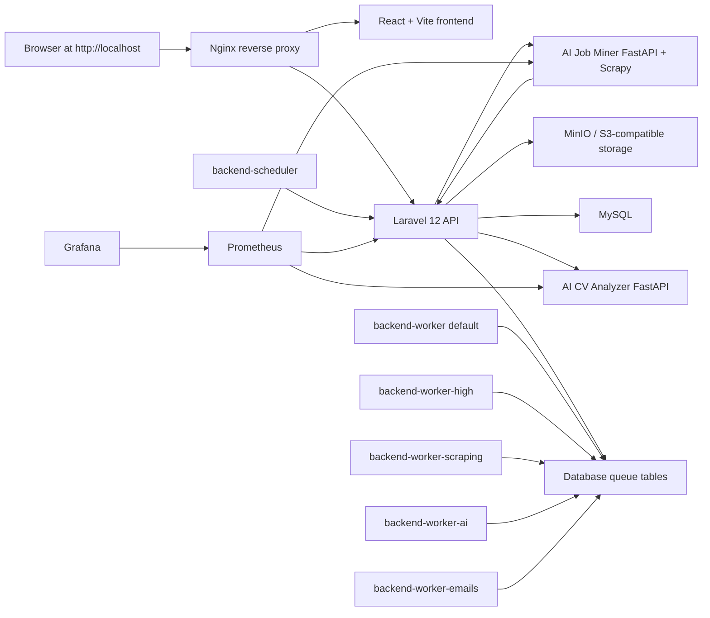

# CareerCompass

CareerCompass is an AI-driven career guidance platform that analyzes CVs, extracts skills and experience, recommends jobs, tracks applications, compares users against job requirements, and helps administrators monitor job-mining sources and market data.

The project is now Docker-first on `main`. The previous `setup-docker` branch and its checkpoint tags are historical stabilization references only; teammates should start from `main`.

## Current Status

- `main` contains the Docker-first production-style stack from PR #75 and all follow-up hardening through PR #79.
- Pull request CI is intentionally lightweight: backend, frontend, Python services, Docker Compose validation, selected image builds, and non-blocking security scans.
- Heavy full-stack Docker smoke validation lives in the manual `Full Docker Smoke` GitHub Actions workflow.
- The local/team handoff path is Docker Compose, not host-installed PHP, Composer, Node, Python, Scrapy, or MySQL.
- The app is demo-usable from `http://localhost/` after the Docker quickstart.

## What CareerCompass Does

CareerCompass covers the core journey from a raw CV to actionable career guidance:

1. A user registers and logs in with Laravel Sanctum authentication.
2. The user uploads a CV from the dashboard.
3. Laravel stores the CV and sends it to the Python AI CV Analyzer service.
4. The AI service extracts structured profile data, contact info, skills, experience, role/domain signals, and completeness signals.
5. Laravel persists the CV analysis, profile fields, user skills, experience rows, and signed CV access metadata.
6. The Jobs page recommends jobs from the user's predicted role or profile title.
7. The user can search jobs manually, inspect details, save opportunities, and track applications.
8. Gap analysis compares the user's skills/CV against a selected job using AI hybrid matching with a database fallback.
9. If role market data is missing, Laravel can trigger on-demand scraping through the Python job miner.
10. Admin pages expose job/source/user/target-role management and source diagnostics.
11. Prometheus and Grafana are available for local production-style monitoring.

## Architecture


```mermaid
flowchart LR
  Browser["Browser at http://localhost"] --> Nginx["Nginx reverse proxy"]
  Nginx --> Frontend["React + Vite frontend"]
  Nginx --> Backend["Laravel 12 API"]
  Backend --> MySQL["MySQL"]
  Backend --> Storage["MinIO / S3-compatible storage"]
  Backend --> Queue["Database queue tables"]
  WorkerDefault["backend-worker default"] --> Queue
  WorkerHigh["backend-worker-high"] --> Queue
  WorkerScraping["backend-worker-scraping"] --> Queue
  WorkerAI["backend-worker-ai"] --> Queue
  WorkerEmails["backend-worker-emails"] --> Queue
  Scheduler["backend-scheduler"] --> Backend
  Backend --> Analyzer["AI CV Analyzer FastAPI"]
  Backend --> Miner["AI Job Miner FastAPI + Scrapy"]
  Miner --> Backend
  Prometheus["Prometheus"] --> Backend
  Prometheus --> Analyzer
  Prometheus --> Miner
  Grafana["Grafana"] --> Prometheus
```

### Main Components

- Browser: uses the React application served through Nginx.
- Nginx: routes frontend traffic and `/api` requests, uses Docker DNS resolver support so recreated containers do not leave stale upstream IPs.
- Frontend: React + Vite application with public, user, and admin routes.
- Backend API: Laravel 12 API with Sanctum auth, services, requests, resources, policies/middleware, queues, scheduler, health, metrics, CV storage, and integrations.
- MySQL: primary relational database.
- Database queues: queue backend for default, high, scraping, AI, and email lanes.
- AI CV Analyzer: Python FastAPI service for CV parsing and hybrid job matching.
- AI Job Miner: Python FastAPI wrapper around Scrapy job-mining workflows.
- MinIO/S3: local S3-compatible object storage for production-style private CV storage and signed URLs.
- Prometheus/Grafana: local monitoring stack.
- GitHub Actions: CI workflows for backend, frontend, Python services, Docker validation, security, deploy, and manual full Docker smoke.

## Service Map

| Compose service | Container | Purpose | Host port | Health URL |
| --- | --- | --- | --- | --- |
| `nginx` | `cc-nginx` | Reverse proxy for frontend and Laravel API | `80` | `http://localhost/api/health` |
| `frontend` | `cc-frontend` | React/Vite UI, served directly for dev and through Nginx | `5173` | `http://localhost:5173` |
| `backend-api` | `cc-backend` | Laravel API over PHP-FPM behind Nginx | internal `9000` | `http://localhost/api/health` |
| `backend-worker` | `cc-backend-worker` | Default queue worker | none | `docker compose ps` |
| `backend-worker-high` | `cc-backend-worker-high` | High-priority queue worker | none | `docker compose ps` |
| `backend-worker-scraping` | `cc-backend-worker-scraping` | Long-running scraping queue worker | none | `docker compose ps` |
| `backend-worker-ai` | `cc-backend-worker-ai` | AI queue worker | none | `docker compose ps` |
| `backend-worker-emails` | `cc-backend-worker-emails` | Email queue worker | none | `docker compose ps` |
| `backend-scheduler` | `cc-backend-scheduler` | Laravel scheduler daemon | none | `docker compose ps` |
| `db` | `cc-db` | MySQL 8.0 | `3306` | Docker healthcheck |
| `ai-cv-analyzer` | `cc-cv-analyzer` | FastAPI CV parser and hybrid matcher | `8000` | `http://localhost:8000/` |
| `ai-job-miner` | `cc-job-miner` | FastAPI Scrapy wrapper | `8003` -> container `8000` | `http://localhost:8003/health` |
| `minio` | generated | S3-compatible object storage | `9000`, `9001` | `http://localhost:9000/minio/health/live` |
| `prometheus` | generated | Metrics collection | `9090` | `http://localhost:9090/-/ready` |
| `grafana` | generated | Metrics dashboards | `3000` | `http://localhost:3000/api/health` |

## Repository Structure

```text
.
|-- backend-api/          Laravel API, database, queues, services, resources
|-- frontend/             React + Vite browser application
|-- ai-cv-analyzer/       FastAPI CV parsing and hybrid matching service
|-- ai-job-miner/         FastAPI + Scrapy job-mining service
|-- docker/               Nginx, Prometheus, and Grafana configuration
|-- docs/                 Operational, QA, production-readiness, and flow reports
|-- scripts/smoke/        HTTP, queue, and Docker smoke scripts
|-- .github/workflows/    CI/CD workflows
|-- docker-compose.yml    Base local Docker Compose stack
`-- docker-compose.prod.yml Production-style overrides for storage, monitoring, resources
```

## User Flow

### Authentication

- Public users can register and log in.
- Laravel Sanctum issues bearer tokens.
- Protected frontend routes call `/api/v1/user` to hydrate the current account.
- Logout revokes the current token.

### CV Upload And Analysis

- The Dashboard uploads CV files through `POST /api/v1/upload-cv`.
- The frontend uses a CV-upload-specific timeout of `240000ms`.
- If a timeout/network/gateway issue occurs but backend processing may still be running, the frontend shows a recovery state and polls current user/CV data for a short period.
- Laravel stores the uploaded CV on the configured disk, calls the AI analyzer, and persists structured analysis.
- AI parsing statuses include `success`, `ocr_fallback`, `timeout`, `error`, `empty_file`, and `no_text` where applicable.
- Timeout/error results do not wipe existing profile or skills.
- Successful parses with no skills preserve existing skills and log a warning.
- Comma-delimited AI skill labels such as `PHP, LARAVEL` are split and canonicalized before syncing.

### Profile And Skills

- Profile pages display real backend/AI fields: predicted role, headline, primary domain, seniority, total experience, parsing status, completeness, contact links, skills, and experience timeline data.
- Skills include confidence and evidence metadata when available.
- Settings remains backend-compatible with the user/profile update payload.

### Jobs And Recommendations

- Without a manual search, the Jobs page calls the personalized `/api/v1/jobs/recommended` endpoint.
- Recommendation context is based on CV `predicted_role`, profile title/headline, or user job title where available.
- Manual search uses the normal `/api/v1/jobs` endpoint and does not mix stale recommendation context.
- Match display normalizes backend `match_percentage` and `match_score` fields.

### Save Opportunity And Applications

- Saved jobs are tracked through the applications API.
- The Jobs page hydrates saved job IDs from existing applications on load.
- A saved opportunity remains saved after reload.
- Duplicate saves show an "already in your tracker" message instead of misleading success copy.
- The Applications page shows saved jobs and tracker status.

### Gap Analysis

- Gap analysis runs from a selected job or target role.
- The backend uses `GapAnalysisService`, AI hybrid matching when available, and a database fallback when the AI service is unavailable.
- Users with no CV/profile/skills receive a clear 422-style response instead of a misleading empty analysis.
- The frontend ignores stale gap-analysis responses if the user switches jobs quickly.

### Scrape-On-Demand

- If job market data is missing for a role, Laravel can create a `ScrapingJob` and dispatch work to the `scraping` queue.
- Duplicate active scrape jobs for the same role are avoided while one is pending, processing, or running.
- The scraper service imports jobs through internal Laravel endpoints and reports failed URLs.
- If a scrape stores zero jobs and reports failed URLs, the job is marked failed with an honest external-source message.

## Admin Flow

Admin routes are protected by user auth plus admin middleware. Normal users must not access admin pages.

Admin features include:

- Dashboard stats, health, batch progress, failed URL visibility, and retry controls.
- Job listing, detail, and safe delete operations.
- User listing, user detail, and ban toggle.
- Scraping source listing, create/update/delete, active toggle, source status, and diagnostics.
- Target role listing, create, active toggle, delete, and full scraping dispatch.
- Source diagnostics now surface scraper output failures/DLQ signals instead of reporting false success.

## Docker Quickstart

### Prerequisites

- Git.
- Docker Desktop.
- At least 8-12 GB free disk space.
- Enough Docker Desktop memory for the AI analyzer. The production override reserves up to 2 GB for that service.

### Clone And Prepare

```bash
git clone https://github.com/YousefAlTohamy/CareerCompass.git
cd CareerCompass
git checkout main
git pull origin main
```

Copy environment templates:

```bash
cp .env.example .env
cp backend-api/.env.example backend-api/.env
cp frontend/.env.example frontend/.env
cp ai-cv-analyzer/.env.example ai-cv-analyzer/.env
cp ai-job-miner/.env.example ai-job-miner/.env
```

Windows PowerShell:

```powershell
Copy-Item .env.example .env
Copy-Item backend-api/.env.example backend-api/.env
Copy-Item frontend/.env.example frontend/.env
Copy-Item ai-cv-analyzer/.env.example ai-cv-analyzer/.env
Copy-Item ai-job-miner/.env.example ai-job-miner/.env
```

Use placeholder secrets only for local development. Rotate every token/password before staging or production.

### First Boot

```bash
docker compose -f docker-compose.yml -f docker-compose.prod.yml up -d --build
docker compose -f docker-compose.yml -f docker-compose.prod.yml exec backend-api php artisan migrate --force --no-interaction
```

Windows shortcut:

```powershell
.\start_all.bat
```

### Normal Boot

```bash
docker compose -f docker-compose.yml -f docker-compose.prod.yml up -d
```

### Stop Without Data Loss

```bash
docker compose -f docker-compose.yml -f docker-compose.prod.yml stop
```

Avoid these commands for routine work:

```bash
docker compose down -v
docker system prune --volumes
```

They delete persistent Docker volumes such as MySQL data, MinIO files, Prometheus data, and Grafana data.

## Day-To-Day Docker Rules

- Code change: restart the affected service only.
- Dependency change: rebuild the affected service only.
- Dockerfile or Compose change: rebuild the affected service only.
- Final validation: full rebuild only when needed.

Examples:

```bash
docker compose -f docker-compose.yml -f docker-compose.prod.yml restart backend-api
docker compose -f docker-compose.yml -f docker-compose.prod.yml restart frontend nginx
docker compose -f docker-compose.yml -f docker-compose.prod.yml up -d --build frontend
docker compose -f docker-compose.yml -f docker-compose.prod.yml restart ai-cv-analyzer
docker compose -f docker-compose.yml -f docker-compose.prod.yml restart ai-job-miner backend-worker-scraping
```

## Health URLs

- App through Nginx: `http://localhost`
- Backend health: `http://localhost/api/health`
- Backend readiness: `http://localhost/api/ready`
- API v1 health: `http://localhost/api/v1/health`
- AI analyzer: `http://localhost:8000/`
- Scraper service: `http://localhost:8003/health`
- Prometheus: `http://localhost:9090/-/ready`
- Grafana: `http://localhost:3000/api/health`
- MinIO API health: `http://localhost:9000/minio/health/live`
- MinIO console: `http://localhost:9001`

## Common Commands

### Compose And Logs

```bash
docker compose -f docker-compose.yml -f docker-compose.prod.yml config --quiet
docker compose -f docker-compose.yml -f docker-compose.prod.yml ps
docker compose -f docker-compose.yml -f docker-compose.prod.yml logs -f backend-api
docker compose -f docker-compose.yml -f docker-compose.prod.yml logs -f backend-worker-scraping
docker compose -f docker-compose.yml -f docker-compose.prod.yml logs -f ai-cv-analyzer
docker compose -f docker-compose.yml -f docker-compose.prod.yml logs -f ai-job-miner
docker compose -f docker-compose.yml -f docker-compose.prod.yml logs -f nginx
```

### Backend

```bash
docker compose -f docker-compose.yml -f docker-compose.prod.yml exec backend-api php artisan migrate --force --no-interaction
docker compose -f docker-compose.yml -f docker-compose.prod.yml exec backend-api php artisan route:list
docker compose -f docker-compose.yml -f docker-compose.prod.yml exec backend-api php artisan optimize:clear
docker compose -f docker-compose.yml -f docker-compose.prod.yml exec backend-api php artisan queue:failed
docker compose -f docker-compose.yml -f docker-compose.prod.yml exec backend-api php artisan test
```

### Frontend

```bash
cd frontend
npm ci
npm run lint
npm run build
cd ..
```

### Python Services

```bash
python -m compileall ai-cv-analyzer ai-job-miner

cd ai-cv-analyzer
python -m pytest -q tests/test_service_api.py
cd ..

cd ai-job-miner
python -m pytest -q tests/test_ai.py tests/test_service_api.py
cd ..
```

### Smoke Scripts

```bash
bash scripts/smoke/http-smoke.sh http://localhost
bash scripts/smoke/queue-smoke.sh
bash scripts/smoke/docker-smoke.sh
```

Windows PowerShell:

```powershell
.\scripts\smoke\http-smoke.ps1 http://localhost
.\scripts\smoke\queue-smoke.ps1
```

The Docker smoke script is heavier and should be used for local validation or the manual CI workflow, not as a required lightweight PR check.

## Testing And QA References

- Backend tests: PHPUnit feature/API tests under `backend-api/tests`.
- Frontend validation: ESLint and Vite build.
- Python services: `compileall` plus service tests.
- Docker validation: Compose config, health URLs, queue smoke, Docker smoke.
- Browser QA: see `docs/QA_BROWSER_WALKTHROUGH.md`.
- Product flow review through PR #79: see `docs/PRODUCT_FLOW_REVIEW.md`.

## CI/CD

GitHub Actions workflows:

- `backend.yml`: backend install/test checks with CI-compatible PHP.
- `frontend.yml`: frontend lint/build.
- `python-services.yml`: Python compile/tests and legacy-test handling.
- `docker.yml`: lightweight PR Docker validation and selected builds.
- `full-docker-smoke.yml`: manual full-stack Docker smoke workflow.
- `security.yml`: security scanning.
- `deploy.yml`: deployment workflow scaffold.

## Important Documentation

- `docs/DOCKER_QUICKSTART.md`: teammate startup guide.
- `docs/TEAM_HANDOFF.md`: branch, checkpoint, and Docker handoff notes.
- `docs/TROUBLESHOOTING.md`: common runtime issues.
- `docs/PRODUCTION_READINESS.md`: production-style hardening and remaining ops work.
- `docs/FLOW_REVIEW.md`: logical-flow review from the earlier hardening pass.
- `docs/QA_BROWSER_WALKTHROUGH.md`: full browser walkthrough results.
- `docs/PRODUCT_FLOW_REVIEW.md`: product-flow polish and PR #79 behavior.
- `docs/LOCAL_HOST_CLEANUP.md`: safe project-local cleanup guidance.

## Known Limitations

- External scraping depends on third-party availability, blocking, page changes, and network behavior. The system now reports scraper failures honestly, but it cannot guarantee a third-party source will return jobs.
- CV upload is still synchronous at the API level. It has a longer upload-specific timeout and recovery polling, but a future fully async upload/progress flow would be better.
- Admin source diagnostics should become more source-specific so each configured source is tested through the exact matching spider/API path.
- Some frontend lint warnings remain non-blocking, mainly Fast Refresh and hook dependency warnings.
- The AI analyzer image is heavy because of ML, OCR, transformer, and PDF-processing dependencies.
- The production-style Docker stack is suitable for local/team handoff and demo validation, but a real production deployment still needs secret management, backups, deployment automation, observability configuration, and load testing.

## Production Warnings

Before using CareerCompass outside a local/demo environment:

- Rotate all `.env` secrets, internal scraper tokens, monitoring tokens, MinIO credentials, Grafana credentials, and any API keys.
- Move secrets into a real secret manager.
- Use managed MySQL or a backed-up database volume.
- Use managed S3 or a hardened MinIO deployment with backups and lifecycle policies.
- Restrict exposed ports with firewalls or private networks.
- Configure Sentry and monitoring tokens intentionally.
- Run load tests for CV upload, recommendations, scraper queues, and AI matching.
- Review CORS, rate limits, upload limits, and token rotation policies.
- Add backup and disaster recovery procedures for MySQL and object storage.

## Rollback And Checkpoints

Historical Docker handoff tags are documented in `docs/TEAM_HANDOFF.md`. They are rollback references, not the default branch workflow.

General rollback pattern:

```bash
git fetch origin --tags
git checkout main
git reset --hard <stable-checkpoint-tag>
docker compose -f docker-compose.yml -f docker-compose.prod.yml up -d --build
```

Use this only when you intentionally want to return to a known checkpoint. For normal development, branch from `main` and open pull requests.
