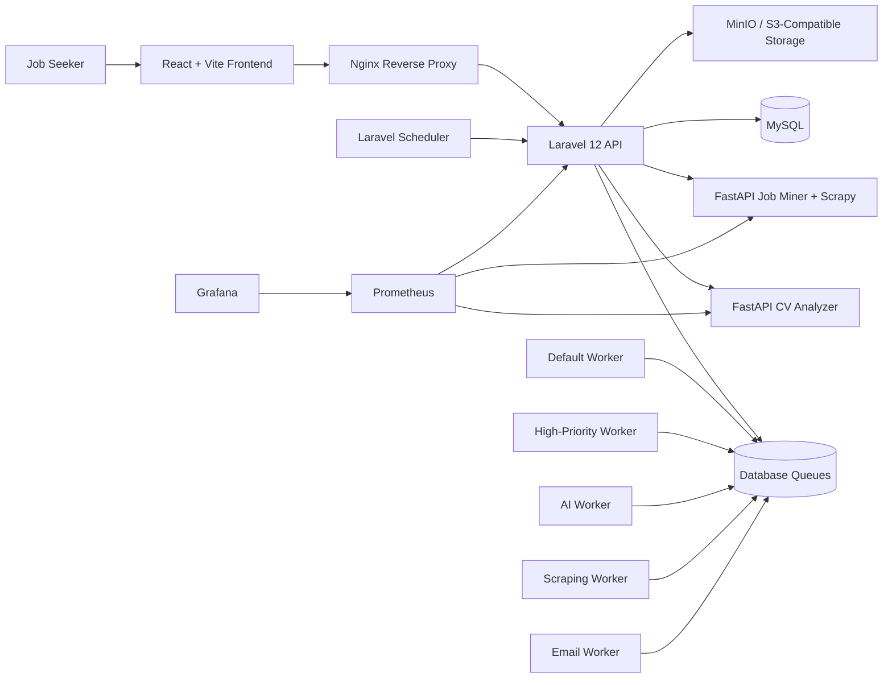

<h1 align="center">CareerCompass</h1>

<p align="center">
  <strong>AI-Powered Career Guidance Platform</strong>
</p>

<p align="center">
  Transforming a CV into a structured career profile, job recommendations, skill-gap insights, and an application tracker.
</p>

<p align="center">
  
  
  
  
  
  
</p>

<p align="center">
  <a href="#features">Features</a> •
  <a href="#architecture">Architecture</a> •
  <a href="#tech-stack">Tech Stack</a> •
  <a href="#quick-start">Quick Start</a> •
  <a href="#documentation">Documentation</a>
</p>

---

## Overview

CareerCompass is a graduation project built to help job seekers turn a CV into actionable career guidance. A user uploads a CV, receives a structured profile and skills analysis, discovers relevant jobs, identifies missing skills for a role, and tracks saved opportunities in one place.

The project is designed as a **Docker-first, service-based application**: Laravel coordinates business workflows and APIs, FastAPI services handle CV analysis and job-mining tasks, and separate queue workers process asynchronous workloads.

---

## Features

### CV Analysis & Profile Building

- Secure user registration, login, logout, and protected routes using Laravel Sanctum.
- CV upload for supported PDF and image formats.
- FastAPI-powered CV parsing that extracts profile details, skills, experience, predicted role, seniority signals, and completeness data.
- OCR fallback and clear parsing statuses for cases such as timeout, empty files, and unreadable text.
- Private CV storage with signed-access metadata.

### Job Discovery & Career Insights

- Personalized job recommendations based on the user’s predicted role, profile title, or headline.
- Manual job search and job-detail exploration.
- Hybrid job matching using semantic signals alongside TF-IDF matching.
- Skill-gap analysis that highlights matched and missing skills for a selected job or target role.
- Market intelligence and role-based demand insights.

### Application Tracking & Admin Operations

- Save jobs and track application status from a dedicated applications workspace.
- Duplicate-save protection and clear tracker state for saved opportunities.
- Admin operations for users, jobs, scraping sources, target roles, diagnostics, and retry controls.
- On-demand job scraping when role-specific market data is missing.

### Reliability & Engineering Workflow

- Database-backed queues with dedicated lanes for default, high-priority, scraping, AI, and email workloads.
- Docker Compose environment with Nginx, MySQL, MinIO, Prometheus, and Grafana.
- GitHub Actions workflows for backend tests, frontend lint/build, Python service checks, Docker validation, security scans, and manual full-stack smoke testing.

---

## How It Works

1. A user creates an account and uploads a CV.
2. Laravel stores the file and sends it to the FastAPI CV Analyzer.
3. The analyzer returns structured profile data, skills, experience, and role signals.
4. Laravel saves the analysis and uses it to generate job recommendations and skill-gap insights.
5. The user saves suitable jobs, tracks applications, and explores market data for target roles.

---

## Architecture


```mermaid
flowchart LR
    User[Job Seeker] --> Web[React + Vite Frontend]
    Web --> Nginx[Nginx Reverse Proxy]
    Nginx --> API[Laravel 12 API]

    API --> DB[(MySQL)]
    API --> Storage[MinIO / S3-Compatible Storage]
    API --> Queues[(Database Queues)]
    API --> Analyzer[FastAPI CV Analyzer]
    API --> Miner[FastAPI Job Miner + Scrapy]

    WorkerDefault[Default Worker] --> Queues
    WorkerHigh[High-Priority Worker] --> Queues
    WorkerAI[AI Worker] --> Queues
    WorkerScraping[Scraping Worker] --> Queues
    WorkerEmails[Email Worker] --> Queues
    Scheduler[Laravel Scheduler] --> API

    Prometheus[Prometheus] --> API
    Prometheus --> Analyzer
    Prometheus --> Miner
    Grafana[Grafana] --> Prometheus
```

### Main Components

| Component | Responsibility |
| --- | --- |
| **React + Vite** | User-facing and admin interfaces. |
| **Nginx** | Serves frontend traffic and proxies API requests. |
| **Laravel 12 API** | Authentication, core business logic, REST APIs, validation, policies, storage, queue dispatching, and admin operations. |
| **MySQL** | Primary relational data store for users, profiles, jobs, applications, and platform data. |
| **FastAPI CV Analyzer** | CV parsing, OCR fallback, structured profile extraction, and hybrid matching. |
| **FastAPI Job Miner + Scrapy** | Job-mining workflows and internal job import pipeline. |
| **Database Queues** | Separate asynchronous processing lanes for AI, scraping, email, high-priority, and default work. |
| **MinIO / S3-Compatible Storage** | Private object storage for CV files and signed access flows. |
| **Prometheus + Grafana** | Local production-style observability and dashboards. |

---

## Tech Stack

| Area | Technologies |
| --- | --- |
| **Backend** | PHP, Laravel 12, Laravel Sanctum, Eloquent ORM, REST APIs, Policies, API Resources, Form Requests, Database Transactions |
| **Frontend** | React, Vite, TypeScript |
| **Database & Storage** | MySQL, MinIO / S3-Compatible Storage |
| **AI Services** | Python, FastAPI, OCR fallback, semantic matching, TF-IDF |
| **Async Processing** | Laravel Scheduler, Database Queues, dedicated queue workers |
| **Infrastructure** | Docker Compose, Nginx, Prometheus, Grafana |
| **Quality & Delivery** | PHPUnit, ESLint, Pytest, GitHub Actions, smoke tests |

---

## Repository Structure

```text
.
├── backend-api/          # Laravel API, database, queues, services, resources, tests
├── frontend/             # React + Vite application
├── ai-cv-analyzer/       # FastAPI CV parsing and hybrid matching service
├── ai-job-miner/         # FastAPI + Scrapy job-mining service
├── docker/               # Nginx, Prometheus, and Grafana configuration
├── docs/                 # Team handoff, QA, troubleshooting, and operational documentation
├── scripts/smoke/        # HTTP, queue, and Docker smoke scripts
├── .github/workflows/    # CI/CD workflows
├── docker-compose.yml    # Base Docker Compose stack
└── docker-compose.prod.yml # Production-style local overrides
```

---

## Quick Start

### Prerequisites

- Git
- Docker Desktop
- Sufficient Docker memory for the FastAPI analyzer and supporting services

### 1. Clone the Repository

```bash
git clone https://github.com/YousefAlTohamy/CareerCompass.git
cd CareerCompass
git checkout main
git pull origin main
```

### 2. Create Local Environment Files

```bash
cp .env.example .env
cp backend-api/.env.example backend-api/.env
cp frontend/.env.example frontend/.env
cp ai-cv-analyzer/.env.example ai-cv-analyzer/.env
cp ai-job-miner/.env.example ai-job-miner/.env
```

<details>
<summary>Windows PowerShell equivalent</summary>

```powershell
Copy-Item .env.example .env
Copy-Item backend-api/.env.example backend-api/.env
Copy-Item frontend/.env.example frontend/.env
Copy-Item ai-cv-analyzer/.env.example ai-cv-analyzer/.env
Copy-Item ai-job-miner/.env.example ai-job-miner/.env
```
</details>

Use placeholder values only for local development. Never commit real secrets, tokens, or API keys.

### 3. Build and Start Services

```bash
docker compose -f docker-compose.yml -f docker-compose.prod.yml up -d --build
docker compose -f docker-compose.yml -f docker-compose.prod.yml exec backend-api php artisan migrate --force --no-interaction
```

### 4. Open the Application

- Application: `http://localhost`
- API health: `http://localhost/api/health`
- AI CV Analyzer: `http://localhost:8000/`
- Job Miner health: `http://localhost:8003/health`
- Grafana: `http://localhost:3000`

---

## Validation

```bash
# Laravel tests
docker compose -f docker-compose.yml -f docker-compose.prod.yml exec backend-api php artisan test

# Docker configuration validation
docker compose -f docker-compose.yml -f docker-compose.prod.yml config --quiet

# Frontend validation
cd frontend && npm ci && npm run lint && npm run build && cd ..

# Python service checks
python -m compileall ai-cv-analyzer ai-job-miner
```

The repository also includes HTTP, queue, and full Docker smoke scripts under [`scripts/smoke`](scripts/smoke/).

---

## CI/CD

GitHub Actions workflows automate the project’s main validation paths:

- **Backend CI:** installs Laravel dependencies, starts MySQL, runs migrations, and executes tests.
- **Frontend CI:** runs lint and production builds.
- **Python Services CI:** compiles Python code and runs service tests.
- **Docker CI:** validates Compose configuration and selected image builds.
- **Full Docker Smoke:** manually triggered full-stack validation for heavier end-to-end checks.
- **Security & Deployment:** security scans and a deployment workflow scaffold for controlled release flows.

---

## Documentation

For deeper operational and project documentation, see:

- [Docker Quick Start](docs/DOCKER_QUICKSTART.md)
- [Team Handoff Notes](docs/TEAM_HANDOFF.md)
- [Troubleshooting Guide](docs/TROUBLESHOOTING.md)
- [Browser QA Walkthrough](docs/QA_BROWSER_WALKTHROUGH.md)
- [Production Readiness Notes](docs/PRODUCTION_READINESS.md)
- [Product Flow Review](docs/PRODUCT_FLOW_REVIEW.md)

---

<details>
<summary><strong>Known Limitations & Production Notes</strong></summary>

- External job scraping depends on third-party availability, blocking behavior, site changes, and network conditions.
- CV upload currently waits for analysis at the API level; a fully asynchronous progress-driven upload flow would be a future improvement.
- The Docker stack is designed for local development, team handoff, and demo validation. A live production deployment would still require managed secrets, backups, hardened storage, intentional observability configuration, firewalling, and load testing.
</details>

---

<p align="center">
  Built as a graduation project focused on backend architecture, AI-assisted career workflows, and reliable service integration.
</p>
