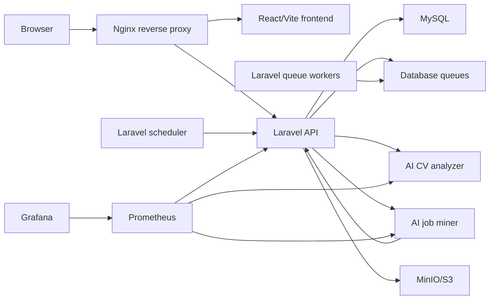

# CareerCompass

CareerCompass is a Docker-first career guidance platform for CV analysis, skill extraction, job scraping, job recommendations, and market intelligence.

The production-style Docker stack is now merged into `main`. Historical Docker stabilization checkpoints are documented in `docs/TEAM_HANDOFF.md`.

## Architecture


```mermaid
flowchart LR
  Browser["Browser"] --> Nginx["Nginx reverse proxy"]
  Nginx --> Frontend["React/Vite frontend"]
  Nginx --> Backend["Laravel API"]
  Backend --> MySQL["MySQL"]
  Backend --> Queue["Database queues"]
  Workers["Laravel queue workers"] --> Queue
  Scheduler["Laravel scheduler"] --> Backend
  Backend --> AI["AI CV analyzer"]
  Backend --> Scraper["AI job miner"]
  Scraper --> Backend
  Backend --> Storage["MinIO/S3"]
  Prometheus["Prometheus"] --> Backend
  Prometheus --> AI
  Prometheus --> Scraper
  Grafana["Grafana"] --> Prometheus
```

## Services

- `backend-api`: Laravel 12 API, Sanctum auth, `/api` and `/api/v1`, CV upload, gap analysis, scraper orchestration, metrics.
- `frontend`: React + Vite application served through Nginx in Docker.
- `ai-cv-analyzer`: FastAPI service for CV parsing and hybrid matching.
- `ai-job-miner`: FastAPI wrapper around Scrapy workflows.
- `db`: MySQL database.
- `backend-worker*`: database queue workers for `high`, `scraping`, `ai`, `emails`, and `default`.
- `backend-scheduler`: Laravel scheduler container.
- `nginx`: reverse proxy with Docker DNS resolver support.
- `minio`: local S3-compatible object storage.
- `prometheus` and `grafana`: monitoring stack.

## Docker Quickstart

Prerequisites:

- Git
- Docker Desktop
- At least 8-12 GB free disk space for images, dependencies, and service data

```bash
git clone https://github.com/YousefAlTohamy/CareerCompass.git
cd CareerCompass
git checkout main
git pull origin main

cp .env.example .env
cp backend-api/.env.example backend-api/.env
cp frontend/.env.example frontend/.env
cp ai-cv-analyzer/.env.example ai-cv-analyzer/.env
cp ai-job-miner/.env.example ai-job-miner/.env

docker compose -f docker-compose.yml -f docker-compose.prod.yml up -d --build
docker compose -f docker-compose.yml -f docker-compose.prod.yml exec backend-api php artisan migrate --force --no-interaction
```

Windows PowerShell copy commands:

```powershell
Copy-Item .env.example .env
Copy-Item backend-api/.env.example backend-api/.env
Copy-Item frontend/.env.example frontend/.env
Copy-Item ai-cv-analyzer/.env.example ai-cv-analyzer/.env
Copy-Item ai-job-miner/.env.example ai-job-miner/.env
```

Windows users can also run:

```powershell
.\start_all.bat
```

More detail is in `docs/DOCKER_QUICKSTART.md`.

## Health URLs

- Frontend: `http://localhost`
- Backend health: `http://localhost/api/health`
- Backend readiness: `http://localhost/api/ready`
- API v1 health: `http://localhost/api/v1/health`
- AI analyzer: `http://localhost:8000/`
- Scraper service: `http://localhost:8003/health`
- Prometheus: `http://localhost:9090/-/ready`
- Grafana: `http://localhost:3000/api/health`
- MinIO API health: `http://localhost:9000/minio/health/live`
- MinIO console: `http://localhost:9001`

## Common Commands

```bash
docker compose -f docker-compose.yml -f docker-compose.prod.yml ps
docker compose -f docker-compose.yml -f docker-compose.prod.yml logs -f backend-api
docker compose -f docker-compose.yml -f docker-compose.prod.yml logs -f backend-worker
docker compose -f docker-compose.yml -f docker-compose.prod.yml restart
docker compose -f docker-compose.yml -f docker-compose.prod.yml stop
```

Do not use `docker compose down -v` or `docker system prune --volumes` unless you intentionally want to delete persistent local data.

## Smoke Tests

```bash
bash scripts/smoke/http-smoke.sh http://localhost
bash scripts/smoke/queue-smoke.sh
```

Windows PowerShell:

```powershell
.\scripts\smoke\http-smoke.ps1 http://localhost
.\scripts\smoke\queue-smoke.ps1
```

The Docker smoke script is safe from volume deletion, but it starts multiple services and is intended for validation environments:

```bash
bash scripts/smoke/docker-smoke.sh
```

## Production Warnings

Before any real deployment:

- Rotate all `.env` secrets and default tokens.
- Use managed S3 or hardened MinIO with backups.
- Back up MySQL and object storage.
- Configure Sentry/monitoring tokens.
- Run load tests against expected traffic.
- Review exposed ports and firewall rules.
- Use a real secret manager instead of checked-in examples.

## Rollback

```bash
git fetch origin --tags
git checkout main
git reset --hard <stable-checkpoint-tag>
docker compose -f docker-compose.yml -f docker-compose.prod.yml up -d --build
```

See `docs/TEAM_HANDOFF.md` for historical Docker handoff tags. Use a tag only when you intentionally need to roll back to that checkpoint.
