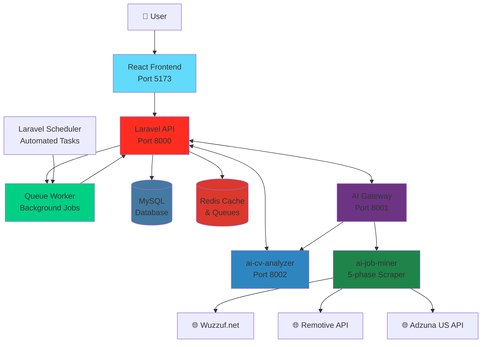
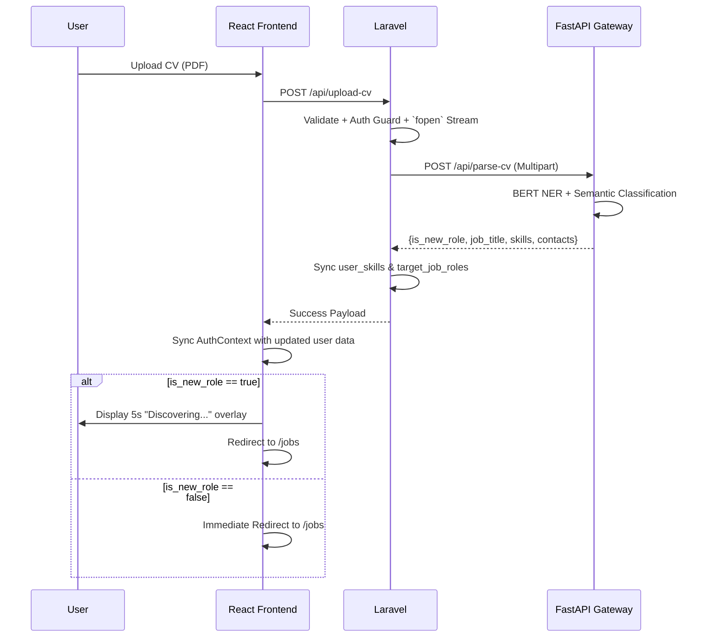
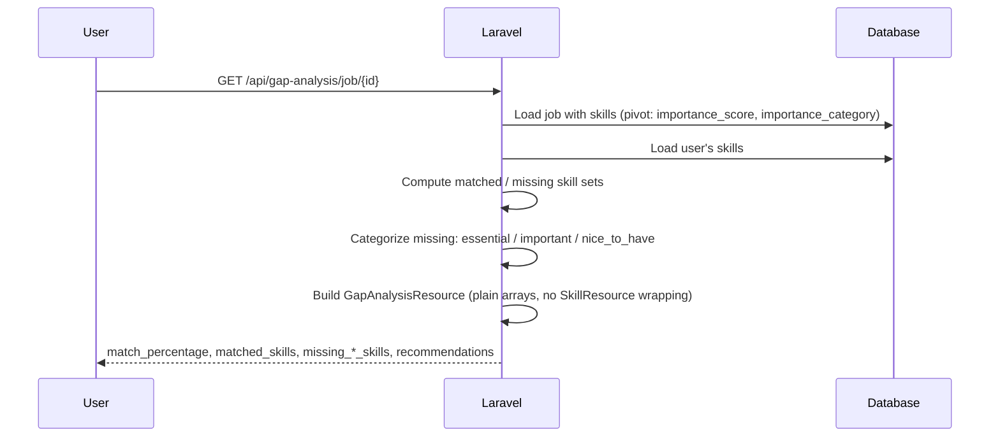
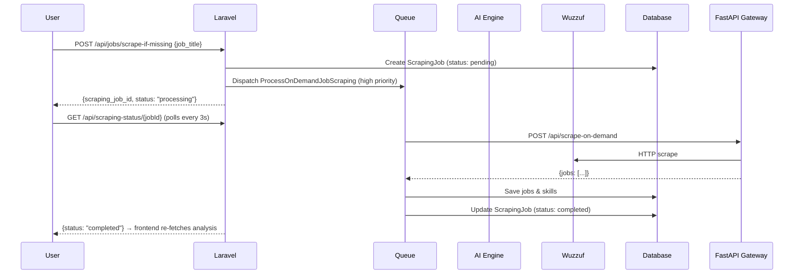
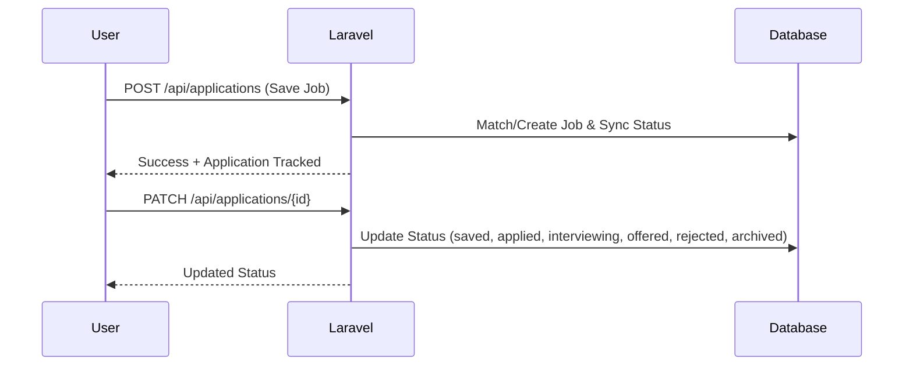
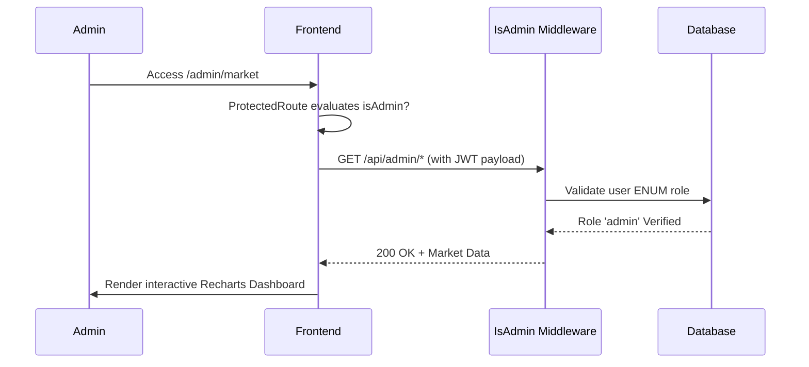

# CareerCompass 🧭

> **Graduation Project**: AI-powered career guidance platform using microservices architecture with React frontend

## 📋 Overview

CareerCompass is an **advanced AI-powered career development platform** that combines intelligent CV analysis, real-time job market scraping, and smart skill gap analysis to help users make data-driven career decisions. The platform features:

- **Market Intelligence System**: Automated job scraping with skill importance ranking, visualized via an interactive Recharts dashboard
- **On-Demand Job Data**: Real-time job scraping with background queue processing and live status polling
- **Hybrid AI Gateway**: FastAPI orchestrator combining TF-IDF + Semantic embeddings for absolute matching precision
- **Smart Gap Analysis & Match Scoring**: Priority-based skill roadmap with dynamically calculated AI match scores rendered naturally in the jobs feed
- **Seamless Discovery UX**: Intelligent React upload bounds capturing CV changes and gracefully routing users to real-time market opportunities
- **Job Application Tracker**: Kanban-style lifecycle visualization for tracked applications
- **Strict Payload Integrities**: External user requests are rigorously sanitized through **Regex-powered `FormRequest` validations** prior to backend processing
- **Secure Split Routing Boundaries**: Frontend is rigidly divided into `ProtectedRoute`-shielded `/admin/*` schemas and consumer `/user/*` layouts
- **Robust RBAC Layer**: All critical endpoints are shielded by `IsAdmin` middleware, universally bypassed initially by the safe `AdminUserSeeder` protocol
- **Bilingual UI (i18n)**: Full English ↔ Arabic internationalization via `i18next` with automatic browser-language detection and RTL layout switching
- **Dark / Light Mode**: Theme toggle persisted to `localStorage` via a `ThemeContext` provider, with smooth CSS transitions across all pages
- **AI Match Insights**: Detailed "Career Identity" and "Insights & Alerts" cards in the profile, powered by `AiInsights.jsx`
- **Visual Skill Roadmap**: Next-step career guidance via an interactive `RoadmapTimeline.jsx` component
- **System Health Monitor**: Admin dashboard includes live service-health checks for Database connectivity, Cache/Queue status, and AI Gateway availability
- **SweetAlert2 Toasts**: Rich, styled modal and toast notifications for user actions (track job, delete, errors)
- **Auto-Profile Provisioning**: The `User` model's `booted()` hook automatically creates a `UserProfile` record on registration, ensuring normalized profile data is always available
- **Guest Route Guards**: `GuestRoute` component redirects authenticated users away from `/login` and `/register`, with role-aware routing (admins → `/admin/dashboard`)

---

## 🏗️ Architecture — 3-Layer AI System

The platform uses a **3-Layer AI architecture** working in harmony with Laravel and React:

| Layer | Name | Service | Purpose |
| ----- | ---- | ------- | ------- |
| **Layer 1** | Understanding | ai-cv-analyzer (8002) | V3 Pipeline: Spatial normalization, NER, canonicalization, temporal parsing |
| **Layer 2** | Classification | ai-cv-analyzer | BART-MNLI zero-shot domain classification |
| **Layer 3** | Matching | ai-cv-analyzer + ai-hybrid-orchestrator | Semantic + TF-IDF hybrid scoring; Zero PDF Re-parsing |


```mermaid
graph TB
    User[👤 User] --> Frontend[React Frontend<br/>Port 5173]
    Frontend --> Laravel[Laravel API<br/>Port 8000]
    Laravel --> Queue[Queue Worker<br/>Background Jobs]
    Laravel --> MySQL[(MySQL<br/>Database)]
    Laravel --> Redis[(Redis Cache<br/>& Queues)]
    Laravel <--> Gateway[AI Gateway<br/>Port 8001]
    Laravel <--> CVAnalyzer[ai-cv-analyzer<br/>Port 8002]
    Gateway --> JobMiner[ai-job-miner<br/>5-phase Scraper]
    Gateway --> CVAnalyzer
    JobMiner --> Wuzzuf[🌐 Wuzzuf.net]
    JobMiner --> Remotive[🌐 Remotive API]
    JobMiner --> Adzuna[🌐 Adzuna US API]
    Queue --> Laravel
    Scheduler[Laravel Scheduler<br/>Automated Tasks] --> Queue

    style Frontend fill:#61dafb
    style Laravel fill:#ff2d20
    style Gateway fill:#6c3483
    style CVAnalyzer fill:#2e86c1
    style JobMiner fill:#1e8449
    style MySQL fill:#4479a1
    style Redis fill:#dc382d
    style Queue fill:#00d084
```

> **Security Note:** The `IsAdmin` middleware acts as a rigid backend ingress shield, bridging directly to the `ProtectedRoute` boundaries in the React SPA UI to enforce Role-Based Access Control (RBAC).
>
> **Consolidated AI Core:** Personnel extraction logic (`contact_extractor.py`) has been migrated into the `ai-cv-analyzer` core to ensure a unified V3 parsing pipeline. The `ai-hybrid-orchestrator` operates as a performance-optimized facade using **FastAPI Lifespan** to load BERT/BART models as singletons, ensuring sub-100ms inference responses.
>
> **Security Boundary Handshake:** All administrative requests undergo a dual-verification process. The backend `IsAdmin` middleware validates the JWT payload against the `role` enum in the database. If unauthorized, a 403 Forbidden is emitted, which the frontend `Axios` interceptors catch to trigger an immediate fallback to the guest landing zone.

### Components

| Component          | Technology                 | Port | Purpose                                                      |
| ------------------ | -------------------------- | ---- | ------------------------------------------------------------ |
| **Frontend**       | React 19 + Vite + Recharts | 5173 | V3 UI: Dashboard, Profile, Gap Analysis, Error Boundary      |
| **Backend API**    | Laravel 12                 | 8000 | Business logic, normalized DB, `IsAdmin` RBAC, token mgmt    |
| **Queue Worker**   | Laravel Queue              | -    | Background processing for scraping & calculations            |
| **AI Gateway**     | Python/FastAPI             | 8001 | ai-hybrid-orchestrator: parse-cv, scrape-on-demand, hybrid-match, test-source, scrape-jobs, process-cv |
| **ai-cv-analyzer** | Python Transformers        | 8002 | V3 Pipeline: Layer 1–3 (Understanding, Classification, Matching) |
| **ai-job-miner**   | Python (async)             | -    | 5-phase heuristic scraper + TF-IDF engine (used by Gateway)  |
| **Database**       | MySQL                      | 3306 | Normalized schema: users, user_profiles, user_experiences, cv_analyses |
| **Cache/Queue**    | Redis (opt)                | 6379 | Fast caching and queue management (production)               |
| **Scheduler**      | Laravel Cron               | -    | Automated market data updates (every 48 hours)               |

### Key Technical Achievements (V3 Refactor)

| Achievement | Description |
| ----------- | ----------- |
| **100% Precise Spatial CV Parsing** | pdfplumber Row Grouper + column-aware ordering eliminates multi-column misreads |
| **Normalized Database** | Separation of `users` (Auth) and `user_profiles` (CV data); `user_experiences`, `cv_analyses`; enriched `user_skills` pivot (`confidence_score`, `evidence`) |
| **Canonicalized Skill Matching** | RapidFuzz deduplication; skills stored once; Zero PDF Re-parsing for gap analysis |
| **Zero-Downtime Migration** | Legacy data migrated from `users` to `user_profiles`; fallback to DB-based fuzzy matching when AI API is unreachable |

---

## 📁 Project Structure

```
CareerCompass/
├── debug_pipeline.py         # End-to-end CV upload timing and execution tracer
├── start_all.bat             # Portable environment launcher (6 terminal windows)
├── cleanup.bat               # Global cache cleaner (Laravel, Python, Vite, Jupyter)
├── GRADUATION_REPORT_PRD.md  # Product Requirements Document for graduation review
├── LICENSE                   # MIT License
├── frontend/                 # React 19 + Vite Application
│   ├── src/
│   │   ├── api/
│   │   │   ├── client.js                   # Axios client (base URL, auth headers)
│   │   │   ├── endpoints.js                # All API endpoint definitions + admin API
│   │   │   ├── applications.js             # Application Tracker API helpers (CRUD + convenience aliases)
│   │   │   └── scrapingSources.js          # Admin scraping sources API helpers
│   │   ├── assets/
│   │   │   └── react.svg                   # Default SVG asset
│   │   ├── components/
│   │   │   ├── AiInsights.jsx              # AI Match Reasoning & Detail Cards (Identity, Flags, Verbs)
│   │   │   ├── Button.jsx                  # Reusable button component
│   │   │   ├── Card.jsx                    # Reusable card wrapper
│   │   │   ├── ErrorAlert.jsx              # Dismissible error banner
│   │   │   ├── ErrorBoundary.jsx           # React error boundary
│   │   │   ├── Footer.jsx                  # Premium site footer
│   │   │   ├── GuestRoute.jsx              # Redirects authenticated users away from auth pages (role-aware)
│   │   │   ├── LoadingSpinner.jsx          # Full-screen / inline spinner
│   │   │   ├── Navbar.jsx                  # Scroll-aware glassmorphism nav (i18n, theme toggle, language switch)
│   │   │   ├── ProcessingAnimation.jsx     # Animated CV-processing overlay
│   │   │   ├── ProtectedRoute.jsx          # Auth route guard (includes `requireAdmin` + `allowAdmin` props)
│   │   │   ├── RoadmapTimeline.jsx         # Interactive visual career roadmap
│   │   │   ├── SuccessAlert.jsx            # Dismissible success banner
│   │   │   └── TypingEffect.jsx            # Reusable typing animation component
│   │   ├── context/
│   │   │   ├── AuthContext.jsx             # React Context for authentication state
│   │   │   └── ThemeContext.jsx            # Dark/Light mode + Language (EN/AR) + RTL toggle
│   │   ├── hooks/
│   │   │   ├── useAsync.js                 # Generic async state handler
│   │   │   ├── useAuthHandler.js           # Auth token management
│   │   │   ├── useOnDemandScraping.js      # Trigger on-demand scraping
│   │   │   └── useScrapingStatus.js        # Poll scraping job status
│   │   ├── i18n.js                         # i18next config (EN/AR with browser detection)
│   │   ├── locales/
│   │   │   ├── en.json                     # English translations
│   │   │   └── ar.json                     # Arabic translations (RTL)
│   │   ├── pages/
│   │   │   ├── admin/                      # 🔐 Secure Admin Domain (RBAC-protected)
│   │   │   │   ├── AdminDashboard.jsx      # Admin — system-wide statistics + health monitor
│   │   │   │   ├── AdminJobs.jsx           # Admin — centralized job listings management
│   │   │   │   ├── AdminJobDetails.jsx     # Admin — single job detail view with skills
│   │   │   │   ├── AdminSources.jsx        # Admin — scraping source management
│   │   │   │   ├── AdminTargets.jsx        # Admin — target job role management
│   │   │   │   ├── AdminUsers.jsx          # Admin — user base control and ban management
│   │   │   │   └── AdminUserDetails.jsx    # Admin — single user detail view with skills & profile
│   │   │   ├── user/                       # 👤 Standard User Domain
│   │   │   │   ├── Applications.jsx        # Job Application Tracker (Kanban-style statuses)
│   │   │   │   ├── Dashboard.jsx           # Main dashboard + 5s animated New Role Discovery UX
│   │   │   │   ├── GapAnalysis.jsx         # Priority-based skill gap analysis
│   │   │   │   ├── Jobs.jsx                # Job listings + Match Score logic & dynamic UI badges
│   │   │   │   ├── MarketIntelligence.jsx  # Rich Recharts-based Market trends & trending skills dashboard
│   │   │   │   └── Profile.jsx             # User profile management (editable fields + skill sync)
│   │   │   ├── Home.jsx                    # Landing / welcome page
│   │   │   ├── Login.jsx                   # Login page
│   │   │   ├── NotFound.jsx                # 404 page
│   │   │   └── Register.jsx                # Registration page
│   │   ├── services/
│   │   │   └── storageService.js           # LocalStorage wrapper (tokens, user sync)
│   │   ├── App.jsx                         # Root component + AnimatedRoutes + ThemeProvider
│   │   ├── App.css                         # Root component styles
│   │   ├── main.jsx                        # Entry point
│   │   └── index.css                       # Global Tailwind imports
│   ├── public/
│   │   └── favicon.svg                     # CareerCompass favicon
│   ├── package.json                        # NPM dependencies
│   ├── vite.config.js                      # Vite configuration
│   ├── tailwind.config.js                  # Tailwind CSS config (dark mode class strategy)
│   ├── FRONTEND_DOCUMENTATION.md           # Frontend docs
│   └── DEVELOPER_GUIDE.md                  # Development guide
│
├── backend-api/              # Laravel 12 Application
│   ├── app/
│   │   ├── Http/
│   │   │   ├── Controllers/Api/
│   │   │   │   ├── Admin/
│   │   │   │   │   ├── DashboardController.php     # Admin — stats + system health check
│   │   │   │   │   ├── AdminJobController.php      # Admin — job listing CRUD
│   │   │   │   │   ├── AdminUserController.php     # Admin — user management + ban toggle
│   │   │   │   │   ├── ScrapingSourceController.php# Admin — source CRUD + diagnostics
│   │   │   │   │   └── TargetJobRoleController.php # Admin — target roles / triggers
│   │   │   │   ├── AuthController.php              # Registration (email whitelist), login (ban check), logout, updateProfile
│   │   │   │   ├── ApplicationController.php       # Job Application Tracker (CRUD)
│   │   │   │   ├── CvController.php                # CV upload & analysis (delegates to CvProcessingService)
│   │   │   │   ├── JobController.php               # Job browsing, scraping, on-demand, recommended
│   │   │   │   ├── GapAnalysisController.php       # Enhanced gap analysis with priorities (delegates to GapAnalysisService)
│   │   │   │   ├── MarketIntelligenceController.php # Market statistics & trends
│   │   │   │   └── ScrapingSourceController.php    # Public facing source read endpoints
│   │   │   ├── Middleware/
│   │   │   │   └── IsAdmin.php                     # Role-Based Access Control (RBAC) guard
│   │   │   ├── Requests/
│   │   │   │   ├── CvUploadRequest.php             # CV validation with strict Regex filters (5MB PDF)
│   │   │   │   └── StoreScrapingSourceRequest.php  # Scraping source validation via strict Regex mappings
│   │   │   └── Resources/
│   │   │       ├── CvAnalysisResource.php          # CV analysis JSON formatting (strengths, gaps, red_flags)
│   │   │       ├── GapAnalysisResource.php         # Gap analysis JSON formatting
│   │   │       ├── JobResource.php                 # Job JSON formatting
│   │   │       ├── ScrapingSourceResource.php      # Source config JSON formatting
│   │   │       ├── SkillResource.php               # Skill JSON formatting
│   │   │       ├── UserResource.php                # Comprehensive user JSON (profile, experiences, skills, cv_analysis)
│   │   │       └── UserExperienceResource.php      # Work experience JSON formatting
│   │   ├── Services/
│   │   │   ├── Contracts/
│   │   │   │   ├── CvProcessingServiceInterface.php   # CV processing contract
│   │   │   │   └── GapAnalysisServiceInterface.php    # Gap analysis contract
│   │   │   ├── CvProcessingService.php             # CV processing business logic
│   │   │   └── GapAnalysisService.php              # Gap analysis business logic
│   │   ├── Jobs/
│   │   │   ├── ProcessMarketScraping.php           # Automated market data scraping
│   │   │   └── ProcessOnDemandJobScraping.php      # On-demand job scraping
│   │   ├── Console/Commands/
│   │   │   ├── ScrapeJobs.php                      # Manual scraping command
│   │   │   ├── TestScrapingSources.php             # Diagnose all scraping sources
│   │   │   └── CalculateSkillImportance.php        # Skill importance calculation
│   │   ├── Models/
│   │   │   ├── User.php                            # User model + booted() auto-profile + backward-compat accessors
│   │   │   ├── UserProfile.php                     # User profile (headline, summary, location, seniority, contact_info JSON)
│   │   │   ├── UserExperience.php                  # Work experience entries (title, company, dates, is_current)
│   │   │   ├── CvAnalysis.php                      # CV analysis results (parsing_status, completeness_score, strengths/gaps/red_flags)
│   │   │   ├── Skill.php                           # Skill model
│   │   │   ├── Job.php                             # Job model with importance
│   │   │   ├── JobRoleStatistic.php                # Market statistics per role
│   │   │   ├── ScrapingJob.php                     # Scraping job tracking
│   │   │   ├── ScrapingSource.php                  # Scraping source config model
│   │   │   ├── TargetJobRole.php                   # Target job role config model
│   │   │   └── Application.php                     # Job Application model
│   │   └── Providers/
│   │       └── AppServiceProvider.php              # Service provider (DI bindings)
│   ├── database/
│   │   ├── migrations/
│   │   │   ├── *_create_skills_table.php
│   │   │   ├── *_create_jobs_table.php
│   │   │   ├── *_create_job_skills_table.php
│   │   │   ├── *_add_skill_importance_to_job_skills.php
│   │   │   ├── *_create_job_role_statistics_table.php
│   │   │   ├── *_create_scraping_jobs_table.php
│   │   │   ├── *_create_scraping_sources_table.php
│   │   │   ├── *_add_source_id_to_job_postings.php # Adds scraping_source_id FK
│   │   │   ├── *_create_target_job_roles_table.php # Dynamic job roles table
│   │   │   ├── *_create_user_skills_table.php
│   │   │   ├── *_create_applications_table.php     # Job applications tracking
│   │   │   ├── *_add_role_to_users_table.php       # RBAC role enum
│   │   │   ├── *_add_is_banned_to_users_table.php  # Platform access control boolean
│   │   │   ├── *_create_user_profiles_table.php    # Normalized profiles (migrates legacy user columns)
│   │   │   ├── *_add_confidence_score_evidence_to_user_skills_table.php  # Enriched skill pivot
│   │   │   ├── *_create_user_experiences_table.php # Work experience entries
│   │   │   └── *_create_cv_analyses_table.php      # CV analysis results storage
│   │   └── seeders/
│   │       ├── DatabaseSeeder.php                  # Master seeder (calls all 5 seeders + test user)
│   │       ├── AdminUserSeeder.php                 # Seeds default admin account required to cross the RBAC threshold
│   │       ├── JobSeeder.php                       # 10 sample Egyptian job market listings
│   │       ├── SkillSeeder.php                     # 84 predefined skills (66 technical, 18 soft)
│   │       ├── ScrapingSourceSeeder.php            # 3 active scraping sources
│   │       └── TargetJobRoleSeeder.php             # Default target job roles
│   ├── routes/
│   │   ├── api.php                                 # API endpoints (guest + auth + admin groups)
│   │   ├── console.php                             # Scheduler configuration (48h scraping, daily skill calc)
│   │   └── web.php                                 # Web routes (default)
│   └── TESTING.md                          # API testing guide
│
├── ai-job-miner/             # Phase 6: Heuristic Scraping Engine (5 phases)
│   ├── core/                               # Engine core (http_client, dlq, engine, heuristics)
│   ├── strategies/                         # HtmlSmartScraper + JsonApiScraper
│   ├── factories/                          # ScraperFactory
│   ├── pipeline/                           # Bloom filter dedup + Regex cleaners + Levenshtein
│   ├── ai/                                 # TF-IDF matcher + NER extractor + segmenter
│   ├── tests/                              # 186 pytest tests (fully mocked)
│   ├── run_engine.py                       # Local microservice test runner
│   └── README.md
│
├── ai-cv-analyzer/           # V3 AI Pipeline — Layer 1–3 (port 8002)
│   ├── core/
│   │   ├── layer1_understanding/
│   │   │   ├── orchestrator.py             # CVOrchestrator — master pipeline entrypoint
│   │   │   ├── spatial_parser.py           # pdfplumber Row Grouper + column-aware ordering
│   │   │   ├── section_segmenter.py        # Heuristic section boundary detection
│   │   │   ├── advanced_ner.py             # Fine-tuned BERT NER with WordPiece boundary expansion
│   │   │   ├── experience_engine.py        # Temporal parsing + regex date fallback
│   │   │   ├── canonicalizer.py            # RapidFuzz skill deduplication
│   │   │   ├── contact_extractor.py        # Regex: email, phone, LinkedIn, GitHub, location
│   │   │   ├── ocr_pipeline.py             # Tesseract OCR fallback for image-based CVs
│   │   │   └── schema.py                   # Pydantic CVParseResult schema
│   │   ├── layer2_classification/
│   │   │   └── classifier.py               # BART-MNLI zero-shot domain classifier
│   │   └── layer3_matching/
│   │       ├── embedder.py                 # MiniLM sentence embedding utility
│   │       └── similarity.py               # IntelligentMatcher (cosine similarity scoring)
│   ├── models/                              # Fine-tuned NER weights (git-ignored)
│   ├── scripts/                             # Verification scripts for pipeline phases
│   ├── training/                            # Training data and configs (git-ignored)
│   ├── tests/                               # AI pipeline test suite
│   ├── main.py                              # FastAPI sub-service (port 8002)
│   └── README.md
│
├── ai-hybrid-orchestrator/   # Facade + FastAPI Gateway (port 8001)
│   ├── __init__.py                        # Package marker
│   ├── hybrid_runner.py                   # CLI pipeline: BERT-NER + BART-MNLI + MiniLM hybrid
│   ├── main_api.py                        # FastAPI: /api/parse-cv, /api/scrape-on-demand, /api/hybrid-match, /test-source, /scrape-jobs, /api/process-cv
│   ├── test_api.py                        # End-to-end TestClient runner (5 test groups, EXIT 0 ✅)
│   ├── .env.example                       # Adzuna API credentials template
│   └── README.md
│
├── start_all.bat             # Windows launcher (6 services: frontend, backend, cv-analyzer, gateway, queue, scheduler)
├── CareerCompass.postman_collection.json   # Postman API collection (40+ endpoints)
└── README.md                 # This file
```

> **Note on `contact_extractor.py`**: This module was originally located in `ai-hybrid-orchestrator/` but has been relocated to `ai-cv-analyzer/core/layer1_understanding/` to colocate it with the CV parsing pipeline. The orchestrator imports it from the analyzer's core.

---

## 🚀 Getting Started

### Prerequisites

Make sure you have the following installed on your system:

- **PHP** 8.1+ with extensions: `pdo`, `pdo_mysql`, `mbstring`, `xml`, `curl`, `zip`
- **Composer** 2.x - [Download](https://getcomposer.org/)
- **Node.js** 18+ and npm - [Download](https://nodejs.org/)
- **Python** 3.11+ - [Download](https://www.python.org/)
- **Tesseract OCR** - For image-based CV parsing fallback
- **MySQL** 8.x - [Download](https://dev.mysql.com/downloads/installer/)
- **Git** - [Download](https://git-scm.com/)

### Installation

> **💡 Quick Tip**: After installation, you can use `start_all.bat` (Windows) to launch all services at once!

#### 1️⃣ Clone Repository

```bash
git clone https://github.com/yourusername/CareerCompass.git
cd CareerCompass
```

#### 2️⃣ Setup Database

Create a MySQL database for the project:

```sql
CREATE DATABASE career_compass;
```

Or use your preferred MySQL client (phpMyAdmin, MySQL Workbench, etc.)

#### 3️⃣ Frontend Setup (React + Vite)

```bash
cd frontend

# Install dependencies
npm install

# Configuration (optional)
# Edit src/api/client.js if backend is not on http://127.0.0.1:8000
```

The frontend will automatically connect to the Laravel API at `http://127.0.0.1:8000/api`.

#### 4️⃣ Backend API Setup (Laravel)

```bash
cd backend-api

# Install PHP dependencies
composer install

# Create environment file
cp .env.example .env

# Generate application key
php artisan key:generate
```

**Configure `.env` file** - Open `backend-api/.env` and update:

```env
# Database Configuration
DB_CONNECTION=mysql
DB_HOST=127.0.0.1
DB_PORT=3306
DB_DATABASE=career_compass
DB_USERNAME=root
DB_PASSWORD=your_mysql_password

# Queue Configuration (use 'database' for development, 'redis' for production)
QUEUE_CONNECTION=database

# AI Microservices (both required for full functionality)
AI_CV_ANALYZER_URL=http://127.0.0.1:8002
AI_CV_ANALYZER_TIMEOUT=120
AI_GATEWAY_URL=http://127.0.0.1:8001
AI_GATEWAY_TIMEOUT=30

# Frontend URL (for CORS)
FRONTEND_URL=http://localhost:5173
```

**Run migrations and seed database:**

```bash
# Create database tables
php artisan migrate

# Seed with 84 predefined skills
php artisan db:seed --class=SkillSeeder

# Seed default admin account
php artisan db:seed --class=AdminUserSeeder

# Or run ALL seeders at once (SkillSeeder + JobSeeder + ScrapingSourceSeeder + TargetJobRoleSeeder + AdminUserSeeder)
php artisan migrate:fresh --seed
```

> [!IMPORTANT]
> **Admin Ingress Protocol**: The `AdminUserSeeder.php` is the **critical bootstrap vector** for the platform. Because the standard registration logic is a dedicated "User-Only Sinkhole" (shielding the admin enum from unauthorized elevation), this seeder is the only method to cross the RBAC threshold initially.

> **🔑 Default Admin Credentials (Crucial)**:
> Upon running the `AdminUserSeeder`, a master administrative account is generated. This seeder is the **only** vector to bypass the RBAC guards initially, as the standard frontend React registration flow rigidly restricts all new sign-ups to the standard `user` enum:
>
> - **Email:** `careercompassadmin@gmail.com`
> - **Password:** `CareerCompassAdmin2026`

#### 5️⃣ AI Gateway Setup (FastAPI Orchestrator)

_Note: The legacy `local-ai-engine` is deprecated. We now strictly use the `ai-hybrid-orchestrator`._

```bash
cd ai-hybrid-orchestrator

# Create virtual environment
python -m venv venv

# Activate virtual environment
venv\Scripts\activate        # Windows
source venv/bin/activate     # macOS/Linux

# Install Python dependencies
pip install -r requirements.txt

# Copy environment template (required for Adzuna API credentials)
cp .env.example .env
# Edit .env with your ADZUNA_APP_ID and ADZUNA_APP_KEY

# Start the uvicorn API Gateway natively
uvicorn main_api:app --host 0.0.0.0 --port 8001 --reload
```

#### 6️⃣ AI CV Analyzer Setup (Python Sub-Service)

```bash
cd ai-cv-analyzer

# Create virtual environment
python -m venv venv

# Activate virtual environment
venv\Scripts\activate        # Windows
source venv/bin/activate     # macOS/Linux

# Install Python dependencies
pip install -r requirements.txt

# Start the uvicorn sub-service
uvicorn main:app --host 127.0.0.1 --port 8002 --reload
```

---

## ▶️ Running the Application

### 🎯 Option 1: Automated Launcher (Windows — Recommended)

The easiest way to start all services on Windows:

```bash
# From the project root directory
start_all.bat
```

This launches **six** separate terminal windows:

| Service | URL | Purpose |
| ------- | --- | ------- |
| **Frontend** | http://localhost:5173 | React V3 UI |
| **Backend API** | http://127.0.0.1:8000 | Laravel REST API |
| **AI CV Analyzer** | http://127.0.0.1:8002 | V3 pipeline, Layer 3 match-job |
| **AI Gateway** | http://127.0.0.1:8001 | parse-cv, scrape-on-demand, hybrid-match |
| **Queue Worker** | - | Background job processing |
| **Scheduler** | - | Automated tasks (48h scraping, daily skill calc) |

> **Environment Setup**: Ensure `backend-api/.env` has `AI_CV_ANALYZER_URL=http://127.0.0.1:8002` and `AI_GATEWAY_URL=http://127.0.0.1:8001` for full functionality.

### 🔧 Option 2: Manual Start (All Operating Systems)

Open **five separate terminal windows** and run each service:

**Terminal 1 - Frontend:**
```bash
cd frontend && npm run dev
# http://localhost:5173
```

**Terminal 2 - Backend API:**
```bash
cd backend-api && php artisan serve --port=8000
# http://127.0.0.1:8000
```

**Terminal 3 - AI CV Analyzer (port 8002):**
```bash
cd ai-cv-analyzer
python -m venv venv && venv\Scripts\activate   # Windows
# source venv/bin/activate                      # macOS/Linux
pip install -r requirements.txt
python -m uvicorn main:app --host 127.0.0.1 --port 8002 --reload
# http://127.0.0.1:8002
```

**Terminal 4 - AI Gateway (port 8001):**
```bash
cd ai-hybrid-orchestrator
venv\Scripts\activate        # Windows | source venv/bin/activate (macOS/Linux)
uvicorn main_api:app --reload --port 8001
# http://127.0.0.1:8001
```

**Terminal 5 - Queue Worker:**
```bash
cd backend-api && php artisan queue:work --queue=high,default --tries=3 --timeout=300
```

**Terminal 6 - Scheduler:**
```bash
cd backend-api && php artisan schedule:work
```

### 📅 Optional: Activate Scheduler (Automated Market Updates)

The scheduler automatically runs market scraping every 48 hours and skill importance calculations daily.

**For Development Testing:**

```bash
cd backend-api
php artisan schedule:work
# Scheduler daemon will run scheduled tasks at their defined times
```

**For Production (Linux/macOS):**

Add to crontab (`crontab -e`):

```bash
* * * * * cd /path-to-your-project/backend-api && php artisan schedule:run >> /dev/null 2>&1
```

**For Production (Windows):**

Use Task Scheduler to run `php artisan schedule:run` every minute.

> **Note**: The scheduler runs:
>
> - Market scraping: Every 48 hours at 02:00 AM
> - Skill importance calculation: Daily at 04:00 AM
> - Both tasks use `withoutOverlapping()` to prevent concurrent executions

### ✅ Verify Everything is Running

| Service | URL | Expected Response |
| ----------- | -------------------------------- | ----------------------------------------------- |
| Frontend | http://localhost:5173 | React login/register UI |
| Backend API | http://127.0.0.1:8000/api/health | `{"status": "ok"}` |
| AI CV Analyzer | http://127.0.0.1:8002/docs | Swagger UI (V3 pipeline) |
| AI Gateway | http://127.0.0.1:8001 | `{"status": "operational", "version": "1.0.0"}` |
| AI Gateway | http://127.0.0.1:8001/docs | Swagger UI |

> **Tip**: After logging in, you can access distinct dashboard views at `/user/dashboard` and the admin portal at `/admin/` (requires Admin Role). The secure `ProtectedRoute.jsx` component seamlessly intercepts any standard user attempting to traverse into the `/admin/` domain and safely deflects them backward.

---

## 🔌 API Endpoints

### Authentication & Health (Public)

| Method | Endpoint | Description |
| ------ | --------------- | --------------------------- |
| GET | `/api/health` | Health check (version info) |
| POST | `/api/register` | Create new user account |
| POST | `/api/login` | Login and get token |

> **Note**: Incoming payloads for registration, profile updates, and CV uploads are actively filtered by **strict Regex Validations** inside Laravel's `FormRequest` buffers. This layer guarantees comprehensive data sanitization (e.g. normalizing phone digits, asserting dense password entropy via regex dictionaries, and shielding URL schemas) significantly prior to Eloquent ORM mapping.

> [!TIP]
> **Technical Sidebar: Endpoint Hardening**:
> The API utilizes a **Defensive Multi-Layer Validation** strategy:
> 1. **Structural Validation**: Ensures required fields are present and types are correct.
> 2. **Regex Constraints**: Enforces dense password entropy and strictly validates CV file-header signatures (PDF/Image).
> 3. **RBAC Interceptors**: Universal `IsAdmin` middleware guards for all `/api/admin/*` routing, preventing unauthorized ingress at the network layer.

### User & Skills (Protected)

| Method | Endpoint | Auth | Description |
| ------ | ----------------------- | ---- | ----------------------------------------------------------------------------------------- |
| GET    | `/api/user`             | ✅   | Get current user (comprehensive data via UserResource)                                    |
| PUT    | `/api/user/profile`     | ✅   | Update user profile (name, email, phone, job_title, location, URLs, skills)               |
| POST   | `/api/logout`           | ✅   | Logout (revoke all tokens)                                                                |
| POST   | `/api/upload-cv`        | ✅   | Upload CV → streams to FastApi → returns `job_title`, `is_new_role` boolean, + `contacts` |
| GET    | `/api/user/skills`      | ✅   | View user's skills                                                                        |
| DELETE | `/api/user/skills/{id}` | ✅   | Remove a skill                                                                            |
| GET    | `/api/user/cv-analysis` | ✅   | Get latest CV analysis (parsing_status, completeness_score, strengths, gaps, red_flags)   |
| GET    | `/api/target-roles`      | ✅   | List all active target job roles for discovery                                            |

> **Frontend Behavior**: The `upload-cv` response explicitly returns `is_new_role`. If the AI detected a domain change, React will silently sync the AuthContext payload, suppress immediate success popups, and dynamically transition the screen to a 5-second `ProcessingAnimation` indicating "Discovering market opportunities..." before cleanly piping the user into the `/jobs` page algorithm.

### Jobs (Public + Protected)

| Method | Endpoint | Auth | Description |
| ------ | ------------------------------ | ---- | -------------------------------------------------------------------- |
| GET | `/api/jobs` | ❌ | Browse all jobs (paginated) |
| GET | `/api/jobs/{id}` | ❌ | View single job details |
| GET | `/api/jobs/recommended` | ✅ | Get AI-recommended jobs based on user's skills |
| POST | `/api/jobs/scrape` | ✅ | Trigger job scraping (`query`, `max_results`, `use_samples` in body) |
| POST | `/api/jobs/scrape-if-missing` | ✅ | On-demand scraping with status polling |
| GET | `/api/scraping-status/{jobId}` | ✅ | Check scraping job status |

### Application Tracker (Protected)

| Method | Endpoint | Auth | Description |
| ------ | ------------------------ | ---- | ---------------------------------------------- |
| GET | `/api/applications` | ✅ | List all tracked job applications |
| POST | `/api/applications` | ✅ | Save/track a job (updateOrCreate — safe dedup) |
| GET | `/api/applications/{id}` | ✅ | Get a specific application with job details |
| PATCH | `/api/applications/{id}` | ✅ | Update application status or notes |
| DELETE | `/api/applications/{id}` | ✅ | Remove application from tracker |

### Gap Analysis (Protected)

| Method | Endpoint | Auth | Description |
| ------ | ----------------------------------- | ---- | ------------------------------------------------- |
| GET | `/api/gap-analysis/job/{id}` | ✅ | Analyze match with job (essential/important/nice) |
| POST | `/api/gap-analysis/batch` | ✅ | Batch analyze multiple jobs |
| GET | `/api/gap-analysis/recommendations` | ✅ | Get priority-based skill roadmap |

### Market Intelligence (Protected)

| Method | Endpoint | Auth | Description |
| ------ | ------------------------------------ | ---- | ------------------------------------- |
| GET | `/api/market/overview` | ✅ | Get market overview statistics |
| GET | `/api/market/role-statistics/{role}` | ✅ | Get statistics for specific job role |
| GET | `/api/market/trending-skills` | ✅ | Get trending skills with demand data |
| GET | `/api/market/skill-demand/{role}` | ✅ | Get skill demand breakdown for a role |

### Admin — Control Panel & Scraping (Rigidly Protected by `IsAdmin` Middleware)

| Method | Endpoint | Auth | Description |
| ------ | ----------------------------------------- | ---- | -------------------------------- |
| GET | `/api/admin/dashboard/stats` | ✅ | Get system-wide metrics Overview |
| GET | `/api/admin/dashboard/health` | ✅ | Get system health (DB, Cache, AI services liveness) |
| GET | `/api/admin/jobs` | ✅ | View all centralized jobs (paginated, searchable) |
| GET | `/api/admin/jobs/{id}` | ✅ | View single job details with skills |
| DELETE | `/api/admin/jobs/{id}` | ✅ | Delete a centralized job entry |
| GET | `/api/admin/users` | ✅ | List and analyze user base (paginated, searchable) |
| GET | `/api/admin/users/{id}` | ✅ | View single user details with skills & profile |
| POST | `/api/admin/users/{id}/toggle-ban` | ✅ | Toggle user platform ban status (revokes tokens on ban) |
| GET | `/api/admin/scraping-sources` | ✅ | List all scraping sources |
| POST | `/api/admin/scraping-sources` | ✅ | Create a new source |
| PUT | `/api/admin/scraping-sources/{id}` | ✅ | Update a source |
| DELETE | `/api/admin/scraping-sources/{id}` | ✅ | Delete a source |
| PATCH | `/api/admin/scraping-sources/{id}/toggle` | ✅ | Toggle active/inactive status |
| POST | `/api/admin/scraping-sources/test` | ✅ | Run diagnostics on all sources |
| GET | `/api/admin/target-roles` | ✅ | List all target job roles |
| POST | `/api/admin/target-roles` | ✅ | Create a new target role |
| PATCH | `/api/admin/target-roles/{id}/toggle` | ✅ | Toggle target role active status |
| DELETE | `/api/admin/target-roles/{id}` | ✅ | Delete a target role |
| POST | `/api/admin/scraping/run-full` | ✅ | Trigger full market scraping |

### AI Gateway Endpoints (Port 8001)

| Method | Endpoint | Description |
| ------ | -------------------------- | ------------------------------------------------------------------------ |
| GET | `/` | Health check — `{"status": "operational", "version": "1.0.0"}` |
| POST | `/api/parse-cv` | Upload CV (PDF/DOCX/image) → skills + domain + contact_info |
| POST | `/api/scrape-on-demand` | `source_url` (Form) → up to 5 parsed job dicts via ai-job-miner |
| POST | `/api/hybrid-match` | JSON body (`cv_text`, `job_description`, skills) → weighted hybrid score |
| POST | `/test-source` | Test a single scraping source (called by admin diagnostics) |
| POST | `/scrape-jobs` | Background multi-source market scraping (called by Laravel queue jobs) |
| POST | `/api/process-cv` | Hybrid pipeline: CV file + job URL → full analysis result |

---

## 📊 Database Schema


```mermaid
erDiagram
    USERS ||--|| USER_PROFILES : has
    USERS ||--o{ USER_EXPERIENCES : has
    USERS ||--o{ CV_ANALYSES : has
    USERS ||--o{ USER_SKILLS : has
    USERS ||--o{ APPLICATIONS : makes
    SKILLS ||--o{ USER_SKILLS : belongs_to
    SKILLS ||--o{ JOB_SKILLS : belongs_to
    JOBS ||--o{ JOB_SKILLS : requires
    JOBS ||--o{ SCRAPING_JOBS : tracked_by
    JOBS ||--o{ APPLICATIONS : applied_to
    JOBS }o--|| SCRAPING_SOURCES : scraped_from
    JOB_ROLE_STATISTICS }o--|| JOBS : aggregates

    USERS {
        int id PK
        string name
        string email
        string password
        boolean is_banned "platform access control"
        enum role "user/admin"
        datetime timestamps
    }

    USER_PROFILES {
        int id PK
        int user_id FK "unique"
        string headline "replaces legacy job_title"
        text summary "nullable"
        string location "nullable"
        decimal total_experience_years "nullable"
        string seniority "nullable"
        string primary_domain "nullable"
        json contact_info "phone, linkedin_url, github_url"
        datetime timestamps
    }

    USER_EXPERIENCES {
        int id PK
        int user_id FK
        string title
        string company
        string location "nullable"
        date start_date "nullable"
        date end_date "nullable"
        boolean is_current "default false"
        text description "nullable"
        datetime timestamps
    }

    CV_ANALYSES {
        int id PK
        int user_id FK
        string parsing_status "pending/completed/failed"
        int completeness_score "nullable"
        json strengths "nullable"
        json gaps "nullable"
        json red_flags "nullable"
        json raw_json_output "nullable"
        datetime timestamps
    }

    SKILLS {
        int id PK
        string name
        enum type "technical/soft"
        datetime timestamps
    }

    JOBS {
        int id PK
        string title
        string company
        text description
        string url
        string source
        int scraping_source_id FK
        string location
        string salary_range
        string job_type
        string experience
        datetime timestamps
    }

    USER_SKILLS {
        int user_id FK
        int skill_id FK
        decimal confidence_score "nullable — AI confidence"
        string evidence "nullable — extraction source"
        datetime timestamps
    }

    JOB_SKILLS {
        int job_id FK
        int skill_id FK
        float importance_score
        enum importance_category "essential/important/nice_to_have"
    }

    SCRAPING_JOBS {
        int id PK
        string status "pending/processing/completed/failed"
        int progress
        string error_message
        datetime timestamps
    }

    JOB_ROLE_STATISTICS {
        int id PK
        string role_title
        int total_jobs
        json top_skills
        float avg_salary
        datetime timestamps
    }

    TARGET_JOB_ROLES {
        int id PK
        string name
        boolean is_active
        datetime timestamps
    }

    SCRAPING_SOURCES {
        int id PK
        string name
        string endpoint
        enum type "api/html"
        enum status "active/inactive"
        json headers "nullable"
        json params "nullable"
        datetime timestamps
    }

    APPLICATIONS {
        int id PK
        int user_id FK
        int job_id FK
        enum status "saved/applied/interviewing/offered/rejected/archived"
        text notes "nullable"
        timestamp applied_at "nullable"
        datetime timestamps
    }
```

> **Database Normalization Note**: The `USERS` table no longer directly stores `job_title`, `phone`, `location`, `linkedin_url`, or `github_url`. These columns were migrated to `USER_PROFILES` (with `contact_info` as a JSON column) via migration `*_create_user_profiles_table.php`. The `User` model provides backward-compatible accessors (`getJobTitleAttribute`, `getPhoneAttribute`, etc.) that transparently read from the related `UserProfile`.

> **Note on Match Scores**: The `match_score` logic (e.g. `🎯 Match: 92%`) seen in the Jobs UI is NOT stored permanently in the database. Instead, it is dynamically calculated by the AI Hybrid Orchestrator using a weighted TF-IDF + Semantic mapping on the fly each time the user's skillset is queried against the active job listings.

### Role Management & Tracking

- The `role` ENUM definitively sets the ingress bounds. Core applications inherently default to `user`, tracking standard metrics onto the Applications Tracker. Master **admin** roles are strictly bootstrapped through the initial `AdminUserSeeder`, unlocking the full Market Intelligence controls.

### Skills Management

- Initially seeded with **84 predefined skills** (66 technical, 18 soft).
- **Dynamic Skill Creation**: The system now dynamically extracts new skills from job descriptions using NLP and creates them on-the-fly during scraping.

---

## 🔄 System Flows

### CV Upload & Discovery UX Flow


```mermaid
sequenceDiagram
    participant User
    participant React Frontend
    participant Laravel
    participant FastAPI Gateway

    User->>React Frontend: Upload CV (PDF)
    React Frontend->>Laravel: POST /api/upload-cv
    Laravel->>Laravel: Validate + Auth Guard + `fopen` Stream
    Laravel->>FastAPI Gateway: POST /api/parse-cv (Multipart)
    FastAPI Gateway->>FastAPI Gateway: BERT NER + Semantic Classification
    FastAPI Gateway-->>Laravel: {is_new_role, job_title, skills, contacts}
    Laravel->>Laravel: Sync user_skills & target_job_roles
    Laravel-->>React Frontend: Success Payload
    React Frontend->>React Frontend: Sync AuthContext with updated user data
    alt is_new_role == true
        React Frontend->>User: Display 5s "Discovering..." overlay
        React Frontend->>React Frontend: Redirect to /jobs
    else is_new_role == false
        React Frontend->>React Frontend: Immediate Redirect to /jobs
    end
```

### Gap Analysis Flow


```mermaid
sequenceDiagram
    participant User
    participant Laravel
    participant Database

    User->>Laravel: GET /api/gap-analysis/job/{id}
    Laravel->>Database: Load job with skills (pivot: importance_score, importance_category)
    Laravel->>Database: Load user's skills
    Laravel->>Laravel: Compute matched / missing skill sets
    Laravel->>Laravel: Categorize missing: essential / important / nice_to_have
    Laravel->>Laravel: Build GapAnalysisResource (plain arrays, no SkillResource wrapping)
    Laravel-->>User: match_percentage, matched_skills, missing_*_skills, recommendations
```

### On-Demand Job Scraping Flow


```mermaid
sequenceDiagram
    participant User
    participant Laravel
    participant Queue
    participant AI Engine
    participant Wuzzuf

    User->>Laravel: POST /api/jobs/scrape-if-missing {job_title}
    Laravel->>Database: Create ScrapingJob (status: pending)
    Laravel->>Queue: Dispatch ProcessOnDemandJobScraping (high priority)
    Laravel-->>User: {scraping_job_id, status: "processing"}
    User->>Laravel: GET /api/scraping-status/{jobId} (polls every 3s)
    Queue->>FastAPI Gateway: POST /api/scrape-on-demand
    FastAPI Gateway->>Wuzzuf: HTTP scrape
    FastAPI Gateway-->>Queue: {jobs: [...]}
    Queue->>Database: Save jobs & skills
    Queue->>Database: Update ScrapingJob (status: completed)
    Laravel-->>User: {status: "completed"} → frontend re-fetches analysis
```

### Application Tracker Flow


```mermaid
sequenceDiagram
    participant User
    participant Laravel
    participant Database

    User->>Laravel: POST /api/applications (Save Job)
    Laravel->>Database: Match/Create Job & Sync Status
    Laravel-->>User: Success + Application Tracked
    User->>Laravel: PATCH /api/applications/{id}
    Laravel->>Database: Update Status (saved, applied, interviewing, offered, rejected, archived)
    Laravel-->>User: Updated Status
```

### Admin Authorization & Market Intelligence Flow


```mermaid
sequenceDiagram
    participant Admin
    participant Frontend
    participant IsAdmin Middleware
    participant Database

    Admin->>Frontend: Access /admin/market
    Frontend->>Frontend: ProtectedRoute evaluates isAdmin?
    Frontend->>IsAdmin Middleware: GET /api/admin/* (with JWT payload)
    IsAdmin Middleware->>Database: Validate user ENUM role
    Database-->>IsAdmin Middleware: Role 'admin' Verified
    IsAdmin Middleware-->>Frontend: 200 OK + Market Data
    Frontend->>Admin: Render interactive Recharts Dashboard
```

---

## 🧪 Testing

### Test All Scraping Sources

The fastest way to verify every source is healthy:

```bash
cd backend-api
php artisan scrape:test-sources
```

Expected output — **3/3 sources passed**:

```
  Testing: Wuzzuf Laravel Jobs [html]       ✔ SUCCESS
  Testing: Remotive Software Dev Jobs [api] ✔ SUCCESS
  Testing: Adzuna US Tech Jobs [api]        ✔ SUCCESS
  Results: 3/3 sources passed.
```

### Test AI Gateway

```bash
cd ai-hybrid-orchestrator
python test_api.py
# Expected: 5 test groups, EXIT 0 ✅
```

### Test AI CV Analyzer

```bash
cd ai-cv-analyzer
python -m pytest tests/ -v
```

### Test Laravel API

See [TESTING.md](backend-api/TESTING.md) for detailed testing instructions.

**Quick Test:**

```bash
# Register user
curl -X POST http://127.0.0.1:8000/api/register \
  -H "Content-Type: application/json" \
  -d '{"name":"Test User","email":"test@example.com","password":"password123","password_confirmation":"password123"}'

# Login and get token
curl -X POST http://127.0.0.1:8000/api/login \
  -H "Content-Type: application/json" \
  -d '{"email":"test@example.com","password":"password123"}'

# Run gap analysis for job ID 1
curl -X GET http://127.0.0.1:8000/api/gap-analysis/job/1 \
  -H "Authorization: Bearer <token>"

# Test RBAC Protection (Should return 403 Forbidden for standard user profiles)
curl -s -X GET http://127.0.0.1:8000/api/admin/scraping-sources \
  -H "Authorization: Bearer <user_token>"

# Test Strict Payload Integrities (Should trigger 422 Unprocessable Entity via Regex Guard)
curl -s -X POST http://127.0.0.1:8000/api/register \
  -H "Content-Type: application/json" \
  -d '{"name":"A_#$Invalid","email":"notanemail","password":"123","password_confirmation":"123"}'
```

---

## ✨ Features

### ✅ Complete System (Phases 1-21)

- [x] **Phase 1: Project Setup** - Git, Laravel, Python structure
- [x] **Phase 2: Database Design** - Migrations, models, relationships, seeders
- [x] **Phase 3: AI Engine** - CV parsing, skill extraction (PDFMiner + spaCy + Fuzzy matching)
- [x] **Phase 4: Frontend UX & Smart Job Sorting** - Intercepted `is_new_role` for seamless 5s Discovery Animation overlays. Integrated AI 'Match Scores' dynamically into the React UI across all job cards with absolute-positioned design badges. Hardened array handlers to prevent JS runtime exceptions.
- [x] **Phase 5: Job Scraper** - Wuzzuf scraping, sample jobs, storage & deduplication
- [x] **Phase 6: Gap Analysis** - Match calculation, batch analysis, recommendations
- [x] **Phase 7: Frontend Dashboard** - Complete React/Vite UI with authentication & all features
- [x] **Phase 8: Market Intelligence** - Automated scraping, skill importance ranking, market statistics
- [x] **Phase 9: Production Optimizations** - Retry logic, memory chunking, auto-polling, rate limiting
- [x] **Phase 10: Bug Fixes & Stability** - `GapAnalysisResource` fix, empty-CV validation, URL normalization
- [x] **Phase 11: System Expansion & Scraping Resilience** - Multi-source scraping admin UI, `scrape:test-sources` command, Adzuna US + Remotive integration
- [x] **Phase 12: Cleanup & Hardening** - Removed debug artifacts, fixed Adzuna API (US endpoint, UA spoofing, credential env-vars), deduplicated frontend API files, cleaned orphaned pages
- [x] **Phase 13: Dynamic Job Roles & End-to-End Scraping Update** - Implemented dynamic target job roles (`target_job_roles` table), added role management and manual "Run Full Scraping" triggers to Admin Dashboard, fixed jobs-to-sources database relationship bugs (`scraping_source_id`), ensuring data integrity and ease of remote configuration.
- [x] **Phase 14: Dynamic Skill Data Management** - Replaced hardcoded skill lists with dynamic NLP skill extraction in the AI engine and implemented on-the-fly missing skill creation in Laravel jobs, ensuring comprehensive skill data attachment.
- [x] **Phase 15: CV Persistence & Smart Gap Analysis** - In-place upgrade: pdfplumber+spaCy CV parsing (`/parse-cv`), fuzzy+weighted skill matching, `critical_skills`/`nice_to_have_skills`, `persistUserProfile()` (saves `job_title` to users via `auth('sanctum')` + syncs matched skills via `syncWithoutDetaching`), `findRecommendedJobs()` (up to 6 LIKE-matched jobs), SVG `MatchGauge` + `SkillCard` components, Recommended Jobs grid in `GapAnalysis.jsx`. `CvController` switched from `/analyze` → `/parse-cv` and now returns `job_title` + `experience_years` in the upload response.
- [x] **Phase 16: Unified Scraping Management UI** - Integrated Wuzzuf, Adzuna, and Remotive configuration with a new React dashboard UI for seamless remote management of Scraping Sources and dynamic Target Roles.
- [x] **Phase 17: Job Application Tracker & Recommended Jobs** - Added a full-featured Application Tracker (`ApplicationController`, `Applications.jsx`) with 6 status stages (saved → applied → interviewing → offered → rejected → archived), plus an AI-powered Recommended Jobs endpoint (`GET /api/jobs/recommended`) that matches jobs to user skill profiles.
- [x] **Phase 18: Personalized Recommended Jobs on Jobs Page** - Added `GET /api/jobs/recommended` endpoint (`JobController::getRecommended`) that reads the user's persisted `job_title`, strips seniority prefixes, LIKE-queries `job_postings`, and returns top 10 matching jobs. Fixed route conflict by adding `->whereNumber('id')` constraint to the public `/jobs/{id}` wildcard. Added `🎯 Recommended For You` horizontal-scroll snap carousel to `Jobs.jsx` with skeleton loaders, apply buttons, and gap analysis integration.
- [x] **Phase 19: Premium UI Redesign** - Completely overhauled the frontend visual design with Framer Motion animations, scroll-aware glassmorphism Navbar, role-based admin Settings icon, new `ProcessingAnimation.jsx` overlay, renamed `/market-intelligence` route to `/market`, and applied premium Tailwind design tokens across all pages.
- [x] **Phase 20: Full Frontend Integration & Market Intelligence Dashboard** - Completed end-to-end integration of the Jobs Portal and Applications Tracker: fixed `PUT → PATCH` mismatch in `applicationsAPI`, forwarded `params` in `jobsAPI.getJobs()` to enable search, added per-card **📌 Track** button with toast feedback in `Jobs.jsx`, fixed null-safety and gap-analysis route in `Applications.jsx`, added optimistic status updates and a refresh button. Rebuilt `MarketIntelligence.jsx` as a fully interactive recharts dashboard with animated stat cards, a Top-15 Trending Skills BarChart, filterable skill type pills, a skill card grid with demand progress bars, and a Role Skill Demand section with a searchable results chart and skill-category breakdown. Updated `Navbar.jsx` so the user avatar pill navigates to `/profile` with a hover dropdown (Profile + Logout) and a mobile `View Profile` shortcut.
- [x] **Phase 21: Security, Structure & Branding Updates** - Implemented robust **Role-Based Access Control (RBAC)** securely segregating admin utilities and user areas. Restructured frontend pages into dedicated `/admin` and `/user` directories for a scalable architecture.
- [x] **Phase 22: Comprehensive API Documentation Update** - Performed a 360-degree deep scan across all microservices (Laravel Backend, Python AI Engine, React Frontend) and comprehensively updated the `CareerCompass.postman_collection.json`. Added new endpoints for Recommended Jobs, Advanced CV Parsing, Target Roles Admin CRUD, and the complete Job Application Tracker lifecycle, ensuring perfectly aligned payloads, parameters, and authentication headers.
- [x] **Phase 23: AI Gateway & Hybrid Orchestrator** - Renamed `ai-engine-scraping` → `ai-job-miner` and `ai-engine-v2` → `ai-cv-analyzer` to reflect domain roles. Built the `ai-hybrid-orchestrator` Facade with:
  - **`contact_extractor.py`**: Regex-based extractor for email, phone, LinkedIn, GitHub, and location. _(Later relocated to `ai-cv-analyzer/core/layer1_understanding/` in the architecture consolidation.)_
  - **`hybrid_runner.py`**: CLI pipeline combining all 3 AI models (BERT-NER + BART-MNLI + MiniLM) with a weighted `Final = (Semantic × 60%) + (TF-IDF × 40%)` scoring formula.
  - **`main_api.py`**: FastAPI microservice (port 8001) with 6 Laravel-ready endpoints: `POST /api/parse-cv`, `POST /api/scrape-on-demand`, `POST /api/hybrid-match`, `POST /test-source`, `POST /scrape-jobs`, `POST /api/process-cv`. Implements singleton model loading via FastAPI `lifespan`, CORS middleware, strict `try/except` error handling, and Pydantic request validation. Resolves `core/` namespace collision between engines via sequential `sys.path` swapping.
- [x] **Phase 24: Architecture Hardening & Memory Optimization** - A massive stabilization update addressing edge-case AI data formats and memory leaks:
  - **Service Layer Extraction**: Refactored massive `CvController` and `GapAnalysisController` files by extracting heavy business logic into strictly-typed `CvProcessingService` and `GapAnalysisService` classes, firmly adhering to the **Single Responsibility Principle (SRP)** and mitigating critical memory leaks.
  - **Scraping Format Resiliency**: Bulletproofed the FastAPI Gateway endpoint models with Python `Union` to safely catch empty array brackets `[]` from PHP, preventing 422 validations.
  - **Scraping Scope Scopes**: Seeded `LinkedIn Egypt/MENA` as a primary HTML parsing source and narrowed the `Adzuna` API targeting via the central Database Seeder. Added missing `.env.example` templates to the hybrid orchestrator.
- [x] **Phase 25: Master Admin Control Panel** - Expanded the `ProtectedRoute` boundaries into a comprehensive suite of Admin functionalities.
- [x] **Phase 26: Explainable AI Match Reasoning & Roadmap UI** - Integrated detailed career identity extraction and match reasoning via `AiInsights.jsx`. Implemented a step-by-step learning roadmap visualization using `RoadmapTimeline.jsx`, linking gap analysis directly to actionable career progression steps.
  - Added new React pages for `AdminDashboard.jsx`, `AdminJobs.jsx`, and `AdminUsers.jsx`.
  - Added backend endpoints for system-wide metric tracking, centralized job manipulation, and user-base analysis.
  - Implemented an `is_banned` boolean mapping to the `USERS` database table allowing master admins to selectively revoke platform access.

### 📈 Market Intelligence System

- **Automated Job Scraping**: Scheduled every **48 hours at 02:00 AM** with `withoutOverlapping()` protection
- **Daily Skill Calculation**: Runs at **04:00 AM** to update skill importance after scraping
- **On-Demand Scraping**: Real-time job data on user request with **live status polling**
- **Skill Importance Ranking**: Categorizes skills as Essential (>70%), Important (40-70%), or Nice-to-have (<40%)
- **Market Statistics**: Trending skills, role-specific demand, salary ranges
- **Queue Processing**: Background job handling with **3x retry logic** and exponential backoff
- **Smart Prioritization**: High-priority queue for on-demand requests
- **Memory Optimized**: Processes 100 records at a time for large datasets
- **Rate Limited Scraping**: Random delays (0.5-2s) to prevent IP bans

### 🎯 Enhanced Gap Analysis & Personalized Jobs (Phases 15-17)

**Smart CV Parsing:**

- **`/parse-cv` Endpoint**: pdfplumber + spaCy NLP extracts `job_title`, `experience_years`, and skills from PDF
- **CV Persistence**: `auth('sanctum')->user()->update(['job_title' => ...])` in `CvController` persists detected title immediately on upload
- **Extended Upload Response**: `POST /api/upload-cv` now returns `job_title` and `experience_years` alongside skills

**Smart Gap Analysis:**

- **Fuzzy Skill Matching**: `normalizeSkillName()` handles variants like `Vue.js` ≡ `VueJS`, `NodeJS` ≡ `Node.js`
- **Weighted Match Score**: High-importance skills carry proportionally more weight toward `match_percentage`
- **Critical / Nice-to-Have Split**: Missing skills split into `critical_skills` (importance > 60) and `nice_to_have_skills` (≤ 60)
- **Inline Recommended Jobs**: Up to 6 real jobs from `job_postings` matching detected title in every gap analysis response
- **SVG Match Gauge**: Animated circular gauge (green ≥75% / amber ≥50% / red <50%) — no external library
- **Priority-Based Roadmap**: Skills categorized as Essential 🔴 / Important 🟡 / Nice-to-have 💼
- **Batch Analysis**: Compare skills against multiple jobs simultaneously

**Personalized Jobs Page:**

- **`GET /api/jobs/recommended`**: Reads user's `job_title`, strips seniority prefix, LIKE-queries `job_postings`, returns top 10
- **Route-Conflict Fix**: `->whereNumber('id')` on `/jobs/{id}` prevents `recommended` being swallowed as an ID
- **🎯 Recommended For You Carousel**: Horizontal snap-scroll carousel in `Jobs.jsx` with skeleton loaders and gap analysis integration

### 🚀 System Optimizations (Production-Ready)

**Backend Reliability:**

- **Retry Logic**: 3 automatic retries with 100ms delays for HTTP failures
- **Intelligent Retry**: Only retries on connection errors and 5xx server errors
- **Exponential Backoff**: Progressive delay multiplier for failed requests
- **SQL Data Resiliency**: Custom `castToString()` parser implemented in background queues. Gracefully catches and implodes unpredictable AI engine JSON arrays sent to scalar MySQL string columns, fully mitigating fatal PDO `Array to string conversion` query exceptions.
- **Failed Job Tracking**: Automatic status updates in database for monitoring
- **Empty CV Guard**: Returns user-friendly 422 error if no skills are extracted from CV

**Memory Management:**

- **Chunked Processing**: Processes 100 records at a time instead of loading all
- **Optimized Queries**: Prevents memory exhaustion with large datasets (100k+ jobs)
- **Efficient Skill Calculation**: Reduces memory usage by ~90% for importance calculations

**Frontend UX:**

- **Auto-Polling Hook** (`useScrapingStatus`): Polls backend every 3 seconds with cleanup on unmount
- **On-Demand Scraping Hook** (`useOnDemandScraping`): Encapsulates trigger + status lifecycle
- **Real-Time Updates**: Live status transitions (pending → processing → completed/failed)
- **"Gathering Live Data" UI**: Animated spinner, progress bar, and status messages
- **Callback System**: `onCompleted` and `onFailed` handlers for flexible UI logic
- **Error Boundaries**: React `ErrorBoundary` component prevents full-page crashes

**Scraping Safety:**

- **Rate Limiting**: Random delays (0.5-2 seconds) between processing job cards
- **IP Ban Prevention**: Human-like scraping patterns with randomized delays
- **URL Normalization**: Query parameters and tracking fragments stripped before deduplication

### 🎨 Frontend Pages & Components

**Pages:**

- `Home.jsx` - Landing / welcome page
- `Dashboard.jsx` - Main dashboard with skills overview
- `Login.jsx` / `Register.jsx` - Authentication pages
- `Jobs.jsx` - Job listings with inline quick gap analysis and Apply button
- `GapAnalysis.jsx` - Full detailed gap analysis with priority roadmap
- `Applications.jsx` - Job Application Tracker with Kanban-style status pipeline
- `MarketIntelligence.jsx` - Interactive recharts dashboard: stat cards, Top-15 Trending Skills BarChart, skill card grid, Role Skill Demand search with results chart and category breakdown
- `Profile.jsx` - User profile management (editable fields + skill sync)
- `NotFound.jsx` - 404 error page
- `AdminDashboard.jsx` - Admin system-wide statistics + system health monitor
- `AdminJobs.jsx` - Admin centralized job listings management
- `AdminJobDetails.jsx` - Admin single job detail view with attached skills
- `AdminUsers.jsx` - Admin user base control and ban management
- `AdminUserDetails.jsx` - Admin single user detail view with skills & profile
- `AdminSources.jsx` - Admin scraping source management
- `AdminTargets.jsx` - Admin target job role management

**Reusable Components:**

- `Navbar.jsx` - Scroll-aware glassmorphism navigation; user avatar navigates to `/profile` with hover dropdown (Profile + Logout); role-based admin links; i18n language switch; dark/light mode toggle; Framer Motion mobile drawer
- `AiInsights.jsx` - Detailed "Career Identity" and "Insights & Alerts" cards with action-verb scoring and skill proficiency bars
- `RoadmapTimeline.jsx` - Interactive vertical timeline for visual skill gap roadmaps
- `ProcessingAnimation.jsx` - Animated CV-processing overlay component
- `ProtectedRoute.jsx` - Auth route guard (supports `requireAdmin` + `allowAdmin` props)
- `GuestRoute.jsx` - Redirects authenticated users away from `/login` and `/register` (role-aware: admins → `/admin/dashboard`)
- `TypingEffect.jsx` - Reusable typing animation component for dynamic text display
- `ErrorAlert.jsx` / `SuccessAlert.jsx` - Dismissible banners
- `ErrorBoundary.jsx` - Catches and displays React render errors
- `LoadingSpinner.jsx` - Configurable full-screen or inline spinner
- `Button.jsx` / `Card.jsx` - Design-system primitives

**Frontend API Modules:**

| Module | Purpose |
| --- | --- |
| `client.js` | Axios instance with base URL, auth headers, and interceptor |
| `endpoints.js` | All API definitions: `authAPI`, `jobsAPI`, `cvAPI`, `gapAnalysisAPI`, `marketIntelligenceAPI`, `adminAPI` + application tracker re-exports |
| `applications.js` | Application Tracker CRUD: `getApplications`, `trackApplication`, `updateApplicationStatus`, `deleteApplication` |
| `scrapingSources.js` | Admin scraping source helpers |

**Custom Hooks:**

| Hook                  | Purpose                                      |
| --------------------- | -------------------------------------------- |
| `useScrapingStatus`   | Polls scraping job status, fires callbacks   |
| `useOnDemandScraping` | Triggers on-demand scrape and manages state  |
| `useAsync`            | Generic async state (loading / data / error) |
| `useAuthHandler`      | Manages token storage and auth headers       |

### 🔒 Security Features

- **Role-Based Access Control (RBAC)**: Segregated functionalities using robust middleware (`IsAdmin.php`) interceptors that return 403 Forbidden for unprivileged API access. This logic is physically mirrored in the React frontend via the `<ProtectedRoute requireAdmin>` component to entirely block the mounting of unauthorized admin routing boundaries.
- **Email Domain Whitelist**: Registration enforces a strict regex `/^[a-zA-Z0-9._%+-]+@(gmail|yahoo|outlook|hotmail|icloud)\.com$/` allowing only major providers — preventing disposable email abuse.
- **Password Entropy Enforcement**: Registration requires at least one uppercase letter and one digit via `(?=.*[A-Z])(?=.*\d)` regex validation.
- **Phone Normalization**: Global Regex-based normalization ensures all phone digits are sanitized before database entry.
- **Single-Session Enforcement**: On every login, all prior tokens are revoked before issuing a new one, preventing concurrent session abuse.
- **Banned-User Token Revocation**: When an admin bans a user via `toggleBan()`, all their Sanctum tokens are immediately deleted, forcing an instant session termination.
- **Guest Middleware**: Auth routes (`/register`, `/login`) use `guest:sanctum` middleware to prevent already-authenticated users from re-registering or re-logging in.
- **Strict Validations**: Complete data validation using Laravel FormRequests for both user actions and admin scraping configs to maintain strict data integrity.
- **SQL Injection Prevention**: Uses Laravel's Eloquent ORM and parameterized queries
- **Race Condition Handling**: `withoutOverlapping()` for scheduled tasks + DB transactions
- **Input Sanitization**: All user inputs validated via Laravel Form Requests
- **XSS Protection**: React auto-escapes JSX content
- **Secure Authentication**: Laravel Sanctum token-based API authentication
- **Rate Limiting**: API endpoints throttled to prevent abuse and DoS attacks
- **CV Validation**: Empty-CV check returns descriptive 422 before saving any data

### 🚧 Future Enhancements

- [ ] **Learning Resources** - Link skills to courses (Udemy, Coursera)
- [ ] **Career Paths** - Multi-step job progression planning
- [ ] **Skill Proficiency** - Track beginner/intermediate/expert levels
- [ ] **Job Alerts** - Email notifications for matching jobs
- [ ] **Mobile App** - React Native implementation
- [x] **Admin Panel** - Manage users, jobs, and skills _(Implemented in Phase 25 — see `AdminDashboard.jsx`, `AdminJobs.jsx`, `AdminUsers.jsx`, `AdminSources.jsx`, `AdminTargets.jsx`)_

---

## 🛠️ Technologies

### Frontend

- **React 19** - Modern UI library with hooks
- **Vite** - Lightning-fast build tool and dev server
- **Tailwind CSS 3.4** - Utility-first CSS framework (dark mode via `class` strategy)
- **Framer Motion** - Production-ready animation library (Navbar, page transitions, stat cards)
- **Recharts 3** - Composable charting library (Market Intelligence BarCharts, RadarCharts)
- **Axios** - Promise-based HTTP client
- **React Router DOM 7** - Client-side routing
- **Lucide React** - Beautiful, consistent icons
- **i18next + react-i18next** - Internationalization framework (English ↔ Arabic with RTL support)
- **SweetAlert2** - Premium modal and toast notifications
- **clsx + tailwind-merge** - Conditional className utilities for clean component composition

### Backend

- **Laravel 12** - Modern PHP framework
- **MySQL 8** - Relational database
- **Laravel Sanctum** - API token authentication
- **Guzzle HTTP** - HTTP client for AI Engine communication

### AI Job Miner & Gateway Models

- **FastAPI** - High-performance Python web framework
- **Transformers** - HuggingFace `dslim/bert-base-NER` and `facebook/bart-large-mnli`
- **Sentence-Transformers** - `all-MiniLM-L6-v2`
- **PyPDF2 / PDFMiner.six / pytesseract** - Multipart PDF text & OCR extraction
- **spaCy** - Industrial-strength NLP library
- **BeautifulSoup4** - HTML/XML parser for web scraping
- **httpx** - Async HTTP client (Remotive & Adzuna API fetching)
- **python-dotenv** - Loads API credentials
- **undetected-chromedriver** - Bypass anti-bot detection for HTML scraping
- **Uvicorn** - Lightning-fast ASGI server

### Tools & DevOps

- **Git** - Version control
- **Composer** - PHP dependency manager
- **npm** - JavaScript package manager
- **Pip** - Python package installer
- **Postman** - API testing and documentation

---

## 📝 Development Notes

### Key Design Decisions

1. **Microservices Architecture**: Separates concerns — Laravel handles business logic, Python handles AI/ML
2. **Sanctum over Passport**: Simpler token-based auth for SPA/mobile apps
3. **Fuzzy Matching Default**: Faster than NLP, good enough for most cases
4. **Sample Jobs**: Enables testing without actual web scraping
5. **Duplicate Prevention**: URL-based primary, title+company fallback; query parameters stripped
6. **Plain Array Serialization in GapAnalysisResource**: Skills are returned as plain arrays rather than wrapped in `SkillResource::collection()` to avoid type mismatch (controller produces plain PHP arrays from `->map()`, not Eloquent models)
7. **Pivot Timestamps**: Track when skills/jobs were added

### Environment Variables

**Laravel (`backend-api/.env`):**

```env
# AI Microservices
AI_CV_ANALYZER_URL=http://127.0.0.1:8002
AI_CV_ANALYZER_TIMEOUT=120
AI_GATEWAY_URL=http://127.0.0.1:8001
AI_GATEWAY_TIMEOUT=30
QUEUE_CONNECTION=database
FRONTEND_URL=http://localhost:5173
```

**Python AI Job Miner (`ai-job-miner/.env`):**

```env
ADZUNA_APP_ID=your_adzuna_app_id
ADZUNA_APP_KEY=your_adzuna_app_key
```

**Python AI Gateway (`ai-hybrid-orchestrator/.env`):**

```env
ADZUNA_APP_ID=your_adzuna_app_id
ADZUNA_APP_KEY=your_adzuna_app_key
```

> **Note**: Register free at [developer.adzuna.com](https://developer.adzuna.com/) to get your credentials. The Remotive source requires no credentials. The Adzuna credentials are read by the AI Gateway (`main_api.py`) directly from `ai-hybrid-orchestrator/.env` at startup.

---

## 🐛 Troubleshooting

### Frontend Issues

**Development server won't start:**

```bash
cd frontend
rm -rf node_modules package-lock.json  # or rmdir /s /q node_modules on Windows
npm install
npm run dev
```

**Cannot connect to backend API:**

- Ensure Laravel is running on port 8000
- Check `frontend/src/api/client.js` for correct `baseURL`
- Verify CORS is enabled in Laravel (already configured)

### Laravel Server Won't Start

```bash
cd backend-api
php artisan config:clear
php artisan cache:clear
php artisan route:clear
composer dump-autoload
```

### 403 Forbidden on Admin APIs / Routes

- Ensure you have seeded the admin role via `php artisan db:seed --class=AdminUserSeeder`.
- Ensure you are logging in with appropriately seeded credentials to access `/admin/` frontend boundaries.

### Gap Analysis Returns 500 Error

- Make sure `GapAnalysisResource.php` uses the `toArray_()` helper (not `SkillResource::collection()`)
- Clear caches: `php artisan cache:clear` and `php artisan config:clear`
- Ensure the user has uploaded a CV and has at least some skills on their profile
- **Zero-Knowledge Component Failure**: If the AI gateway fails to classify sections, ensure the `all-MiniLM-L6-v2` model is fully loaded in Layer 3.

### AI Gateway Import Errors

```bash
cd ai-hybrid-orchestrator
deactivate

rm -rf venv  # or rmdir /s venv on Windows
python -m venv venv
venv\Scripts\activate  # Windows
# OR
source venv/bin/activate  # macOS/Linux

pip install -r requirements.txt --upgrade
```

### FastAPI Memory / OOM Errors
If the AI Gateway fails to load models, check the process logs for "Killed" status. Large BERT/BART models require at least 4GB of free RAM. Ensure no redundant uvicorn workers are running:
```bash
taskkill /F /IM python.exe  # Windows cleanup
```

### Database Connection Error

- Check MySQL is running: `mysql -u root -p`
- Verify `.env` database credentials in `backend-api/.env`
- Ensure database exists: `CREATE DATABASE career_compass;`
- Run migrations: `php artisan migrate:fresh --seed`

### Scraping Source Fails Diagnostic

```bash
cd backend-api
php artisan scrape:test-sources
```

- **Wuzzuf fails**: Check internet connection; HTML selectors may need updating in `ai-job-miner/strategies/html_scraper.py`
- **Remotive fails**: Public API — just check internet connectivity
- **Adzuna fails (HTTP 400)**: Ensure `ai-job-miner/.env` has correct `ADZUNA_APP_ID` / `ADZUNA_APP_KEY`, and restart the Python server after any `.env` changes
- **Adzuna returns 0 jobs**: Python server needs a restart to reload `.env` credentials

### Port Already in Use

**Port 8000 (Laravel):**

```bash
# Windows
netstat -ano | findstr :8000
taskkill /PID <PID> /F

# macOS/Linux
lsof -ti:8000 | xargs kill -9
```

**Port 8001 (AI Gateway):**

```bash
# Windows
netstat -ano | findstr :8001
taskkill /PID <PID> /F

# macOS/Linux
lsof -ti:8001 | xargs kill -9
```

**Port 5173 (Vite):**

```bash
# Usually auto-assigns to next available port
# Or manually specify in vite.config.js
```

---

## 📚 Documentation

- **Frontend Documentation**: [frontend/FRONTEND_DOCUMENTATION.md](frontend/FRONTEND_DOCUMENTATION.md) - React components guide
- **Developer Guide**: [frontend/DEVELOPER_GUIDE.md](frontend/DEVELOPER_GUIDE.md) - Frontend development guide
- **Product Requirements Document**: [GRADUATION_REPORT_PRD.md](GRADUATION_REPORT_PRD.md) - Full PRD for graduation review
- **API Testing Guide**: [backend-api/TESTING.md](backend-api/TESTING.md)
- **AI Gateway API Docs**: http://127.0.0.1:8001/docs (Interactive Swagger UI — when running)
- **AI CV Analyzer API Docs**: http://127.0.0.1:8002/docs (Interactive Swagger UI — when running)
- **Postman Collection**: Import `CareerCompass.postman_collection.json` for 40+ ready-to-use API requests

---

## 🗺️ Roadmap

| Phase           | Feature                                              | Status |
| --------------- | ---------------------------------------------------- | ------ |
| **Layer 1**     | Universal document extraction (PDF, DOCX, Image/OCR) | ✅     |
| **Layer 2**     | Zero-shot domain classification (BART-MNLI)          | ✅     |
| **Layer 3**     | Semantic matching engine (SBERT + cosine similarity) | ✅     |
| **API**         | FastAPI gateway (`/analyze-cv`, `/match-job`)        | ✅     |
| **Fine-Tuning** | Synthetic data engine + Colab training pipeline      | ✅     |
| **Integration** | Hybrid Orchestrator Facade with `ai-job-miner`       | ✅     |
| **Phase 7**     | Zero-Knowledge Contextual Engine Refactor            | ✅     |

---

## 🤝 Contributing

This is a graduation project. For questions or collaboration:

1. Fork the repository
2. Create a feature branch (`git checkout -b feature/amazing-feature`)
3. Commit your changes (`git commit -m 'Add amazing feature'`)
4. Push to the branch (`git push origin feature/amazing-feature`)
5. Open a Pull Request

---

## 📄 License

MIT License - See LICENSE file for details

---

## 👥 Authors

- **Student Name** - Graduation Project 2026
- **Supervisor** - Dr. Amnah Mahmoud

---

## 🙏 Acknowledgments

- Laravel Community
- FastAPI Team
- spaCy NLP Library
- Wuzzuf (job listings source)

---

## 📦 Quick Start Summary

### For Windows Users (Easiest):

```bash
# 1. Setup database (in MySQL client)
CREATE DATABASE career_compass;

# 2. Install all dependencies
cd frontend && npm install
cd ../backend-api && composer install
cd ../ai-hybrid-orchestrator && python -m venv venv && venv\Scripts\activate && pip install -r requirements.txt

# 3. Configure Laravel backend
cd backend-api
cp .env.example .env
# Edit .env with your database credentials
php artisan key:generate
php artisan migrate:fresh --seed
# (Optional) Run `php artisan db:seed --class=AdminUserSeeder` for admin access

# 4. Start all services with one command!
cd ..
start_all.bat

# ✅ Done! Visit http://localhost:5173
```

### For macOS/Linux Users:

```bash
# 1. Setup database
mysql -u root -p
CREATE DATABASE career_compass;
EXIT;

# 2. Install dependencies
cd frontend && npm install && cd ..
cd backend-api && composer install && cd ..
cd ai-hybrid-orchestrator && python3 -m venv venv && source venv/bin/activate && pip install -r requirements.txt && cd ..

# 3. Configure Laravel
cd backend-api
cp .env.example .env
# Edit .env with database credentials
php artisan key:generate
php artisan migrate:fresh --seed
# (Optional) Run `php artisan db:seed --class=AdminUserSeeder` for admin access
cd ..

# 4. Start services (5 terminals)
# Terminal 1: cd frontend && npm run dev
# Terminal 2: cd backend-api && php artisan serve --port=8000
# Terminal 3: cd ai-cv-analyzer && source venv/bin/activate && uvicorn main:app --host 127.0.0.1 --port 8002 --reload
# Terminal 4: cd ai-hybrid-orchestrator && uvicorn main_api:app --reload --port 8001 --host 0.0.0.0
# Terminal 5: cd backend-api && php artisan queue:work --queue=high,default --tries=3
```

### 🧪 Test Your Setup:

1. **Register** a new account at http://localhost:5173
2. **Login** with your credentials
3. **Upload CV** to extract skills automatically
4. **Browse Jobs** from the dashboard
5. **Analyze Gap** to see your skill match percentage and priority roadmap
6. **Market Intelligence** to see trending skills in the job market
7. **Get Recommendations** for skills to learn next

### 📮 API Testing (Optional):

Import `CareerCompass.postman_collection.json` into Postman for comprehensive API testing.

---

**Last Updated**: April 2026
**Project Status**: ✅ **V3 AI Pipeline + Database Normalization + React V3 UI + i18n + Admin Panel**
**Components**: Frontend (React 19 + Vite + Framer Motion + Recharts + i18next) + Backend API (Laravel 12) + Queue Worker + Scheduler + **AI Gateway (8001)** + **ai-cv-analyzer (8002)** + ai-job-miner
**API Endpoints**: 55+ total (Laravel APIs + AI Gateway APIs + Market Intelligence + Admin Control Panel + Application Tracker)
**Scraping Sources**: Wuzzuf (HTML) • Remotive API (free) • Adzuna US API — all 3 verified with `scrape:test-sources`
**Key Features**: Role-Based Access Control (RBAC) • **Admin Control Panel (Dashboard/Users/Jobs/Sources/Targets)** • CV Analysis • Hybrid AI Matching (Semantic + TF-IDF) • Contact Info Extraction • Multi-Source Job Scraping • Gap Analysis • Market Intelligence Dashboard • Skill Importance Ranking • Real-time Polling • Scraping Source Management • Dynamic NLP Extraction • Application Tracker • Recommended Jobs • Premium Animated UI • Interactive Recharts Charts • i18n (EN/AR) • Dark Mode • System Health Monitor
**AI Models**: `dslim/bert-base-NER` • `facebook/bart-large-mnli` • `all-MiniLM-L6-v2` — all loaded as Singletons on gateway startup
**Optimizations**: 3x Retry Logic • Memory Chunking • Auto-Polling • Rate Limiting • Scheduler Automation • GapAnalysis Bug Fix • Adzuna UA Spoofing • Env-based Credential Management • On-the-fly Data Creation • PUT→PATCH Fix • Namespace Isolation via sys.path swap
