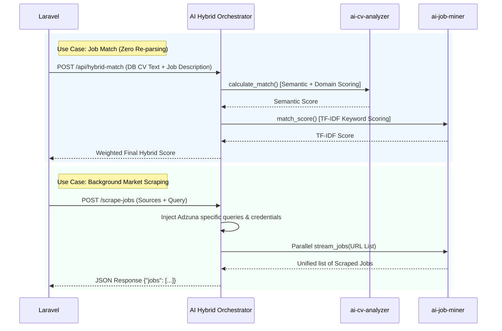

# ai-hybrid-orchestrator

> **Layer 3 Matching — Facade Pattern**  
> A single entry-point combining `ai-job-miner` + `ai-cv-analyzer` into one unified hybrid pipeline, exposed as a **FastAPI microservice** for Laravel integration.



---

## Overview

| Engine             | Directory            | Role                                                                 |
| ------------------ | -------------------- | -------------------------------------------------------------------- |
| **AI Job Miner**   | `../ai-job-miner/`   | 5-phase heuristic scraping + TF-IDF matching                         |
| **AI CV Analyzer** | `../ai-cv-analyzer/` | V3 Pipeline: BERT NER · BART-MNLI · MiniLM semantic embeddings       |

**Port**: 8001 (consumed by Laravel as AI Gateway)

---

## hybrid_runner.py — Facade Entry Point

`hybrid_runner.py` acts as the **CLI Facade** for the full hybrid pipeline:

1. Loads ai-cv-analyzer modules first (`CVOrchestrator`, `IntelligentMatcher`)
2. Resolves `core/` namespace collision via `_only()` context manager — wipes `sys.modules`, sets exclusive `sys.path`
3. Loads ai-job-miner modules (`ScrapingEngine`, `match_score`)
4. Orchestrates: CV parse (V3) → Job scrape → Hybrid scoring
   *(Note: CV parsing natively includes structured contact extraction, eliminating redundant local extraction logic.)*

**Usage:**
```bash
cd ai-hybrid-orchestrator
python hybrid_runner.py   # Edit MOCK_CV_PATH / MOCK_JOB_URL at bottom for testing
```

---

## Zero PDF Re-parsing Optimization (Phase 12)

When Laravel performs **job matching** (e.g., gap analysis), it does **not** re-analyze the user's PDF. Instead:

### How It Works

1. **Laravel** (`GapAnalysisService`) builds a `MatchRequest`-style payload from **canonicalized database data**:
   - **cv_skills**: Plucked from `user_skills` + `skills` (pre-canonicalized at CV upload)
   - **cv_text**: Concatenation of `user_profiles.headline`, `user_profiles.summary`, and `user_experiences.description`
   - **job_skills**: From `job_skills` pivot
   - **job_description**: Raw `jobs.description` text

2. Laravel sends this payload to:
   - **ai-hybrid-orchestrator** `POST /api/hybrid-match` (port 8001) — Semantic + TF-IDF hybrid
   *(Note: The legacy `/api/v2/match-job` was deprecated during the AI Gateway architecture consolidation)*

3. **No PDF re-parsing** — all data comes from the normalized Laravel database. This:
   - Eliminates redundant AI inference
   - Reduces latency
   - Ensures consistency (single source of truth)

---

## Fallback Mechanism (TF-IDF if Semantic API Unreachable)

If the semantic/Layer 3 match API (e.g., ai-cv-analyzer port 8002) is **unreachable**:

- **GapAnalysisService** falls back to **DB-based fuzzy matching**:
  - Uses `normalizeSkillName()` for fuzzy skill comparison
  - Computes weighted match from job importance categories (Essential 5x, Important 3x, Nice-to-have 1x)
  - Returns the same structure as the AI path — seamless UX

- **hybrid-match** endpoint uses **TF-IDF** (pure Python cosine similarity) as the 40% component; if the semantic embedder fails, the request would error. For resilience, Laravel’s gap analysis uses the fallback above when the external API is down.

---

## Directory Structure

```
ai-hybrid-orchestrator/
├── __init__.py              # Package marker
├── hybrid_runner.py         # CLI Facade — full pipeline runner
├── main_api.py              # FastAPI gateway — Laravel endpoints
├── test_api.py              # End-to-end TestClient
├── .env.example             # Template for API credentials (Adzuna, HF)
└── README.md                # This file
```

---

## Environment Variables

Copy the `.env.example` file to configure external service integrations:

```bash
cp .env.example .env
```

| Variable | Purpose |
|----------|---------|
| `ADZUNA_APP_ID` | API ID for the Adzuna job scraper. Automatically injected when targeting an `adzuna.com` source endpoint. |
| `ADZUNA_APP_KEY`| API Key for the Adzuna job scraper. Forces the scraper into API mode bypassing the HTML redirect. |
| `HF_TOKEN`      | HuggingFace token for accessing gated models (optional). |

---

## FastAPI Microservice — main_api.py

### Run Server

```bash
cd ai-hybrid-orchestrator
uvicorn main_api:app --host 0.0.0.0 --port 8001 --reload
```

- Swagger UI: **http://127.0.0.1:8001/docs**
- Health: **http://127.0.0.1:8001/**

### Startup (FastAPI Lifespan)

Heavy AI models are loaded **once** at startup as singletons:

| Model                      | Loaded By            | Purpose                                |
| -------------------------- | -------------------- | -------------------------------------- |
| `dslim/bert-base-NER`      | `SkillNEREngine`     | Skills · Roles · Orgs extraction       |
| `facebook/bart-large-mnli` | `CVDomainClassifier` | Zero-shot domain classification        |
| `all-MiniLM-L6-v2`         | `IntelligentMatcher` | Semantic embedding + cosine similarity |

---

## API Endpoints

### `GET /`

Health check.

### `POST /api/parse-cv`

Upload CV (PDF/DOCX/PNG/JPG) → profile contacts, skills, domain, parsing status, statistics, structured experience.

### `POST /api/scrape-on-demand`

Scrape job listing URL using `ScrapingEngine` → up to 5 parsed job dicts.

### `POST /test-source`

Test a single configured job scraping source and inject search queries. 

**Adzuna Query Injection**: This endpoint (and `/scrape-jobs`) contains specialized logic to intercept requests destined for `adzuna.com`. It dynamically maps Laravel's generic search parameters (`q`, `search`) to Adzuna's API spec (`what`) and overrides pagination (`limit` -> `results_per_page`). It also automatically injects `ADZUNA_APP_ID` and `ADZUNA_APP_KEY` from the `.env` file, forcing the scraper into `api` mode and bypassing HTML scraping bottlenecks.

### `POST /scrape-jobs`

Background market scraping endpoint. Batch streams multiple job sources concurrently and unifies the return structure without internal HTML scraping bottlenecks. Used by Laravel's `ProcessMarketScraping` job.

**Request Schema (`ScrapeJobsRequest`):**
```json
{
  "query": "Software Engineer",
  "max_results": 30,
  "use_samples": false,
  "calculate_statistics": true,
  "sources": [
    {
      "id": 1,
      "name": "Adzuna Tech",
      "endpoint": "https://api.adzuna.com/v1/api/jobs/gb/search/1",
      "type": "html",
      "params": {"category": "it-jobs"}
    }
  ]
}
```

### `POST /api/hybrid-match`

Compute weighted hybrid match score.

**Request:**
```json
{
  "cv_text": "...",
  "cv_skills": ["python", "django"],
  "job_description": "...",
  "job_skills": ["python", "fastapi"]
}
```

**Formula:** `Final = (Adaptive Layer 3 × 60%) + (TF-IDF × 40%)`

**Response:**
```json
{
  "hybrid_match_score": 74.3,
  "semantic_match_pct": 68.1,
  "tfidf_score_pct": 84.2,
  "missing_skills": ["kubernetes", "fastapi"],
  "formula": "Final = (Adaptive Layer 3 × 60%) + (TF-IDF × 40%)"
}
```

### `POST /api/process-cv`

End-to-End Orchestration. Combines CV parsing and job scraping natively. Consumes a `cv_file` and `job_url` from form data, saves a temporary file, and runs `process_hybrid_application`.

**Response Payload (`job`, `cv`, `scores`):**
```json
{
  "job": {
    "url": "https://...",
    "title": "Backend Engineer",
    "job_type": "Full-time",
    "skills": ["python", "aws"]
  },
  "cv": {
    "extraction_method": "v3-orchestrator",
    "skills": ["Python", "Docker"],
    "domain": "Technology & Software",
    "parsing_status": "success",
    "contact": { "email": "user@example.com" }
  },
  "scores": {
    "semantic_match_pct": 82.5,
    "tfidf_score_pct": 71.2,
    "final_score_pct": 77.9,
    "missing_skills": ["aws"]
  }
}
```

---

## Namespace Isolation

Both engines expose `core/` — collision resolved via:

1. **`_wipe_core()`**: Removes `core` and `core.*` from `sys.modules`
2. **`_set_path_exclusive(root)`**: Ensures only target engine root is at `sys.path[0]`
3. **Sequential bootstrapping**: CV-analyzer → wipe → job-miner → restore both roots

---

## Testing

```bash
cd ai-hybrid-orchestrator
python test_api.py
```

| Test Group           | What is verified                                                                 |
| -------------------- | -------------------------------------------------------------------------------- |
| Test 0 — `GET /`     | Health check                                                                     |
| Test 1 — parse-cv    | Skills, domain, contact_info, parsing validation                                 |
| Test 2 — scrape      | Jobs list from Remotive via `ScrapingEngine`                                     |
| Test 3 — hybrid-match| hybrid_match_score, semantic_score, tfidf_score, missing_skills                  |
| Test 4 — Validation  | .txt → 422, blank cv_text → 422, invalid endpoints handling                      |

---

## Roadmap

| Phase   | Feature                                               | Status |
| ------- | ----------------------------------------------------- | ------ |
| Phase 1–5 | ai-job-miner 5-phase scraping                         | ✅     |
| Phase 6a | ai-cv-analyzer 3-layer ML pipeline                    | ✅     |
| Phase 6b | Hybrid Orchestrator Facade (CLI runner)               | ✅     |
| Phase 6c | FastAPI Gateway + Contact Extractor                   | ✅     |
| Phase 7 | Zero-Knowledge Contextual Refactor                    | ✅     |
| Phase 12| Zero PDF Re-parsing (MatchRequest from DB)            | ✅     |

---

**Last Updated**: April 2026
