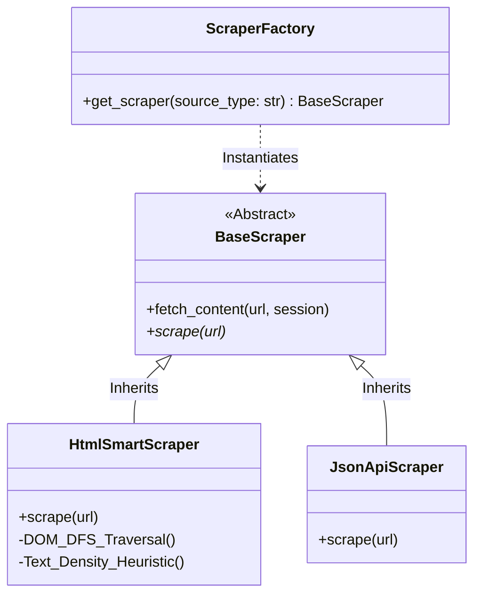
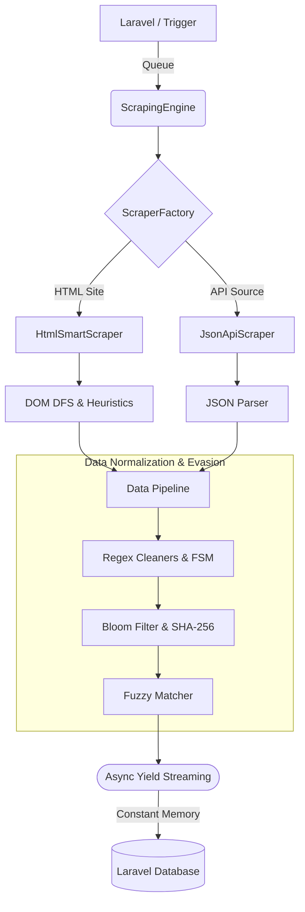
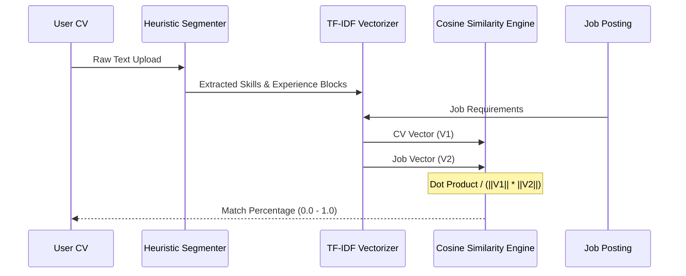

# Smart AI Scraper Engine

> **Phase 1 — Core Architecture & Design Patterns (Strategy + Factory)**  
> **Phase 2 — Smart DOM Analysis (Text Density Heuristics & Semantic Proximity)**  
> **Phase 3 — Data Normalization Pipeline (Bloom Filter, Regex FSM, DP Levenshtein)**  
> **Phase 4 — AI & Mathematical Matching Engine (TF-IDF, Cosine Similarity, NER)**  
> **Phase 5 — Performance, Memory Management & Evasion (Token Bucket, Async Generator, DLQ)**

A highly scalable, generic web-scraping engine built with advanced software-engineering principles. The engine is designed to be **technology-agnostic**: adding a new data-source type (XML, GraphQL, browser-rendered SPA, …) requires zero changes to existing code — only a new strategy class and one line in the factory registry.

---

## Table of Contents

1. [Project Overview](#project-overview)
2. [Directory Structure](#directory-structure)
3. [System Architecture Diagrams](#system-architecture-diagrams)
   - [Design Patterns — OOP Architecture](#1-design-patterns--oop-architecture)
   - [Data Streaming & Normalization Pipeline](#2-data-streaming--normalization-pipeline)
   - [AI Mathematical Matching Engine](#3-ai-mathematical-matching-engine)
4. [Phase 1: Architecture](#phase-1-architecture)
   - [Strategy Pattern](#strategy-pattern)
   - [Factory Pattern](#factory-pattern)
   - [Quick-Start Code Snippet](#quick-start-code-snippet)
5. [Phase 2: Smart DOM Analysis](#phase-2-smart-dom-analysis)
   - [Text Density Heuristic](#text-density-heuristic)
   - [DFS Density Traversal](#dfs-density-traversal)
   - [Semantic Proximity](#semantic-proximity)
   - [Title Extraction](#title-extraction)
   - [Location Extraction](#location-extraction)
   - [Phase 2 Quick-Start](#phase-2-quick-start)
6. [Phase 3: Data Normalization Pipeline](#phase-3-data-normalization-pipeline)
   - [SHA-256 + Bloom Filter Deduplication](#sha-256--bloom-filter-deduplication-pipelinededuplicatorpy)
   - [Regex FSM Cleaners](#regex-fsm-cleaners-pipelinecleanerspy)
   - [Levenshtein DP Fuzzy Matcher](#levenshtein-dp-fuzzy-matcher-pipelinefuzzy_matcherpy)
7. [Phase 4: AI & Mathematical Matching Engine](#phase-4-ai--mathematical-matching-engine)
   - [Heuristic CV Segmentation](#heuristic-cv-segmentation-aisegmentationpy)
   - [TF-IDF Matching Engine](#tf-idf-matching-engine-aimatcherpy)
   - [Custom Skill Extraction](#custom-skill-extraction-aioner_extractorpy)
8. [Phase 5: Performance, Memory & Evasion](#phase-5-performance-memory-management--evasion)
   - [Token Bucket Rate Limiter](#token-bucket-rate-limiter-corehttp_clientpy)
   - [Dead Letter Queue](#dead-letter-queue-coredlqpy)
   - [Async Generator Pipeline](#async-generator-pipeline-coreenginepy)
9. [Testing](#testing)
10. [Installation](#installation)
11. [Roadmap](#roadmap)

---

## Project Overview

| Attribute     | Detail                                                              |
| ------------- | ------------------------------------------------------------------- |
| **Language**  | Python 3.11+                                                        |
| **Async I/O** | `aiohttp` — non-blocking HTTP from day one                          |
| **Patterns**  | Strategy, Factory · Bloom Filter, TF-IDF, DP Levenshtein, Regex FSM |
| **Testing**   | `pytest` + `pytest-asyncio`; all network I/O is mocked              |
| **Goal**      | A drop-in AI scraping library usable by any Python project          |

---

## System Architecture Diagrams

### 1. Design Patterns — OOP Architecture

> How the **Strategy** and **Factory** patterns combine to form a plug-in, technology-agnostic scraping core.



---

### 2. Data Streaming & Normalization Pipeline

> End-to-end data flow from an external trigger to the database, showing every processing stage.



---

### 3. AI Mathematical Matching Engine

> The TF-IDF vectorization and Cosine Similarity pipeline that produces a relevance score between a CV and a job posting.



---

## Directory Structure

```
ai-job-miner/
│
├── core/
│   ├── __init__.py
│   ├── base_scraper.py          # Abstract Strategy interface + shared fetch_content()
│   ├── heuristics.py            # Phase 2: Text Density, DFS traversal, Semantic Proximity
│   ├── http_client.py           # Phase 5: SmartAsyncClient (Token Bucket + Backoff + UA)
│   ├── dlq.py                   # Phase 5: Dead Letter Queue for failed URL tracking
│   └── engine.py                # Phase 5: ScrapingEngine — stream_jobs async generator
│
├── strategies/
│   ├── __init__.py
│   ├── html_scraper.py          # Concrete Strategy: HTML scraper — title, location,
│   │                            #   description, salary_hint via DFS & Semantic Proximity
│   └── api_scraper.py           # Concrete Strategy: JSON REST API scraper
│
├── factories/
│   ├── __init__.py
│   └── scraper_factory.py       # Factory: maps type strings → concrete strategies
│
├── pipeline/                    # Phase 3: Data Normalization Pipeline
│   ├── __init__.py
│   ├── deduplicator.py          # BloomFilter (scratch) + JobDeduplicator (SHA-256)
│   ├── cleaners.py              # clean_text, remove_noise, extract_salary, extract_experience,
│   │                            #   extract_job_type, extract_work_model, extract_working_hours
│   └── fuzzy_matcher.py         # DP Levenshtein distance + are_skills_similar
│
├── ai/                          # Phase 4: AI & Mathematical Matching Engine
│   ├── __init__.py
│   ├── segmentation.py          # HeuristicSegmenter — O(n) CV section parser
│   ├── matcher.py               # TF-IDF + Cosine Similarity (pure Python, no NumPy)
│   └── ner_extractor.py         # CustomSkillExtractor — lexicon + optional spaCy ruler
│
├── tests/
│   ├── __init__.py
│   ├── test_architecture.py     # Phase 1: Factory, ABC, fetch_content tests (21 tests)
│   ├── test_heuristics.py       # Phase 2: Density, DFS, Semantic Proximity tests (21 tests)
│   ├── test_pipeline.py         # Phase 3: Dedup, cleaners, fuzzy matcher tests (65 tests)
│   ├── test_ai.py               # Phase 4: Segmenter, TF-IDF, NER tests (49 tests)
│   └── test_performance.py      # Phase 5: TokenBucket, DLQ, engine streaming (30 tests)
│
├── run_engine.py                # Local microservice test runner (all 5 phases end-to-end)
├── requirements.txt
└── README.md
```

---

## Phase 1: Architecture

### Strategy Pattern

**File:** `core/base_scraper.py`

The **Strategy Pattern** defines a family of algorithms, encapsulates each one, and makes them interchangeable. Here, `BaseScraper` is the _Strategy interface_:

```python
# core/base_scraper.py
from abc import ABC, abstractmethod

class BaseScraper(ABC):

    @abstractmethod
    async def scrape(self, url: str, **kwargs) -> dict:
        """Each concrete strategy implements its own scraping algorithm."""
        ...

    async def fetch_content(self, url: str, session: aiohttp.ClientSession) -> str:
        """Shared HTTP GET helper — error-handling & logging in one place."""
        ...
```

**Why?**

| Problem (without Strategy)                                                                 | Solution (with Strategy)                                    |
| ------------------------------------------------------------------------------------------ | ----------------------------------------------------------- |
| A single monolithic `scraper.py` with `if source == 'html': ... elif source == 'api': ...` | Each algorithm lives in its own class, tested independently |
| Adding new source type means editing existing code (risky)                                 | Add a new class — existing code is untouched                |
| Cannot easily swap algorithm at runtime                                                    | Swap via the Factory at construction time                   |

---

### Factory Pattern

**File:** `factories/scraper_factory.py`

The **Factory Pattern** decouples the _creation_ of objects from their _use_. Callers never import concrete strategy classes directly.

```python
# factories/scraper_factory.py
_SCRAPER_REGISTRY = {
    "html": HtmlSmartScraper,
    "api":  JsonApiScraper,
    # "xml": XmlScraper,  ← add new types here only
}

class ScraperFactory:
    @staticmethod
    def get_scraper(source_type: str) -> BaseScraper:
        scraper_class = _SCRAPER_REGISTRY.get(source_type.strip().lower())
        if scraper_class is None:
            raise ValueError(f"Unknown source type: '{source_type}'")
        return scraper_class()
```

**Why?**

| Problem (without Factory)                                   | Solution (with Factory)                                |
| ----------------------------------------------------------- | ------------------------------------------------------ |
| Client imports `HtmlSmartScraper` directly → tight coupling | Client imports only `ScraperFactory` and `BaseScraper` |
| Changing class names breaks callers                         | Change the registry entry, callers are unaffected      |
| Cannot use dependency injection or mocking easily           | Mock the factory in tests                              |

---

### Quick-Start Code Snippet

```python
import asyncio
from factories.scraper_factory import ScraperFactory

async def main():
    # --- HTML page ---
    html_scraper = ScraperFactory.get_scraper("html")
    html_result  = await html_scraper.scrape("https://example.com")
    print(html_result["status"])   # "success"
    print(html_result["type"])     # "html"

    # --- JSON REST API ---
    api_scraper = ScraperFactory.get_scraper("api")
    api_result  = await api_scraper.scrape("https://jsonplaceholder.typicode.com/todos/1")
    print(api_result["status"])    # "success"
    print(api_result["content"])   # {"userId": 1, "id": 1, "title": "...", "completed": False}

    # --- Unknown type → explicit error ---
    try:
        ScraperFactory.get_scraper("graphql")
    except ValueError as e:
        print(e)  # Unknown source type: 'graphql'. Supported types are: ['api', 'html'].

asyncio.run(main())
```

---

## Phase 2: Smart DOM Analysis

**Files:** `core/heuristics.py` · `strategies/html_scraper.py` (updated)

Phase 2 eliminates the need for brittle, site-specific CSS selectors or XPath expressions.
Instead, we use four complementary **CS algorithms** to extract structured data from _any_ HTML page.

---

### Text Density Heuristic

> **CS Concept:** Signal-to-noise ratio applied to DOM trees.

Each DOM node is scored by how much meaningful text it carries relative to its markup complexity:

```
density = len(stripped_text) / (num_direct_child_tags + 1)
```

| Node Type                       | Characters | Child Tags | Density Score |
| ------------------------------- | ---------- | ---------- | ------------- |
| Job description `<div>` (prose) | 800        | 2          | **400.0** 🏆  |
| Navigation `<nav>` (many links) | 60         | 15         | 3.75          |
| Footer `<div>` (copyright)      | 80         | 4          | 16.0          |

The job description **always wins** — not because of its class name, but because of its content.

This approach is inspired by _Boilerplate Detection Using Shallow Text Features_ (Kohlschütter et al., WWW 2010).

---

### DFS Density Traversal

> **CS Concept:** Depth-First Search over a tree (O(n) — each node visited once).

`find_highest_density_node` runs a full DFS over all `<div>`, `<section>`, `<article>`, and `<main>` tags, scores each with the density formula, and returns the **globally highest-scoring node's text** — the job description.

```python
# core/heuristics.py
def find_highest_density_node(soup: BeautifulSoup, min_length: int = 200) -> str | None:
    best_node, best_score = None, -1.0
    for node in soup.find_all({"div", "section", "article", "main"}):
        score = get_text_density(node)
        if score > best_score and len(node.get_text()) >= min_length:
            best_score, best_node = score, node
    return best_node.get_text() if best_node else None
```

**Why no hardcoded selectors?** The same algorithm works on Indeed, LinkedIn, Glassdoor, or any custom job board — no per-site configuration required.

---

### Semantic Proximity

> **CS Concept:** Graph neighbour traversal (sibling walk) for label–value pair extraction.

`extract_semantic_sibling` finds a keyword (e.g. `"Salary"`) anywhere in the tree, then walks **next siblings** to retrieve the adjacent value — handling all four common HTML patterns:

| HTML Pattern    | Example                                     | Handles? |
| --------------- | ------------------------------------------- | -------- |
| Inline sibling  | `<span>Salary:</span><strong>$80k</strong>` | ✅       |
| Definition list | `<dt>Salary</dt><dd>$80k</dd>`              | ✅       |
| Table cells     | `<td>Pay</td><td>$120k</td>`                | ✅       |
| Inline text     | `<li>Salary: $80k – $100k</li>`             | ✅       |

Synonym keywords (`pay`, `compensation`, `remuneration`, `wage`, `stipend`) are tried in priority order — so even non-standard salary labels are captured.

---

### Title Extraction

> **CS Concept:** DOM tree priority search — O(1) best case.

`HtmlSmartScraper` extracts the job title using a two-level fallback:

| Priority | Source        | Method                                       |
| -------- | ------------- | -------------------------------------------- |
| 1st      | `<h1>` tag    | `soup.find("h1").get_text()`                 |
| 2nd      | `<title>` tag | Strips " `–` Company" suffix noise via Regex |

This works on any job board without knowing its HTML structure.

---

### Location Extraction

> **CS Concept:** Semantic Proximity sibling walk — same algorithm as salary extraction, different keywords.

The same `extract_semantic_sibling` function is reused with location-specific keywords:
`location`, `headquarters`, `based in`, `office`, `city`.

A guard filters out false positives — if the extracted value is longer than 120 characters it is likely a paragraph, not a location, and the next keyword is tried.

---

### Phase 2 Quick-Start

```python
import asyncio
from factories.scraper_factory import ScraperFactory

async def main():
    scraper = ScraperFactory.get_scraper("html")
    result  = await scraper.scrape("https://example-jobs.com/listing/123")

    print(result["title"])        # "Senior Backend Engineer"  — from <h1>
    print(result["location"])     # "Cairo, Egypt"             — semantic proximity
    print(result["description"]) # full body text             — DFS density
    print(result["salary_hint"]) # "$90k – $120k"             — semantic proximity

asyncio.run(main())
```

---

## Phase 3: Data Normalization Pipeline

**Files:** `pipeline/deduplicator.py` · `pipeline/cleaners.py` · `pipeline/fuzzy_matcher.py`

Phase 3 applies the **"Garbage In, Garbage Out"** principle: raw scraped data is normalised, deduplicated, and enriched before being stored or passed to any AI model.

---

### SHA-256 + Bloom Filter Deduplication (`pipeline/deduplicator.py`)

> **CS Concepts:** Cryptographic Hashing (SHA-256) + Probabilistic Set Membership (Bloom Filter)

**Why two layers?**

| Layer                  | Mechanism                           | Time            | Guarantees               |
| ---------------------- | ----------------------------------- | --------------- | ------------------------ |
| Bloom Filter           | k prime-seeded hash fns → bit array | O(k) ≈ **O(1)** | **Zero false negatives** |
| Exact set (`set[str]`) | Python hash table                   | O(1) avg        | **Zero false positives** |

The Bloom Filter acts as a _cheap guard_ — it instantly rules out items that are definitely new. Only when it says "maybe" does the engine do an exact set lookup.

```python
# Canonical fingerprint — normalises case + whitespace before hashing
hash = JobDeduplicator.generate_hash("  Python Dev  ", "Google", "Cairo")
# → sha256("python dev|google|cairo") = 64-char hex

if not dedup.is_duplicate(hash):
    dedup.mark_seen(hash)
    # → store job
```

Optimal Bloom Filter sizing:

```
m (bits) = -n × ln(p) / (ln 2)²     # bit-array size
k (fns)  = (m / n) × ln 2           # hash function count
```

For 10,000 items at 1% FPR: m ≈ 95,850 bits (12 KB), k = 7 hash functions.

---

### Regex FSM Cleaners (`pipeline/cleaners.py`)

> **CS Concept:** Finite State Machine — Python's `re` module compiles patterns into a DFA, giving O(n) matching with no backtracking.

| Function                | Input Example                      | Output Example                              |
| ----------------------- | ---------------------------------- | ------------------------------------------- |
| `clean_text`            | `"<p>Python &amp; Django</p>"`     | `"Python & Django"`                         |
| `remove_noise`          | `"Urgent: Python Dev (Remote)"`    | `"Python Dev"`                              |
| `extract_salary`        | `"10k - 12k USD"`                  | `{min: 10000, max: 12000, currency: "USD"}` |
| `extract_experience`    | `"3-5 yrs"`                        | `{min_exp: 3, max_exp: 5}`                  |
| `extract_job_type`      | `"Full-time contract role"`        | `"Full-time"`                               |
| `extract_work_model`    | `"Hybrid / remote position"`       | `"Hybrid"`                                  |
| `extract_working_hours` | `"40 hrs/week, flexible schedule"` | `"40 hours/week"`                           |

**`extract_job_type`** — patterns tested most-specific-first so `"Full-time Contract"` → `"Full-time"`, not `"Contract"`.

**`extract_work_model`** — `"Hybrid"` is checked before `"Remote"` to prevent `"Hybrid-remote"` mis-classifying as `Remote`.

**`extract_working_hours`** — matches `X hours/week`, `9 to 5`, `night/morning/evening shift`, `flexible hours`, `rotating shifts`.

---

### Levenshtein DP Fuzzy Matcher (`pipeline/fuzzy_matcher.py`)

> **CS Concept:** Dynamic Programming — O(m×n) 2D matrix, zero external libraries.

Recurrence:

```
if s1[i-1] == s2[j-1]:  dp[i][j] = dp[i-1][j-1]
else:                    dp[i][j] = 1 + min(delete, insert, substitute)
```

```python
levenshtein_distance("React.js", "ReactJS")  # → 3
similarity_score("React.js", "ReactJS")      # → 0.625  (= 1 - 3/8)
are_skills_similar("React.js", "ReactJS")    # → True   (score ≥ 0.8 threshold)
are_skills_similar("Python", "Java")         # → False
```

---

## Phase 4: AI & Mathematical Matching Engine

**Files:** `ai/segmentation.py` · `ai/matcher.py` · `ai/ner_extractor.py`

Phase 4 introduces the core intelligence: a pure-mathematical matching engine and heuristic NLP segmentation — with **zero black-box ML libraries** for the core math.

---

### Heuristic CV Segmentation (`ai/segmentation.py`)

> **CS Concept:** O(n) single-pass state machine over document lines.

`HeuristicSegmenter.segment_cv` scans the CV line-by-line. At each line it either:

- **Transitions state** → detects a section header via pre-compiled regex patterns per canonical section (`summary`, `experience`, `education`, `skills`, `certifications`, `projects`, …)
- **Accumulates content** → appends the line to the current section bucket

Header detection uses two layers:

1. **Pre-compiled regex patterns** — keyword families per section (e.g., `experience|work history|employment|career history|…`)
2. **ALL-CAPS fallback** — entirely uppercase short lines are tested even if they use unusual phrasing

```python
segmenter = HeuristicSegmenter()
sections = segmenter.segment_cv(raw_cv_text)
print(sections["experience"])   # → job history text
print(sections["skills"])       # → skills list
```

---

### TF-IDF Matching Engine (`ai/matcher.py`)

> **CS Concepts:** Information Retrieval (TF-IDF, Sparck Jones 1972) + Linear Algebra (Cosine Similarity). Zero numpy, zero scikit-learn.

| Step | Function            | Formula                                       | Complexity |
| ---- | ------------------- | --------------------------------------------- | ---------- |
| 1    | `tokenize`          | lowercase + split on `\W+` + stop-word filter | O(n)       |
| 2    | `compute_tf`        | count(t, d) / total_tokens                    | O(n)       |
| 3    | `compute_idf`       | log(D / (1 + df(t)))                          | O(D × n)   |
| 4    | `vectorize`         | TF(t,d) × IDF(t) per vocab term               | O(V)       |
| 5    | `cosine_similarity` | (v₁·v₂) / (‖v₁‖×‖v₂‖)                         | O(V)       |

```python
# Full pipeline in one call
score = match_score(cv_text, job_description_text)
# 0.0 = no overlap  |  1.0 = identical term distribution

# Or step-by-step:
idf   = compute_idf([cv_text, job_text])
cv_v  = vectorize(cv_text, idf)
job_v = vectorize(job_text, idf)
score = cosine_similarity(cv_v, job_v)   # → e.g. 0.72
```

**Why TF-IDF beats raw keyword counting:**
TF-IDF down-weights terms like "experience" or "developer" that appear in nearly every document — ensuring common words don't dominate the similarity score.

---

### Custom Skill Extraction (`ai/ner_extractor.py`)

> **CS Concept:** Longest-match-first lexicon scanning (equivalent to prefix-trie traversal, O(L) per position).

Hybrid extraction, two layers:

1. **Lexicon** — 150+ skills across 7 categories (languages, frameworks, databases, cloud, AI/ML, tools, methodologies). Multi-word skills (`machine learning`, `react native`) are matched **longest-first** to avoid partial matches.
2. **spaCy Entity Ruler** (optional) — custom `SKILL` label patterns added _before_ spaCy's default NER. Gracefully absent when spaCy is not installed.

```python
extractor = CustomSkillExtractor()
skills = extractor.extract_skills(
    "5+ years Python, React Native, PostgreSQL, Docker, and AWS"
)
# → ['python', 'react native', 'postgresql', 'docker', 'aws']
```

---

## Phase 5: Performance, Memory Management & Evasion

**Files:** `core/http_client.py` · `core/dlq.py` · `core/engine.py`

Phase 5 completes the engine by adding resilience, politeness, and O(1) memory streaming.

---

### Token Bucket Rate Limiter (`core/http_client.py`)

> **CS Concept:** Token Bucket traffic-shaping algorithm (RFC 4115) — O(1) per request.

The `SmartAsyncClient` combines three evasion & reliability mechanisms:

| Mechanism               | Algorithm                                                   | Purpose                                            |
| ----------------------- | ----------------------------------------------------------- | -------------------------------------------------- |
| **Token Bucket**        | Lazy refill: `tokens += elapsed × rate`, capped at capacity | Smooth request rate — prevents bursting            |
| **Exponential Backoff** | `delay = min(base × 2ⁿ, max) + jitter`                      | Handles 429 / 5xx gracefully; jitter prevents herd |
| **User-Agent Rotation** | `random.choice(8 real browser UA strings)`                  | Reduces WAF fingerprint signal                     |

```python
async with SmartAsyncClient(rate=2.0, max_retries=4) as client:
    html = await client.get("https://jobs.example.com/123")
    # → automatically rate-limited, retried on 429, UA rotated
```

Backoff formula: `delay = min(1.0 × 2ⁿ, 60) + U(0, 1)` seconds per attempt — capped at 60 s to prevent unbounded waits.

---

### Dead Letter Queue (`core/dlq.py`)

> **CS Concept:** Fault-tolerance pattern from distributed systems (AWS SQS, Kafka). No URL is ever silently lost.

Failed URLs are stored as `FailedTask` records with:

- `url`, `error`, `attempts`, `first_failed_at`, `last_failed_at`
- Idempotent `add_failure` — same URL fails again → increments counter, not duplicate
- `get_retryable()` — returns tasks below `max_attempts` threshold
- `get_permanently_failed()` — tasks for human review / persistent logging
- `asyncio.Lock` ensures concurrent coroutine safety

```python
dlq = DeadLetterQueue(max_attempts=3)
await dlq.add_failure("https://example.com/job/1", "HTTP 503")
print(dlq.summary)
# → {'total': 1, 'retryable': 1, 'permanently_failed': 0}

for task in await dlq.get_retryable():
    # re-queue task.url into the scraper
    ...
```

---

### Async Generator Pipeline (`core/engine.py`)

> **CS Concept:** Asynchronous Generator (PEP 525) — O(1) memory footprint regardless of dataset size.

`ScrapingEngine.stream_jobs` is declared with `async def … yield`. This fuses a coroutine with a generator:

| Property             | Bulk `return list`                    | `async def … yield`          |
| -------------------- | ------------------------------------- | ---------------------------- |
| Memory               | O(N) — all jobs in RAM simultaneously | **O(1)** — one job at a time |
| First result latency | Must finish all URLs first            | Immediately after first URL  |
| Back-pressure        | None                                  | Automatic (consumer pulls)   |

The engine orchestrates the **full 5-phase + IE pipeline** per URL:

```
URL → SmartAsyncClient.get()      [Phase 5: rate-limited, retrying]
    → HtmlSmartScraper.scrape()   [Phase 2: DFS + title <h1> + location proximity]
    → extract_job_type/model/hrs  [Phase 3: IE Regex classifiers]
    → clean + extract_salary()    [Phase 3: Regex FSM]
    → JobDeduplicator             [Phase 3: SHA-256 + Bloom Filter]
    → CustomSkillExtractor        [Phase 4: NER lexicon]
    → match_score()               [Phase 4: TF-IDF cosine]
    → yield job_dict (11 fields)  [Phase 5: O(1) stream]
    → DLQ on failure              [Phase 5: fault tolerance]
```

```python
engine = ScrapingEngine(rate=3.0, reference_text="Python Django REST API")

async for job in engine.stream_jobs(url_list):
    # Each yielded dict has 11 fields:
    print(job["title"])         # "Senior Backend Engineer"  — <h1> extraction
    print(job["job_type"])      # "Full-time"                — Regex FSM
    print(job["work_model"])    # "Remote"                   — Regex FSM
    print(job["location"])      # "Cairo, Egypt"             — semantic proximity
    print(job["working_hours"]) # "40 hours/week"            — Regex FSM
    print(job["salary"])        # {min: 90000, max: 120000, currency: "USD"}
    print(job["experience"])    # {min_exp: 4, max_exp: 6}
    print(job["skills"])        # ["python", "django", "fastapi", ...]
    print(job["match_score"])   # 0.9177  — TF-IDF cosine relevance
    await save_to_database(job) # processed one at a time — O(1) memory

# After the run
print(engine.dlq.summary)            # inspect failures
retryable = await engine.dlq.get_retryable()  # re-queue for retry
```

---

## Testing

All tests use `pytest` with the `pytest-asyncio` plugin. **No real network calls are made** — all HTTP I/O is mocked with `unittest.mock`, and all heuristic tests use inline HTML strings.

```bash
# Run the full test suite from the ai-job-miner/ directory
pytest tests/ -v
```

### What is tested

| Test File              | Test Class                   | Coverage                                            |
| ---------------------- | ---------------------------- | --------------------------------------------------- |
| `test_architecture.py` | `TestScraperFactory`         | Factory dispatch, case-insensitivity, `ValueError`  |
| `test_architecture.py` | `TestBaseScraperAbstraction` | ABC enforcement                                     |
| `test_architecture.py` | `TestFetchContent`           | Success, HTTP error, timeout, connection error      |
| `test_architecture.py` | `TestHtmlSmartScraper`       | End-to-end success/error                            |
| `test_architecture.py` | `TestJsonApiScraper`         | Valid + invalid JSON                                |
| `test_heuristics.py`   | `TestGetTextDensity`         | Density formula, leaf nodes, noisy nodes            |
| `test_heuristics.py`   | `TestFindHighestDensityNode` | DFS picks correct div by density, ignores noise     |
| `test_heuristics.py`   | `TestExtractSemanticSibling` | All 4 HTML patterns + synonyms + edge cases         |
| `test_heuristics.py`   | `TestIntegration`            | End-to-end on realistic job-listing HTML            |
| `test_pipeline.py`     | `TestJobDeduplicator`        | SHA-256 determinism, normalisation, dedup flow      |
| `test_pipeline.py`     | `TestBloomFilter`            | No false negatives, sizing, FPR                     |
| `test_pipeline.py`     | `TestCleanText`              | HTML stripping, entity unescaping, whitespace       |
| `test_pipeline.py`     | `TestRemoveNoise`            | Noise word removal, punctuation cleanup             |
| `test_pipeline.py`     | `TestExtractSalary`          | k-multiplier, 5 currency codes, range & single      |
| `test_pipeline.py`     | `TestExtractExperience`      | Range, min-only, at-least, single, empty            |
| `test_pipeline.py`     | `TestLevenshteinDistance`    | Known distances, symmetry, triangle inequality      |
| `test_pipeline.py`     | `TestSimilarityScore`        | Bounds, identical, asymmetric pairs                 |
| `test_pipeline.py`     | `TestAreSkillsSimilar`       | React.js/ReactJS, threshold, invalid input          |
| `test_ai.py`           | `TestHeuristicSegmenter`     | Section detection, ALL-CAPS headers, edge cases     |
| `test_ai.py`           | `TestTokenize`               | Stop-word removal, punctuation, min-length          |
| `test_ai.py`           | `TestComputeTF`              | Formula correctness, sum-to-1, empty input          |
| `test_ai.py`           | `TestComputeIDF`             | Rare > common IDF, smoothed formula                 |
| `test_ai.py`           | `TestVectorize`              | OOV exclusion, TF × IDF product                     |
| `test_ai.py`           | `TestCosineSimilarity`       | Identical=1.0, orthogonal=0.0, symmetry, bounds     |
| `test_ai.py`           | `TestMatchScore`             | End-to-end identical/unrelated/related texts        |
| `test_ai.py`           | `TestCustomSkillExtractor`   | Single/multi-word, longest-match, dedup, ordering   |
| `test_performance.py`  | `TestTokenBucket`            | Immediate acquire, invalid rate, capacity, burst    |
| `test_performance.py`  | `TestSmartAsyncClient`       | UA rotation, 429 backoff sequence, retry exhaustion |
| `test_performance.py`  | `TestDeadLetterQueue`        | CRUD, idempotency, filtering, concurrent safety     |
| `test_performance.py`  | `TestScrapingEngine`         | Async generator type, lazy yield, DLQ path, dedup   |

Expected output:

```
collected 186 items

tests/test_architecture.py::... PASSED
tests/test_heuristics.py::...  PASSED
tests/test_pipeline.py::...    PASSED
tests/test_ai.py::...          PASSED
tests/test_performance.py::... PASSED
186 passed in ~1.6s
```

---

## Installation

```bash
# 1. Navigate into the project directory
cd ai-job-miner

# 2. (Recommended) Create & activate a virtual environment
python -m venv .venv
# Windows
.venv\Scripts\activate
# macOS / Linux
source .venv/bin/activate

# 3. Install dependencies
pip install -r requirements.txt

# 4. (Optional) Install spaCy for enhanced NER in Phase 4
pip install spacy
python -m spacy download en_core_web_sm
```

---

## Roadmap

| Phase      | Feature                                                                                          |
| ---------- | ------------------------------------------------------------------------------------------------ |
| ✅ **1**   | Strategy + Factory patterns, `BaseScraper`, HTML & API strategies, full test suite               |
| ✅ **2**   | DOM DFS Text-Density walker, Semantic Proximity salary + location extraction, heuristic tests    |
| ✅ **3**   | SHA-256 + Bloom Filter dedup, Regex cleaners, DP Levenshtein fuzzy matcher                       |
| ✅ **4**   | TF-IDF + Cosine Similarity engine, Heuristic CV segmenter, Custom NER extractor                  |
| ✅ **5**   | Token Bucket rate limiter, Exponential Backoff, Dead Letter Queue, async generator               |
| ✅ **5.5** | IE enhancements — `title` (`<h1>`), `location`, `job_type`, `work_model`, `working_hours` fields |
| ✅ **6**   | Hybrid Orchestrator — Facade combining `ai-job-miner` + `ai-cv-analyzer` with weighted scoring   |
| 🔜 **7**   | REST API wrapper (FastAPI) for Laravel integration                                               |
