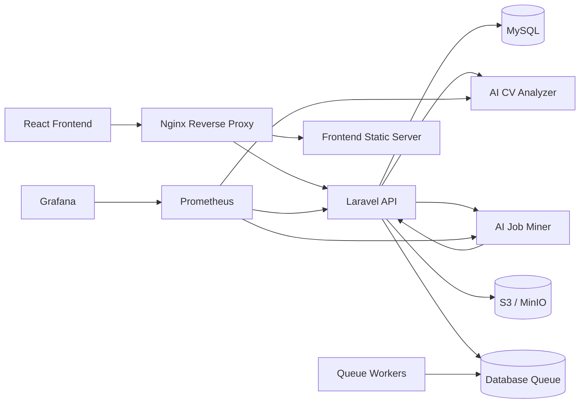

# Career Compass Production Readiness

## Architecture

## Service Flow

1. User authenticates through Laravel Sanctum.
2. CV uploads are validated, stored privately, then sent to the AI analyzer.
3. Scraping requests are dispatched to the scraper service over HTTP.
4. Scraper callbacks use machine auth only and never expose proxy credentials to user tokens.
5. Queue workers process default, high, scraping, ai, and emails lanes separately.
6. Readiness and metrics endpoints feed smoke tests, Prometheus, and the status page.

## Local Development

1. Copy the env files in `backend-api/.env.example` and `frontend/.env.example`.
2. Start the stack with `docker compose up -d`.
3. Run migrations with `docker compose exec backend-api php artisan migrate --force`.
4. Open the app through nginx on `http://localhost`.

## Production Deployment

1. Set production secrets: database, S3/MinIO, Sentry, monitoring token, and scraper tokens.
2. Build and deploy with `docker compose -f docker-compose.yml -f docker-compose.prod.yml up -d --build`.
3. Run migrations before promoting traffic.
4. Verify `http://<host>/api/v1/ready` and `http://<host>/api/v1/metrics`.

## Queue Layout

- `default`: general API background work.
- `high`: urgent interactive jobs.
- `scraping`: scraper orchestration and heavy crawling.
- `ai`: future long-running AI jobs.
- `emails`: future notification dispatch.

## Scraper Flow

1. Laravel creates a scraping job record.
2. Laravel calls `ai-job-miner` over HTTP with a machine token.
3. Scrapy sends results back through internal machine-authenticated Laravel routes.
4. Failed URLs are recorded in the failure table and surfaced in the admin dashboard.

## Monitoring

- Laravel readiness: `/api/v1/ready`
- Laravel metrics: `/api/v1/metrics`
- AI metrics: `/metrics`
- Scraper metrics: `/metrics`
- Logs: structured JSON on stderr
- Tracing: request IDs propagate through Laravel, AI, and scraper calls

## Scaling

- Scale queue workers independently by queue.
- Increase scraping worker count before raising crawl concurrency.
- Keep CV analysis synchronous only for user-triggered uploads; move any new bulk work to queue jobs.
- Use MinIO locally and S3 in production for file storage.

## Rollback

1. Keep the previous image tags available.
2. Roll back the compose file to the prior release.
3. Re-run migrations only if the rollback path is migration-safe.

## Backup / DR

- Back up MySQL daily.
- Back up the object store bucket daily.
- Keep `.env` and deployment secrets in your secret manager, not in git.

## Troubleshooting

- `503` on readiness usually means a dependency is down or a token is missing.
- Queue jobs stuck in `jobs` usually means the queue worker for that lane is not running.
- Scraper credential exposure should never happen; if it does, verify that user tokens are not used on internal routes.
