# CareerCompass: AI-Powered Career Guidance and Job Recommendation Platform

Kafr El-Sheikh University

Faculty of Computers and Information

Computer Science Department

Graduation Project Book

Academic Year: 2025 / 2026

Supervisor: Dr. Amena Mahmoud

Submitted by:
Yousef Altohamy Ahmed Altohamy
Ahmed Mohamed Ahmed Abdelaziz
Mohamed Ali Ahmed Mohamed
Mohamed Ibrahim Ahmed Mohamed
Ahmed Khamis Mohamed Younes
Ahmed Sobhy Mohamed Ali

\pagebreak

# Table of Contents

- [List of Figures](#bm_list_of_figures)
- [List of Tables](#bm_list_of_tables)
- [Acknowledgment](#bm_acknowledgment)
- [Abstract](#bm_abstract)
- [Abbreviations](#bm_abbreviations)
- [Chapter 1: Introduction](#bm_chapter_1_introduction)
- [Chapter 2: System Analysis](#bm_chapter_2_system_analysis)
- [Chapter 3: System Design and Architecture](#bm_chapter_3_system_design_and_architecture)
- [Chapter 4: Software and Tools Used](#bm_chapter_4_software_and_tools_used)
- [Chapter 5: System Implementation](#bm_chapter_5_system_implementation)
- [Chapter 6: AI CV Analyzer Deep Technical Analysis](#bm_chapter_6_ai_cv_analyzer_deep_technical_analysis)
- [Chapter 7: AI Job Miner and Scraping Deep Technical Analysis](#bm_chapter_7_ai_job_miner_and_scraping_deep_technical_analysis)
- [Chapter 8: Testing and Evaluation](#bm_chapter_8_testing_and_evaluation)
- [Chapter 9: Security and Privacy](#bm_chapter_9_security_and_privacy)
- [Chapter 10: Conclusion and Future Work](#bm_chapter_10_conclusion_and_future_work)
- [References](#bm_references)
- [Appendices](#bm_appendices)

\pagebreak

# List of Figures

- [Figure 1. High-level architecture of CareerCompass.](#bm_figure_1)
- [Figure 2. Docker deployment architecture.](#bm_figure_2)
- [Figure 3. DFD Level 0 context diagram.](#bm_figure_3)
- [Figure 4. DFD Level 1 process diagram.](#bm_figure_4)
- [Figure 5. UML use case diagram.](#bm_figure_5)
- [Figure 6. Sequence diagram for CV upload and analysis.](#bm_figure_6)
- [Figure 7. Sequence diagram for recommendation and gap analysis.](#bm_figure_7)
- [Figure 8. ERD and database summary diagram.](#bm_figure_8)
- [Figure 9. AI CV Analyzer runtime flow.](#bm_figure_9)
- [Figure 10. AI CV Analyzer model-training workflow.](#bm_figure_10)
- [Figure 11. AI CV Analyzer extraction components.](#bm_figure_11)
- [Figure 12. Layer 1 CV understanding pipeline.](#bm_figure_12)
- [Figure 13. Layer 2 classification flow.](#bm_figure_13)
- [Figure 14. Layer 3 matching engine.](#bm_figure_14)
- [Figure 15. NER token processing and BIO tagging.](#bm_figure_15)
- [Figure 16. Seniority decision logic.](#bm_figure_16)
- [Figure 17. Skill canonicalization chain.](#bm_figure_17)
- [Figure 18. Layer 3 score collapse logic.](#bm_figure_18)
- [Figure 19. AI design philosophy for the layered hybrid analyzer.](#bm_figure_19)
- [Figure 20. Complete CV processing flow.](#bm_figure_20)
- [Figure 21. CV analyzer fault tolerance and recovery flow.](#bm_figure_21)
- [Figure 22. Confidence and readiness signal flow.](#bm_figure_22)
- [Figure 23. Skill canonicalization example.](#bm_figure_23)
- [Figure 24. Fine-tuned BERT NER architecture.](#bm_figure_24)
- [Figure 25. Detailed NER training pipeline.](#bm_figure_25)
- [Figure 26. Matching formula and penalty flow.](#bm_figure_26)
- [Figure 27. Explainable AI recommendation output.](#bm_figure_27)
- [Figure 28. AI analyzer sequence diagram.](#bm_figure_28)
- [Figure 29. Dataset evidence availability.](#bm_figure_29)
- [Figure 30. AI CV Analyzer smoke evaluation metrics.](#bm_figure_30)
- [Figure 31. Home page.](#bm_figure_31)
- [Figure 32. Register page.](#bm_figure_32)
- [Figure 33. Login page.](#bm_figure_33)
- [Figure 34. Student dashboard before CV upload.](#bm_figure_34)
- [Figure 35. CV upload user interface.](#bm_figure_35)
- [Figure 36. Dashboard after successful CV parsing.](#bm_figure_36)
- [Figure 37. Extracted profile and skills page.](#bm_figure_37)
- [Figure 38. Jobs recommendations page.](#bm_figure_38)
- [Figure 39. Job detail and inline gap panel.](#bm_figure_39)
- [Figure 40. Gap analysis page.](#bm_figure_40)
- [Figure 41. Applications tracker page.](#bm_figure_41)
- [Figure 42. Tools Hub preview page.](#bm_figure_42)
- [Figure 43. System status page.](#bm_figure_43)
- [Figure 44. Admin dashboard.](#bm_figure_44)
- [Figure 45. Admin jobs page.](#bm_figure_45)
- [Figure 46. Admin sources diagnostics page.](#bm_figure_46)
- [Figure 47. Admin target roles page.](#bm_figure_47)
- [Figure 48. Docker services evidence.](#bm_figure_48)
- [Figure 49. Validation command evidence.](#bm_figure_49)
- [Figure 50. Colab NER final epoch metrics.](#bm_figure_50)
- [Figure 51. Colab NER epoch performance trend.](#bm_figure_51)
- [Figure 52. Colab NER training and validation loss curve.](#bm_figure_52)
- [Figure 53. Job mining design philosophy.](#bm_figure_53)
- [Figure 54. AI Job Miner runtime architecture.](#bm_figure_54)
- [Figure 55. Complete job mining flow.](#bm_figure_55)
- [Figure 56. Scraping sequence diagram.](#bm_figure_56)
- [Figure 57. Scraping job lifecycle.](#bm_figure_57)
- [Figure 58. Source management and target-role flow.](#bm_figure_58)
- [Figure 59. Job import and deduplication flow.](#bm_figure_59)
- [Figure 60. Failed URL and retry flow.](#bm_figure_60)
- [Figure 61. Scraping security boundaries.](#bm_figure_61)
- [Figure 62. Scraping validation evidence.](#bm_figure_62)

\pagebreak

# List of Tables

- [Table 1. Stakeholder summary.](#bm_table_1)
- [Table 2. Functional requirements summary.](#bm_table_2)
- [Table 3. Non-functional requirements summary.](#bm_table_3)
- [Table 4. Hardware and software environment.](#bm_table_4)
- [Table 5. Design decisions summary.](#bm_table_5)
- [Table 6. AI CV Analyzer components.](#bm_table_6)
- [Table 7. NER entity label schema.](#bm_table_7)
- [Table 8. Synthetic dataset generation workflow.](#bm_table_8)
- [Table 9. Model training configuration.](#bm_table_9)
- [Table 10. Layer 1 component details.](#bm_table_10)
- [Table 11. Layer 2 classification engine details.](#bm_table_11)
- [Table 12. Layer 3 matching engine details.](#bm_table_12)
- [Table 13. Semantic embedding and TF-IDF fallback comparison.](#bm_table_13)
- [Table 14. Simplified BIO tagging example.](#bm_table_14)
- [Table 15. AI CV Analyzer source inventory summary.](#bm_table_15)
- [Table 16. Algorithm-to-file mapping.](#bm_table_16)
- [Table 17. AI design alternatives comparison.](#bm_table_17)
- [Table 18. Confidence and readiness signal summary.](#bm_table_18)
- [Table 19. Skill canonicalization example.](#bm_table_19)
- [Table 20. Dataset availability and transparency.](#bm_table_20)
- [Table 21. Seniority-aware matching weights.](#bm_table_21)
- [Table 22. Recommendation explanation output types.](#bm_table_22)
- [Table 23. Computational complexity overview.](#bm_table_23)
- [Table 24. Raw CV fragment extraction example.](#bm_table_24)
- [Table 25. Layer 2 interpretation example.](#bm_table_25)
- [Table 26. Layer 3 matching evidence example.](#bm_table_26)
- [Table 27. AI approach comparison.](#bm_table_27)
- [Table 28. Colab NER training run configuration.](#bm_table_28)
- [Table 29. Colab NER final metric summary.](#bm_table_29)
- [Table 30. AI CV Analyzer output schema sections.](#bm_table_30)
- [Table 31. Job mining design decisions.](#bm_table_31)
- [Table 32. Scraping runtime component map.](#bm_table_32)
- [Table 33. On-demand scraping lifecycle states.](#bm_table_33)
- [Table 34. Source management and target-role controls.](#bm_table_34)
- [Table 35. Import and deduplication stages.](#bm_table_35)
- [Table 36. Failed URL and operational failure handling.](#bm_table_36)
- [Table 37. Scraping security and configuration controls.](#bm_table_37)
- [Table 38. Job mining API contract summary.](#bm_table_38)
- [Table 39. Scraping validation evidence.](#bm_table_39)
- [Table 40. Scraping limitations, ethics, and future work.](#bm_table_40)
- [Table 41. Model evaluation evidence.](#bm_table_41)
- [Table 42. NER extraction examples.](#bm_table_42)
- [Table 43. Semantic matching and TF-IDF example results.](#bm_table_43)
- [Table 44. Mini CV dataset.](#bm_table_44)
- [Table 45. Mini job dataset.](#bm_table_45)
- [Table 46. Mini evaluation metrics.](#bm_table_46)
- [Table 47. Recommendation ranking details.](#bm_table_47)
- [Table 48. Gap analysis pair details.](#bm_table_48)
- [Table 49. Automated validation results.](#bm_table_49)
- [Table 50. Manual functional evaluation matrix.](#bm_table_50)
- [Table 51. Manual functional observations.](#bm_table_51)
- [Table 52. Security and privacy controls.](#bm_table_52)
- [Table 53. API endpoint summary.](#bm_table_53)
- [Table 54. Database tables summary.](#bm_table_54)
- [Table 55. Docker services summary.](#bm_table_55)
- [Table 56. AI CV Analyzer function inventory summary.](#bm_table_56)

\pagebreak

# Acknowledgment

The project team would like to express sincere appreciation to Dr. Amena Mahmoud for academic supervision, technical guidance, and continuous feedback during the preparation of CareerCompass. The team also thanks the Faculty of Computers and Information at Kafr El-Sheikh University for providing the academic setting in which this graduation project was designed, implemented, tested, and documented.

The work presented in this book reflects a collaborative software engineering effort. It combines web application development, database design, AI-assisted document analysis, explainable matching, containerized deployment, testing, and technical documentation. The two supervisor-provided graduation books were used only to understand expected report structure and visual formality; no content, wording, project-specific claims, diagrams, or references were copied from them.

# Abstract

CareerCompass is a graduation/demo career guidance platform that helps students and early-career users understand their CV profile, explore imported job opportunities, and compare their current skills against job requirements. The system consists of a React and Vite frontend, a Laravel API backend, a MySQL database, a FastAPI-based CV analyzer, a FastAPI/Scrapy-based job miner, MinIO-compatible private file storage, Nginx routing, and Prometheus/Grafana monitoring. The platform supports registration, login, CV upload, AI-assisted CV parsing, normalized profile and skills storage, job recommendation, gap analysis, an application tracker, and administrator dashboards for job and source diagnostics.

The AI CV Analyzer is documented as a hybrid implementation rather than a single opaque model. It combines PDF/image text extraction, OCR fallback, section segmentation, a BERT-family token-classification path for named-entity recognition, rule-based contact/date/experience extraction, skill canonicalization, domain and seniority classification, sentence embeddings, and TF-IDF-style matching. The runtime code can load an exported local NER artifact when that ignored deployment folder is present, and a Colab-oriented training notebook documents how the artifact is produced. A user-provided exported Colab PDF now records the overall NER training metrics, while the cleaned dataset content and model weights remain outside Git; therefore, the report separates recorded training-run evidence from repository-alone reproducibility and production benchmark claims.

The implementation is intentionally described as a graduation/demo system rather than a production product. The AI outputs are estimates, the job data depends on imported and demo sources, and the security posture is appropriate for demonstration but requires further production hardening. Validation was performed through Docker Compose configuration checks, backend/frontend evidence from earlier passes, Python syntax checks, containerized AI Job Miner tests, service health probes, a deterministic demo-source smoke check, and manual browser screenshots. Backend tests previously passed with 39 tests and 297 assertions, the AI Job Miner container test suite passed with 75 tests in the final cleanup pass, and frontend lint/build evidence remains recorded from the earlier validation pass. The AI CV Analyzer pytest suite was not rerun in this cleanup pass, while Python syntax compilation passed.

\pagebreak

# Abbreviations

| Abbreviation | Meaning |
|---|---|
| API | Application Programming Interface |
| CV | Curriculum Vitae |
| DFD | Data Flow Diagram |
| ERD | Entity Relationship Diagram |
| HTTP | Hypertext Transfer Protocol |
| JSON | JavaScript Object Notation |
| JWT | JSON Web Token |
| ML | Machine Learning |
| NLP | Natural Language Processing |
| OCR | Optical Character Recognition |
| RBAC | Role-Based Access Control |
| REST | Representational State Transfer |
| S3 | Simple Storage Service compatible object storage |
| TF-IDF | Term Frequency-Inverse Document Frequency |
| UI | User Interface |

\pagebreak

# Chapter 1: Introduction

## 1.1 Introduction to the Project

CareerCompass is an AI-assisted career guidance and job recommendation platform developed as a Computer Science graduation project for Kafr El-Sheikh University. The system helps a student upload a CV, receive a structured profile, view estimated job matches, inspect skill gaps, and save opportunities in an application tracker. The project combines web engineering, backend service design, natural language processing support, web scraping support, data persistence, and containerized operations.

The platform uses a modern web stack. The frontend is implemented with React, a component-based UI library [4], and bundled with Vite [5]. The backend uses Laravel, which provides routing, controllers, validation, middleware, Eloquent ORM, queues, testing support, and file storage abstractions [1]. The AI services are implemented with FastAPI, a Python API framework that supports type-hinted request and response handling [6]. The deployment is orchestrated through Docker Compose [11].

## 1.2 Background and Motivation

Many students prepare CVs and search for jobs without a clear view of how their current skills relate to job descriptions. Career guidance is often fragmented across CV feedback, job boards, learning resources, and manual advice. CareerCompass addresses this academic problem by placing those steps into one integrated demonstration system. The objective is not to replace human career advising, but to provide a practical software prototype that can parse a CV, normalize profile data, import job records, estimate matches, and present explainable gap analysis.

## 1.3 Problem Statement

Students frequently face three connected problems. First, they may not know whether their CV communicates their skills clearly. Second, job listings often describe requirements in different formats, making comparison difficult. Third, students may save opportunities across separate tools without a coherent tracker. CareerCompass proposes a centralized graduation/demo system that links CV data, jobs, matching, gap analysis, and tracking.

## 1.4 Purpose of the Project

The purpose of CareerCompass is to demonstrate how a distributed web system can support career exploration using explainable AI-assisted workflows. The project demonstrates authentication, CV upload, private storage, parsing, skill extraction, job import, recommendation, gap analysis, admin diagnostics, and monitoring in a Dockerized environment.

## 1.5 Project Objectives

- Provide a student-facing web interface for account creation, login, CV upload, profile review, job recommendations, gap analysis, and application tracking.
- Provide an administrator interface for dashboard statistics, job review, source diagnostics, and target role management.
- Implement a Laravel API that protects authenticated workflows using token-based access and role checks.
- Implement Python services for CV analysis and job mining support.
- Store uploaded CV files privately and expose downloads through controlled URLs.
- Validate the system with backend tests, frontend lint/build, Python tests where available, Docker checks, HTTP probes, and browser screenshots.

## 1.6 Proposed Solution

The proposed solution is a multi-service application. React renders the browser interface. Nginx serves as the gateway. Laravel handles REST-style APIs over HTTP [16], authentication, validation, data models, business services, and admin routes. MySQL stores normalized data [8]. MinIO provides S3-compatible object storage [9]. The CV analyzer parses PDFs and images using Python text extraction and OCR-related libraries. The job miner imports jobs from demo, API, and scraping-style sources using FastAPI, Scrapy, and HTML parsing concepts [16], [17], [18].

## 1.7 Project Scope

The scope covers a graduation/demo environment: local Docker deployment, student workflows, admin workflows, testing, screenshots, and documentation. It does not claim production readiness, job placement certainty, full job market coverage, legal compliance for production privacy, or complete AI accuracy.

## 1.8 Graduation Demo Positioning

CareerCompass should be presented as a working academic prototype with realistic engineering boundaries. The screenshots and tests show that the core workflows can run locally. However, large-scale evaluation, production identity management, cloud infrastructure, observability hardening, legal privacy review, and complete market integrations remain future work.

## 1.9 Report Organization

Chapter 2 analyzes requirements and users. Chapter 3 presents architecture, diagrams, database design, and deployment. Chapter 4 lists software and tools with references. Chapter 5 documents implementation modules from the repository. Chapter 6 presents the AI CV Analyzer deep technical analysis as a standalone academic contribution. Chapter 7 presents the AI Job Miner and scraping deep technical analysis. Chapter 8 presents testing and evaluation results. Chapter 9 discusses security and privacy. Chapter 10 concludes with achievements, limitations, and future work.

\pagebreak

# Chapter 2: System Analysis

## 2.1 Introduction

System analysis defines what CareerCompass should do, who uses it, and what constraints influence implementation. The analysis is based on the reviewed repository, including the root documentation, Docker configuration, Laravel API, React frontend, Python services, database migrations, seeders, tests, and finalization notes.

## 2.2 Development Methodology

The project followed an iterative engineering approach. Each feature was implemented, checked through local commands or tests, integrated with Docker services, then documented. This approach is appropriate for a graduation project because it supports incremental progress while keeping the system demonstrable. The architecture uses separate services, which follows a common microservice-style pattern where independently deployable services communicate over network APIs [29].

## 2.3 Existing Career Guidance Problems

The system targets common problems in student career preparation:

- CV content is not structured for direct software comparison.
- Job descriptions vary in wording and completeness.
- Students need explainable feedback rather than unexplained match numbers.
- Admin users need visibility into imported jobs and scraping sources.
- Demo systems need reliable startup, testing, and evidence for academic evaluation.

## 2.4 Target Users and Stakeholders

| Stakeholder | Description | Main Interest |
|---|---|---|
| Student user | A university student or early-career user. | Upload CV, view profile, discover jobs, analyze gaps, save opportunities. |
| Administrator | A project operator or supervisor/demo administrator. | Review jobs, source diagnostics, users, target roles, and system health. |
| Supervisor | Academic supervisor evaluating the graduation project. | Correctness, completeness, originality, and honest evaluation. |
| Project team | Developers responsible for design and implementation. | Maintainable code, demonstrable workflows, testing, and documentation. |

*Table 1. Stakeholder summary.*

## 2.5 User Roles

CareerCompass implements two practical roles. The student role can register, login, upload a CV, view recommendations, run gap analysis, and track applications. The admin role can access protected admin routes for dashboard statistics, job administration, scraping sources, target roles, and user review.

\pagebreak

## 2.6 Functional Requirements

| ID | Requirement | Implementation Evidence |
|---|---|---|
| FR-01 | Register and login users. | Laravel AuthController, RegisterRequest, LoginRequest, React Login/Register pages. |
| FR-02 | Upload a CV file. | CvUploadRequest validates PDF/JPEG/PNG and max size; Dashboard appends file field `cv`. |
| FR-03 | Store CV files privately. | CvStorageService and MinIO/S3-compatible disk configuration. |
| FR-04 | Parse CV and extract profile/skills. | CvProcessingService and AI CV Analyzer `/api/parse-cv`. |
| FR-05 | Display normalized profile and skills. | UserResource, Profile page, Dashboard AI insight components. |
| FR-06 | Import and display jobs. | JobPosting model, ScrapedJobController, JobController, AI Job Miner. |
| FR-07 | Estimate job recommendations. | JobController and GapAnalysisService use CV/profile data and matching service. |
| FR-08 | Analyze skill gaps. | GapAnalysisController and GapAnalysis page. |
| FR-09 | Track applications. | ApplicationController, ApplicationTrackerService, Applications page. |
| FR-10 | Provide admin dashboards. | Admin Dashboard, Jobs, Sources, Targets pages and admin API routes. |
| FR-11 | Provide health and metrics endpoints. | HealthController, MetricsController, Prometheus/Grafana compose services. |

*Table 2. Functional requirements summary.*

## 2.7 Non-Functional Requirements

| Category | Requirement | CareerCompass Approach |
|---|---|---|
| Usability | The UI should guide students through CV upload and recommendations. | React pages, dashboard cards, profile score, and action buttons. |
| Maintainability | Code should be modular. | Controllers, requests, services, resources, models, React pages, and Python services are separated. |
| Reliability | The system should degrade honestly if AI services fail. | CV processing returns timeout/error/no_text statuses and preserves prior data when appropriate. |
| Security | Authentication, validation, private files, and admin role checks are required. | Sanctum tokens, request validation, admin middleware, signed URLs, service tokens. |
| Observability | Health and metrics should be available. | `/api/health`, `/api/ready`, `/api/metrics`, Prometheus, Grafana. |
| Portability | The demo should run locally. | Docker Compose services and environment examples. |

*Table 3. Non-functional requirements summary.*

## 2.8 Hardware Requirements

For local demonstration, a developer machine capable of running Docker Desktop and multiple containers is required. CV parsing and OCR-like processing can be CPU-intensive; therefore, enough memory should be available for the Laravel backend, MySQL, frontend, Python services, MinIO, Prometheus, and Grafana. GPU acceleration is not required for the demonstrated flow.

\pagebreak

## 2.9 Software Requirements

| Layer | Software |
|---|---|
| Frontend | React, Vite, Tailwind-style CSS classes, lucide-react icons, Recharts. |
| Backend | Laravel 12, PHP, Composer dependencies, Sanctum-style token authentication. |
| AI services | Python, FastAPI, text extraction, OCR-related dependencies, Scrapy-style job mining. |
| Data | MySQL 8.0, MinIO/S3-compatible storage. |
| Infrastructure | Docker, Docker Compose, Nginx, Prometheus, Grafana. |
| Testing | PHPUnit/Pest-style Laravel tests, pytest for Python, ESLint and Vite build. |

*Table 4. Hardware and software environment.*

## 2.10 Input and Output Flow

Primary inputs include user account data, uploaded CV files, imported job records, target role settings, and administrator source configurations. Primary outputs include normalized user profiles, skill lists, CV analysis metadata, estimated job matches, gap reports, application records, admin statistics, health checks, and monitoring metrics.

## 2.11 Use Case Summary

The main use cases are shown in Figure 5. The system separates student and administrator responsibilities while sharing the same backend API and database.

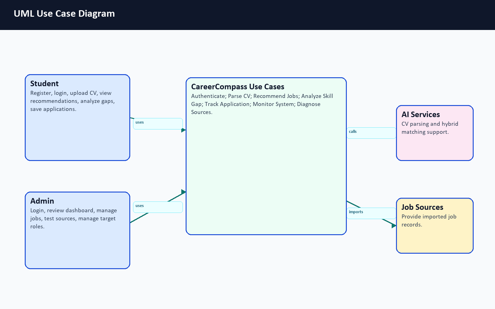

*Figure 5. UML use case diagram.*

\pagebreak

# Chapter 3: System Design and Architecture

## 3.1 Introduction

CareerCompass is designed as a Dockerized multi-service application. This design separates browser UI, API logic, AI services, data storage, object storage, reverse proxy routing, and monitoring. Docker containers help package runtime dependencies consistently [10], while Docker Compose coordinates the multi-container local deployment [11].

## 3.2 High-Level System Architecture

The high-level architecture is shown in Figure 1. Browser users interact with the React frontend through Nginx. The frontend calls the Laravel API. Laravel persists records in MySQL, stores CV files in MinIO-compatible storage, calls the AI CV Analyzer for parsing, calls matching logic for recommendations/gaps, and receives job imports from the job miner. This diagram was reviewed during the final evidence pass and already represents the important deployment boundaries: React, Nginx, Laravel, MySQL, MinIO, AI CV Analyzer, AI Job Miner, and monitoring.

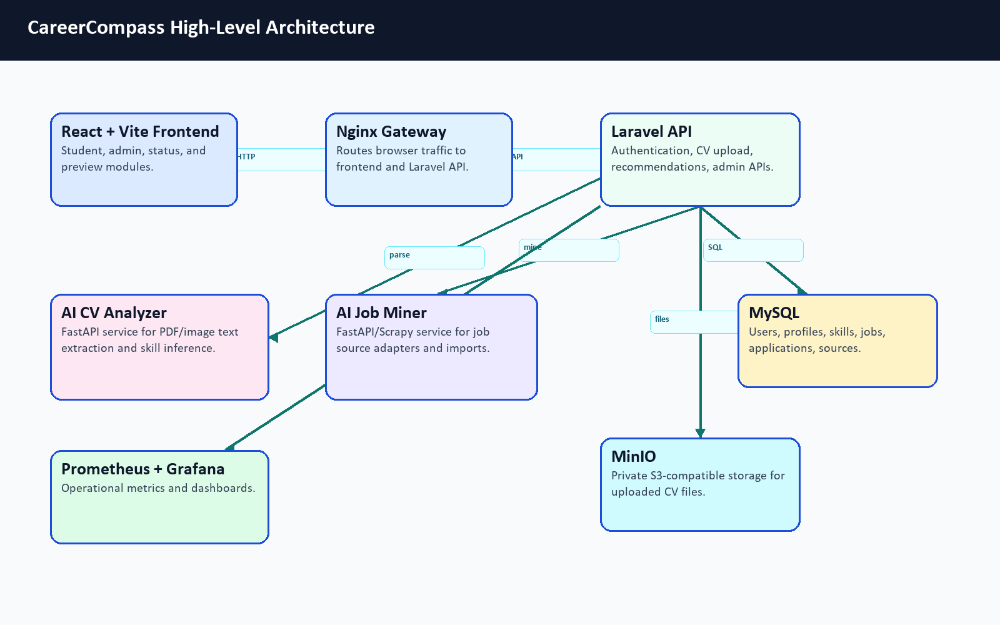

*Figure 1. High-level architecture of CareerCompass.*

## 3.3 Frontend Architecture

The frontend is implemented with React and organized around routes in `frontend/src/App.jsx`. Public pages include Home, Login, Register, About, Privacy, Terms, and System Status. Protected student routes include Dashboard, Jobs, Gap Analysis, Profile, Settings, Market Intelligence, Applications, CV Builder, Mock Interview, Learning, Career Planner, Mentorship, and Tools Hub. Protected admin routes include Admin Dashboard, Jobs, Users, Sources, and Target Roles.

The frontend API layer is located under `frontend/src/api`. Axios is configured in `client.js`, including base URL resolution, bearer token injection, request IDs, retry behavior for safe GET requests, and 401 handling. Authentication state is managed by `AuthContext.jsx`, which stores the user and token in local storage. Localization files exist under `frontend/src/locales`.

## 3.4 Backend API Architecture

The backend is a Laravel API. Routes are defined in `backend-api/routes/api.php` and are registered both at `/api` and `/api/v1`. The API includes public health/readiness/metrics endpoints, guest authentication routes, public job listing routes, internal scraper import routes protected by a service token, authenticated student routes, and admin routes protected by middleware.

Laravel provides structured controllers, form requests, resources, services, models, migrations, seeders, and tests. This aligns with Laravel's documented framework responsibilities, including routing, validation, database access, queues, and testing [1], [3].

## 3.5 AI CV Analyzer Architecture

The AI CV Analyzer is a FastAPI service. Laravel sends CV files to this service for parsing through `/api/parse-cv`. The analyzer routes PDFs and images differently, enforces timeout/error fallbacks, extracts readable text, runs structured extraction, and returns fields such as predicted role, seniority, domain, skills, strengths, gaps, red flags, confidence, document statistics, and parsing status. The backend handles statuses such as success, OCR fallback, timeout, error, empty file, and no text.

The analyzer is not a pure pretrained-model wrapper and not a model built entirely from scratch. It is a hybrid pipeline. The runtime prefers a local exported token-classification model under `ai-cv-analyzer/models/ner_weights/career_compass_ner_final` when that ignored deployment artifact exists; if the local artifact is unavailable, the NER engine has a fallback model path. Around that model-loading path, the team implemented practical CV-specific logic: spatial PDF parsing, OCR fallback, semantic sectioning, contact extraction, date/experience parsing, noisy-skill filtering, canonicalization, domain inference, seniority inference, and hybrid matching. PDF and OCR-related libraries are supported by external tools such as PyMuPDF, pdfplumber, and EasyOCR [22], [23], [24]. Transformer token classification and training concepts follow Hugging Face documentation [31], [32], [33].

Figure 9 summarizes the runtime path from the browser upload to Laravel persistence, FastAPI parsing, model/rule extraction, and dashboard output.

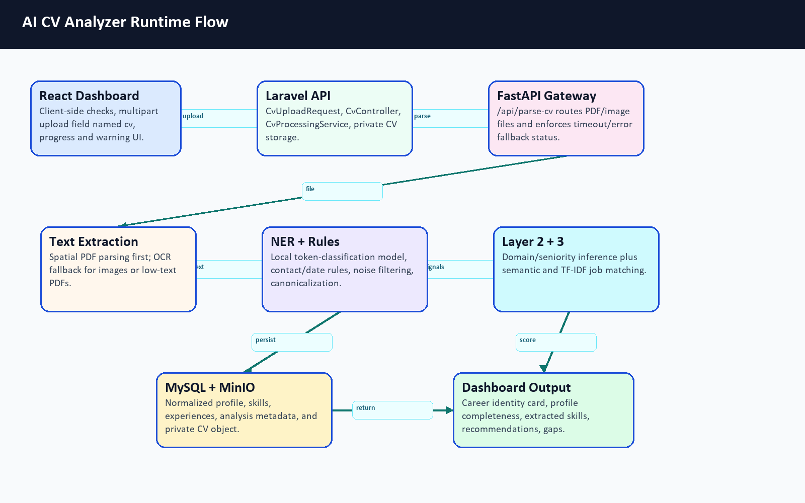

*Figure 9. AI CV Analyzer runtime flow.*

## 3.6 AI Job Miner Architecture

The AI Job Miner is a FastAPI service with scraping and import support. It includes source adapters for demo/local data, public APIs, and HTML/Scrapy-style extraction. Scrapy is a Python framework for extracting structured data from websites [17], and Beautiful Soup is commonly used to parse HTML documents [18]. CareerCompass uses a quality gate and honest source classifications so that demo/imported data is not overstated as broad labor-market reach.

## 3.7 Database Design

MySQL stores users, user profiles, skills, user-skill pivots, experience records, CV analyses, job postings, job-skill pivots, applications, scraping sources, target job roles, scraping jobs, failed URLs, and related metadata. MySQL is a relational database system documented by Oracle [8]. The Laravel migrations define schema constraints, indexes, foreign keys, and unique combinations such as job title/company uniqueness.

## 3.8 ERD

Figure 8 summarizes the main database tables and relationships. It is not a complete replacement for migrations, but it provides a readable graduation-book view of the data model. The final diagram was reviewed against migrations and updated to show the actual `user_profiles`, `user_experiences`, `user_skills`, and `job_skills` relationships.

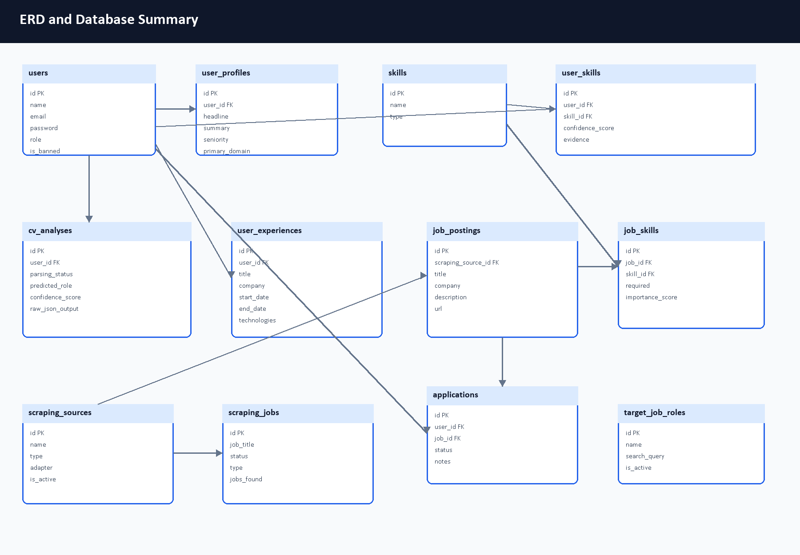

*Figure 8. ERD and database summary diagram.*

## 3.9 Data Flow Diagrams

The context-level data flow is shown in Figure 3, and the expanded process-level view is shown in Figure 4. Student and administrator workflows enter the same system boundary, while external job sources and AI services interact with controlled backend processes.

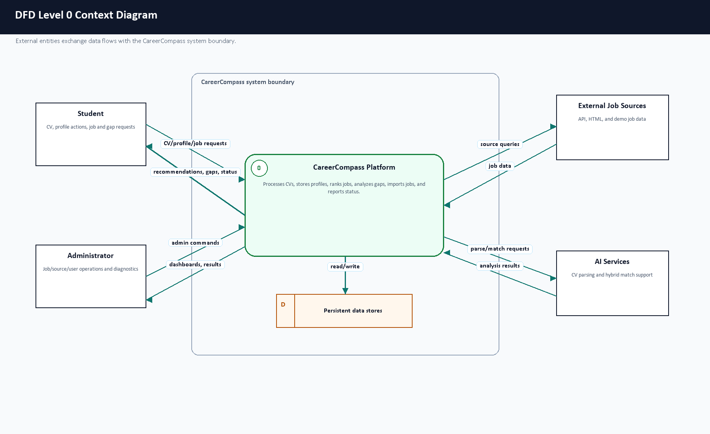

*Figure 3. DFD Level 0 context diagram.*

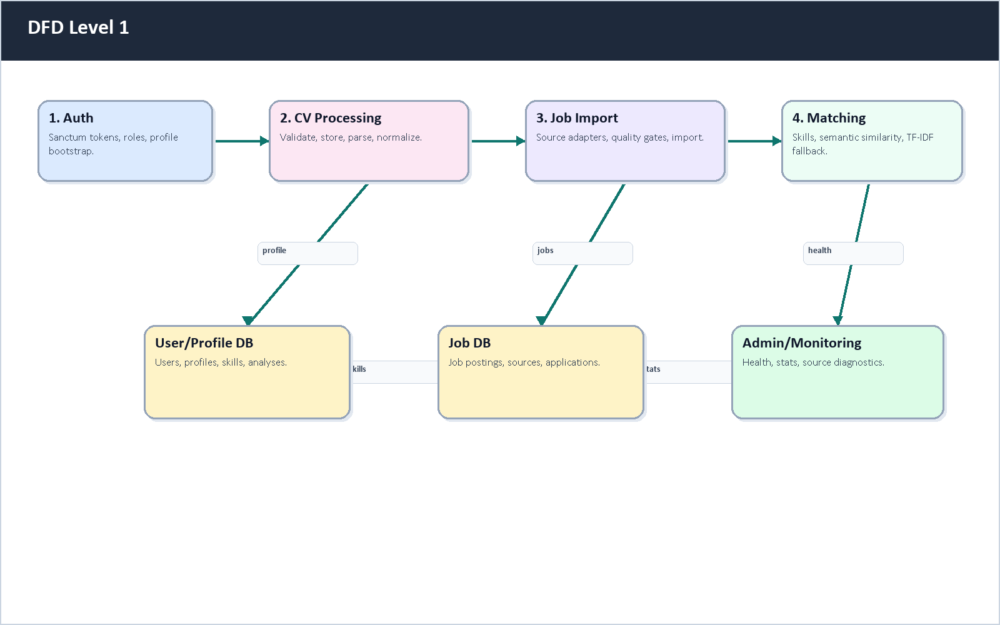

*Figure 4. DFD Level 1 process diagram.*

## 3.10 UML Use Case Diagram

The use case diagram separates student actions from administrator actions. Student workflows focus on career exploration. Admin workflows focus on operating and inspecting the imported job ecosystem.

## 3.11 UML Sequence Diagrams

Figure 6 shows the CV upload and analysis sequence. Figure 7 shows recommendation and gap analysis.

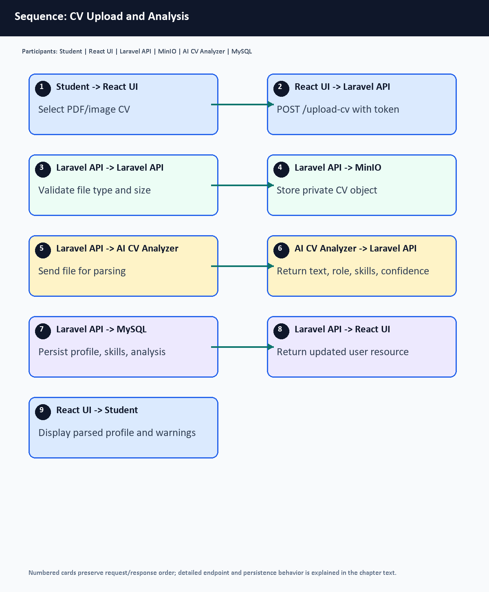

*Figure 6. Sequence diagram for CV upload and analysis.*

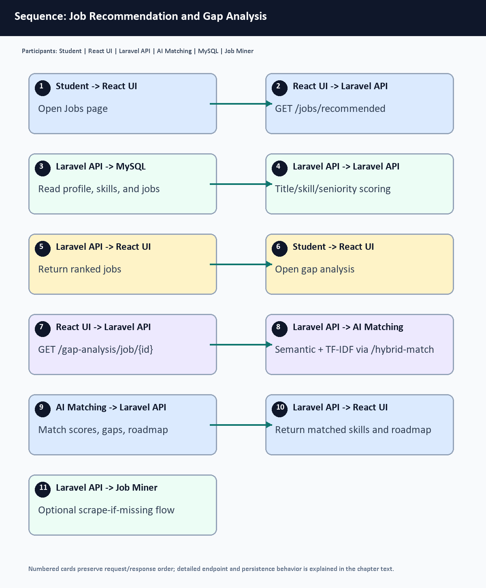

*Figure 7. Sequence diagram for recommendation and gap analysis.*

## 3.12 Deployment Architecture with Docker

The deployment is defined by Docker Compose files. Nginx exposes the application, the frontend serves built React assets, the Laravel API and workers handle backend work, MySQL stores structured data, MinIO stores private CV objects, Python services provide AI CV parsing and job mining, and Prometheus/Grafana provide monitoring. Figure 2 summarizes the container layout.

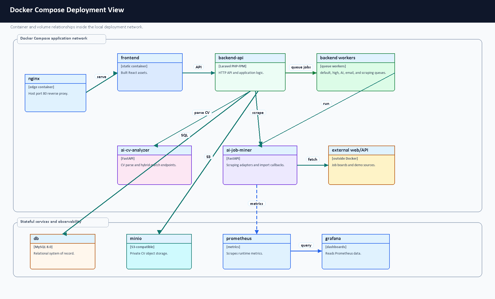

*Figure 2. Docker deployment architecture.*

## 3.13 Monitoring Architecture

CareerCompass includes live, readiness, and metrics endpoints. Prometheus is used for scraping and time-series metrics collection [13], while Grafana visualizes metrics and dashboard panels [14]. The admin dashboard also exposes application-level health information for the graduation demo.

## 3.14 Design Decisions and Justification

| Decision | Justification |
|---|---|
| Use Laravel for the main API. | The project benefits from built-in routing, validation, Eloquent ORM, queues, resources, tests, and middleware [1]. |
| Use React for UI. | Component-based pages support student/admin route separation and reusable cards [4]. |
| Use FastAPI for AI services. | Python AI/NLP dependencies are easier to isolate behind typed HTTP services [6]. |
| Use Docker Compose. | Multiple services can be started consistently for a graduation defense [11]. |
| Use private object storage for CV files. | CV files are sensitive; private storage and signed downloads reduce accidental exposure [9], [27]. |
| Keep AI wording honest. | Match scores and CV parsing are estimates; the demo should avoid claiming certain outcomes. |

*Table 5. Design decisions summary.*

\pagebreak

# Chapter 4: Software and Tools Used

## 4.1 Laravel

Laravel is used for the backend API, controllers, middleware, validation requests, Eloquent models, migrations, resources, queues, tests, and storage integration [1]. In CareerCompass, Laravel centralizes authenticated business logic and data persistence.

## 4.2 React

React is used to build the browser-based interface for students and administrators [4]. The project uses React routes and components for dashboard cards, forms, pages, tables, modals, and visualization panels.

## 4.3 Vite

Vite is used as the frontend build tool [5]. The successful production build transformed 2904 modules during validation.

## 4.4 FastAPI

FastAPI is used for Python services because it supports efficient API development using Python type hints and modern web service patterns [6]. CareerCompass uses it for CV analysis and job mining service endpoints.

## 4.5 Python

Python is used for AI and scraping-related services [7]. It supports the ecosystem of text extraction, OCR, NLP, testing, and scraping libraries used by the AI services.

## 4.6 MySQL

MySQL stores relational project data including users, profiles, skills, jobs, applications, scraping sources, and CV analyses [8].

## 4.7 MinIO / S3-Compatible Storage

MinIO-compatible object storage is used to store CV files privately. This avoids placing uploaded CVs directly in public web directories and supports signed temporary download flows [9].

## 4.8 Docker and Docker Compose

Docker containers package each runtime, and Docker Compose coordinates multi-container execution [10], [11]. CareerCompass uses Compose for Nginx, frontend, backend, workers, MySQL, MinIO, AI services, Prometheus, and Grafana.

## 4.9 Nginx

Nginx acts as the reverse proxy and public gateway for the local deployment [12]. It routes browser and API traffic to the correct containers.

## 4.10 Prometheus and Grafana

Prometheus collects metrics [13], and Grafana visualizes metrics and dashboards [14]. CareerCompass uses these tools to support monitoring-oriented evaluation.

## 4.11 GitHub Actions

GitHub Actions is configured for repository automation and CI/CD-style validation [15]. The report treats workflow definitions as part of the development process, while final PR status should be reviewed after the draft PR is opened.

## 4.12 NLP / AI Libraries

The project uses concepts and libraries related to text extraction, OCR, transformer token classification, TF-IDF, cosine similarity, and sentence embeddings. TF-IDF and cosine similarity are documented by scikit-learn [19], [20]. Sentence Transformers provides sentence embedding models and utilities [21]. PyMuPDF, pdfplumber, and EasyOCR support PDF/image text extraction and OCR-style workflows [22], [23], [24]. The token-classification path builds on BERT-style contextual representations [37].

Hugging Face Transformers is used for model loading and token-classification style inference/training [31], [32]. The training notebook uses Hugging Face Trainer concepts, token-label alignment, the `seqeval` metric family, and a BERT token-classification configuration [33]. Optional dynamic quantization is supported in the local model-loading code as an inference optimization concept [38]. The deployed matching layer also uses sentence embeddings and a custom TF-IDF fallback so that a service outage or weak semantic signal does not become a silent failure.

## 4.13 Synthetic Data and Training Tools

The repository includes a model-training workflow designed around synthetic annotated CV snippets. The data-generation script uses the Gemini API through Google AI developer tooling to generate labeled examples, while the training notebook is designed for Google Colab GPU execution [34], [35], [36]. This report treats the external AI tooling as training-support tooling, not as a runtime dependency for private CV uploads.

## 4.14 Testing Tools

Backend tests use Laravel/PHP testing tools and PHPUnit concepts [25]. Python service tests use pytest where available [26]. Frontend validation uses ESLint and Vite build checks.

## 4.15 Development and Version Control Tools

Git and GitHub are used for version control and pull-request-based collaboration. Docker Desktop provides the local container runtime. Browser screenshots were captured through a Chrome DevTools Protocol helper to provide evidence images for this report.

\pagebreak

# Chapter 5: System Implementation

## 5.1 Introduction

This chapter documents the implemented CareerCompass modules based on repository files. The implementation is not a generic career platform; it is a Laravel/React/FastAPI/Docker system with specific routes, services, pages, models, seeders, and tests.

## 5.2 Authentication and User Management

Authentication is implemented in `backend-api/app/Http/Controllers/Api/AuthController.php`. Registration creates a user with role `user`, loads profile and related resources, and returns a token. Login validates credentials, checks the banned state, revokes old tokens, creates a new token, and returns a user resource. The frontend stores the token as `auth_token` and the user object in local storage through `frontend/src/context/AuthContext.jsx`.

The register request restricts emails to selected public email domains and validates password format. The admin role is protected by the `IsAdmin` middleware. Admin seed data creates a demo-only administrator account through `AdminUserSeeder`.

## 5.3 Student Dashboard

The student dashboard is implemented in `frontend/src/pages/user/Dashboard.jsx`. It presents the current profile state, CV upload/update controls, profile completeness, career identity, AI insights, and next actions. Before CV upload, it prompts the user to add a CV. After upload, it displays parsed CV availability, role inference, profile score, experience, and action buttons.

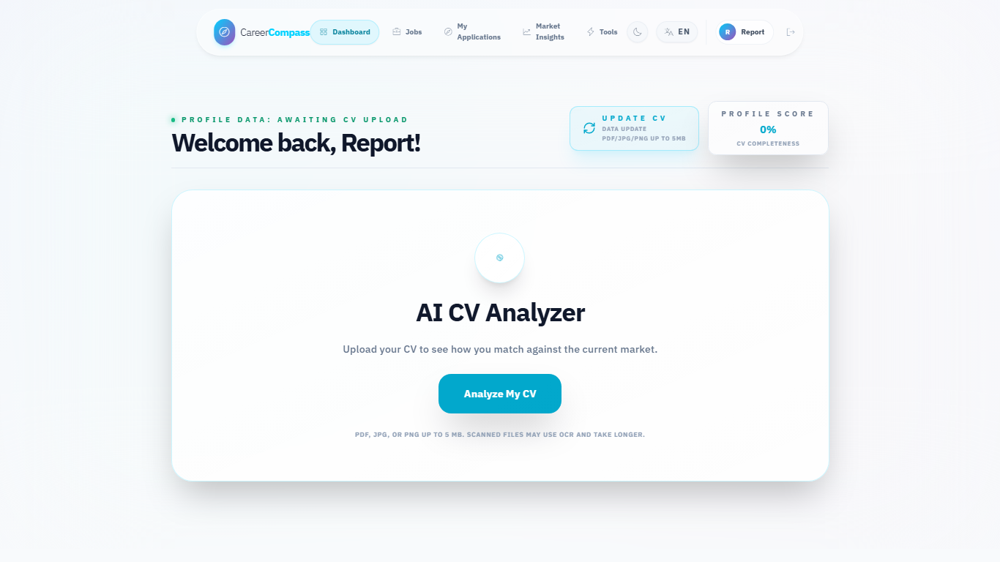

*Figure 34. Student dashboard before CV upload.*

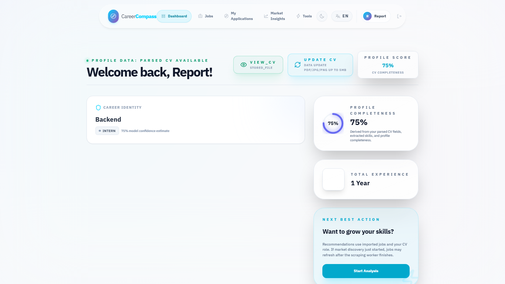

*Figure 36. Dashboard after successful CV parsing.*

## 5.4 CV Upload and Storage

`CvUploadRequest` requires a `cv` file and accepts PDF, JPEG, JPG, and PNG files up to 5 MB. The frontend appends the selected file as `cv` in a `FormData` object. `CvController` calls the CV processing service, persists the file path and metadata, and returns a unified user resource.

CV storage is handled as a private file workflow. The system supports signed download URLs, which is a better demo posture than public file exposure. OWASP recommends validating uploaded file type, extension, size, and storage handling carefully [27].

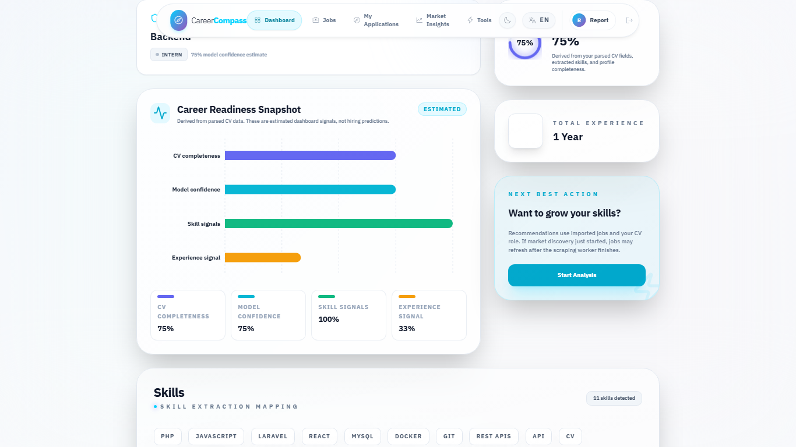

*Figure 35. CV upload user interface.*

## 5.5 CV Parsing and Skill Extraction

The CV processing flow sends the file to the AI CV Analyzer, receives parsed data, synchronizes skills, updates profile fields, and stores CV analysis metadata. The implementation handles multiple parsing statuses honestly. If analysis times out, fails, or finds no readable text, the backend returns warnings and preserves existing profile details rather than silently replacing data with low-quality output.

### 5.5.1 Analyzer Runtime Components

The analyzer is implemented as layered Python code rather than one monolithic function. `main.py` exposes FastAPI endpoints, `CVOrchestrator` coordinates extraction, `AdvancedNEREngine` runs transformer-based named-entity recognition, and supporting engines handle contacts, sections, experience blocks, canonicalization, domain classification, seniority classification, semantic embeddings, and hybrid job matching. Figure 11 summarizes these extraction components.

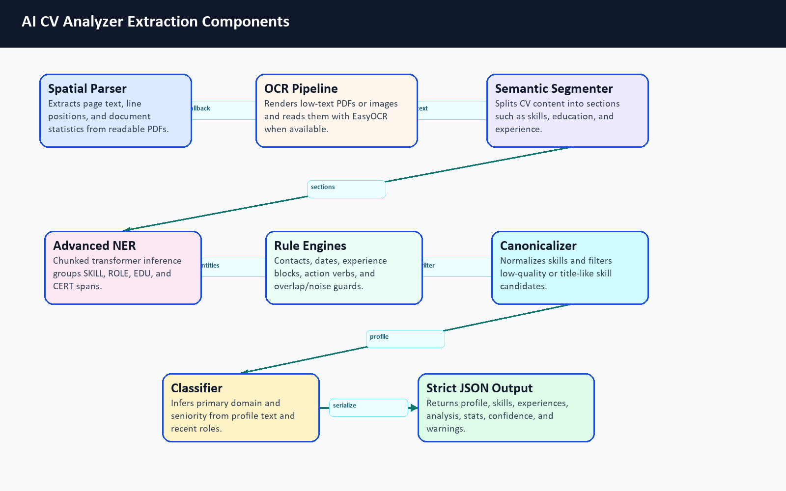

*Figure 11. AI CV Analyzer extraction components.*

| Component | Repository Evidence | Responsibility | Output Used By |
|---|---|---|---|
| FastAPI gateway | `ai-cv-analyzer/main.py` | Receives `/api/parse-cv` and `/api/hybrid-match` requests; handles timeout/error fallbacks. | Laravel `CvProcessingService` and `GapAnalysisService` |
| Laravel CV service | `backend-api/app/Services/CvProcessingService.php` | Sends uploads to the analyzer, stores private CV objects, persists normalized analysis. | User profile, skills, experiences, recommendations |
| Spatial/OCR extraction | `spatial_parser.py`, `ocr_pipeline.py` | Reads PDF text first and falls back to image/OCR when needed. | Section segmenter and NER pipeline |
| Advanced NER | `advanced_ner.py` and optional ignored local model folder | Loads the exported local token-classification model when deployed; chunks long CVs and groups entity spans. | Skills, roles, education, certifications |
| Rule engines | contact, experience, date, noise-filtering helpers | Extract contact details, experience blocks, dates, and remove title-like or noisy skill candidates. | Profile and experience persistence |
| Canonicalization/classification | Layer 1 and Layer 2 modules | Normalize skills and infer primary domain plus seniority. | Dashboard identity card and matching |
| Hybrid matching | Layer 3 matching modules | Combines semantic scores, skill text similarity, domain alignment, constraints, and TF-IDF fallback. | Recommendations and gap analysis |
| Frontend display | `Dashboard.jsx`, `AiInsights.jsx` | Shows upload status, confidence-style signals, role/seniority, and extracted skills. | Student-facing CV feedback |

*Table 6. AI CV Analyzer components.*

### 5.5.2 Model Type and Customization

The NER part is a fine-tuned transformer token-classification design, not a model trained from randomly initialized architecture. The notebook uses `bert-base-cased` as the base checkpoint and defines a CV-specific BIO label set. The runtime checks for the exported local model at `ai-cv-analyzer/models/ner_weights/career_compass_ner_final` and uses it when available. That folder is ignored by Git, so committed repository evidence should be described as code and training workflow evidence. Local ignored metadata inspected during this documentation update identified a BERT token-classification configuration, 512-token maximum position setting, 28,996-token vocabulary, 12 transformer layers, 768 hidden size, and a cased tokenizer; the binary model weights were not copied into the report.

The project customization is mainly in the data, labels, orchestration, and post-processing. The team defined CV-specific labels, generated synthetic annotated examples, cleaned entity spans, aligned character spans to tokens, exported a local model, and connected it to a CV-specific extraction pipeline. The pipeline then adds deterministic rules for contacts, dates, experience blocks, noisy skill rejection, canonical skill names, domain/seniority inference, and safer fallback statuses.

| Label | BIO Forms | Meaning in Training Data | Runtime Note |
|---|---|---|---|
| O | O | Token outside a labeled entity. | Used by the model to ignore ordinary text. |
| SKILL | B-SKILL, I-SKILL | Technical skill such as Laravel, React, Docker, SQL, or PyTorch. | Returned as skills after filtering and canonicalization. |
| ROLE | B-ROLE, I-ROLE | Job title or role such as Backend Developer or Data Analyst. | Used for predicted role and role evidence. |
| EDU | B-EDU, I-EDU | Degree, major, faculty, university, or education phrase. | Used as education/profile evidence. |
| CERT | B-CERT, I-CERT | Certification such as AWS Cloud Practitioner. | Used as certification evidence. |
| SOFT | B-SOFT, I-SOFT | Soft skill phrase such as leadership or communication. | Present in training configuration; the runtime NER grouping mainly returns SKILL, ROLE, EDU, and CERT. |

*Table 7. NER entity label schema.*

### 5.5.3 Synthetic Dataset Generation

The helper material under `D:/Graduation/model-analys-helper` was reviewed as documentation support. The top-level helper folders found were `docs`, `layer1`, `layer2`, and `layer3`. No raw datasets, screenshots, or secrets were copied into the graduation-book folder. The important training workflow is already represented in the repository by `ai-cv-analyzer/training/generate_tech_dataset.py`, `clean_dataset.py`, and `train_ner.ipynb`.

The dataset generator is designed to call the Gemini API through API keys stored outside source control. It asks for synthetic technical CV snippets across backend, frontend, DevOps, mobile, AI/data, cybersecurity, cloud, QA, and networking contexts. It intentionally includes positive labeled examples and negative decoy examples so that the model learns both what to tag and what to ignore. Because this uses external generation and keys, it was inspected rather than executed for this documentation update.

| Step | Repository Evidence | Description | Documentation Decision |
|---|---|---|---|
| API-key loading | `generate_tech_dataset.py` | Reads `GEMINI_API_KEYS` from `.env` and rotates keys/models during generation. | Do not commit keys; no secrets were found in helper docs. |
| Synthetic sample generation | Generator system prompt | Requests batches with technical domains, noise, varied CV formats, and labeled entities. | Documented as synthetic data, not real student CV data. |
| Negative decoys | Generator distribution comments | Includes examples with no entities to reduce false positives. | Preserved in the description because it affects model behavior. |
| Cleaning | `clean_dataset.py` | Normalizes whitespace, deduplicates exact text, validates entity text, filters long skill spans. | Documented as a data-quality gate before training. |
| Output | Training docs and scripts | Expected cleaned JSON/JSONL input for notebook training. | Dataset files were not present in the repository, so metrics cannot be reproduced from repo files alone. |

*Table 8. Synthetic dataset generation workflow.*

### 5.5.4 Training Notebook Workflow

The training notebook is structured for Google Colab rather than local execution. It installs model-training dependencies, loads cleaned JSON data, defines labels, tokenizes examples, aligns entity spans to token labels, initializes `AutoModelForTokenClassification` from `bert-base-cased`, trains with Hugging Face Trainer, evaluates with sequence-labeling metrics, then exports `career_compass_ner_final` for deployment [31], [32], [33], [36].

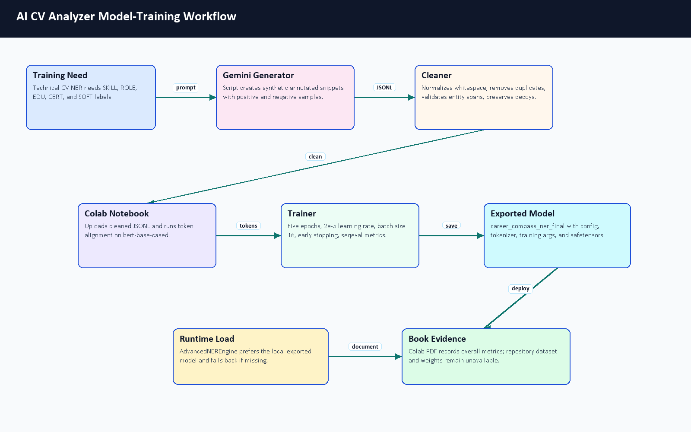

*Figure 10. AI CV Analyzer model-training workflow.*

| Setting | Value Found in Notebook or Docs | Purpose | Evidence Limitation |
|---|---|---|---|
| Base checkpoint | `bert-base-cased` | Provides pretrained language representations for token classification. | Confirmed by training notebook and Colab PDF. |
| Labels | O plus B/I for SKILL, ROLE, EDU, CERT, SOFT | Encodes CV entity spans using BIO tagging. | Label map is reproducible from notebook/config. |
| Split | 90 percent train, 10 percent test, seed 42 | Creates a repeatable train/evaluation split. | Colab PDF records 41,319 train rows and 4,592 test rows; dataset content is not committed. |
| Max length | 512 tokens | Fits BERT token-classification input limits. | Long runtime CVs are handled through chunking separately. |
| Epochs and learning rate | 5 epochs, 2e-5 | Standard fine-tuning style schedule for a small NER task. | No final epoch table was available. |
| Batch size | 16 train/eval | Balances GPU memory and throughput on Colab/T4-style runtime. | Visible in the exported Colab PDF. |
| Metrics | precision, recall, F1, accuracy via sequence labeling | Evaluates entity extraction quality when labels are available. | Colab PDF records overall metrics; per-label report is not visible. |
| Export | `career_compass_ner_final` zip/model folder | Produces the deployable local model artifact. | Export success is visible in the PDF, but model weights are ignored by Git. |

*Table 9. Model training configuration.*

### 5.5.5 Layer 1: CV Understanding Pipeline

Layer 1 is responsible for turning a noisy CV file into a structured candidate profile. The runtime begins at `main.py`, which accepts the uploaded file, chooses PDF or image handling, applies timeout/error wrappers, and delegates the actual extraction to `CVOrchestrator`. The orchestrator first tries ordered PDF text extraction. The spatial parser reads words from PDF pages, groups words into rows using an adaptive tolerance, splits row segments when large x-axis gaps imply columns, removes `(cid:...)` artifacts, and falls back to plain PDF extraction when the spatial output loses too much text.

If the file has little or no readable text, the OCR path renders PDF pages to images and uses EasyOCR after grayscale/blur preprocessing. After text recovery, the semantic segmenter finds CV sections, contact extraction parses email/phone/location fields, the NER engine extracts entity candidates, experience logic estimates date ranges and career signals, and the canonicalizer normalizes skills before the result is validated through strict Pydantic schema classes.

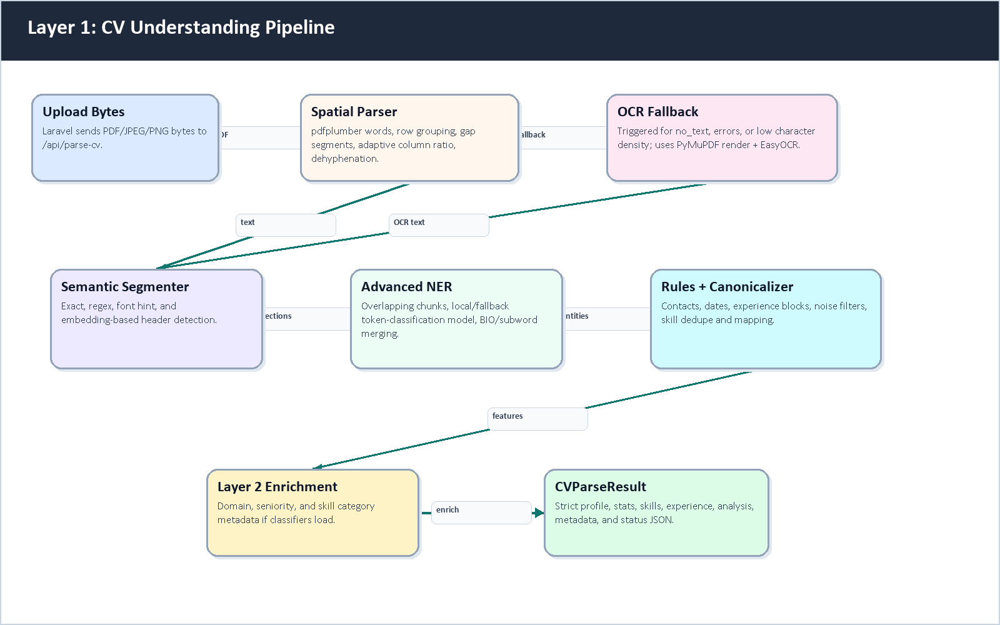

*Figure 12. Layer 1 CV understanding pipeline.*

| Layer 1 Component | Main Files | Important Behavior | Risk or Fallback |
|---|---|---|---|
| API gateway | `main.py` | `/api/parse-cv`, `/api/hybrid-match`, timeout handling, health and metrics endpoints. | Timeout results are returned as explicit status dictionaries. |
| Spatial parser | `core/layer1_understanding/spatial_parser.py` | Word extraction, row grouping, column ordering, dehyphenation, plain-text fallback. | Falls back when spatial output is too weak. |
| OCR fallback | `core/layer1_understanding/ocr_pipeline.py`, orchestrator OCR helpers | Renders image-like PDFs, preprocesses pages, and extracts text when normal PDF parsing fails. | Triggered for short/no-text inputs. |
| Section segmenter | `core/layer1_understanding/section_segmenter.py` | Header detection from patterns and optional semantic header matching. | Missing headers fall back to profile-style grouping. |
| Contact and experience engines | `contact_extractor.py`, `experience_engine.py` | Extract emails/phones/location, date ranges, total years, skill durations, gaps, overlaps, and action-verb strength. | Ambiguous dates are treated conservatively. |
| NER and canonicalization | `advanced_ner.py`, `canonicalizer.py` | Extracts skills/roles/education/certifications, filters noise, deduplicates, and maps skills to canonical names. | Fallback model path exists when local deployment artifact is missing. |
| Output schema | `schema.py` | Strict typed response for profile, skills, experience, confidence, stats, and parsing status. | Invalid shapes are prevented before backend persistence. |

*Table 10. Layer 1 component details.*

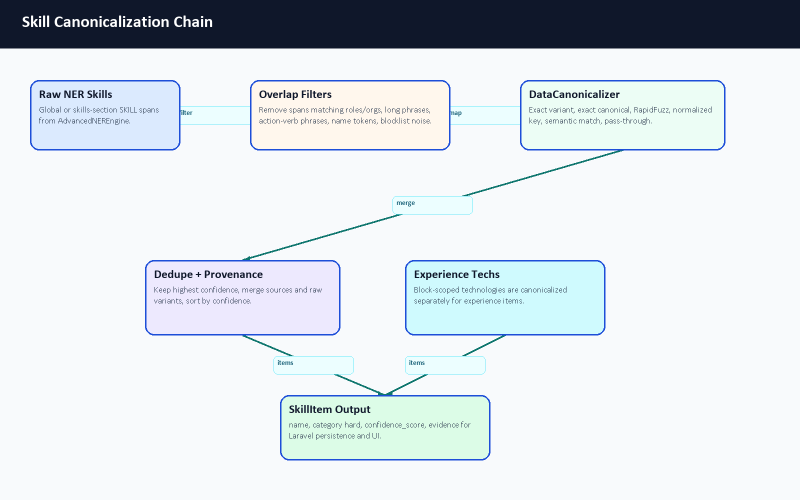

*Figure 17. Skill canonicalization chain.*

### 5.5.6 Layer 2: Classification Engine

Layer 2 enriches the extracted CV with a domain and seniority interpretation. The classification orchestrator reads the Layer 1 result, then combines title, experience, summary, skill categories, and taxonomy descriptions. `DomainEngine` compares CV context against taxonomy descriptions using semantic embeddings when available. `SkillEngine` separates hard, soft, and management-oriented skills using taxonomy rules. `SeniorityEngine` combines years of experience, title keywords, semantic title/summary hints, and action-verb strength.

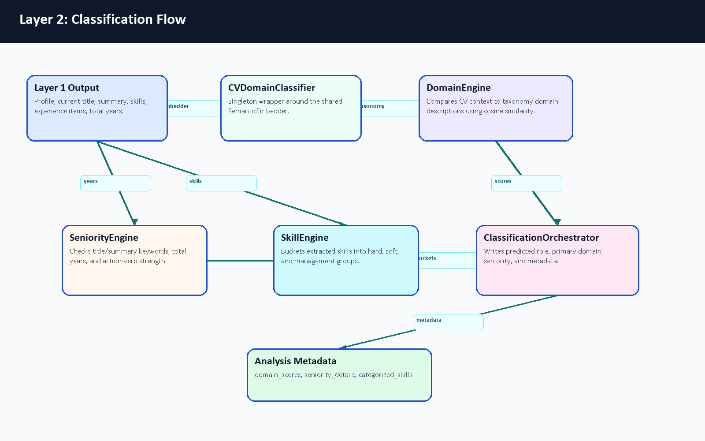

*Figure 13. Layer 2 classification flow.*

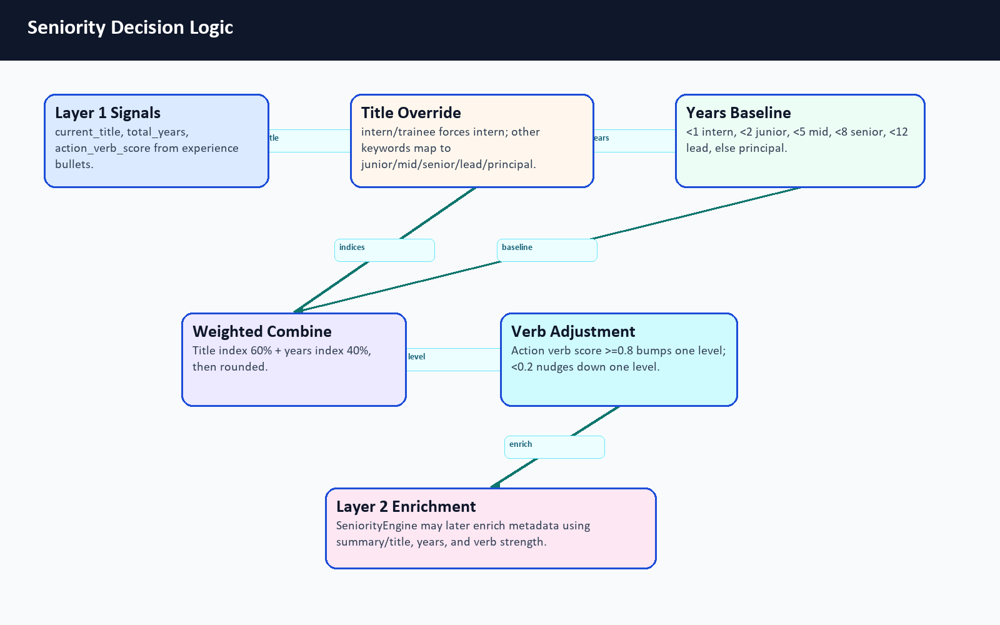

*Figure 16. Seniority decision logic.*

| Layer 2 Component | Main Files | Input | Output |
|---|---|---|---|
| Classification orchestrator | `core/layer2_classification/orchestrator.py` | Parsed CV profile, skills, experience, and summary. | Adds primary domain, seniority level, skill categories, and confidence-style signals. |
| Domain engine | `core/layer2_classification/domain_engine.py`, `data/taxonomy.json` | Title, summary, and first experience titles. | Primary technical domain selected from taxonomy descriptions. |
| Seniority engine | `core/layer2_classification/seniority_engine.py` | Experience years, title, summary, and action verbs. | Intern, Junior, Mid-Level, Senior, or Lead / Manager estimate. |
| Skill engine | `core/layer2_classification/skill_engine.py` | Canonical skill names and taxonomy terms. | Hard, soft, and management skill buckets. |
| Taxonomy loader | `core/layer2_classification/utils.py` | JSON taxonomy file. | Shared configuration for domain and skill classification. |

*Table 11. Layer 2 classification engine details.*

### 5.5.7 Layer 3: Matching Engine

Layer 3 compares a candidate profile with a job description. `JobDescriptionEngine` parses job text into seniority, required years, mandatory skills, bonus skills, domain, and summary. `IntelligentMatcher` calculates semantic similarity, skill-text similarity, and domain alignment using adaptive weights that change by seniority level. `ConstraintValidator` subtracts penalties for missing mandatory skills, experience shortfalls, and seniority mismatch. `FitAnalysisGenerator` turns the numeric result into strengths, gaps, red flags, and a verdict.

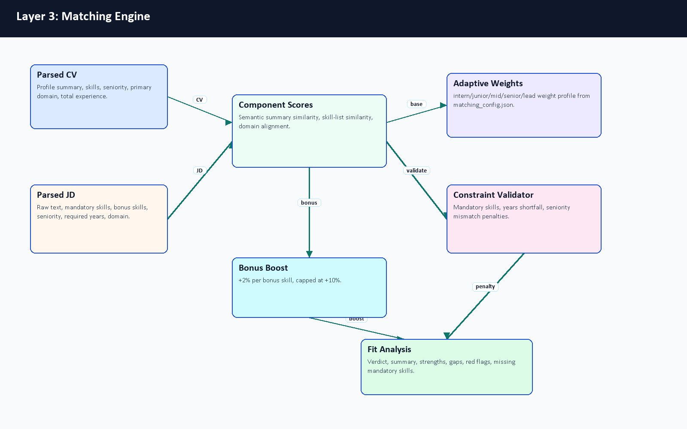

*Figure 14. Layer 3 matching engine.*

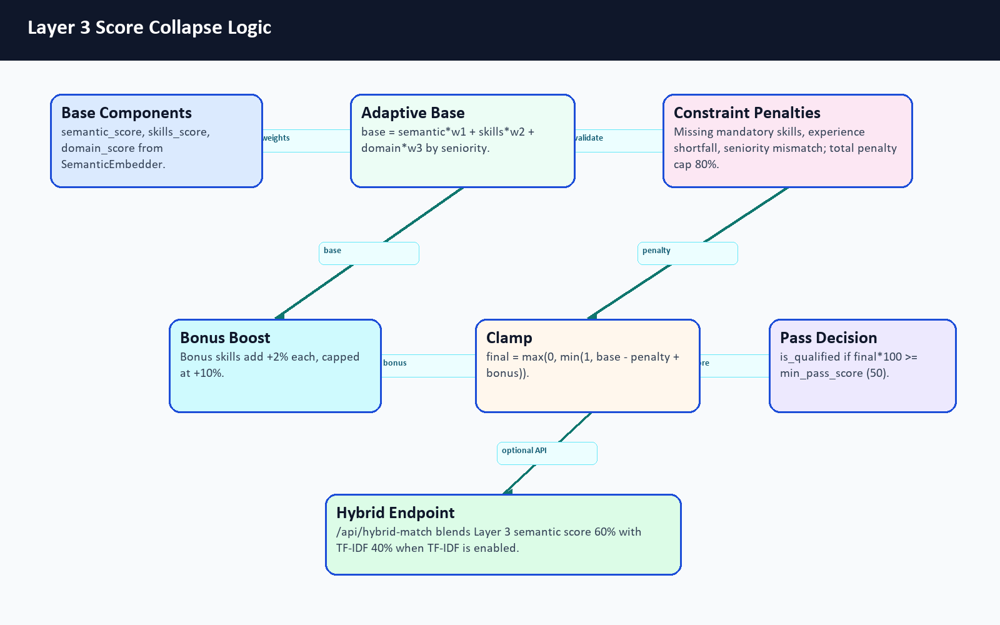

*Figure 18. Layer 3 score collapse logic.*

| Layer 3 Component | Main Files | Scoring Contribution | Explanation Contribution |
|---|---|---|---|
| JD parser | `job_description_engine.py` | Extracts requirements that become matching inputs. | Explains what the system understood from the job post. |
| Semantic embedder | `embedder.py` | Summary similarity and domain-similarity fallback. | Captures meaning beyond exact keyword overlap when dependencies are available. |
| Intelligent matcher | `similarity.py`, `matching_config.json` | Combines semantic, skill, and domain scores using seniority-aware weights. | Produces score breakdown and qualification flag. |
| Constraint validator | `constraint_validator.py` | Applies capped penalties for mandatory gaps, experience gaps, and seniority mismatch. | Lists missing mandatory skills and mismatch reasons. |
| Fit analysis generator | `fit_analysis_generator.py` | Converts score ranges into verdict categories. | Generates strengths, gaps, and red flags for the UI. |
| Ranking orchestrator | `ranking_orchestrator.py` | Applies matcher repeatedly across candidates/jobs. | Sorts candidates or opportunities by explainable fit. |

*Table 12. Layer 3 matching engine details.*

### 5.5.8 Semantic Embedding, Caching, and TF-IDF Fallback

The semantic embedder uses the configured sentence-transformer model name, with `all-MiniLM-L6-v2` as the default. The class is implemented as a singleton so that model loading is not repeated for every request. It keeps a bounded embedding cache of 2,000 entries and can optionally apply dynamic quantization through `EMBEDDER_QUANTIZE`. If the embedding stack is unavailable, it returns zero vectors and the calling code falls back to transparent lower-confidence behavior instead of pretending semantic comparison succeeded.

The FastAPI `/api/hybrid-match` endpoint also combines semantic-style matching with the pure Python TF-IDF matcher when the TF-IDF module is importable. In that endpoint, semantic/adaptive scoring contributes 60 percent and TF-IDF contributes 40 percent. This gives the demo a useful exact-keyword safety check for skills such as Laravel, Docker, MySQL, React, AWS, or Kubernetes.

| Method | Repository Evidence | Strength | Limitation |
|---|---|---|---|
| Sentence embeddings | `core/layer3_matching/embedder.py` | Captures meaning even when words differ. | Requires sentence-transformer dependencies and model loading. |
| Domain similarity | `core/layer3_matching/similarity.py` | Allows related domains to receive partial credit. | Low domain similarity is cut off below the configured threshold. |
| Skill text similarity | `core/layer3_matching/similarity.py` | Compares extracted CV skills against mandatory and bonus job skills. | Quality depends on upstream extraction and canonicalization. |
| TF-IDF fallback | `core/layer3_matching/tfidf.py`, `/api/hybrid-match` | Lightweight deterministic keyword overlap. | Does not understand synonyms or phrase meaning. |
| Constraint penalties | `constraint_validator.py` | Prevents high scores when hard requirements are missing. | Penalty weights need larger evaluation data for calibration. |

*Table 13. Semantic embedding and TF-IDF fallback comparison.*

### 5.5.9 NER Token Processing and BIO Tagging

The training notebook uses character-span annotations and converts them into token labels. Each text sample is tokenized with offsets; special tokens are assigned `-100` so they are ignored by the loss; tokens whose offsets fall inside an entity span are assigned `B-` or `I-` labels. The cased BERT tokenizer is appropriate for CV text because names, certificates, role titles, and technology names often rely on capitalization. At runtime, long CV text is chunked with overlap, model predictions are merged, subword prefixes are cleaned, and duplicate/noisy entities are filtered before canonicalization.

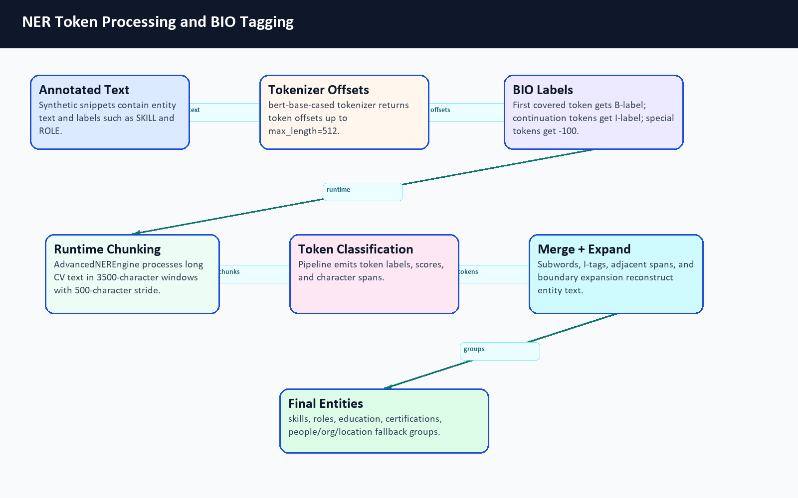

*Figure 15. NER token processing and BIO tagging.*

| Simplified Text Token | BIO Label | Why It Matters |
|---|---|---|
| Experienced | O | Ordinary descriptive word, not extracted as an entity. |
| Backend | B-ROLE | Start of a role phrase. |
| Developer | I-ROLE | Continuation of the role phrase. |
| with | O | Connector word. |
| Laravel | B-SKILL | Skill entity. |
| Docker | B-SKILL | Skill entity. |
| MySQL | B-SKILL | Skill entity. |

*Table 14. Simplified BIO tagging example.*

### 5.5.10 AI CV Analyzer Source Code Inventory

The AI CV Analyzer was audited as source code, not only as a running service. The inventory below summarizes the relevant repository areas. Full support notes are stored under `docs/graduation-book/model-analysis/`.

| Area | Representative Files | Main Responsibility |
|---|---|---|
| FastAPI service | `main.py`, `Dockerfile`, `requirements.txt`, `.env.example` | Service startup, endpoints, container runtime, and documented configuration variables. |
| Layer 1 understanding | `core/layer1_understanding/*.py`, `core/layer1_understanding/data/config.json` | PDF/image text extraction, OCR fallback, sectioning, NER, contact extraction, experience analysis, and canonicalization. |
| Layer 2 classification | `core/layer2_classification/*.py`, `core/layer2_classification/data/taxonomy.json` | Domain, seniority, and skill-category enrichment. |
| Layer 3 matching | `core/layer3_matching/*.py`, `core/layer3_matching/matching_config.json` | Job parsing, semantic/TF-IDF matching, constraints, fit explanation, and ranking. |
| Training workflow | `training/generate_tech_dataset.py`, `clean_dataset.py`, `train_ner.ipynb` | Synthetic labeled dataset generation, cleaning, token alignment, Trainer setup, metrics code, and export. |
| Diagnostics and tests | `scripts/verify_phase*.py`, `tests/test_service_api.py`, `tests/trace_cv.py`, manual tests | Phase checks, service API tests with fakes, tracing, and manual validation helpers. |
| Documentation | Layer README and EXPLAIN files | Developer explanations for analyzer layers and matching logic. |
| Ignored deployment assets | `.env`, `models/ner_weights/...` | Local secrets and model weights are intentionally ignored; only safe metadata was inspected locally. |

*Table 15. AI CV Analyzer source inventory summary.*

| Algorithm or Workflow | Primary File(s) | Notes |
|---|---|---|
| Parse-CV request routing | `main.py` | File validation, image/PDF branching, timeout and error wrappers. |
| Ordered PDF extraction | `core/layer1_understanding/spatial_parser.py` | Adaptive row/column ordering and dehyphenation. |
| OCR fallback | `core/layer1_understanding/ocr_pipeline.py`, `CVOrchestrator` | Used when PDF text is absent or too short. |
| NER extraction | `core/layer1_understanding/advanced_ner.py` | Singleton model loading, chunked inference, entity merging, and cleanup. |
| Skill normalization | `core/layer1_understanding/canonicalizer.py` | Exact, fuzzy, and semantic mapping toward canonical names. |
| Experience calculation | `core/layer1_understanding/experience_engine.py` | Date ranges, total years, skill durations, gaps, overlaps, and action verbs. |
| Seniority inference | `core/layer1_understanding/orchestrator.py`, `core/layer2_classification/seniority_engine.py` | Combines title keywords, years, semantic hints, and action verbs. |
| Domain classification | `core/layer2_classification/domain_engine.py` | Embedding comparison against taxonomy descriptions. |
| Job parsing | `core/layer3_matching/job_description_engine.py` | Seniority, years, mandatory/bonus skills, domain, and summary extraction. |
| Hybrid match scoring | `core/layer3_matching/similarity.py`, `core/layer3_matching/constraint_validator.py` | Weighted semantic/skill/domain score minus constraint penalties plus bonus boost. |
| TF-IDF fallback | `core/layer3_matching/tfidf.py`, `main.py` | Pure Python sparse cosine score used in hybrid endpoint. |
| Fit explanation | `core/layer3_matching/fit_analysis_generator.py` | Verdict, strengths, gaps, and red flags. |
| NER training | `training/train_ner.ipynb` | BERT base checkpoint, BIO labels, token alignment, Trainer, seqeval metrics. |
| Synthetic data generation | `training/generate_tech_dataset.py` | Gemini-based generation with key rotation and negative decoys. |

*Table 16. Algorithm-to-file mapping.*

## 5.6 Profile and Skills Management

The profile page reads normalized user data, profile fields, experiences, skills, and CV analysis. The system distinguishes user fields, profile fields, extracted skills, predicted role, seniority, and completeness score. Skill synchronization is handled through backend services rather than only frontend state.

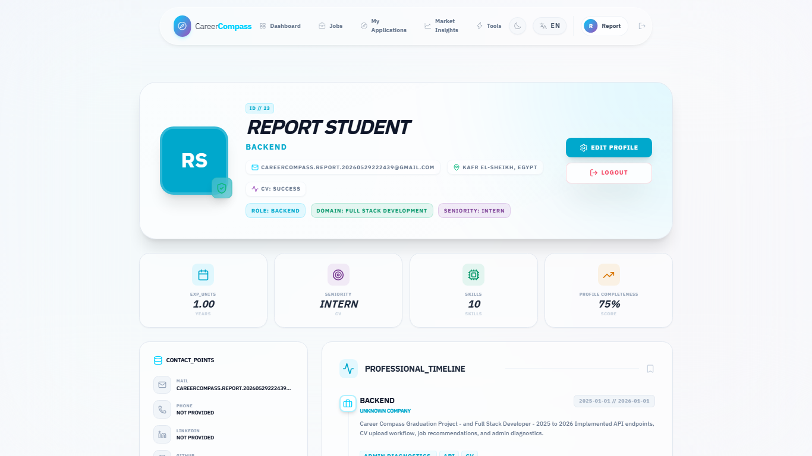

*Figure 37. Extracted profile and skills page.*

## 5.7 Job Data Model

Jobs are represented in the backend through job posting models and migrations. Fields include title, company, description/requirements, URL, source, and metadata. The seeders and import controllers enforce quality gates and uniqueness rules, including a title/company uniqueness constraint that prevented duplicate seed insertion during validation.

## 5.8 AI Job Miner and Scraping Sources

The job miner exposes a FastAPI service and imports candidate jobs through configured sources. This implementation chapter keeps the feature overview short: Laravel remains the system of record, the Python service handles adapter work, and admin pages expose source diagnostics, source status, testing, and target role management. Chapter 7 expands this subsystem with runtime diagrams, queue flow, API contracts, import/deduplication logic, failed-URL handling, security boundaries, evaluation evidence, and ethical limitations.

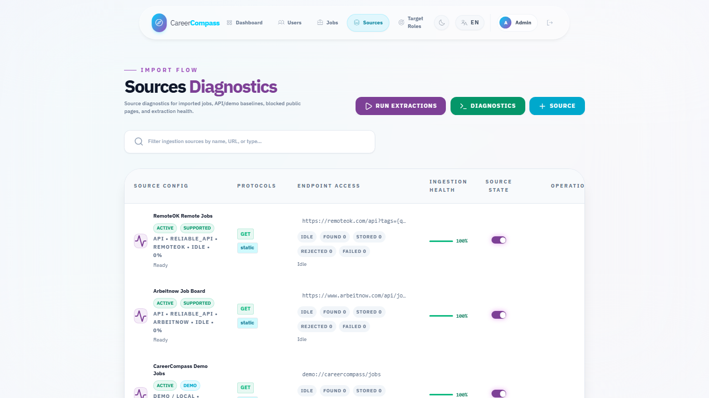

*Figure 46. Admin sources diagnostics page.*

## 5.9 Job Recommendations

The jobs page requests recommended jobs when no manual search query is active. Recommendations are based on CV/profile context when available. Matching combines normalized database data with semantic and TF-IDF-style comparison where available. TF-IDF represents text using term frequency and inverse document frequency weighting [19], while cosine similarity compares vector orientation [20].

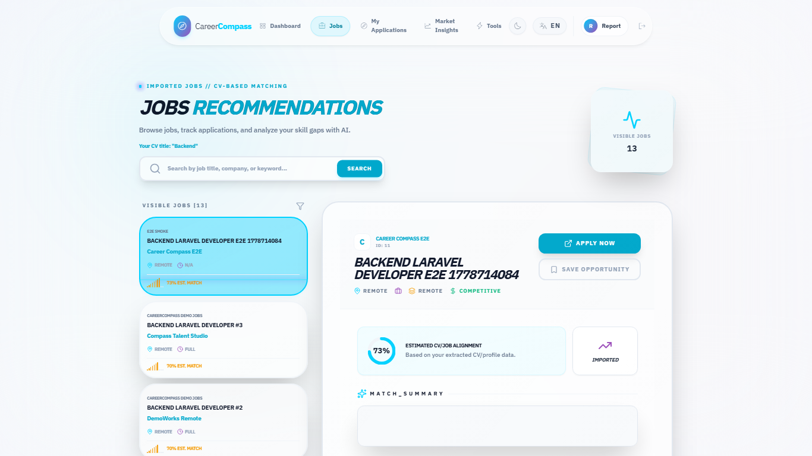

*Figure 38. Jobs recommendations page.*

## 5.10 Gap Analysis

Gap analysis compares a selected job or target role against the user's profile and extracted skills. It returns matched skills, critical/missing skills, recommendations, match percentage, and roadmap-like guidance. The frontend displays these outputs in an explainable layout rather than a single opaque score.

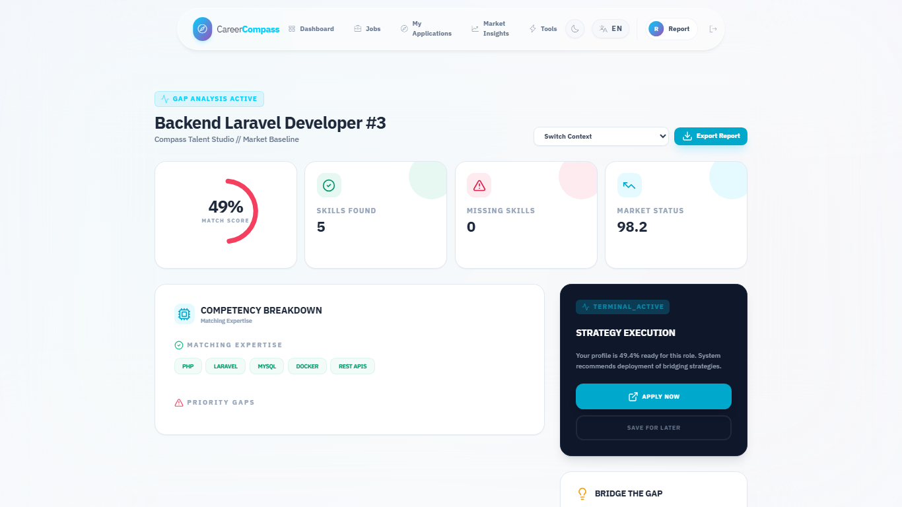

*Figure 40. Gap analysis page.*

## 5.11 Application Tracker

The application tracker is implemented through `ApplicationController`, `ApplicationTrackerService`, and `frontend/src/pages/user/Applications.jsx`. Students can save a job, update status, view counts, and delete tracked items. The backend validates job existence and allowed statuses.

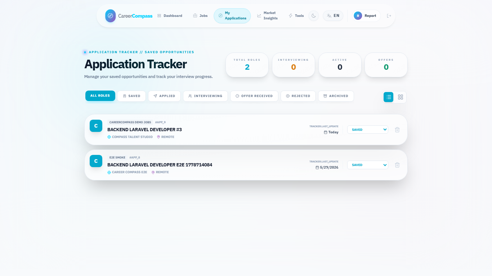

*Figure 41. Applications tracker page.*

## 5.12 Admin Dashboard

The admin dashboard summarizes users, imported jobs, active sources, target roles, health status, and scraping batch progress. It is protected by admin middleware and uses admin API routes.

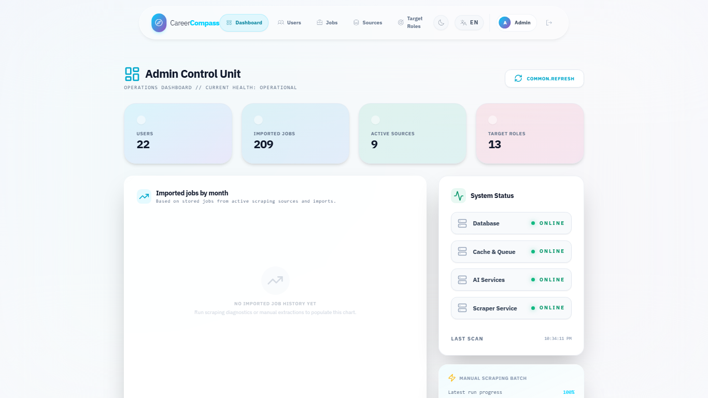

*Figure 44. Admin dashboard.*

## 5.13 Admin Source Diagnostics

The source diagnostics page lists configured scraping sources, supports source testing, and displays quality and scraping status information. The target roles page manages role names used by scraping and market discovery.

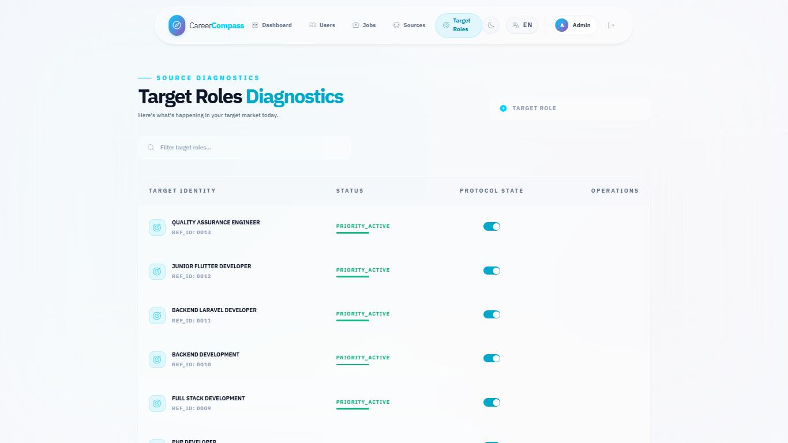

*Figure 47. Admin target roles page.*

## 5.14 System Health and Monitoring

Health endpoints include live and readiness checks. The system status page presents service state to users, while admin health data supports operational monitoring. Metrics are available for Prometheus and dashboards are available through Grafana.

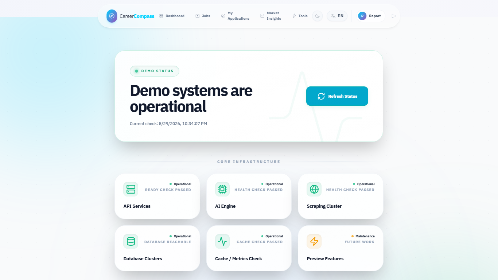

*Figure 43. System status page.*

## 5.15 Error Handling and Fallbacks

The code includes explicit handling for CV processing failures, AI gateway connection failures, validation errors, missing user data, empty job data, and unavailable services. The job recommendation and gap analysis code includes fallback behavior when AI services are not available.

## 5.16 Internationalization and UI Preview Modules

The frontend contains English and Arabic locale files. Several menu items intentionally appear as preview modules so the interface can show the intended product direction without presenting those areas as completed core deliverables. The completed graduation/demo core remains CV upload, parsed profile and skills, recommendations, gap analysis, application tracking, admin diagnostics, and system status.

| Module | Current Status | Reason Included | Future Work |
|---|---|---|---|
| CV Builder | Preview placeholder | Shows where guided resume authoring would fit beside CV upload. | Add editable sections, export templates, and validation tests. |
| Mock Interview | Preview placeholder | Demonstrates a possible practice workflow after gap analysis. | Add question banks, scoring rubrics, and consent-aware recording rules. |
| Learning Paths | Preview placeholder | Connects missing skills to future study plans. | Integrate curated resources and progress tracking. |
| Career Planner | Preview placeholder | Shows longer-term roadmap direction. | Add milestone planning and advisor review. |
| Mentorship | Preview placeholder | Shows possible human-support extension. | Add mentor profiles, matching rules, and moderation. |
| Tools Hub | Preview screen | Groups preview tools in one visible place. | Replace placeholders with independently tested modules. |
| Market Intelligence | Supporting/preview view | Helps explain job-market context from imported jobs. | Add stronger statistics, freshness indicators, and source quality labels. |

*Preview module clarification table.*

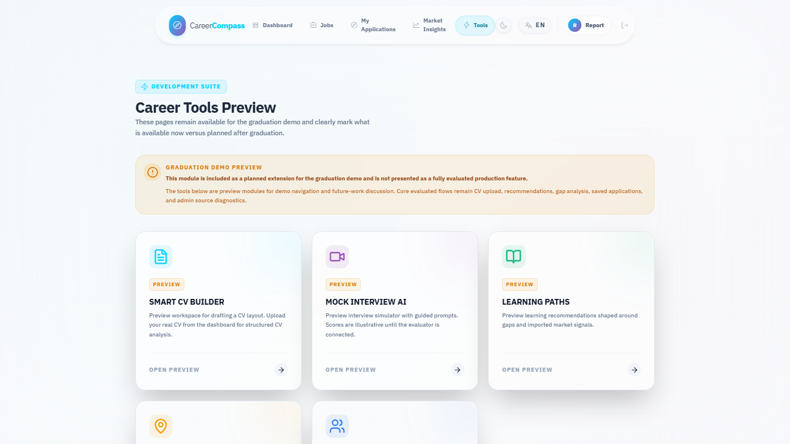

*Figure 42. Tools Hub preview page.*

## 5.17 Dockerized Runtime Flow

The runtime starts through Docker Compose. Nginx exposes the app, frontend and backend containers serve UI/API flows, backend workers process queues, Python services support AI workflows, MySQL and MinIO persist state, and monitoring services observe the stack.

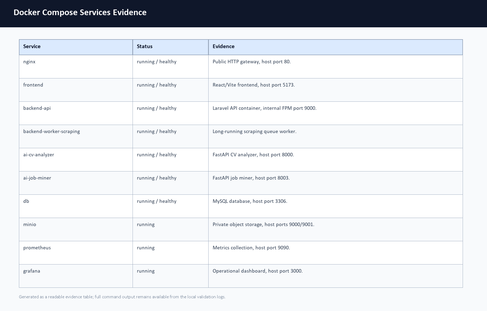

*Figure 48. Docker services evidence.*

\pagebreak

# Chapter 6: AI CV Analyzer Deep Technical Analysis

## 6.1 Introduction

The AI CV Analyzer is one of the main technical contributions of CareerCompass. It should not be understood as a thin wrapper around one pretrained model. The implemented analyzer is a layered hybrid pipeline that combines document-processing logic, NER, deterministic extraction rules, semantic enrichment, score composition, and explanation generation. This chapter separates that AI contribution from the general implementation chapter so that supervisors and examiners can evaluate the design as an academic system component.

## 6.2 AI Design Philosophy

CareerCompass does not use a pure NER model because CVs are noisy, multi-format documents. They can contain multiple columns, icons, section headers, table-like blocks, scanned pages, mixed date formats, and skill aliases. NER can extract entity candidates, but NER alone does not naturally explain seniority, primary technical domain, job-fit constraints, or recommendation reasons.

The system also does not use a pure rule-based parser. Rules are deterministic and useful for validation, but fixed rules are brittle when skill names, job titles, section headings, and CV layouts vary. A rule set can recognize known patterns, but it struggles with semantic similarity, synonyms, and role/domain interpretation.

The implemented design is therefore hybrid. NER extracts structured candidates, deterministic rules improve consistency and safety, canonicalization reduces noisy variants, Layer 2 adds domain and seniority interpretation, Layer 3 compares candidate and job evidence, and the explanation layer turns scores into strengths, gaps, red flags, and verdicts. TF-IDF fallback keeps the matching endpoint useful when heavier semantic components are unavailable.

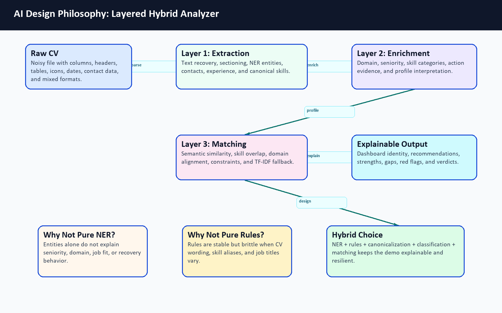

*Figure 19. AI design philosophy for the layered hybrid analyzer.*

| Design Option | Advantage | Limitation | CareerCompass Decision |
|---|---|---|---|
| Pure NER | Learns entity patterns from data. | Does not solve file recovery, seniority, domain, matching, or explanation by itself. | Used only as one extraction component. |
| Pure rules | Predictable and easy to inspect. | Brittle when CVs use new wording, layouts, and aliases. | Used for safety, contacts, dates, validation, and fallback behavior. |
| Hybrid layered AI | Combines learned extraction, deterministic checks, semantic signals, and explanation. | More components must be tested and documented. | Chosen because it fits noisy CVs and graduation-demo transparency. |

*Table 17. AI design alternatives comparison.*

## 6.3 Complete CV Processing Flow

The end-to-end flow begins when the student uploads a PDF or image CV. The frontend validates the file before sending it to Laravel. Laravel sends the file to the FastAPI analyzer, stores the private CV object, persists successful structured outputs, and records parsing status. The analyzer first recovers text, then segments sections, extracts entities, estimates experience, canonicalizes skills, classifies the profile, and supports matching for recommendations and gap analysis.

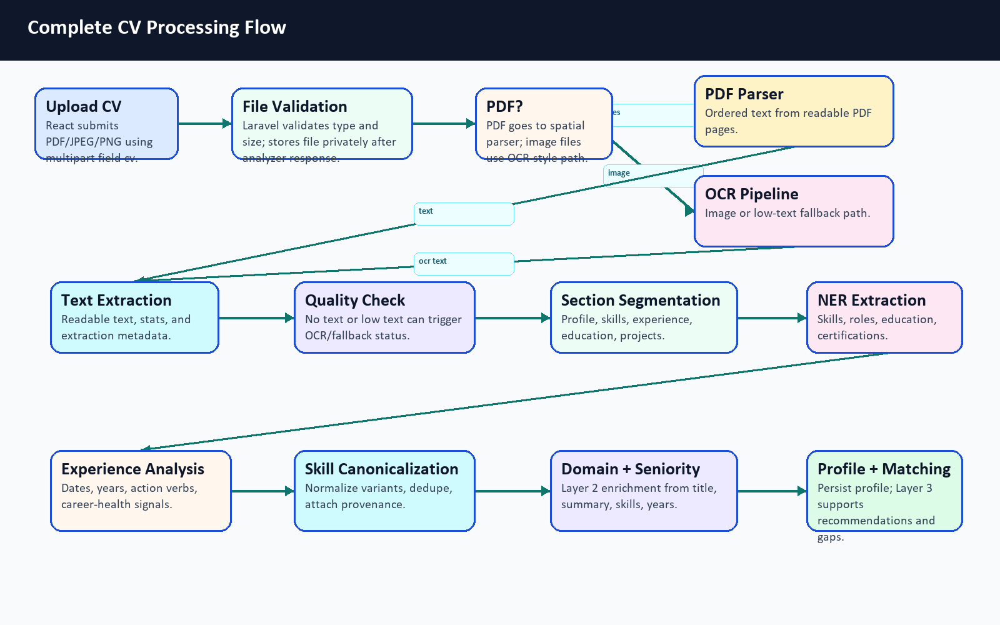

*Figure 20. Complete CV processing flow.*

The flowchart is intentionally more detailed than the high-level architecture diagram. It shows that the AI service performs several recoverable steps before returning data. The output is not only a list of words; it includes profile fields, skills, experience signals, domain, seniority, confidence-style values, metadata, and status.

## 6.4 Fault Tolerance and Recovery

CV parsing can fail for normal reasons: scanned PDFs, image-only files, weak text extraction, unsupported content, or service timeouts. The analyzer and backend are designed to report these states explicitly instead of silently overwriting good profile data with empty extraction results.

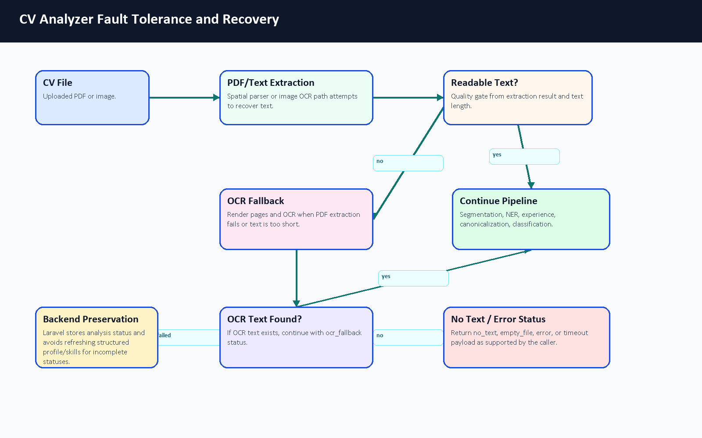

*Figure 21. CV analyzer fault tolerance and recovery flow.*

The FastAPI schema supports `success`, `ocr_fallback`, `empty_file`, `no_text`, and `error` statuses. The API-level timeout path returns a timeout payload. Laravel treats `timeout`, `error`, `empty_file`, and `no_text` as incomplete statuses and avoids refreshing profile, experience, and skills for those results. The backend still records analysis status and file metadata, then warns the frontend so the user can retry with a clearer document.

## 6.5 Confidence and Readiness Signals

CareerCompass uses confidence-style and readiness signals rather than a certified probability of hiring success. In Layer 1, `_aggregate_confidence` averages positive confidence-style values and caps the result at 1.0. Skills, profile, experience, and analysis sections can each carry confidence values. Laravel stores parser `confidence_score` and converts it into a `completeness_score` when available. The dashboard then visualizes completeness, model confidence, skill count, and experience as an estimated Career Readiness Snapshot.

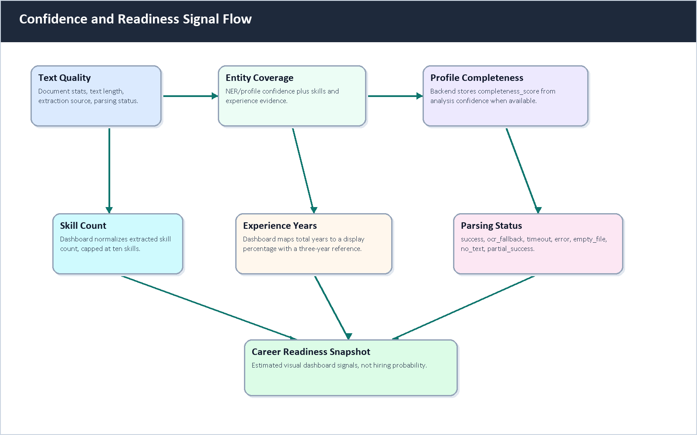

*Figure 22. Confidence and readiness signal flow.*

The current code-derived signal boundary is:

```text
AggregateConfidence =
    min(1.0, average(positive confidence signals))

AnalysisConfidence =
    AggregateConfidence([
        skills_section.confidence_score,
        experience_section.confidence_score
    ])

BackendCompleteness =
    round(analysis.confidence_score * 100)

DashboardSkillSignal =
    min(extracted_skill_count * 10, 100)

DashboardExperienceSignal =
    min((total_experience_years / 3) * 100, 100)
```

These formulas are intentionally described as signals. They help the dashboard explain whether enough structured CV evidence was extracted, but they are not probabilities of employability, hiring success, or model correctness.

| Signal | Source File or Component | Meaning | Used In | Limitation |
|---|---|---|---|---|
| `parsing_status` | `main.py`, `schema.py`, `CvProcessingService.php` | Whether parsing succeeded, used OCR, failed, timed out, or found no text. | Upload feedback, stored analysis status, preservation logic. | It is a status flag, not a quality score. |
| `confidence_score` | Layer 1 schema and orchestrator aggregation | Confidence-style value for extracted/derived fields. | Stored CV analysis and AI insight display. | It is not a calibrated probability of employment success. |
| `completeness_score` | `CvProcessingService.php` | Backend percentage derived from analysis confidence when available. | Profile/dashboard completeness display. | It depends on parser output availability. |
| Skill signal | `Dashboard.jsx` | Extracted skill count normalized and capped at ten skills. | Career Readiness Snapshot. | More skills do not automatically mean a better candidate. |
| Experience signal | `Dashboard.jsx` | Total parsed years mapped to a display percentage using a three-year reference. | Career Readiness Snapshot. | It is a UI signal, not a universal seniority formula. |
| Extraction metadata | Layer 1 metadata and Laravel analysis metadata | Source, spatial status, segmentation, gaps, action-verb and experience details. | Debugging, review, and future evaluation. | Metadata quality depends on successful text recovery. |

*Table 18. Confidence and readiness signal summary.*

## 6.6 Skill Canonicalization With Practical Example

Skill extraction is noisy because the same skill can appear in different forms. The canonicalizer supports exact variant mapping, exact canonical matching, RapidFuzz matching when available, normalized-key fallback, semantic embedding fallback, and pass-through behavior. The current committed config is largely industry-agnostic, so the example below is labeled illustrative of the implemented mapping stages rather than proof that every alias is already configured in source data.

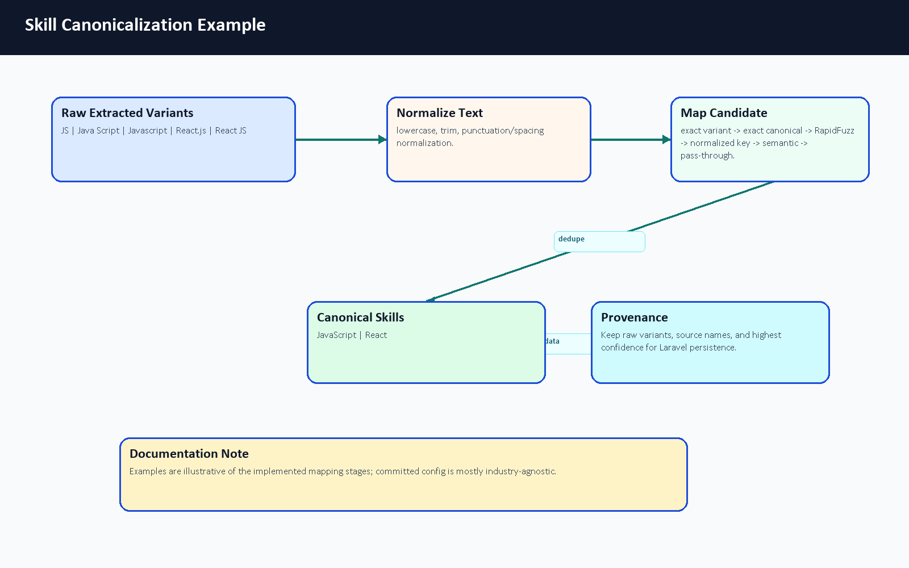

*Figure 23. Skill canonicalization example.*

| Raw Extracted Skill | Normalized Skill | Why |
|---|---|---|
| JS | JavaScript | Illustrative abbreviation normalization. |
| Java Script | JavaScript | Illustrative spacing normalization. |
| Javascript | JavaScript | Illustrative casing/spelling normalization. |
| React.js | React | Illustrative framework alias normalization. |
| React JS | React | Illustrative punctuation and spacing normalization. |

*Table 19. Skill canonicalization example.*

## 6.7 Fine-Tuned BERT NER Architecture

The NER architecture is a fine-tuning workflow, not a from-scratch language model. The training notebook uses `bert-base-cased`, tokenizes CV text with offsets, aligns character-span annotations to BIO token labels, trains a token-classification head, and exports `career_compass_ner_final`. At runtime, `AdvancedNEREngine` can load local ignored model weights if supplied; those weights are not committed to Git. A user-provided Colab export now provides recorded training-run metrics, but the repository alone still does not contain the final dataset, model weights, or a fully reproducible benchmark package.

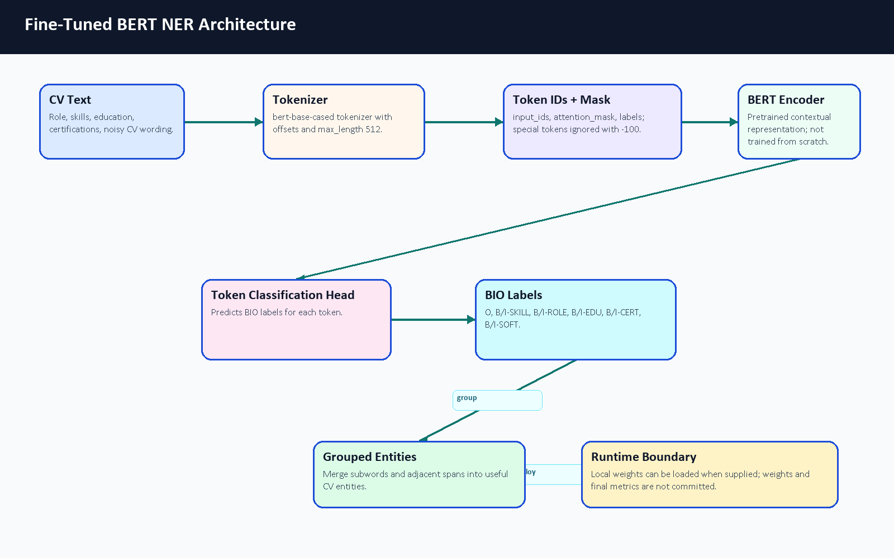

*Figure 24. Fine-tuned BERT NER architecture.*

The simplified BIO example in Table 14 remains valid for examiner explanation: `Backend` can start a ROLE entity, `Developer` can continue it, and `Laravel` or `Docker` can start SKILL entities. The actual model sees tokenized subwords and offsets rather than only human-readable words.

## 6.8 Detailed Training Pipeline

Synthetic training data is used because labeled CV NER data is not naturally available in the repository. The generator is designed to create varied technical CV snippets, including positive examples and negative decoys. Negative decoys matter because they teach the model not to tag every technical-looking phrase. The cleaner normalizes samples and validates entity spans before the notebook performs token alignment and fine-tuning.

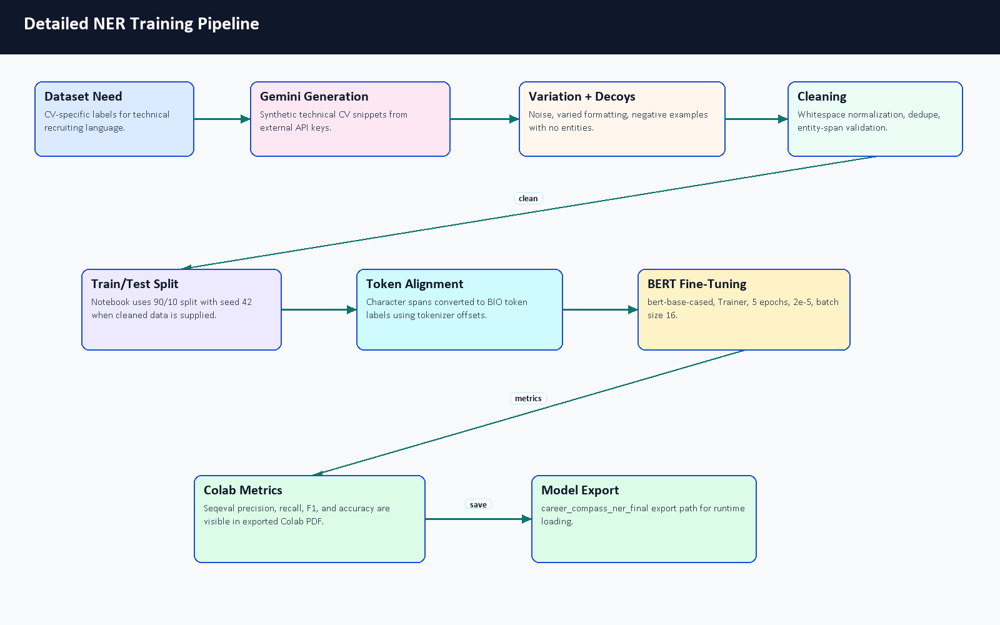

*Figure 25. Detailed NER training pipeline.*

The documentation pass also reviewed committed evaluation evidence and generated a dataset transparency note under `docs/graduation-book/model-analysis/dataset_statistics.md`. The user-provided Colab PDF gives recorded training-run output cells, including split counts and overall validation metrics. However, the cleaned dataset content and model weights are still not committed, and the PDF does not show per-label support counts. Therefore, the report includes the verified Colab metrics but still avoids a fake per-label distribution chart. Figure 29 records which evidence is available and what remains unavailable for reproducible academic review.

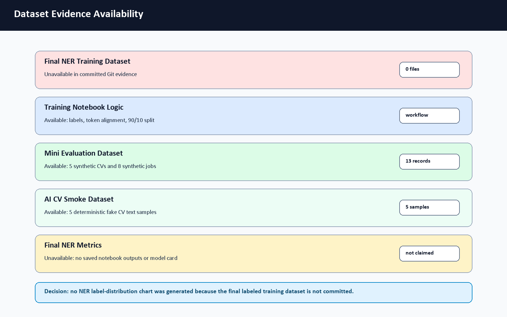

*Figure 29. Dataset evidence availability summary.*

| Dataset Statistic | Status | Reason |
|---|---|---|
| Cleaned NER training samples | 45,911 rows recorded in Colab PDF | The PDF shows the generated rows loaded from `train_real_tech_cleaned.json`; the dataset content itself is not committed. |
| Recorded train split | 41,319 rows | Visible in the exported Colab PDF; split uses test size 0.1 and seed 42. |
| Recorded test split | 4,592 rows | Visible in the exported Colab PDF and used for the notebook evaluation output. |
| Entity counts by label | Not visible in the PDF | The PDF shows labels but not per-label support counts. |
| Negative decoy count | Not available from committed evidence | Generator/cleaner support decoys, but final generated data is absent. |
| Mini evaluation CV samples | 5 | Generated documentation mini dataset under `docs/graduation-book/evaluation/`; separate from NER training. |
| Mini evaluation job samples | 8 | Generated documentation mini dataset; not a production benchmark. |
| AI CV Analyzer smoke samples | 5 | Deterministic text-only smoke set created for this evidence pass; evaluates parser-style labels and dependency availability, not transformer weights. |
| Final NER label distribution chart | Not generated | No per-label support counts are visible in the PDF, and no committed final labeled dataset exists to count SKILL/ROLE/EDU/CERT/SOFT/O labels honestly. |

*Table 20. Dataset availability and transparency.*

### 6.8.1 Colab NER Fine-Tuning Results

The team exported the Google Colab notebook `train_ner.ipynb` as a PDF with visible output cells. This PDF was copied into `docs/graduation-book/model-analysis/colab_train_ner_results.pdf` after inspection. It is treated as supporting training evidence for the NER fine-tuning process. The PDF shows the notebook title `train_ner.ipynb - Colab`, timestamp `6/7/26, 3:55 AM`, the heading `CareerCompass AI Engine: Global Skill NER training (Autonomous)`, and a synthetic data augmentation strategy. It also shows the cleaned dataset path `train_real_tech_cleaned.json`, 11 BIO labels, train/test row counts, tokenization completion, model initialization from `bert-base-cased`, training arguments, and epoch-level metrics.

These numbers improve the academic evidence for the training workflow, but they should be interpreted carefully. They are Colab-run validation outputs for the generated/synthetic dataset and notebook split visible in the PDF. They are not production accuracy, not a large real-world CV benchmark, and not reproducible from the repository alone unless the same dataset, runtime, and exported model artifacts are supplied.

| Parameter | Value from Colab PDF | Source |
|---|---|---|
| Notebook | `train_ner.ipynb - Colab` | PDF header |
| Export timestamp | `6/7/26, 3:55 AM` | PDF header |
| Dataset file | `train_real_tech_cleaned.json` | PDF data-loading cell |
| Total loaded rows | 45,911 | PDF dataset output |
| Train rows | 41,319 | PDF dataset output |
| Test rows | 4,592 | PDF dataset output |
| Split | test size 0.1, seed 42 | PDF data-loading cell |
| Base checkpoint | `bert-base-cased` | PDF model initialization cell |
| Labels | O plus B/I for SKILL, ROLE, EDU, CERT, SOFT | PDF label configuration cell |
| Max length | 512 tokens | PDF tokenization cell |
| Epochs | 5 | PDF training arguments |
| Learning rate | 2e-5 | PDF training arguments |
| Batch size | 16 train / 16 eval | PDF training arguments |
| Weight decay | 0.01 | PDF training arguments |
| Best model metric | F1 | PDF training arguments |

*Table 28. Colab NER training run configuration.*

The full epoch-by-epoch numeric table is retained in `docs/graduation-book/model-analysis/colab_ner_training_results_summary.md`. In the main chapter, the same verified values are shown as charts so the trend is easier to read in the PDF.

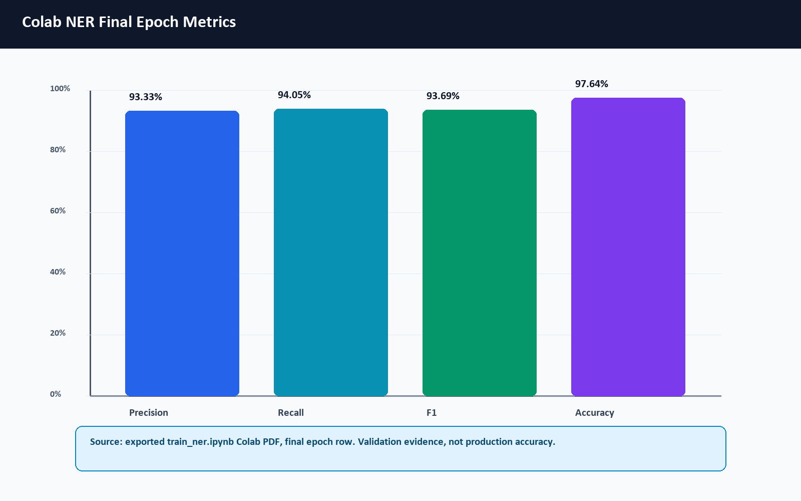

*Figure 50. Colab NER final epoch metrics.*

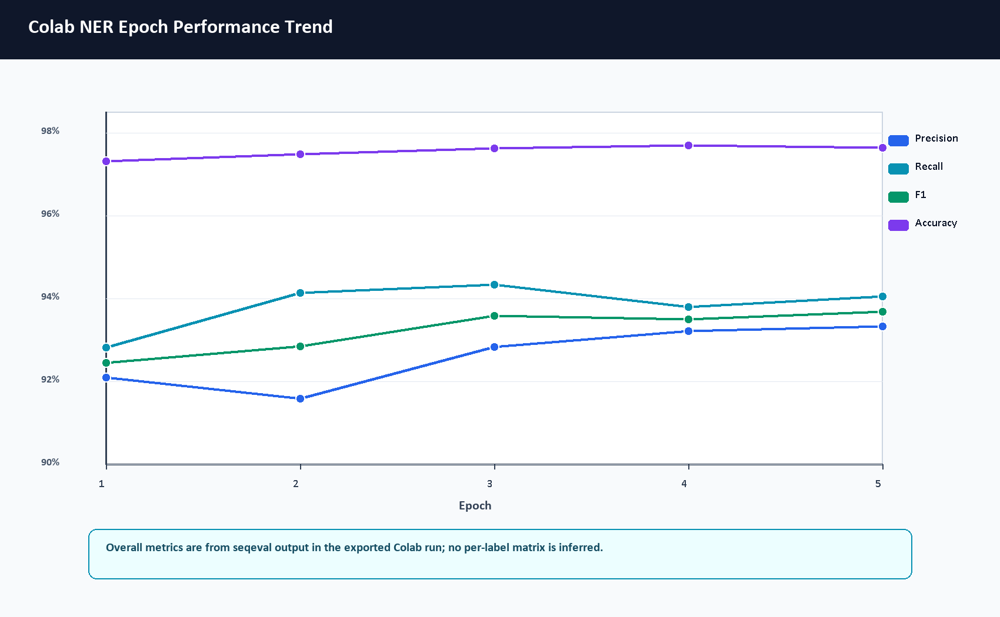

*Figure 51. Colab NER epoch performance trend.*

The performance chart shows that the overall F1 score increases from 0.924603 at epoch 1 to 0.936900 at epoch 5, while accuracy remains high throughout the run. These values are overall `seqeval` metrics from the notebook validation split; they are not per-label SKILL/ROLE/EDU/CERT/SOFT metrics.

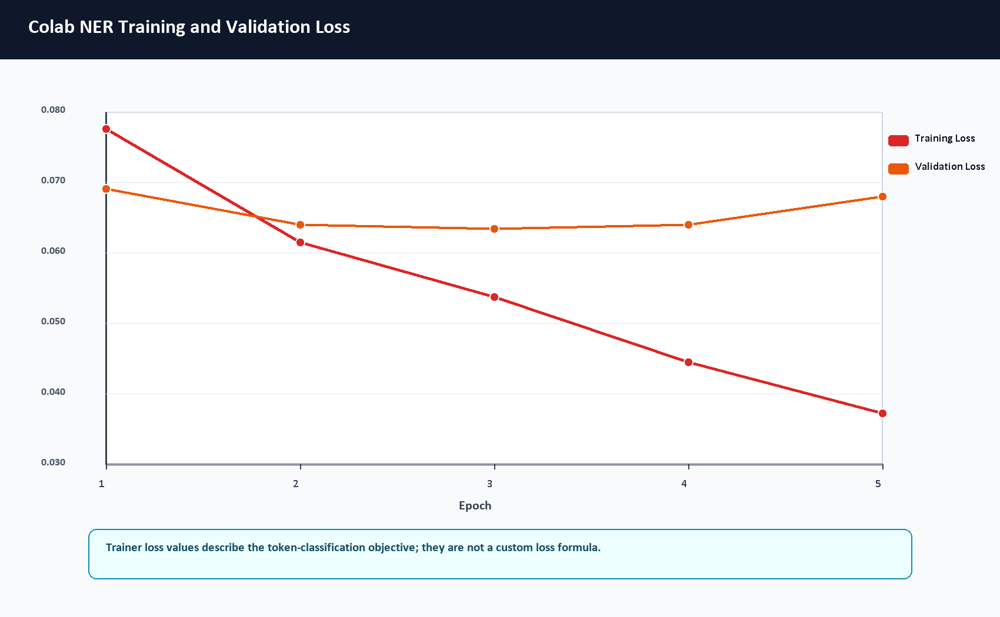

*Figure 52. Colab NER training and validation loss curve.*

The notebook uses Hugging Face `Trainer` with `AutoModelForTokenClassification` and a token-classification dataset. It does not define a custom loss function in the visible code, so this report treats the reported training and validation loss as the Trainer's token-classification objective values rather than a separately designed loss formula. Training loss decreases steadily from 0.077623 to 0.037280. Validation loss remains low, with the lowest visible value at epoch 3 (0.063463) and a small increase by epoch 5 (0.068058). The final epoch still has the strongest visible F1 score, but the validation-loss movement is a reason to interpret the run cautiously rather than overclaiming model generalization.

| Metric | Final Epoch Value | Source |
|---|---:|---|
| Precision | 0.933307 | Colab PDF output, epoch 5 |
| Recall | 0.940521 | Colab PDF output, epoch 5 |
| F1-score | 0.936900 | Colab PDF output, epoch 5 |
| Accuracy | 0.976376 | Colab PDF output, epoch 5 |
| Training loss | 0.037280 | Colab PDF output, epoch 5 |
| Validation loss | 0.068058 | Colab PDF output, epoch 5 |

*Table 29. Colab NER final metric summary.*

No per-label classification report or confusion matrix is visible in the exported Colab PDF, and the attached notebook output does not contain `classification_report`, `confusion_matrix`, `sklearn.metrics`, or matrix-like output cells. Therefore, this report does not invent per-label SKILL/ROLE/EDU/CERT/SOFT support, precision, recall, F1, or a confusion-matrix chart. Future training exports should save a token-level or entity-level confusion matrix plus a per-label classification report with support counts.

## 6.9 Matching Score Formula and Penalty Logic

The Layer 3 matcher exposes a clear score-composition formula in `similarity.py` and `matching_config.json`. It is exact for the code path implemented by `IntelligentMatcher.calculate_match`; however, it still depends on upstream component scores such as semantic similarity, skill similarity, and domain similarity.

```text
BaseScore =
    semantic_score * w_semantic
  + skills_score   * w_skills
  + domain_score   * w_domain

FinalScore =
    clamp(BaseScore - total_penalty + bonus_boost, 0.0, 1.0)

MatchScorePercent = round(FinalScore * 100, 2)
```

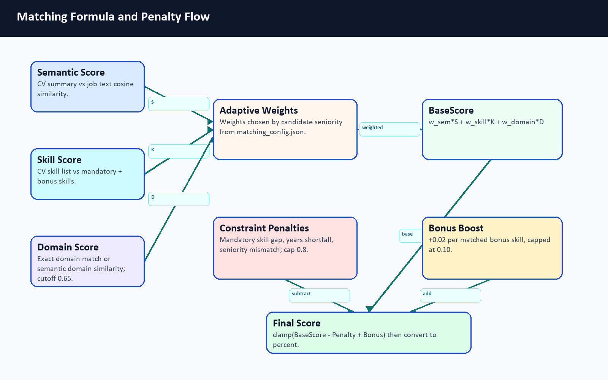

*Figure 26. Matching formula and penalty flow.*

| Seniority | Semantic Weight | Skill Weight | Domain Weight | Notes |
|---|---:|---:|---:|---|
| intern | 0.30 | 0.60 | 0.10 | Early roles emphasize concrete skill overlap. |
| junior | 0.40 | 0.40 | 0.20 | Balanced summary and skill evidence. |
| mid | 0.35 | 0.35 | 0.30 | Adds more domain importance. |
| senior | 0.25 | 0.25 | 0.50 | Domain alignment becomes more important. |
| lead | 0.20 | 0.20 | 0.60 | Leadership roles emphasize domain/role alignment. |
| default | 0.35 | 0.35 | 0.30 | Fallback profile. |

*Table 21. Seniority-aware matching weights.*

Constraint penalties are also code-derived. Missing mandatory skills subtract 15 percent each, capped at 50 percent. Experience shortfall subtracts a proportional penalty capped at 30 percent. Seniority mismatch subtracts 20 percent. Total validation penalty is capped at 80 percent. Bonus skills add 2 percent each, capped at 10 percent. The `/api/hybrid-match` endpoint additionally blends the Layer 3 semantic/adaptive result with TF-IDF when TF-IDF is available: 60 percent semantic/adaptive and 40 percent TF-IDF.

## 6.10 Explainable AI Recommendation Output

The analyzer does not only return a single percentage. It also returns supporting evidence that can be shown to users and examiners: score breakdowns, missing mandatory skills, strengths, gaps, red flags, and a fit verdict. This is important academically because it makes the recommendation process inspectable rather than opaque.

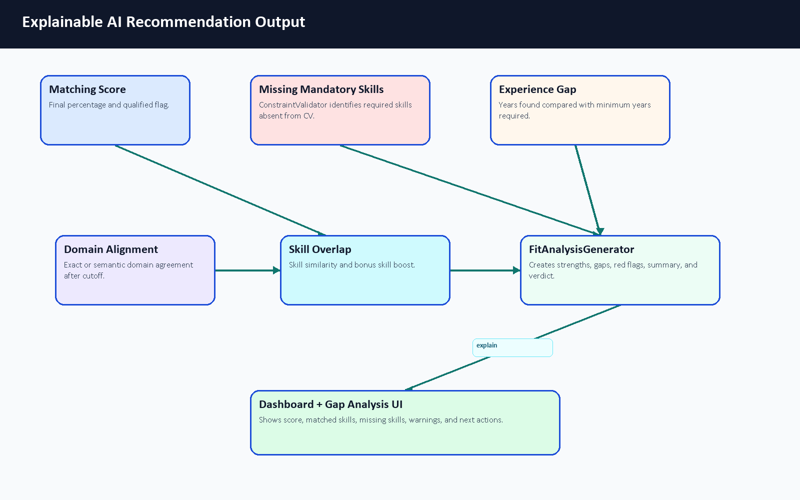

*Figure 27. Explainable AI recommendation output.*

| Output Type | Example | Why It Helps |
|---|---|---|
| Score | 78 percent | Gives a quick summary of estimated fit. |
| Matched skills | Laravel, Docker, MySQL | Shows evidence supporting the recommendation. |
| Missing skills | Kubernetes | Turns the gap into a learning target. |
| Red flags | Significant seniority mismatch | Warns that a numeric score should not be read alone. |
| Verdict | Strong Match or Potential Fit | Converts score ranges into readable guidance. |
| Gaps | Experience shortfall or missing mandatory skills | Explains why a candidate may need improvement before applying. |

*Table 22. Recommendation explanation output types.*

## 6.11 AI Analyzer Sequence

The analyzer is synchronous during CV upload: Laravel calls FastAPI and receives a structured parse result before updating the returned user resource. The stored profile, skills, experiences, CV analysis, and private file metadata then support later dashboard, recommendation, and gap-analysis requests.

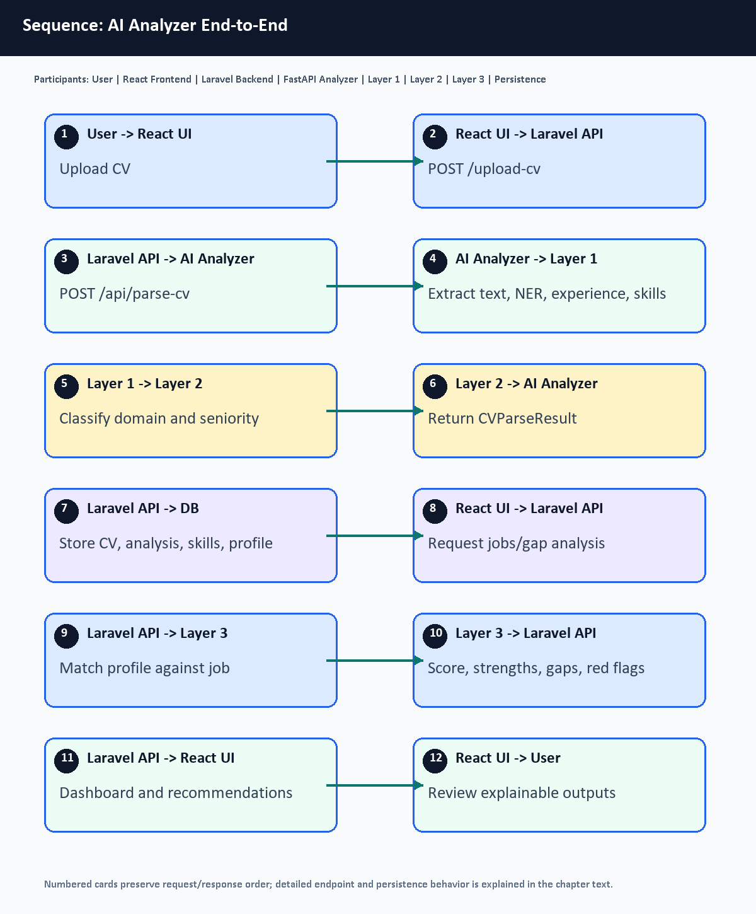

*Figure 28. AI analyzer sequence diagram.*

## 6.12 Computational Complexity Overview

The following complexity statements are approximate code-level descriptions, not formal proofs. They describe how cost grows with input size and component counts.

| Component | Approximate Complexity | Explanation |
|---|---|---|
| Text cleanup and line processing | O(n) | Scans the recovered text and lines, where n is text length. |
| Spatial PDF row grouping | Approximately O(w log w) | Word positions are grouped/sorted, where w is extracted word count. |
| NER chunking | O(c x model_cost) | Long CV text is split into c chunks; transformer inference dominates per chunk. |
| Skill canonicalization | O(s x k) for fuzzy/semantic comparison | s extracted skills may be compared against k configured/canonical names. |
| Domain classification | O(d) embedding comparisons | CV context is compared against d taxonomy domain descriptions. |
| Matching one job | O(s + r) plus embedding calls | Compares candidate skills with job requirements r and computes semantic/domain signals. |
| Ranking many jobs | O(j x match_cost) | j jobs require repeated matching or backend fallback comparison. |
| TF-IDF fallback | O(t) vectorization plus sparse cosine | Depends on token count t in the two texts. |

*Table 23. Computational complexity overview.*

## 6.13 Raw CV Input to Structured Output Example

The example below is an illustrative walkthrough designed for examiner readability. It is not a live model benchmark. It uses a small CV fragment and a small job description to show how the three layers cooperate. Because the full transformer/OCR runtime dependencies were not available in the documentation Python environment, the JSON block is labeled as an illustrative schema example based on the actual `schema.py` response structure rather than a live model run.

Sanitized raw CV fragment:

```text
Demo Student
Laravel Backend Developer
Skills: Laravel, MySQL, RESTful APIs
Experience: Backend Developer at Demo Company, 2025-2026
Education: Computer Science
```

| Raw Evidence | Extracted Output | Schema Area |
|---|---|---|
| `Laravel Backend Developer` | Predicted role/title evidence. | `profile.current_title`, `analysis.predicted_role` |
| `Laravel, MySQL, RESTful APIs` | Hard technical skills. | `skills.items[]` |
| `Backend Developer at Demo Company, 2025-2026` | One experience item with company, title, period, and technologies. | `experience.items[]` |
| `Computer Science` | Education evidence. | Profile/education metadata when recovered |
| Text CV fragment | Successful text parsing path; no OCR needed in this example. | `parsing_status`, `stats`, `analysis.metadata` |

*Table 24. Raw CV fragment extraction example.*

Illustrative sanitized output based on an actual analyzer response structure:

```json
{
  "parsing_status": "success",
  "profile": {
    "full_name": "Demo Student",
    "current_title": "Laravel Backend Developer",
    "alternative_titles": ["Backend Developer"],
    "headline": "Professional Summary",
    "contact": {
      "email": "student@example.com", "phone": "+20XXXXXXXXXX",
      "location": "Giza, Egypt",
      "linkedin_url": "https://example.com/linkedin",
      "github_url": "https://example.com/github", "portfolio_url": null
    },
    "summary": "Redacted summary text for a backend-focused student CV.",
    "confidence_score": 0.93
  },
  "stats": {"page_count": 2, "char_count": 4110, "word_count": 498, "language_hint": null},
  "skills": {
    "items": [
      {"confidence_score": 0.65, "name": "Laravel", "category": "hard", "evidence": "ner"},
      {"confidence_score": 0.65, "name": "MySQL", "category": "hard", "evidence": "ner"},
      {"confidence_score": 0.65, "name": "RESTful APIs", "category": "hard", "evidence": "rule"}
    ],
    "confidence_score": 0.65
  },
  "experience": {
    "items": [
      {
        "confidence_score": 0.85, "title": "Backend Developer",
        "company": "Demo Company", "location": "Remote",
        "start_date": "2025-12-01", "end_date": "2026-01-01", "is_current": false,
        "description": ["Developed Laravel APIs and database-backed features."],
        "technologies": ["Laravel", "MySQL"]
      }
    ],
    "confidence_score": 0.85
  },
  "analysis": {
    "summary": null,
    "predicted_role": "Laravel Backend Developer",
    "seniority": "Intern",
    "primary_domain": "Full Stack Development",
    "strengths": ["Diverse technical portfolio with multiple backend technologies."],
    "gaps": [], "red_flags": [],
    "confidence_score": 0.75,
    "metadata": {
      "segmentation": {
        "found_sections": ["profile_summary", "experience", "projects", "skills", "education"],
        "sections_missing": [], "anomalies": []
      },
      "experience": {"total_experience_years": 0.08, "action_verb_score": 0.3, "gap_details": []},
      "extraction": {"source": "spatial", "spatial_status": "ok", "word_count_spatial": 499},
      "layer2": {
        "seniority_details": {"level": "Intern", "semantic_match": "Intern"},
        "categorized_skills": {
          "hard_skills": ["Laravel", "MySQL", "RESTful APIs"],
          "soft_skills": [], "management_skills": []
        },
        "domain_scores": {"Backend Development": 0.3338, "Full Stack Development": 0.4616}
      }
    },
    "domain_scores": {"Backend Development": 0.3338, "Full Stack Development": 0.4616}
  }
}
```

| Section | Meaning |
|---|---|
| `profile` | Normalized identity, contact, title, headline, summary, and confidence data. |
| `stats` | Document-level counts such as pages, characters, words, and language hint. |
| `skills` | Extracted and categorized skill items with confidence and evidence source. |
| `experience` | Parsed work-history items, dates, descriptions, technologies, and confidence. |
| `analysis` | Predicted role, seniority, domain, strengths, gaps, red flags, and confidence. |
| `analysis.metadata.segmentation` | CV sections detected or missing during document understanding. |
| `analysis.metadata.layer2` | Classification details such as seniority reasoning, categorized skills, and domain scores. |

*Table 30. AI CV Analyzer output schema sections.*

| Classification | Result | Reason |
|---|---|---|
| Domain | Full Stack Development | The sanitized sample preserves the attached schema's multi-domain scoring style, with backend and frontend scores visible. |
| Seniority | Intern | Short recorded experience and the Layer 2 seniority detail support an early-career estimate. |
| Skill category | Hard technical skills | Laravel, MySQL, and RESTful APIs are technical implementation skills. |

*Table 25. Layer 2 interpretation example.*

Example job: Junior Backend Developer requiring Laravel, MySQL, Docker, and REST APIs.

| Matching Evidence | Result |
|---|---|
| Matched skills | Laravel, MySQL, Docker, REST APIs |
| Missing skills | None in this simplified example |
| Fit interpretation | Good illustrative fit for a junior backend role |
| Explanation | Skill overlap is strong; seniority appears compatible; final production score would require live matcher execution. |

*Table 26. Layer 3 matching evidence example.*

## 6.14 Why Not Use a Direct LLM-Only Approach?

Direct LLM analysis can be powerful, especially for summarizing complex CVs and producing natural-language feedback. CareerCompass still avoids a direct LLM-only runtime because the graduation/demo system must be reproducible, inspectable, containerized, and privacy-aware. The Gemini-based code is used for synthetic training-data generation, not for sending private uploaded CVs to an external LLM during the normal runtime flow. The runtime analyzer is decomposed into layers so each part can be tested, explained, and improved independently.

| Direct LLM-Only Approach | CareerCompass Hybrid Analyzer |
|---|---|
| Requires an external inference service for each private CV unless self-hosted. | Runs the analyzer locally/containerized in the demo stack. |
| Responses can vary across prompts, model versions, and temperatures. | Uses deterministic rules, typed schema validation, and explicit status values. |
| Harder to benchmark each sub-step because extraction, reasoning, and explanation are blended. | Layers can be inspected separately: text recovery, NER, rules, classification, matching, and explanation. |
| Privacy risk is higher if real CVs are sent to a remote service. | Runtime CV analysis can stay inside the deployed services. |
| Can explain textually but may hallucinate unsupported fields. | Outputs structured strengths, gaps, red flags, metadata, and confidence-style signals from code paths. |
| May be faster to prototype but harder to reproduce academically. | Fits Docker-based graduation evaluation and component-level evidence. |

*Table 27. AI approach comparison.*

## 6.15 AI Analyzer Limitations and Future Work

The limitations below make the AI contribution more academically honest, not weaker. They identify exactly what should be improved before the system is treated as a stronger research or production artifact.

- OCR quality affects scanned or image-heavy CV extraction.
- Synthetic data may not cover all real CV styles, languages, layouts, and informal wording.
- The Colab PDF provides recorded NER training-run metrics, but the final cleaned NER dataset and exported model weights are not committed, so the run is not reproducible from repository files alone.
- More real or human-reviewed labeled CV data is needed for trustworthy per-label precision, recall, and F1.
- A larger fixed benchmark should evaluate parsing, role prediction, domain classification, seniority, matching, and gap analysis together.
- Arabic and multilingual CV support can be improved beyond the current UI localization.
- The role/domain taxonomy and skill alias catalog should expand through reviewed labor-market evidence.
- A model card and dataset card should be added for any exported model artifact.
- Human-in-the-loop review can improve reliability for important student guidance decisions.
- Privacy-preserving training and evaluation workflows should be designed before using real CV data.

## 6.16 AI Chapter Summary

The standalone AI chapter was added because the analyzer is a core project contribution. The system is best described as a transparent, layered hybrid analyzer for a graduation/demo environment. It does not claim production-grade AI accuracy, a certified hiring probability, or repository-alone reproducible final NER benchmarking. The new Colab PDF strengthens training-run evidence, while the academic value remains the integration of document recovery, NER, rules, canonicalization, classification, matching, explanation, and honest fallback behavior.

\pagebreak

# Chapter 7: AI Job Miner and Scraping Deep Technical Analysis

## 7.1 Purpose of Job Mining in CareerCompass

CareerCompass needs job mining because career guidance becomes weak when job data is static. A student's CV skills, predicted role, and gap-analysis output are useful only when compared against job descriptions that contain current requirements. The job-mining subsystem supplies those job descriptions to the recommendation and gap-analysis workflows, while the admin interface gives operators visibility into sources, target roles, imported jobs, and failures.

The chapter uses the term "job mining" instead of claiming unrestricted web scraping. The repository contains a deterministic local demo source, API adapters, HTML parser adapters, and a Scrapy spider path. These are source adapters for a graduation/demo system. They do not prove complete labor-market coverage, production-grade crawling reliability, or permission to scrape every configured website.

## 7.2 Scraping Design Philosophy

The implementation separates responsibilities deliberately. Laravel remains the trusted application backend and system of record. It owns authentication, authorization, job records, skill synchronization, admin controls, and user-facing APIs. The Python AI Job Miner service owns network-heavy adapter work, public API parsing, HTML parsing, Scrapy execution, adapter quality checks, and callback payload construction. Queue workers sit between them so slow and failure-prone network work does not block normal browser requests.

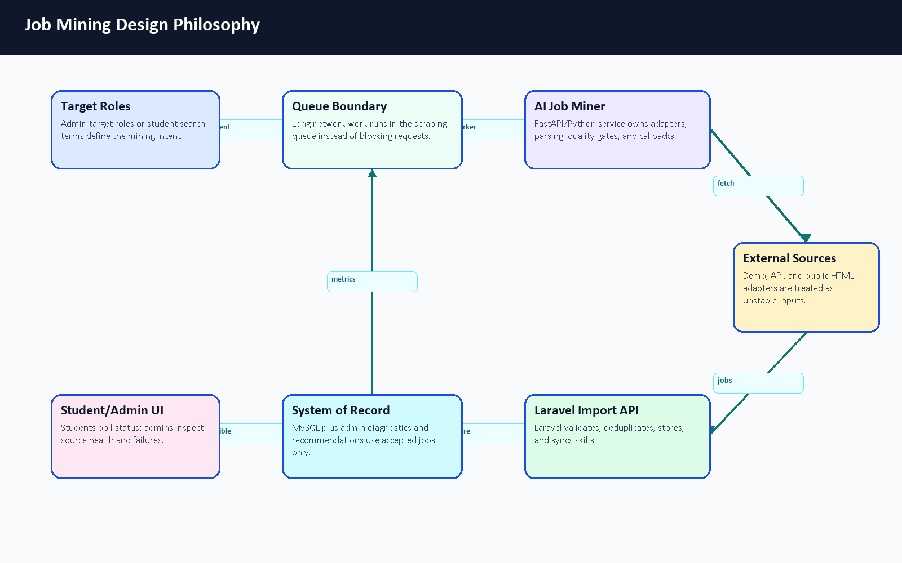

*Figure 53. Job mining design philosophy.*

| Design Question | CareerCompass Decision | Reason |
|---|---|---|
| Why job mining? | Use imported job descriptions to support recommendations, gap analysis, and market context. | Static seed data becomes stale and cannot represent changing skill demand. |
| Why Python/FastAPI? | Keep scraping/API ingestion dependencies in `ai-job-miner`. | Python has stronger parsing/scraping tooling and isolates unstable network work from Laravel. |
| Why Laravel as system of record? | Only Laravel validates, deduplicates, stores, and exposes accepted jobs. | Auth, admin controls, database consistency, and skill sync already belong to Laravel. |
| Why queues? | `ProcessOnDemandJobScraping` and market scraping jobs run on the scraping queue. | External sources can timeout, block, or return malformed data. |
| Why diagnostics? | Admin pages show source status, source tests, target roles, failed URLs, and batch progress. | Operators need evidence instead of assuming sources are healthy. |

*Table 31. Job mining design decisions.*

## 7.3 AI Job Miner Runtime Architecture

The deployed runtime uses Docker Compose service separation. The AI Job Miner service is named `cc-job-miner`, maps host port `8003` to container port `8000`, and exposes `/health`. Laravel reaches it through `SCRAPER_SERVICE_URL`, while the scraper calls Laravel callback endpoints through `LARAVEL_API_BASE_URL`. The production overlay also defines `backend-worker-scraping`, which runs the database queue with the `scraping` queue name and a longer timeout than ordinary request work.

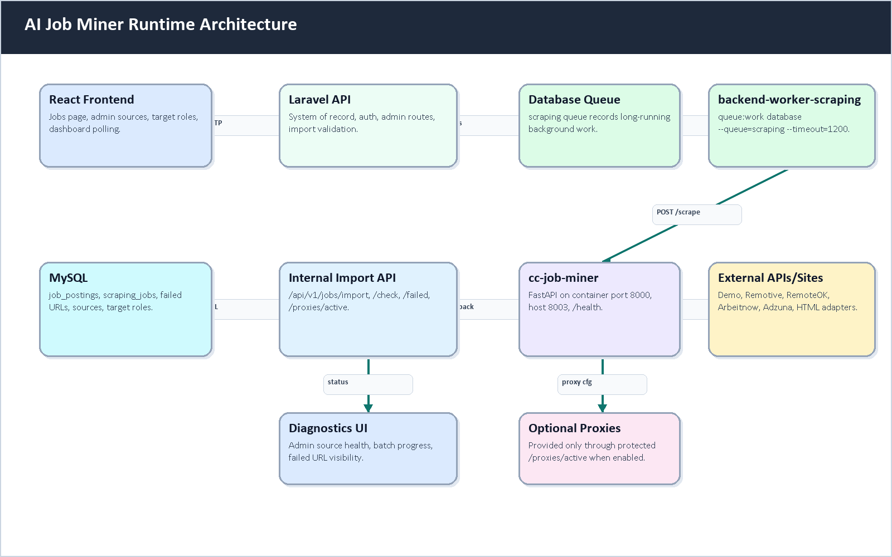

*Figure 54. AI Job Miner runtime architecture.*

| Component | Implementation Evidence | Runtime Role |
|---|---|---|
| React frontend | `frontend/src/api/endpoints.js`, `scrapingSources.js`, admin pages | Starts user/admin actions and polls status. |
| Laravel API | `JobController`, `ScrapedJobController`, admin controllers | Creates jobs, protects routes, validates imports, and exposes results. |
| Database queue | `ProcessOnDemandJobScraping`, `ProcessMarketScrapingCategory` | Runs slow scrape work outside request/response flow. |
| AI Job Miner | `ai-job-miner/service_api.py` | FastAPI adapter service with `/health`, `/metrics`, and protected `/scrape`. |
| Scrapy path | `ai_job_miner/settings.py`, `linkedin_spider.py`, pipelines | Public-page spider flow with robots obedience, delay, retries, dedupe, and Laravel export. |
| MySQL | migrations and models for jobs, sources, target roles, scraping jobs, failed URLs | Stores accepted jobs and operational state. |
| Optional proxies | `InternalProxyController`, `SCRAPER_USE_PROXIES` | Supplies active proxies only through a protected internal route when enabled. |

*Table 32. Scraping runtime component map.*

## 7.4 Complete Job Mining Flow

The complete flow starts with a user search or an admin target role. Laravel checks whether usable stored jobs already exist. If stored data is enough for the user workflow, Laravel returns it. If not, Laravel creates a `ScrapingJob` record, dispatches a background worker, calls AI Job Miner, receives candidate jobs through protected import endpoints, deduplicates and stores them, syncs required skills, and exposes status through polling/dashboard endpoints.

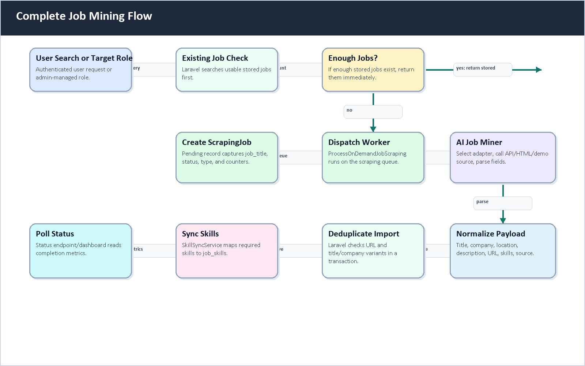

*Figure 55. Complete job mining flow.*

The important architectural point is that the Python service does not directly become the database owner. It is an ingestion service. Candidate jobs become CareerCompass jobs only after Laravel form requests validate the payload and the import transaction completes.

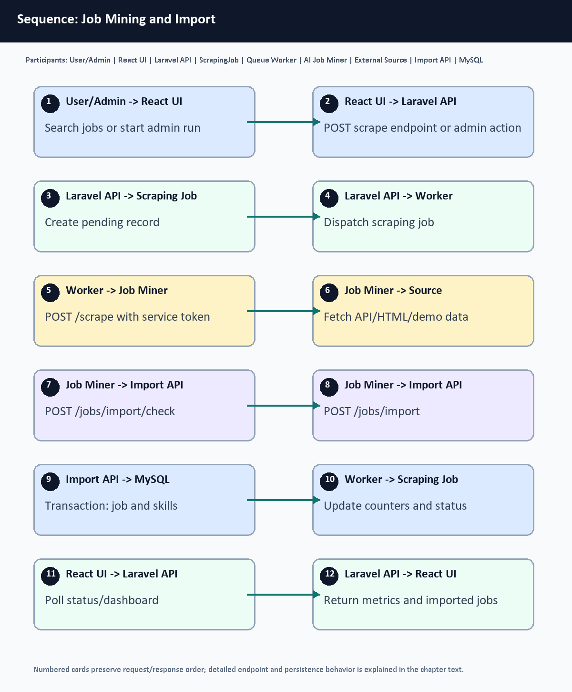

*Figure 56. Scraping sequence diagram.*

## 7.5 On-Demand Scraping and Status Polling

On-demand scraping is implemented in `JobController`. `scrapeAndStore` accepts a query and maximum result count, creates a pending `ScrapingJob`, dispatches `ProcessOnDemandJobScraping`, and returns the scraping job ID. `scrapeJobTitleIfMissing` first checks whether public usable jobs with a matching title already exist. If jobs exist, it returns `data_exists: true`; otherwise it queues a scrape and returns a polling URL. `checkScrapingStatus` returns the lifecycle state, counters, completed timestamp, matching stored jobs, or an error message.

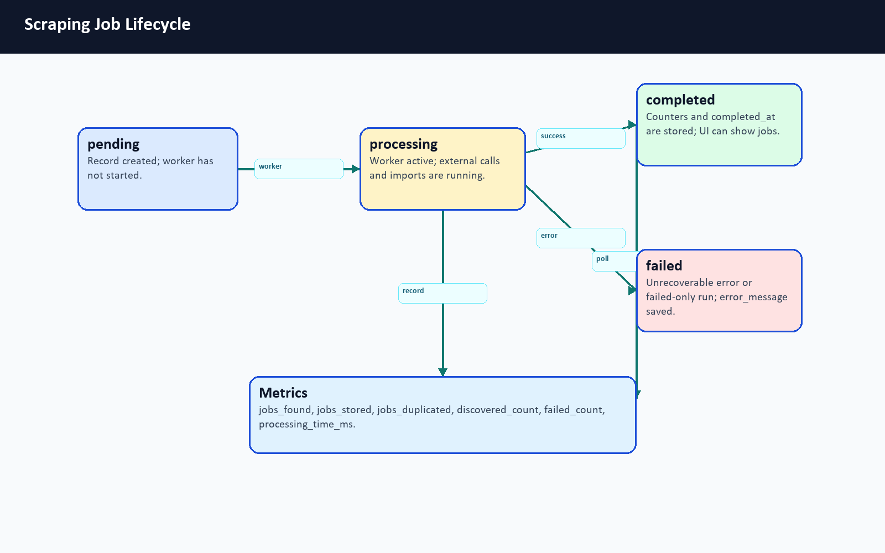

*Figure 57. Scraping job lifecycle.*

| Status | Meaning | User/Admin Behavior |
|---|---|---|
| pending | The `ScrapingJob` record exists and is waiting for a worker. | Poll status and keep the UI non-blocking. |
| processing | The queue worker has started and external/import work is running. | Continue polling or show progress/admin diagnostics. |
| completed | The worker finished and stored counters such as `jobs_found`, `jobs_stored`, `jobs_duplicated`, `discovered_count`, `failed_count`, and `processing_time_ms`. | Display imported/stored jobs and final metrics. |
| failed | The run ended with an unrecoverable error or failed-only outcome and `error_message` is stored. | Show an error and use admin diagnostics/manual review. |

*Table 33. On-demand scraping lifecycle states.*

## 7.6 Source Management and Target Roles

Admin source management is implemented through `ScrapingSourceController`, `ScrapingSource`, and `AdminSources.jsx`. Sources store endpoint, method, type, mode, status, headers, and params. The model computes adapter names and support metadata so the UI can distinguish demo/local sources, supported API adapters, missing credentials, external-risk HTML adapters, and unsupported configurations.

Target roles are implemented through `TargetJobRoleController`, `TargetJobRole`, and `AdminTargets.jsx`. A full scraping run combines active target roles with active/runnable sources. Unsupported sources and sources missing required credentials are skipped instead of being counted as successful.

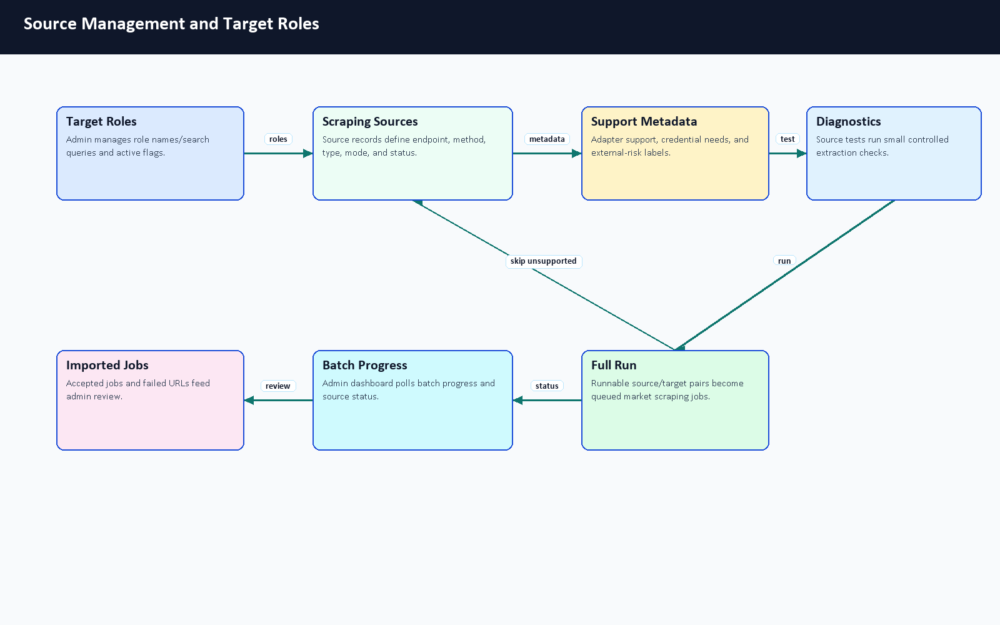

*Figure 58. Source management and target-role flow.*

| Control | Code Evidence | Purpose |
|---|---|---|
| Source CRUD/status | `ScrapingSourceController`, `StoreScrapingSourceRequest`, `UpdateScrapingSourceRequest` | Manage source definitions and active/inactive state. |
| Source support metadata | `ScrapingSource::supportMetadata()` | Label demo, supported APIs, config-required sources, external-risk sources, and adapter-missing sources. |
| Source diagnostics | `test`, `testSingle`, `runSourceDiagnostic` | Run a small extraction and report support status, jobs stored/rejected, failures, and elapsed time. |
| Target roles | `TargetJobRoleController`, `TargetJobRoleSeeder` | Manage role names/search queries for market scraping. |
| Full scraping run | `runFullScraping`, `ProcessMarketScrapingCategory` | Queue source/target pairs and record per-run `ScrapingJob` status. |
| Admin evidence | Figures 44-47 | Dashboard, jobs, source diagnostics, and target-role screens show the operator workflow. |

*Table 34. Source management and target-role controls.*

The admin operational evidence is already shown in Figures 44-47: dashboard, jobs, source diagnostics, and target roles. This chapter refers to those screenshots instead of repeating them, so Chapter 7 can focus on architecture, flows, and implementation behavior.

## 7.7 Laravel Import Pipeline and Deduplication

The import pipeline is centered in `ScrapedJobController::import`. It runs inside a database transaction and applies a layered duplicate strategy. First it checks URL, which is the strongest available source identity. Then it checks title/company candidates, including original and title-case variants. Finally it checks squished lowercase title/company values. If a job already exists, Laravel updates it; otherwise it creates a new `job_postings` record. `SkillSyncService` then normalizes and links required skills without detaching prior evidence.

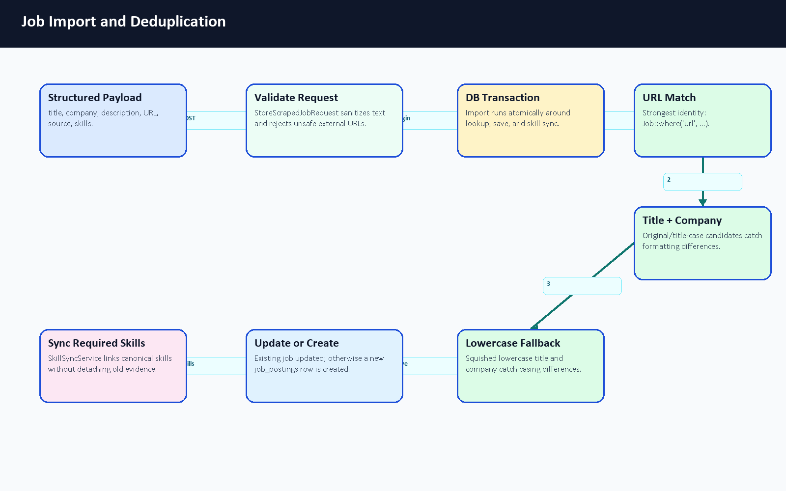

*Figure 59. Job import and deduplication flow.*

| Deduplication Stage | Evidence | Reason |
|---|---|---|
| URL match | `Job::where('url', ...)` | Strongest available unique source identity. |
| Title/company variants | original title and title-case candidate with company | Catches common formatting differences. |
| Lowercase title/company | squished lowercase title and company comparison | Catches casing/spacing differences. |
| Update or create | Import runs inside `DB::transaction` | Keeps lookup, save, and skill sync atomic. |
| Skill sync | `SkillSyncService::syncJobSkills(..., detaching: false)` | Preserves and extends job-skill matching evidence. |

*Table 35. Import and deduplication stages.*

The current duplicate strategy is appropriate for a demo system, but a stronger production importer should add source-specific IDs, canonical URLs, content hashes, expiration states, and reviewed merge rules.

## 7.8 Failed URL Handling and Dead Letter Queue

The failure path uses `ScrapingFailedUrl` records as a lightweight dead-letter style store. AI Job Miner reports failed source URLs to `POST /api/v1/jobs/import/failed`; Laravel validates the payload with `ReportScrapingFailureRequest` and stores URL, optional source/job IDs, error message, retried flag, and failed timestamp. Admin dashboard routes expose failed URLs for a scraping job.

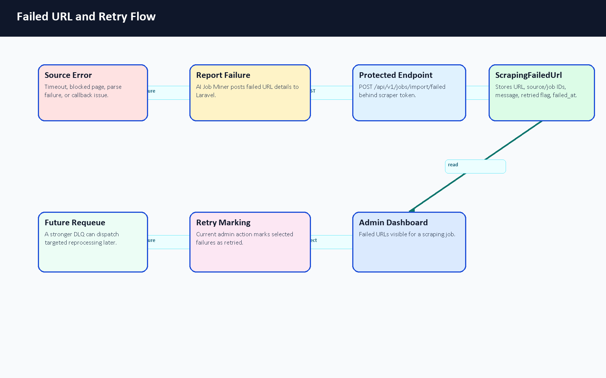

*Figure 60. Failed URL and retry flow.*

| Failure Type | Handling | User/Admin Visibility |
|---|---|---|
| Timeout or network error | Operational category reported through failed URL callback when available. | Admin failed-URL list and source diagnostics. |
| Parse or quality failure | Adapter may classify empty, rejected, or data-quality failed outcomes. | Source diagnostic result and counters. |
| Duplicate candidate | Import check/import path tracks duplicate or non-created outcomes. | Batch/on-demand counters rather than a user-facing error. |
| Source disabled or unsupported | Source is skipped before full run or reported as adapter missing/config required. | Admin source status and planned/skipped run summary. |
| Missing internal token | `scraper.token` middleware rejects Laravel import callbacks. | Request rejected; should be reviewed through logs/config. |

*Table 36. Failed URL and operational failure handling.*

The current `retry-failures` admin endpoint marks selected failed URLs as retried. It does not yet dispatch a targeted re-fetch job. The book therefore describes it as operational retry marking, not as a complete production DLQ processor.

## 7.9 Admin Diagnostics and Retry Operations

Admin diagnostics are more than a source list. `ScrapingSourceController::runSourceDiagnostic` creates a diagnostic `ScrapingJob`, calls the scraper with a small query, captures adapter classification, records elapsed time, and returns support metadata, job preview counts, quality rejections, failed URL counts, and an output excerpt. `DashboardController` exposes scraper health, batch progress, failed URLs, and retry marking. This gives examiners a visible way to discuss what happened rather than only whether a scrape produced jobs.

The diagnostic design is especially important for external sources. Public APIs can require credentials, and websites can change HTML or block automated access. A mature demo should show those outcomes honestly: skipped, config required, blocked, empty, failed, partial, or successful.

## 7.10 Security, Tokens, Rate Limits, and Proxy Configuration

Scraping uses multiple security boundaries. User and admin actions go through authenticated Laravel routes. Laravel-to-miner calls use `X-Scraper-Service-Token` on AI Job Miner `/scrape`. Miner-to-Laravel callbacks use the protected `scraper.token` middleware and `throttle:scraper`; in the current Laravel middleware this is checked through the bearer token against `SCRAPY_API_TOKEN`. Import logs are redacted by `ScrapedJobController::redactForLogs`, and the Python service redacts token/API-key-like fields in adapter output.

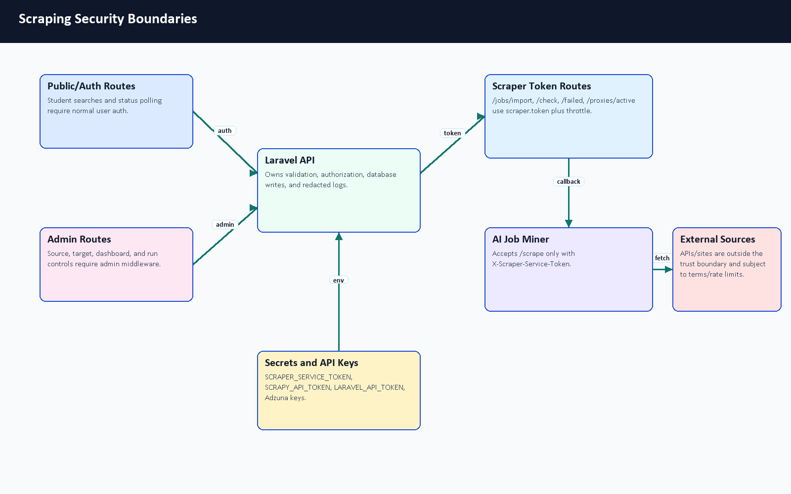

*Figure 61. Scraping security boundaries.*

| Control | Code / Configuration Evidence | Purpose |
|---|---|---|
| Laravel import token | `VerifyScraperToken`, `SCRAPY_API_TOKEN`, `LARAVEL_API_TOKEN` | Protects `/jobs/import`, `/jobs/import/check`, `/jobs/import/failed`, and `/proxies/active`. |
| Laravel-to-miner token | `SCRAPER_SERVICE_TOKEN`, `X-Scraper-Service-Token` | Prevents public calls to AI Job Miner `/scrape`. |
| Scraper throttling | `throttle:scraper` route middleware | Limits protected callback traffic. |
| Secret redaction | `redactForLogs`, `_sanitize_sensitive` | Avoids logging tokens, API keys, app IDs, authorization headers, passwords, and secrets. |
| External API keys | `ADZUNA_APP_ID`, `ADZUNA_APP_KEY` | Enables Adzuna adapter when configured; missing keys are reported honestly. |
| Proxy configuration | `SCRAPER_USE_PROXIES`, `/proxies/active` | Optional operational feature; not a permission bypass or reliability guarantee. |
| Rate-limit configuration | `SCRAPER_RATE_LIMIT_PER_MINUTE` and Scrapy delay/retry settings | Documents conservative runtime policy, but source-specific terms still matter. |
| Robots and terms | Scrapy `ROBOTSTXT_OBEY = True`; RFC 9309 context [41] | Ethical scraping requires respecting source rules and terms. |

*Table 37. Scraping security and configuration controls.*

## 7.11 Job Mining API Contracts

The scraping API surface has three groups: authenticated user endpoints, protected internal scraper endpoints, and admin endpoints. Detailed examples are included in Appendix A so maintainers can reuse them without exposing real tokens. The examples follow an OpenAPI-style documentation pattern [39].

| Group | Method and Path | Auth / Middleware | Purpose |
|---|---|---|---|
| User/Auth | `POST /api/v1/jobs/scrape` | `Authorization: Bearer <user-token>` | Queue on-demand scraping for a query. |
| User/Auth | `POST /api/v1/jobs/scrape-if-missing` | `Authorization: Bearer <user-token>` | Return existing jobs or queue scraping when missing. |
| User/Auth | `GET /api/v1/scraping-status/{jobId}` | `Authorization: Bearer <user-token>` | Poll lifecycle state and counters. |
| Internal scraper | `POST /api/v1/jobs/import/check` | `Authorization: Bearer <internal-token>` | Check duplicate URL before import. |
| Internal scraper | `POST /api/v1/jobs/import` | `Authorization: Bearer <internal-token>` | Validate, deduplicate, save/update job, and sync skills. |
| Internal scraper | `POST /api/v1/jobs/import/failed` | `Authorization: Bearer <internal-token>` | Store failed source URL evidence. |
| Internal scraper | `GET /api/v1/proxies/active` | `Authorization: Bearer <internal-token>` | Return active proxy definitions when enabled. |
| Scraper service | `POST /scrape` on AI Job Miner | `X-Scraper-Service-Token: <internal-token>` | Execute adapter work for Laravel worker. |
| Admin | `/api/v1/admin/scraping-sources*`, `/api/v1/admin/target-roles*`, `/api/v1/admin/scraping/run-full` | User token plus admin middleware | Manage sources, target roles, diagnostics, and full runs. |

*Table 38. Job mining API contract summary.*

On-demand request example:

```json
{
  "query": "Backend Developer",
  "max_results": 10
}
```

Status response example:

```json
{
  "success": true,
  "status": "completed",
  "jobs_found": 8,
  "jobs_stored": 5,
  "jobs_duplicated": 3,
  "failed_count": 0,
  "processing_time_ms": 12640
}
```

Internal import example:

```json
{
  "title": "Junior Backend Developer",
  "company": "Example Co",
  "location": "Remote",
  "description": "Build APIs with Laravel and MySQL.",
  "requirements": "Laravel, MySQL, REST APIs",
  "url": "https://example.com/jobs/123",
  "source": "remotive",
  "scraping_source_id": 5,
  "skills": ["Laravel", "MySQL", "REST APIs"]
}
```

## 7.12 Scraping Evaluation and Validation Evidence

The strongest current scraping evidence is architectural and test evidence, not live market coverage evidence. The repository includes AI Job Miner tests for service auth, health, metrics, adapter parsing, classification, redaction, blocked/empty outcomes, and skill extraction helpers. Laravel validates imports through form requests and transactions. Docker Compose wires the `ai-job-miner` service, long-running scraping worker, tokens, and callback URLs.

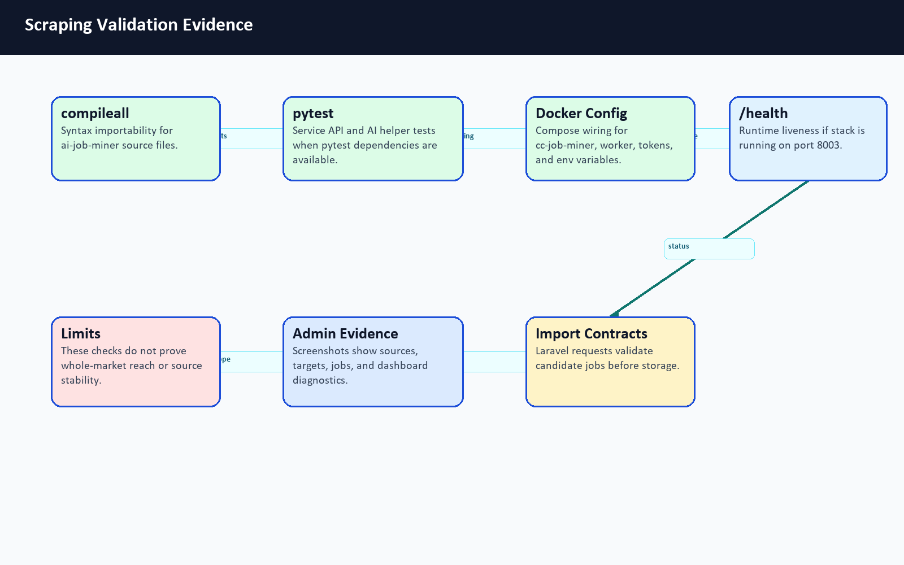

*Figure 62. Scraping validation evidence.*

| Evidence | Result to Record | What It Proves | Limitation |
|---|---|---|---|
| `python -m compileall ai-job-miner` | Passed using the bundled Python runtime. | Python syntax/importability for the service files. | Not runtime source success. |
| `python -m pytest` in `ai-job-miner` | Passed inside the running container: 75 tests, 1 warning. | Service logic and adapter parser behavior under tests. | Mocked tests do not prove real website availability. |
| `/health` and `/metrics` | AI Job Miner `/health` returned 200 with `{"status":"ok","service":"CareerCompass Job Miner"}`; `/metrics` returned Prometheus-style scraper counters. | FastAPI job-miner service is alive and exposes basic scraper metrics. | Not source coverage or data quality. |
| Docker Compose config | Passed for base plus production overlay. | Service wiring, tokens, workers, and ports are valid YAML/config. | Not external scraping success. |
| Deterministic demo scrape | Protected `/scrape` call using `CareerCompass Demo Jobs` returned `SUCCESS`, previewed 3 jobs, stored 3, and reported 0 failed URLs; smoke rows were cleaned afterward. | Demo adapter and Laravel import path can work together without external websites. | Direct service call bypassed the queue worker, so the temporary `ScrapingJob` status stayed pending and was not status-polling evidence. |
| Import API validation | Documented from form requests and controller code. | Laravel accepts structured payloads and rejects unsafe data. | Not a complete benchmark. |
| Admin diagnostics screenshots | Figures 44-47. | Admin UI supports source, job, dashboard, and target-role operations. | Point-in-time demo evidence. |

*Table 39. Scraping validation evidence.*

The final smoke test used a direct protected `/scrape` request to validate the deterministic demo adapter and Laravel import path. A full authenticated `/jobs/scrape-if-missing` queue lifecycle with browser polling remains a recommended final demonstration check because it exercises the user-facing queue trigger and status-polling path rather than only the internal scraper contract.

| Component | Primary Evidence | Summary |
|---|---|---|
| FastAPI service/API layer | `ai-job-miner/service_api.py` | Provides `/health`, `/metrics`, and protected `/scrape` orchestration. |
| Demo/local adapter | `CareerCompass Demo Jobs` source path and tests | Deterministic source used for safe smoke evidence without external websites. |
| Adzuna/API adapter | Adzuna source code and environment keys | Optional external API source when credentials and quotas are configured. |
| HTML/Scrapy-related path | `ai_job_miner/settings.py`, spiders, pipelines | Public-page crawling path with robots/delay/retry configuration boundaries. |
| Laravel JobController | `JobController` | Starts on-demand scraping and exposes status polling. |
| Laravel ScrapedJobController | `ScrapedJobController` | Validates imports, checks duplicates, records failures, and redacts logs. |
| Queue jobs | `ProcessOnDemandJobScraping`, market scraping jobs | Move long network tasks out of browser request time. |
| Skill sync | `SkillSyncService` | Connects imported job requirements to canonical skills. |
| Admin source/target controllers | `ScrapingSourceController`, `TargetJobRoleController` | Manage active sources, diagnostics, target roles, and full-run triggers. |
| Frontend admin/user pages | `frontend/src/pages/admin`, user job pages | Surface jobs, sources, targets, status, and retry/diagnostic views. |

*AI Job Miner Source and Function Inventory Summary.*

No source coverage percentage, success rate, or every-job-board claim is made. External-source behavior should be retested shortly before the final defense if the team wants live demonstration evidence.

## 7.13 Limitations, Ethics, and Future Work

The scraping subsystem is useful because it connects CV analysis to job requirements, but it must remain academically honest. Public websites can change HTML, block requests, or impose rules. APIs can require credentials and quotas. Proxy usage can introduce reliability and compliance risks. Stored jobs can become stale. Duplicate detection can be improved.

| Area | Current Boundary | Future Work |
|---|---|---|
| Source coverage | Demo/local source is deterministic; external adapters are partial and unstable. | Add reviewed source policies and source-specific adapters. |
| External terms | Code cannot prove permission for every source. | Record robots/terms review per source before enabling external runs. |
| Rate limits | Scrapy delay/retry settings and rate-limit config exist. | Add per-source rate-limit dashboard and enforcement. |
| API keys | Adzuna uses environment credentials when configured [40]. | Add secret rotation and key-status diagnostics. |
| Proxies | Optional protected proxy route exists. | Use only compliant proxies and document source permission. |
| Duplicate detection | URL and title/company transaction logic. | Add canonical IDs, URL normalization, and content hashes. |
| Data freshness | Imported jobs remain until managed. | Add expiration, archival, and human review queue. |
| Failed URLs | Failed URL records and retry marking. | Add targeted DLQ reprocessing with attempt counts. |
| Evaluation | Tests and structural validation. | Add reproducible live-source health checks without inflated claims. |

*Table 40. Scraping limitations, ethics, and future work.*

Ethical operation should respect robots.txt and website/API terms, prefer official APIs where available, avoid private/login/CAPTCHA bypasses, keep request rates conservative, and avoid presenting imported data as exhaustive or assured. This framing keeps the system useful for a graduation demonstration while making its real boundaries clear.

\pagebreak

# Chapter 8: Testing and Evaluation

## 8.1 Introduction

Evaluation was performed using repository-aware commands and browser evidence. The goal was to verify that each major part of the graduation/demo system runs and to document limitations honestly.

## 8.2 Testing Strategy

The testing strategy combined automated tests, build checks, configuration checks, service health probes, and manual functional evaluation. Automated tests provide repeatable evidence. Screenshots provide visible workflow evidence. Manual tables document behavior that is difficult to fully automate in the available environment.

## 8.3 Backend Testing

Backend validation was executed inside the backend container. Composer dependencies were already installed. `php artisan config:clear`, `php artisan route:list`, migrations, and tests passed. The route list confirmed 131 routes. The Laravel test suite passed with 39 tests and 297 assertions.

## 8.4 Frontend Testing

The frontend was validated using the existing `frontend/node_modules` and the bundled Node runtime. ESLint passed with 9 warnings and 0 errors. The warnings were related to React fast-refresh export conventions and hook dependency notes. The Vite production build passed and transformed 2904 modules.

## 8.5 Python Services Testing

Python syntax compilation passed for both AI services. The AI Job Miner pytest suite was rerun inside the running `ai-job-miner` Docker container and passed with 75 tests and 1 warning. The local bundled Python runtime still did not include pytest, so the successful pytest evidence is specifically container-based. The AI CV Analyzer pytest suite was not rerun in this cleanup pass; AI CV Analyzer syntax compilation passed, and earlier smoke/Colab evidence remains documented separately.

## 8.6 Docker and Integration Testing

Docker Desktop was initially unavailable to the shell, then was started through `docker desktop start`. Docker Compose configuration validation passed for the base plus production overlay files. `docker compose up -d` was used without a rebuild to start the existing local stack. After startup settled, `docker compose ps` showed the main app containers running, with backend, frontend, Nginx, job miner, database, and queue workers healthy. Health probes returned 200 for `/api/health`, `/api/ready`, `/status`, AI Job Miner `/health`, and the AI CV Analyzer root endpoint. These checks prove service availability in the local demo stack, not external source reliability.

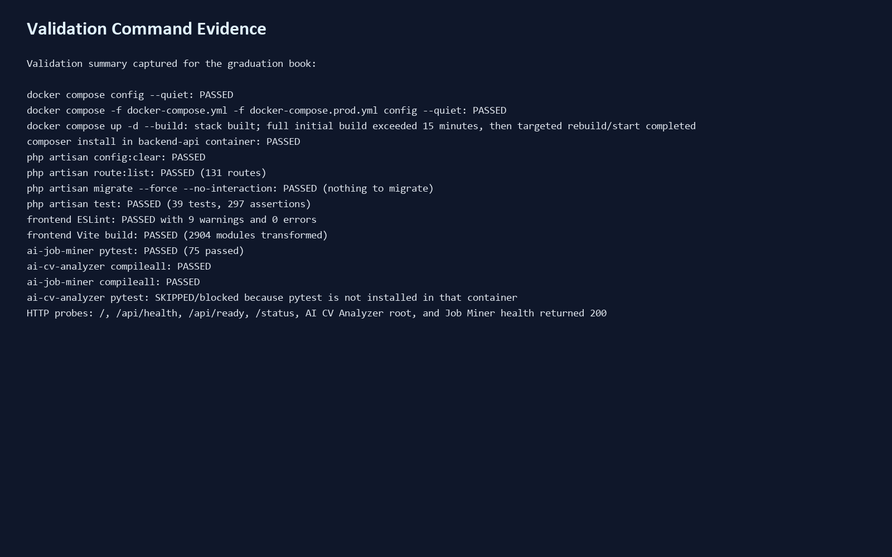

*Figure 49. Validation command evidence.*

## 8.7 CI/CD Validation

GitHub Actions workflow files were reviewed as part of repository inspection. A live GitHub Actions status screenshot was not captured before the draft PR because PR checks only become meaningful after the branch is pushed and GitHub schedules workflows. The manual review checklist asks the team to inspect CI status on the opened draft PR.

## 8.8 AI CV Analyzer Model Evidence

The AI CV Analyzer training workflow was inspected from repository files, helper documentation, and the exported Colab training-results PDF. Full model training was not rerun during this documentation update because the generator requires external Gemini API keys, the cleaned training dataset content is not committed, the runtime dependencies for transformer inference were not installed in the bundled documentation Python environment, and the notebook is designed for a Colab/T4-style GPU runtime.

The important distinction is reproducibility scope. The repository alone still does not provide the final labeled evaluation dataset, final model weights, or a one-command reproducible training run. However, the user-provided Colab PDF does provide recorded output cells from the actual notebook run, including train/test counts and overall epoch metrics. Those values are reported as Colab-run training evidence on the generated/synthetic notebook split, not as production accuracy. A local ignored artifact folder was present on this workstation and safe metadata was inspected, but model binaries remain outside Git. The mini evaluation below remains useful for regression-style demonstration, but it is separate from the Colab NER training metrics.

| Evidence Item | Status | What It Proves | What It Does Not Prove |
|---|---|---|---|
| Runtime NER artifact path | Code checks `ai-cv-analyzer/models/ner_weights/career_compass_ner_final`; the folder is ignored by Git. | The service can load a local token-classification model when deployed. | It does not prove the artifact is committed or provide a final held-out F1 score. |
| Local ignored metadata | `config.json` and tokenizer metadata were inspected locally without copying weights. | The local artifact uses a BERT token-classification configuration and cased tokenizer. | It is not a portable repository artifact. |
| Training notebook | Present under `ai-cv-analyzer/training/train_ner.ipynb` | The training process, label map, token alignment, Trainer setup, metrics code, and export steps are documented. | It does not include the cleaned dataset or model weights. |
| Colab training-results PDF | Exported PDF under `docs/graduation-book/model-analysis/colab_train_ner_results.pdf` | Shows recorded NER fine-tuning/evaluation outputs: 41,319 train rows, 4,592 test rows, and final epoch precision 0.933307, recall 0.940521, F1 0.936900, accuracy 0.976376. | It does not prove readiness for real deployment and may not be reproducible without the same dataset, runtime, and model artifacts. |
| Dataset generator | Present under `ai-cv-analyzer/training/generate_tech_dataset.py` | Synthetic labeled data can be generated from Gemini with key rotation and negative decoys. | It was not run here because it requires API keys and would generate a large dataset. |
| Dataset cleaner | Present under `ai-cv-analyzer/training/clean_dataset.py` | Dataset normalization, deduplication, and span validation are part of the workflow. | The cleaned dataset file itself is not committed. |
| API tests | Present under `ai-cv-analyzer/tests/test_service_api.py` | FastAPI status handling and hybrid-match formula behavior are covered with fakes. | These tests do not measure real NER model accuracy. |
| Dependency probe | Local bundled Python lacked `transformers`, `torch`, `sentence_transformers`, OCR/PDF packages, and Gemini client libraries. | Explains why live model inference and training were not rerun during documentation generation. | It does not reflect what the Docker image may install at runtime. |
| Mini evaluation | Generated under `docs/graduation-book/evaluation/` | Synthetic skill/recommendation/gap logic can be checked repeatably. | It is not a statistical live-model benchmark. |

*Table 41. Model evaluation evidence.*

## 8.9 NER Extraction Examples

The table below documents expected extraction behavior from the inspected NER labels and runtime post-processing. It is intentionally marked as example evidence rather than measured per-label accuracy because transformer dependencies were not available in the local documentation runtime and the Colab PDF reports overall metrics rather than a per-label classification report.

| Example CV Text | Expected NER Entities | Downstream Use | Evidence Type |
|---|---|---|---|
| `Experienced Backend Developer with Laravel, Docker, and MySQL.` | ROLE: Backend Developer; SKILL: Laravel, Docker, MySQL | Predicted role, extracted skills, backend/domain matching. | Illustrative example from label schema and code path. |
| `Graduated from Faculty of Computers and Information, Kafr El-Sheikh University.` | EDU: Faculty of Computers and Information, Kafr El-Sheikh University | Education/profile evidence. | Illustrative example from EDU label behavior. |
| `AWS Cloud Practitioner certified with Kubernetes deployment experience.` | CERT: AWS Cloud Practitioner; SKILL: Kubernetes | Certification and cloud/DevOps skill evidence. | Illustrative example from CERT/SKILL labels. |
| `Leadership, communication, and teamwork across agile projects.` | SOFT labels exist in training setup; runtime grouping mainly returns SKILL/ROLE/EDU/CERT. | Soft-skill interpretation is handled mostly by taxonomy and rule layers. | Limitation observed from runtime grouping code. |

*Table 42. NER extraction examples.*

## 8.10 Semantic Matching vs TF-IDF Fallback Examples

The semantic matching path could not be executed locally during this documentation update because sentence-transformer dependencies were unavailable in the bundled Python environment. The pure Python TF-IDF matcher was executed directly as a small deterministic fallback check. It gave a positive score for overlapping backend skills and zero for an unrelated mobile-role comparison.

| Pair | Semantic Path Status | TF-IDF Fallback Result | Interpretation |
|---|---|---|---|
| CV: `Laravel Docker MySQL REST APIs`; Job: `Backend developer with Laravel Docker MySQL` | Not executed locally; dependencies unavailable. | 0.4316 | Keyword overlap confirms a backend-oriented match signal. |
| CV: `Flutter Dart mobile UI`; Job: `Backend developer with Laravel Docker MySQL` | Not executed locally; dependencies unavailable. | 0.0000 | No meaningful keyword overlap, so fallback does not inflate score. |
| Expected runtime behavior | Sentence embeddings plus TF-IDF in `/api/hybrid-match` when both paths are available. | 60 percent semantic/adaptive plus 40 percent TF-IDF in that endpoint. | The fallback helps explainable matching but is not a substitute for full semantic evaluation. |

*Table 43. Semantic matching and TF-IDF example results.*

## 8.11 Model Evaluation Limitations

- The Colab PDF provides recorded overall training-run metrics, but the repository alone still does not include the dataset/model artifacts needed to reproduce the run.
- The cleaned labeled dataset used for final training is not committed.
- The model-weight folder is ignored by Git; safe local metadata was inspected, but binary weights were not copied or benchmarked.
- Local documentation Python did not include transformer, sentence-transformer, OCR, PDF, or Gemini packages, so live model inference and training were not rerun here.
- The Colab PDF does not show a per-label classification report, per-label support counts, or a confusion matrix.
- The examples in Table 42 are expected-behavior examples, while the TF-IDF values in Table 43 are actual small local fallback checks.
- A stronger final defense package should add a fixed labeled CV test set, saved per-label NER metrics, and CI-friendly inference smoke tests.

## 8.12 CV Analyzer Mini Dataset Evaluation

A sample PDF CV was generated for the screenshot workflow and uploaded through the running system. The upload succeeded, and the dashboard showed parsed CV data, backend role inference, extracted skills, and profile completeness. To strengthen the evaluation beyond that smoke test, this revision adds a mini synthetic dataset under `docs/graduation-book/evaluation/`.

The mini CV evaluation is explicitly offline and deterministic. It uses fake CV text, expected skill labels, and a keyword/role inference evaluator. It does not claim live model accuracy. The live AI CV Analyzer endpoint can be added to this mini-evaluation later, but the current document records only metrics that were actually computed from the synthetic dataset.

## 8.13 Recommendation Mini Dataset Evaluation

The recommendation mini evaluation ranks synthetic jobs for each synthetic CV using skill overlap plus domain and seniority bonuses. This validates the recommendation concept and provides a repeatable regression check for report evidence. It is not a production recommender benchmark, and the report does not claim complete job-market coverage.

## 8.14 Gap Analysis Mini Dataset Evaluation

The gap-analysis mini evaluation compares expected matched and missing skills with computed matched and missing skills for selected CV/job pairs. This directly validates the explanation structure used by the gap-analysis workflow: matched skills should be shown separately from missing skills.


### Mini Dataset Files

The mini evaluation uses fake synthetic CVs and fake synthetic job records stored under `docs/graduation-book/evaluation/`. It is intentionally small and preliminary. It is useful for graduation validation and regression checks, but it is not statistically representative and should not be used as a production benchmark.

| Sample ID | Expected Role | Seniority | Domain | Expected Skills |
| --- | --- | --- | --- | --- |
| cv_backend_laravel | Backend Laravel Developer | junior | backend_web | PHP, Laravel, MySQL, REST API, Docker, Git |
| cv_frontend_react | Frontend React Developer | intern | frontend_web | React, JavaScript, Vite, HTML, CSS, API integration |
| cv_data_ml | Data and ML Student | student | data_ml | Python, pandas, scikit-learn, NLP, data analysis |
| cv_full_stack | Full Stack Developer | junior | full_stack_web | Laravel, React, MySQL, Docker, REST API, Git |
| cv_qa_testing | QA Testing Engineer | intern | quality_assurance | testing, test cases, pytest, API testing, bug reporting |

*Table 44. Mini CV dataset.*

| Job ID | Title | Domain | Required Skills |
| --- | --- | --- | --- |
| job_laravel_backend | Junior Laravel Backend Developer | backend_web | PHP, Laravel, MySQL, REST API, Docker, Git |
| job_react_frontend | React Frontend Intern | frontend_web | React, JavaScript, Vite, HTML, CSS, API integration |
| job_full_stack_web | Full Stack Web Developer | full_stack_web | Laravel, React, MySQL, Docker, REST API, Git |
| job_data_analyst | Junior Data Analyst | data_ml | Python, pandas, scikit-learn, NLP, data analysis |
| job_qa_intern | QA Automation Intern | quality_assurance | testing, test cases, pytest, API testing, bug reporting |
| job_devops_docker | DevOps Docker Intern | devops | Docker, Git, CI, Linux, monitoring |
| job_php_api | PHP API Developer | backend_web | PHP, Laravel, REST API, MySQL, Git, Docker |
| job_nlp_assistant | NLP Assistant Intern | data_ml | Python, NLP, scikit-learn, data analysis, testing |

*Table 45. Mini job dataset.*

### Metric Definitions

Skill precision measures how many extracted skills are expected labels. Skill recall measures how many expected skills were extracted. Skill F1 is the harmonic mean of precision and recall [30]. Recommendation top-1 and top-3 relevance compare ranked jobs against manual relevance labels. Gap agreement compares computed matched/missing skills against expected matched/missing skills.

| Area | Metric | Value | Notes |
| --- | --- | --- | --- |
| CV offline | Macro skill precision | 1.000 | Keyword extraction over synthetic CV text |
| CV offline | Macro skill recall | 1.000 | Compared with expected skill labels |
| CV offline | Macro skill F1 | 1.000 | F1 computed from precision/recall [30] |
| CV offline | Role match rate | 1.000 | Rule-based role inference on synthetic data |
| CV offline | Seniority match rate | 1.000 | Rule-based seniority inference |
| CV offline | Domain match rate | 1.000 | Rule-based domain inference |
| Recommendation offline | Top-1 relevance | 1.000 | Top recommendation belongs to manual relevant set |
| Recommendation offline | Top-3 relevance | 1.000 | Any top-3 job belongs to manual relevant set |
| Recommendation offline | Mean precision@3 | 0.800 | Relevant jobs among top three |
| Gap offline | Matched skill agreement F1 | 1.000 | Computed matched skills vs. expected matched skills |
| Gap offline | Missing skill agreement F1 | 1.000 | Computed missing skills vs. expected missing skills |

*Table 46. Mini evaluation metrics.*

### Recommendation Ranking Details

| CV Sample | Expected Relevant Jobs | Top 3 Offline Recommendations | P@3 |
| --- | --- | --- | --- |
| cv_backend_laravel | job_laravel_backend, job_php_api, job_full_stack_web, job_devops_docker | job_laravel_backend, job_php_api, job_full_stack_web | 1.000 |
| cv_frontend_react | job_react_frontend, job_full_stack_web | job_react_frontend, job_full_stack_web, job_qa_intern | 0.667 |
| cv_data_ml | job_data_analyst, job_nlp_assistant | job_data_analyst, job_nlp_assistant, job_laravel_backend | 0.667 |
| cv_full_stack | job_full_stack_web, job_laravel_backend, job_php_api, job_react_frontend, job_devops_docker | job_full_stack_web, job_laravel_backend, job_php_api | 1.000 |
| cv_qa_testing | job_qa_intern, job_nlp_assistant | job_qa_intern, job_nlp_assistant, job_react_frontend | 0.667 |

*Table 47. Recommendation ranking details.*

### Gap Analysis Pair Details

| CV / Job Pair | Matched Skills | Missing Skills | Agreement |
| --- | --- | --- | --- |
| cv_backend_laravel -> job_laravel_backend | Docker, Git, Laravel, MySQL, PHP, REST API | None | matched F1=1.000; missing F1=1.000 |
| cv_frontend_react -> job_full_stack_web | React | Docker, Git, Laravel, MySQL, REST API | matched F1=1.000; missing F1=1.000 |
| cv_data_ml -> job_nlp_assistant | NLP, Python, data analysis, scikit-learn | testing | matched F1=1.000; missing F1=1.000 |
| cv_qa_testing -> job_qa_intern | API testing, bug reporting, pytest, test cases, testing | None | matched F1=1.000; missing F1=1.000 |
| cv_full_stack -> job_react_frontend | React | API integration, CSS, HTML, JavaScript, Vite | matched F1=1.000; missing F1=1.000 |

*Table 48. Gap analysis pair details.*


## 8.15 AI CV Analyzer Smoke Evaluation

The smoke evaluation under `docs/graduation-book/evaluation/` uses five short, fake CV text samples: backend, data analyst, frontend, DevOps/cloud, and low-information/noisy input. It is deterministic and useful as a small reproducibility check. It does not run the full transformer NER model and must not be reported as final model accuracy.

The script also probes the local documentation runtime. In this run, full analyzer import was unavailable because `ModuleNotFoundError: No module named 'pdfplumber'`. The pure Python TF-IDF matcher was available, with a backend-overlap probe score of `0.5101`.

| Package | Status |
| --- | --- |
| easyocr | Unavailable |
| pdfplumber | Unavailable |
| pydantic | Available |
| sentence_transformers | Unavailable |
| torch | Unavailable |
| transformers | Unavailable |

*Dependency probe for the AI CV Analyzer smoke evaluation.*

| Area | Metric | Value | Notes |
| --- | --- | --- | --- |
| AI analyzer smoke | Macro skill precision | 0.971 | Five manually labeled text samples |
| AI analyzer smoke | Macro skill recall | 1.000 | Expected skill labels defined in smoke sample JSON |
| AI analyzer smoke | Macro skill F1 | 0.985 | Deterministic text smoke metric, not NER benchmark |
| AI analyzer smoke | Role match rate | 1.000 | Simple role inference over sample text |
| AI analyzer smoke | Domain match rate | 1.000 | Simple domain evidence markers |
| AI analyzer smoke | Seniority match rate | 0.800 | One mismatch preserved as evidence of limitation |
| AI analyzer smoke | Parsing status match rate | 1.000 | Includes low-information abstention sample |

*AI CV Analyzer smoke evaluation metrics.*

| Sample | Skill F1 | Role | Domain | Seniority | Status |
| --- | --- | --- | --- | --- | --- |
| smoke_backend_laravel | 1.000 | Pass | Pass | Check | Pass |
| smoke_data_analyst | 1.000 | Pass | Pass | Pass | Pass |
| smoke_frontend_react | 0.923 | Pass | Pass | Pass | Pass |
| smoke_devops_cloud | 1.000 | Pass | Pass | Pass | Pass |
| smoke_low_information | 1.000 | Pass | Pass | Pass | Pass |

*Per-sample AI CV Analyzer smoke evaluation results.*

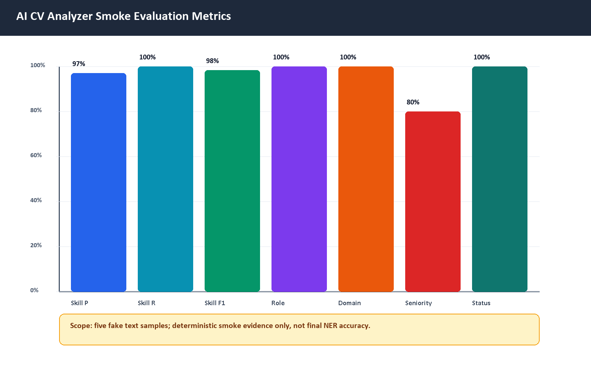

*Figure 30. AI CV Analyzer smoke evaluation metrics.*


## 8.16 Job Miner Evaluation

The AI Job Miner is evaluated in more detail in Chapter 7. This testing chapter records only validation outcomes: syntax compilation, the AI Job Miner pytest run when available, Docker Compose wiring, health checks when the stack is running, import validation, and admin diagnostics evidence. Because external job sources can change, throttle, or require keys, long-term data quality evaluation should be repeated near the final defense and should not be replaced by source-template counts.

## 8.17 Application Tracker Evaluation

The application tracker was evaluated by saving a selected job to the tracker and loading the Applications page. The screenshot shows saved opportunity state. Backend tests also include application tracker behavior.

## 8.18 Admin Dashboard Evaluation

Admin login and admin dashboard access were tested with the demo admin account. The admin dashboard, admin jobs, admin sources, and admin target roles pages were captured. The dashboard displayed 22 users, 209 imported jobs, 9 active sources, and 13 target roles at capture time.

## 8.19 Performance Observations

The local Docker stack is heavy because it runs frontend, backend, multiple Laravel workers, MySQL, MinIO, two Python AI services, Prometheus, and Grafana. Initial full build can exceed a short command timeout on a Windows laptop. Once images are built, targeted service startup and HTTP checks are practical for a graduation demo.

## 8.20 Evaluation Limitations

- The AI CV Analyzer pytest suite was not executed because pytest was absent in that container.
- The browser CV upload remains a smoke test, and the mini dataset is synthetic rather than statistically representative.
- The AI CV Analyzer training notebook and exported Colab PDF were inspected, but full model training was not rerun because the cleaned training dataset and external generation keys are not committed and the workflow is designed for Colab GPU execution.
- The Colab metrics are recorded training-run evidence on the notebook split, not a production benchmark on a large real-world CV dataset.
- The AI CV Analyzer smoke evaluation uses five deterministic text samples and does not measure the transformer NER model weights.
- The recommendation score shown in screenshots is an estimated local demo output.
- External scraping reliability depends on source availability and changing website/API behavior.
- Production security, privacy, and performance audits remain future work.

## 8.21 Summary of Results

| Area | Command or Scenario | Result | Evidence |
|---|---|---|---|
| Docker config | `docker compose -f docker-compose.yml -f docker-compose.prod.yml config --quiet` | Passed | Final cleanup command output |
| Docker stack | `docker desktop start`; `docker compose up -d`; `docker compose ps` | Running; main app containers healthy after startup settled | Service availability evidence |
| Backend routes | `php artisan route:list` | Previously passed, 131 routes | Earlier validation evidence retained |
| Backend tests | `php artisan test` | Previously passed, 39 tests, 297 assertions | Earlier validation evidence retained; backend code unchanged in cleanup pass |
| Frontend lint | ESLint | Previously passed, 9 warnings, 0 errors | Earlier validation evidence retained; frontend code unchanged in cleanup pass |
| Frontend build | Vite build | Previously passed, 2904 modules transformed | Earlier validation evidence retained; frontend code unchanged in cleanup pass |
| AI Job Miner tests | `docker compose exec -T ai-job-miner python -m pytest` | Passed, 75 tests, 1 warning | Fresh container command output |
| AI Job Miner demo scrape | Protected `/scrape` call with demo/local source | SUCCESS; previewed 3, stored 3, failed URLs 0; smoke rows cleaned afterward | Validates demo adapter plus Laravel import path, not queue status polling |
| AI CV Analyzer syntax | `python -m compileall ai-cv-analyzer` | Passed with non-fatal `.pytest_cache` listing warning | Final cleanup command output |
| AI CV Analyzer pytest | Not rerun | Skipped in cleanup pass | Colab/smoke evidence retained separately |
| HTTP probes | `/api/health`, `/api/ready`, `/status`, `:8003/health`, `:8000/` | 200 responses after Docker startup settled | Service availability only, not external scraping success |

*Table 49. Automated validation results.*

| Test ID | Module | Scenario | Status | Evidence |
|---|---|---|---|---|
| M-01 | Authentication | Register demo user | Passed | Register screenshot/API output |
| M-02 | Authentication | Login student | Passed | Figure 34 |
| M-03 | CV upload | Upload valid PDF | Passed | Figures 35-37 |
| M-04 | CV upload | Invalid file handling | Not Run Manual | Backend validation tests |
| M-05 | Recommendations | Open jobs page after CV | Passed | Figure 38 |
| M-06 | Gap analysis | Analyze selected job | Passed | Figure 40 |
| M-07 | Tracker | Save job | Passed | Figure 41 |
| M-08 | Admin | Login admin and open dashboard | Passed | Figure 44 |
| M-09 | Admin sources | Open diagnostics | Passed | Figure 46 |
| M-10 | Status | Open system status page | Passed | Figure 43 |

*Table 50. Manual functional evaluation matrix.*

| Test ID | Expected vs Actual Observation |
|---|---|
| M-01 | Expected user creation and token return; actual user was created with an accepted Gmail-style address. |
| M-02 | Expected dashboard access after login; actual dashboard loaded. |
| M-03 | Expected CV acceptance and parsing; actual upload parsed successfully. |
| M-04 | Expected validation error for invalid file; actual manual browser repetition was not run because backend validation/tests already cover the rule. |
| M-05 | Expected recommendations with estimated matches; actual jobs page loaded. |
| M-06 | Expected match and skill breakdown; actual gap page loaded. |
| M-07 | Expected saved job in tracker; actual application page loaded with saved item. |
| M-08 | Expected admin-only dashboard; actual dashboard visible after admin login. |
| M-09 | Expected source diagnostics; actual diagnostics page visible. |
| M-10 | Expected health UI; actual system status page visible. |

*Table 51. Manual functional observations.*

\pagebreak

# Chapter 9: Security and Privacy

## 9.1 Introduction

Security in CareerCompass is implemented for a graduation/demo context. The system includes meaningful controls, but it should not be presented as production-grade without future hardening, legal review, and operational security work.

## 9.2 Authentication and Authorization

User authentication uses token-based API access through Laravel. Laravel Sanctum supports API token and SPA authentication use cases [2]. CareerCompass stores an auth token in the browser and attaches it to API requests. Authorization is role-aware: student routes require authentication, while admin routes require the admin role. Authentication security should follow established password and session guidance in production [28].

## 9.3 Admin Access Control

Admin access is enforced server-side by admin middleware. Frontend route protection improves user experience, but the backend check is the important control. The demo admin account is generated by a seeder and should be changed or disabled in any non-demo environment.

## 9.4 CV File Privacy

CV files contain personal data. CareerCompass validates file type and size, stores files privately, and avoids public direct file exposure. OWASP's file upload guidance emphasizes validation, restricted storage, and safe handling [27].

## 9.5 Private Storage and Signed Downloads

Uploaded CV files are stored through private storage and accessed through signed or temporary URLs. MinIO/S3-compatible storage supports object-based file storage and access control patterns [9]. The graduation demo should still avoid uploading real sensitive CVs unless the environment is controlled.

The model-training workflow is intentionally documented separately from runtime CV processing. Synthetic training snippets may be generated through Google AI developer tooling [34], [35], but real student CV uploads should not be sent to external AI APIs without explicit consent, a privacy notice, retention rules, and supervisory approval. In the demonstrated runtime, Laravel sends the uploaded file to the local FastAPI analyzer service and stores the file privately; the Gemini-based generator is a training-support script, not the normal CV-upload path.

## 9.6 Internal Service Tokens

Scraper import routes use a service token middleware. This reduces accidental public ingestion, but service tokens must be rotated, stored securely, and monitored in production.

## 9.7 Payload and File Validation

Laravel form requests validate registration, login, CV upload, applications, and profile updates. File validation includes MIME type, extension, and size checks. Validation reduces risk but does not replace malware scanning, deep file inspection, or content disarm in production.

## 9.8 Logging and Request IDs

The API client attaches request IDs, and backend logging records important events such as CV processing status and AI gateway errors. For production, logs should avoid sensitive CV content and should be retained according to a privacy policy.

\pagebreak

## 9.9 Demo Security Limitations

| Area | Current Demo Control | Production Hardening Needed |
|---|---|---|
| Admin account | Demo seeder account | Secret rotation, SSO/MFA, audit logs |
| CV files | Private storage and signed URLs | Malware scanning, retention policy, consent model |
| Tokens | Bearer tokens | Token rotation, secure cookie strategy, revocation review |
| Scraper service | Internal token | Secret manager, network isolation, rate limits |
| Monitoring | Local Prometheus/Grafana | Auth, TLS, dashboard access control |
| Privacy | Local demo posture | Legal review, privacy notice, data minimization |

*Table 52. Security and privacy controls.*

## 9.10 Future Production Hardening

Future work should include HTTPS-only deployment, secure cookie/session strategy, administrator MFA, centralized secrets management, object scanning, retention policies, audit logging, rate-limit review, CSRF/CORS review, dependency vulnerability scanning, and a privacy impact assessment.

\pagebreak

# Chapter 10: Conclusion and Future Work

## 10.1 Conclusion

CareerCompass demonstrates a practical AI-assisted career guidance workflow for a graduation project. It integrates CV parsing, profile normalization, skill extraction, imported job records, estimated recommendation, gap analysis, application tracking, admin diagnostics, and containerized deployment.

## 10.2 Project Achievements

- Built a working multi-service web application with frontend, backend, AI services, database, object storage, proxy, and monitoring.
- Implemented student authentication, dashboard, CV upload, profile view, jobs, gap analysis, and application tracking.
- Implemented admin dashboard, job management, source diagnostics, and target role management.
- Documented the AI CV Analyzer runtime architecture, optional local NER artifact path, synthetic data-generation workflow, and Colab training notebook.
- Documented the AI Job Miner runtime architecture, queue flow, source management, import/deduplication logic, failed URL handling, and ethical scraping boundaries.
- Added tests and validation commands across backend, frontend, Python services, Docker, and HTTP probes.
- Captured browser screenshots from the running local system.
- Generated a formal report with diagrams, references, and evaluation notes.

## 10.3 Educational Value

The project demonstrates practical learning in software architecture, service decomposition, secure file handling, API design, database schema design, frontend state management, AI service integration, testing, Docker operations, monitoring, and academic documentation.

## 10.4 Current Limitations

- The system is a graduation/demo platform and not a production product.
- Recommendation and gap analysis outputs are estimates.
- AI evaluation needs larger labeled datasets, committed training artifacts, per-label reports, and repeatable model scoring.
- The exported NER model artifact path is supported by the runtime. The repository includes the exported Colab PDF with recorded overall NER metrics, but it does not include the cleaned dataset and model weights required to rerun the same training experiment from repository files alone.
- The Colab PDF records overall NER training metrics, but the final labeled NER dataset was not available in committed evidence, so label distribution and final per-label NER precision/recall/F1 were not claimed.
- OCR and PDF text-recovery quality can affect scanned CVs, image-heavy layouts, multi-column documents, and unusual fonts.
- Synthetic training examples may not represent all real student CV styles, Arabic/multilingual CVs, or informal job-market wording.
- External scraping sources can be unstable, require keys, change page structure, enforce rate limits, or impose terms that must be reviewed before use.
- The AI CV Analyzer container needs pytest installed to run its test suite.
- Security and privacy controls need production hardening before real deployment.

## 10.5 Future Work

- Add a larger CV/job evaluation dataset with manual labels.
- Add a reproducible NER evaluation pipeline that runs on a fixed labeled test set and records per-label precision, recall, and F1.
- Store model cards, dataset cards, and training-run summaries for each exported model artifact.
- Add a privacy-preserving workflow for any future human-reviewed real CV dataset.
- Improve Arabic/multilingual parsing, OCR, and field extraction.
- Expand the role taxonomy, skill aliases, and labor-market evidence with periodic review.
- Add human-in-the-loop review for high-impact guidance and ambiguous CV parsing results.
- Improve skill normalization through reviewed aliases and false-positive checks.
- Add production-grade authentication and administrator controls.
- Add malware scanning and retention policies for uploaded CV files.
- Improve recommendation explanations and calibration.
- Strengthen job-mining evaluation with reproducible source-health checks, canonical source IDs, data freshness rules, and targeted failed-URL reprocessing.
- Add automated browser end-to-end tests.
- Extend CI to run all containerized test suites consistently.
- Improve observability dashboards and alerting.
- Add deployment documentation for a secure cloud environment.

## 10.6 Final Remarks

CareerCompass is an original graduation project that connects academic software engineering requirements with a practical career guidance problem. Its strongest value is the integration of many realistic system parts into one demonstrable workflow, while preserving honest language about limitations and future production work.

\pagebreak

# References

[1] Laravel, "Laravel 12.x Documentation," Laravel, 2026. [Online]. Available: https://laravel.com/docs/12.x. Accessed: May 29, 2026.
[2] Laravel, "Laravel Sanctum," Laravel, 2026. [Online]. Available: https://laravel.com/docs/12.x/sanctum. Accessed: May 29, 2026.
[3] Laravel, "Queues," Laravel, 2026. [Online]. Available: https://laravel.com/docs/12.x/queues. Accessed: May 29, 2026.
[4] Meta Open Source, "Quick Start - React," React Documentation, 2026. [Online]. Available: https://react.dev/learn. Accessed: May 29, 2026.
[5] Vite, "Getting Started," Vite Documentation, 2026. [Online]. Available: https://vite.dev/guide/. Accessed: May 29, 2026.
[6] FastAPI, "FastAPI Documentation," FastAPI, 2026. [Online]. Available: https://fastapi.tiangolo.com/. Accessed: May 29, 2026.
[7] Python Software Foundation, "Python 3 Documentation," Python, 2026. [Online]. Available: https://docs.python.org/3/. Accessed: May 29, 2026.
[8] Oracle, "MySQL 8.0 Reference Manual," MySQL Documentation, 2026. [Online]. Available: https://dev.mysql.com/doc/refman/8.0/en/. Accessed: May 29, 2026.
[9] MinIO, "MinIO AIStor Documentation," MinIO Documentation, 2026. [Online]. Available: https://docs.min.io/aistor/. Accessed: May 29, 2026.
[10] Docker, "What is a Container?," Docker Resources, 2026. [Online]. Available: https://www.docker.com/resources/what-container/. Accessed: May 29, 2026.
[11] Docker, "Docker Compose," Docker Documentation, 2026. [Online]. Available: https://docs.docker.com/compose/. Accessed: May 29, 2026.
[12] Nginx, "nginx Documentation," nginx, 2026. [Online]. Available: https://nginx.org/en/docs/. Accessed: May 29, 2026.
[13] Prometheus, "Overview," Prometheus Documentation, 2026. [Online]. Available: https://prometheus.io/docs/introduction/overview/. Accessed: May 29, 2026.
[14] Grafana Labs, "Grafana OSS and Enterprise," Grafana Documentation, 2026. [Online]. Available: https://grafana.com/docs/grafana/latest/. Accessed: May 29, 2026.
[15] GitHub, "GitHub Actions Documentation," GitHub Docs, 2026. [Online]. Available: https://docs.github.com/en/actions. Accessed: May 29, 2026.
[16] MDN Web Docs, "HTTP: Hypertext Transfer Protocol," MDN, 2026. [Online]. Available: https://developer.mozilla.org/en-US/docs/Web/HTTP. Accessed: May 29, 2026.
[17] Scrapy, "Scrapy Documentation," Scrapy, 2026. [Online]. Available: https://docs.scrapy.org/en/latest/. Accessed: May 29, 2026.
[18] Leonard Richardson, "Beautiful Soup Documentation," Beautiful Soup, 2026. [Online]. Available: https://www.crummy.com/software/BeautifulSoup/bs4/doc/. Accessed: May 29, 2026.
[19] scikit-learn, "TfidfVectorizer," scikit-learn Documentation, 2026. [Online]. Available: https://scikit-learn.org/stable/modules/generated/sklearn.feature_extraction.text.TfidfVectorizer.html. Accessed: May 29, 2026.
[20] scikit-learn, "cosine_similarity," scikit-learn Documentation, 2026. [Online]. Available: https://scikit-learn.org/stable/modules/generated/sklearn.metrics.pairwise.cosine_similarity.html. Accessed: May 29, 2026.
[21] UKP Lab, "Sentence Transformers Documentation," Sentence Transformers, 2026. [Online]. Available: https://www.sbert.net/. Accessed: May 29, 2026.
[22] Artifex, "PyMuPDF Documentation," PyMuPDF, 2026. [Online]. Available: https://pymupdf.readthedocs.io/en/latest/. Accessed: May 29, 2026.
[23] jsvine, "pdfplumber," GitHub Repository, 2026. [Online]. Available: https://github.com/jsvine/pdfplumber. Accessed: May 29, 2026.
[24] Jaided AI, "EasyOCR," GitHub Repository, 2026. [Online]. Available: https://github.com/JaidedAI/EasyOCR. Accessed: May 29, 2026.
[25] PHPUnit, "PHPUnit 12.0 Manual," PHPUnit Documentation, 2026. [Online]. Available: https://docs.phpunit.de/en/12.0/. Accessed: May 29, 2026.
[26] pytest, "pytest Documentation," pytest, 2026. [Online]. Available: https://docs.pytest.org/en/stable/. Accessed: May 29, 2026.
[27] OWASP, "File Upload Cheat Sheet," OWASP Cheat Sheet Series, 2026. [Online]. Available: https://cheatsheetseries.owasp.org/cheatsheets/File_Upload_Cheat_Sheet.html. Accessed: May 29, 2026.
[28] OWASP, "Authentication Cheat Sheet," OWASP Cheat Sheet Series, 2026. [Online]. Available: https://cheatsheetseries.owasp.org/cheatsheets/Authentication_Cheat_Sheet.html. Accessed: May 29, 2026.
[29] Martin Fowler and James Lewis, "Microservices," martinfowler.com, 2014. [Online]. Available: https://martinfowler.com/articles/microservices.html. Accessed: May 29, 2026.
[30] scikit-learn, "precision_recall_fscore_support," scikit-learn Documentation, 2026. [Online]. Available: https://scikit-learn.org/stable/modules/generated/sklearn.metrics.precision_recall_fscore_support.html. Accessed: May 29, 2026.
[31] Hugging Face, "Transformers Documentation," Hugging Face Documentation, 2026. [Online]. Available: https://huggingface.co/docs/transformers/index. Accessed: June 6, 2026.
[32] Hugging Face, "Token Classification," Hugging Face Documentation, 2026. [Online]. Available: https://huggingface.co/docs/transformers/tasks/token_classification. Accessed: June 6, 2026.
[33] Hugging Face, "Trainer," Hugging Face Documentation, 2026. [Online]. Available: https://huggingface.co/docs/transformers/main_classes/trainer. Accessed: June 6, 2026.
[34] Google, "Gemini API Documentation," Google AI for Developers, 2026. [Online]. Available: https://ai.google.dev/gemini-api/docs. Accessed: June 6, 2026.
[35] Google, "Google AI Studio," Google AI for Developers, 2026. [Online]. Available: https://ai.google.dev/aistudio. Accessed: June 6, 2026.
[36] Google, "Google Colaboratory FAQ," Google Research, 2026. [Online]. Available: https://research.google.com/colaboratory/faq.html. Accessed: June 6, 2026.
[37] Jacob Devlin, Ming-Wei Chang, Kenton Lee, and Kristina Toutanova, "BERT: Pre-training of Deep Bidirectional Transformers for Language Understanding," arXiv, 2018. [Online]. Available: https://arxiv.org/abs/1810.04805. Accessed: June 6, 2026.
[38] PyTorch, "Dynamic Quantization," PyTorch Tutorials, 2026. [Online]. Available: https://docs.pytorch.org/tutorials/recipes/recipes/dynamic_quantization.html. Accessed: June 6, 2026.
[39] OpenAPI Initiative, "OpenAPI Specification," OpenAPI Documentation, 2026. [Online]. Available: https://spec.openapis.org/oas/latest.html. Accessed: June 7, 2026.
[40] Adzuna, "Adzuna Developer API," Adzuna Developer Portal, 2026. [Online]. Available: https://developer.adzuna.com/. Accessed: June 7, 2026.
[41] IETF, "RFC 9309: Robots Exclusion Protocol," RFC Editor, 2022. [Online]. Available: https://www.rfc-editor.org/rfc/rfc9309. Accessed: June 7, 2026.

\pagebreak

# Appendices

## Appendix A: API Request and Response Examples

This appendix expands the endpoint summary with JSON-oriented examples. The examples are intentionally small and use placeholders such as `Authorization: Bearer <token>`. They document the implemented API shape for examiners and future maintainers; they do not expose real tokens, private CV contents, or production secrets. The format follows an OpenAPI-style request/response documentation pattern [39].

| Group | Example Endpoints | Purpose |
|---|---|---|
| Health | `/api/health`, `/api/ready`, `/api/metrics` | Liveness, readiness, and Prometheus metrics. |
| Auth | `/api/v1/register`, `/api/v1/login`, `/api/v1/logout`, `/api/v1/user` | User identity and token lifecycle. |
| CV | `/api/v1/upload-cv`, `/api/v1/user/skills`, `/api/v1/user/cv-analysis` | CV upload, parsed analysis, and extracted skills. |
| Jobs | `/api/v1/jobs`, `/api/v1/jobs/recommended`, `/api/v1/jobs/{id}`, `/api/v1/jobs/scrape`, `/api/v1/jobs/scrape-if-missing`, `/api/v1/scraping-status/{jobId}` | Job listing, details, recommendations, on-demand scraping, and status polling. |
| Gap Analysis | `/api/v1/gap-analysis/job/{jobId}`, `/api/v1/gap-analysis/role/{roleId}` | Skill comparison and recommendations. |
| Applications | `/api/v1/applications` | Save and update tracked opportunities. |
| Admin | `/api/v1/admin/dashboard/stats`, `/api/v1/admin/dashboard/batch-progress`, `/api/v1/admin/dashboard/failed-urls/{scrapingJobId}`, `/api/v1/admin/dashboard/retry-failures`, `/api/v1/admin/scraping-sources`, `/api/v1/admin/target-roles`, `/api/v1/admin/scraping/run-full` | Admin dashboards, diagnostics, source management, target roles, full runs, and failed URL operations. |
| Internal Scraper | `/api/v1/jobs/import`, `/api/v1/jobs/import/check`, `/api/v1/jobs/import/failed`, `/api/v1/proxies/active` | Service-token protected import, duplicate check, failure report, and proxy routes. |

*Table 53. API endpoint summary.*

### A.1 Student CV Upload Endpoint

Method and URL: `POST /api/v1/upload-cv`

Purpose: Upload a PDF/image CV to Laravel, send it to the local FastAPI AI CV Analyzer, persist successful structured outputs, and return warnings/status for the dashboard.

Request example:

```text
Authorization: Bearer <token>
Content-Type: multipart/form-data

cv=@sample_cv.pdf
```

Successful response example:

```json
{
  "success": true,
  "message": "CV parsed successfully.",
  "parsing_status": "success",
  "analysis_id": 12,
  "skills_count": 4,
  "predicted_role": "Backend Developer",
  "profile_updated": true,
  "retry_available": false,
  "download_url": "https://example.local/api/cv-files/12?signature=...",
  "data": {
    "analysis_id": 12,
    "parsing_status": "success",
    "skills_count": 4,
    "predicted_role": "Backend Developer",
    "warnings": []
  }
}
```

Error response example:

```json
{
  "success": false,
  "message": "The AI engine is currently unavailable. Please try again in a moment.",
  "parsing_status": "error",
  "retry_available": true,
  "warnings": [
    {
      "code": "ai_unavailable",
      "message": "The AI engine could not be reached. No profile data was changed."
    }
  ]
}
```

### A.2 AI Analyzer Parse-CV Endpoint

Method and URL: `POST /api/parse-cv`

Purpose: FastAPI service endpoint that accepts an uploaded CV file and returns the typed parse schema used by Laravel.

Request example:

```text
Content-Type: multipart/form-data

file=@sample_cv.pdf
```

Response example:

```json
{
  "parsing_status": "success",
  "profile": {
    "full_name": "Demo Student",
    "current_title": "Backend Developer",
    "email": "student@example.com"
  },
  "stats": {
    "page_count": 1,
    "word_count": 340,
    "language_hint": "en"
  },
  "skills": {
    "items": [
      {"name": "Laravel", "category": "hard", "confidence_score": 0.65},
      {"name": "Docker", "category": "hard", "confidence_score": 0.65}
    ],
    "confidence_score": 0.65
  },
  "experience": {
    "items": [],
    "confidence_score": 0.0
  },
  "analysis": {
    "predicted_role": "Backend Developer",
    "seniority": "junior",
    "primary_domain": "Backend Development",
    "strengths": [],
    "gaps": [],
    "red_flags": [],
    "confidence_score": 0.65
  },
  "request_id": "example-request-id"
}
```

Error response example:

```json
{
  "detail": "Empty file uploaded."
}
```

### A.3 AI Hybrid Match Endpoint

Method and URL: `POST /api/hybrid-match`

Purpose: Compare CV text/skills with a job description using Layer 3 adaptive matching plus TF-IDF when available.

Request example:

```json
{
  "cv_skills": ["Laravel", "Docker", "MySQL"],
  "cv_text": "Backend developer with Laravel Docker MySQL REST APIs.",
  "job_description": "Junior backend developer required with Laravel, Docker, MySQL, and REST API experience.",
  "job_skills": ["Laravel", "Docker", "MySQL", "REST APIs"]
}
```

Response example:

```json
{
  "hybrid_match_score": 78.4,
  "semantic_match_pct": 82.0,
  "tfidf_score_pct": 73.0,
  "missing_skills": [],
  "formula": "Final = (Adaptive Layer 3 x 60%) + (TF-IDF x 40%)",
  "matching_mode": "hybrid",
  "request_id": "example-request-id"
}
```

Validation error example:

```json
{
  "detail": "cv_text must not be empty."
}
```

### A.4 Recommended Jobs Endpoint

Method and URL: `GET /api/v1/jobs/recommended`

Purpose: Return personalized job recommendations for an authenticated student when CV/profile context exists, otherwise return recent usable jobs.

Request example:

```text
Authorization: Bearer <token>
Accept: application/json
```

Response example:

```json
{
  "success": true,
  "job_title": "Backend Developer",
  "data": [
    {
      "id": 101,
      "title": "Junior Backend Developer",
      "company": "DemoTech",
      "location": "Cairo",
      "source": "demo",
      "match_percentage": 84.5,
      "skills_count": 4
    }
  ],
  "meta": {
    "total": 1,
    "based_on": "Your CV title: Backend Developer"
  }
}
```

### A.5 On-Demand Job Scraping Endpoint

Method and URL: `POST /api/v1/jobs/scrape`

Purpose: Start an authenticated on-demand scraping job for a query. Laravel validates the request, creates a `ScrapingJob`, dispatches the scraping queue worker, and returns a status identifier.

Request example:

```text
Authorization: Bearer <user-token>
Content-Type: application/json
```

```json
{
  "query": "Backend Developer",
  "max_results": 10
}
```

Successful response example:

```json
{
  "success": true,
  "message": "Scraping job started.",
  "scraping_job_id": 42,
  "status": "pending"
}
```

Validation error example:

```json
{
  "message": "The query field is required.",
  "errors": {
    "query": ["The query field is required."]
  }
}
```

### A.6 Scrape If Missing and Status Polling

Method and URL: `POST /api/v1/jobs/scrape-if-missing`

Purpose: Check whether matching stored jobs exist before queueing an external scrape.

Request example:

```json
{
  "job_title": "Laravel Developer",
  "max_results": 10
}
```

Existing-data response example:

```json
{
  "success": true,
  "data_exists": true,
  "message": "Jobs already exist for this title.",
  "jobs_count": 5
}
```

Queued response example:

```json
{
  "success": true,
  "data_exists": false,
  "scraping_job_id": 43,
  "status": "pending",
  "poll_url": "/api/v1/scraping-status/43"
}
```

Method and URL: `GET /api/v1/scraping-status/{jobId}`

Status response example:

```json
{
  "success": true,
  "status": "completed",
  "scraping_job_id": 43,
  "jobs_found": 8,
  "jobs_stored": 5,
  "jobs_duplicated": 3,
  "discovered_count": 8,
  "failed_count": 0,
  "processing_time_ms": 12640,
  "data": [
    {
      "id": 101,
      "title": "Junior Backend Developer",
      "company": "Example Co"
    }
  ]
}
```

### A.7 Internal Scraper Duplicate Check and Import

These Laravel endpoints are protected by `scraper.token` and `throttle:scraper`. In the current middleware, the scraper supplies `Authorization: Bearer <internal-token>`.

Method and URL: `POST /api/v1/jobs/import/check`

Request example:

```text
Authorization: Bearer <internal-token>
Content-Type: application/json
```

```json
{
  "url": "https://example.com/jobs/123"
}
```

Response example:

```json
{
  "exists": false
}
```

Method and URL: `POST /api/v1/jobs/import`

Request example:

```json
{
  "title": "Junior Backend Developer",
  "company": "Example Co",
  "location": "Remote",
  "description": "Build APIs with Laravel and MySQL.",
  "requirements": "Laravel, MySQL, REST APIs",
  "url": "https://example.com/jobs/123",
  "source": "remotive",
  "scraping_source_id": 5,
  "skills": ["Laravel", "MySQL", "REST APIs"],
  "work_type": "remote",
  "job_type": "full_time"
}
```

Response example:

```json
{
  "success": true,
  "job_id": 101,
  "created": true
}
```

### A.8 Failed URL Reporting, Proxies, and Admin Scraping

Method and URL: `POST /api/v1/jobs/import/failed`

Purpose: Store a failed source URL for diagnostics and retry visibility.

Request example:

```json
{
  "url": "https://example.com/jobs/broken",
  "scraping_source_id": 5,
  "scraping_job_id": 43,
  "error_message": "Timeout while fetching public job detail page."
}
```

Response example:

```json
{
  "success": true
}
```

Method and URL: `GET /api/v1/proxies/active`

Purpose: Return active proxy definitions to the scraper only when proxy configuration is enabled and authorized.

Admin source diagnostic request:

```text
Authorization: Bearer <admin-token>
POST /api/v1/admin/scraping-sources/5/test
```

Admin full scraping request:

```text
Authorization: Bearer <admin-token>
POST /api/v1/admin/scraping/run-full
```

Example full-run response shape:

```json
{
  "success": true,
  "batch_id": "example-batch-id",
  "planned_jobs": 12,
  "skipped_sources": []
}
```

### A.9 Gap Analysis Endpoint

Method and URL: `GET /api/v1/gap-analysis/job/{jobId}`

Purpose: Compare the authenticated student's extracted skills/profile with one job and return matched skills, missing skills, recommendations, and CV-analysis context.

Request example:

```text
Authorization: Bearer <token>
Accept: application/json
```

Response example:

```json
{
  "success": true,
  "data": {
    "job": {
      "id": 101,
      "title": "Junior Backend Developer",
      "company": "DemoTech"
    },
    "analysis": {
      "match_percentage": 80.0,
      "match_level": "Good Match",
      "matched_skills": ["Laravel", "Docker", "MySQL"],
      "missing_skills": ["Kubernetes"]
    },
    "recommendations": [
      "Practice Kubernetes deployment basics before applying."
    ],
    "cv_analysis": {
      "parsing_status": "success",
      "completeness_score": 75,
      "strengths": [],
      "gaps": [],
      "red_flags": []
    }
  }
}
```

Error response example:

```json
{
  "success": false,
  "message": "Upload a CV first so the system can extract skills and profile data."
}
```

### A.10 Health and Readiness Endpoints

Methods and URLs: `GET /api/health`, `GET /api/ready`

Purpose: Confirm whether Laravel is alive and whether dependent services are ready.

Health response example:

```json
{
  "success": true,
  "status": "ok",
  "service": "CareerCompass API",
  "request_id": "example-request-id"
}
```

Readiness response example:

```json
{
  "success": true,
  "status": "ready",
  "checks": {
    "database": {"ok": true},
    "cache": {"ok": true},
    "ai": {"ok": true, "status": 200},
    "scraper": {"ok": true, "status": 200}
  },
  "request_id": "example-request-id"
}
```

## Appendix B: Quick Start Guide for Examiners

This guide is intended for a local graduation/demo run. It assumes Docker Desktop is installed and running. It should not be read as a production deployment guide.

### B.1 Start the Stack

```powershell
git clone https://github.com/YousefAlTohamy/CareerCompass.git
cd CareerCompass
cp .env.example .env
docker compose -f docker-compose.yml -f docker-compose.prod.yml up -d --build
docker compose exec backend-api php artisan migrate --seed
```

### B.2 Useful URLs

- Frontend: `http://localhost`
- Backend health: `http://localhost/api/health`
- Backend readiness: `http://localhost/api/ready`
- AI Job Miner health, when the stack is running: `http://localhost:8003/health`
- System status page: `http://localhost/status`
- Admin dashboard: `http://localhost/admin/dashboard`
- Grafana, if exposed by the local compose stack: `http://localhost:3000`

### B.3 Demo Accounts and Flow

The demo admin account is seeded from environment variables. The current example values are:

| Variable | Demo Value |
|---|---|
| `DEMO_ADMIN_EMAIL` | `careercompassadmin@gmail.com` |
| `DEMO_ADMIN_PASSWORD` | `CareerCompassAdmin2026` |

*Demo admin environment values.*

Student demo flow:

1. Open `http://localhost`.
2. Register a new student account or log in with an existing demo student.
3. Upload a small PDF CV from the dashboard.
4. Review dashboard readiness signals, extracted role, extracted skills, and profile page.
5. Open Jobs and review recommended jobs.
6. Open Gap Analysis for a selected job and review matched/missing skills.
7. Save a job to Applications.
8. Log in as the demo admin and review dashboard, jobs, sources, and target roles.

### B.4 Validation Commands

```powershell
docker compose config --quiet
docker compose -f docker-compose.yml -f docker-compose.prod.yml config --quiet
docker compose exec backend-api php artisan test
cd frontend
npm run lint
npm run build
```

Documentation/evaluation checks:

```powershell
python docs/graduation-book/evaluation/run_mini_evaluation.py
python docs/graduation-book/evaluation/run_ai_cv_analyzer_smoke_eval.py
python docs/graduation-book/scripts/generate_graduation_book.py
python -m compileall ai-job-miner
python -m compileall ai-cv-analyzer
cd ai-job-miner
python -m pytest
cd ..
```

### B.5 Troubleshooting Notes

- If the frontend appears stale after rebuild, hard-refresh the browser or rebuild the frontend/nginx containers.
- If Docker startup is slow, wait for MySQL, MinIO, Laravel workers, Python AI services, Prometheus, and Grafana to settle before judging readiness.
- AI model weights are not committed to Git; the runtime supports `ai-cv-analyzer/models/ner_weights/career_compass_ner_final` when supplied locally.
- NER training requires a cleaned labeled dataset and external API keys for synthetic-data generation; those are not included in the repository.
- Demo admin credentials should be changed for any non-demo environment.

## Appendix C: Database Tables Summary

| Table | Purpose |
|---|---|
| users | Authentication identity, role, and banned status. |
| user_profiles | Student profile details and contact metadata. |
| skills | Canonical skill catalog. |
| user_skills | User-to-skill relationship and proficiency metadata. |
| user_experiences | Extracted or entered experience records. |
| cv_analyses | CV parsing status, predicted role, confidence, file metadata, strengths, gaps, and warnings. |
| job_postings | Imported/demo job data. |
| job_skills | Job-to-skill relationship and requirement metadata. |
| applications | Saved opportunities and status tracking. |
| scraping_sources | Admin-configured job source definitions. |
| target_job_roles | Target role list for scraping and market exploration. |
| scraping_jobs | Scraping batch execution state. |
| scraping_failed_urls | Failed source URL diagnostics and retry marker records. |
| scraping_proxies | Optional active proxy definitions protected by internal scraper token. |

*Table 54. Database tables summary.*

## Appendix D: Docker Services Summary

| Service | Role |
|---|---|
| nginx | Public gateway and reverse proxy. |
| frontend | React/Vite web UI container. |
| backend-api | Laravel API runtime. |
| backend-worker variants | Queue processing for default, high, AI, emails, and scraping work. |
| backend-scheduler | Scheduled Laravel commands. |
| db | MySQL database. |
| minio | S3-compatible CV object storage. |
| ai-cv-analyzer | FastAPI CV parsing service. |
| ai-job-miner | FastAPI job mining service. |
| prometheus | Metrics collection. |
| grafana | Metrics visualization. |

*Table 55. Docker services summary.*

## Appendix E: Screenshots

The screenshot set was reviewed during this pass. Some dashboard states are similar, but they document different examiner-visible states: before CV upload, upload UI, and after analysis. No screenshot merge was performed because combining them would reduce traceability and could disturb existing figure references in the generated List of Figures.

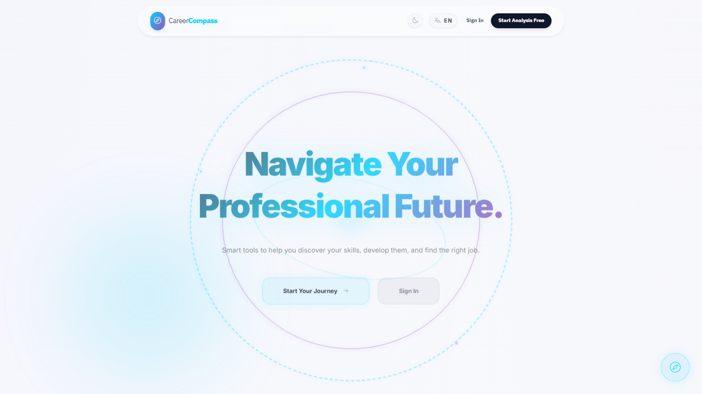

*Figure 31. Home page.*
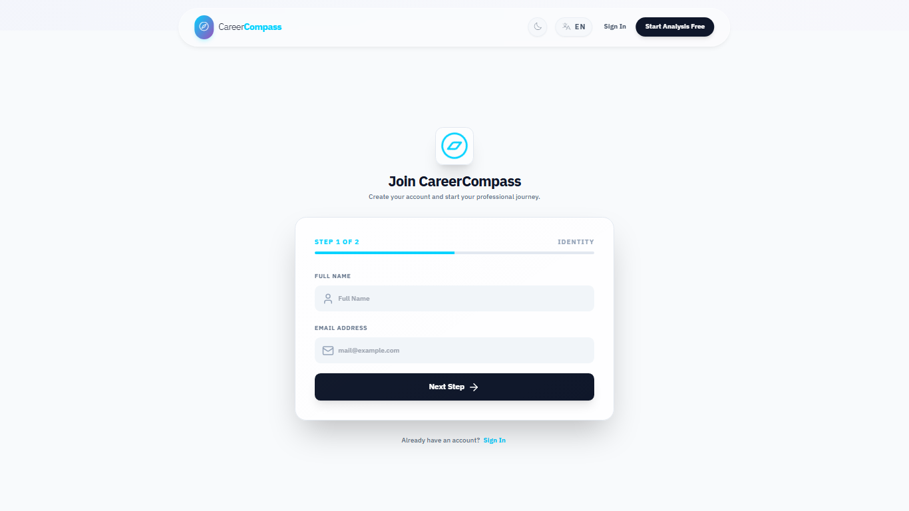

*Figure 32. Register page.*
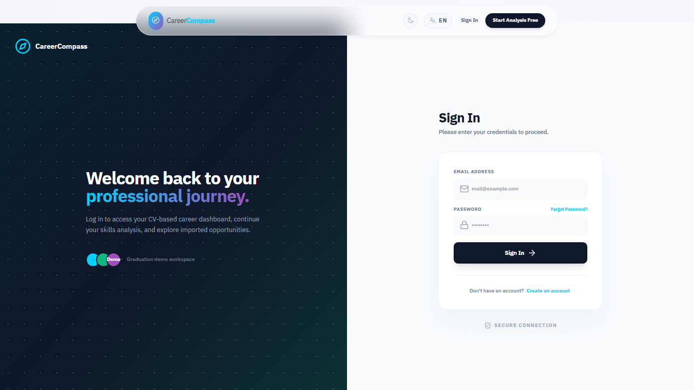

*Figure 33. Login page.*


*Figure 34. Student dashboard before CV upload.*


*Figure 35. CV upload user interface.*


*Figure 36. Dashboard after successful CV parsing.*


*Figure 37. Extracted profile and skills page.*


*Figure 38. Jobs recommendations page.*
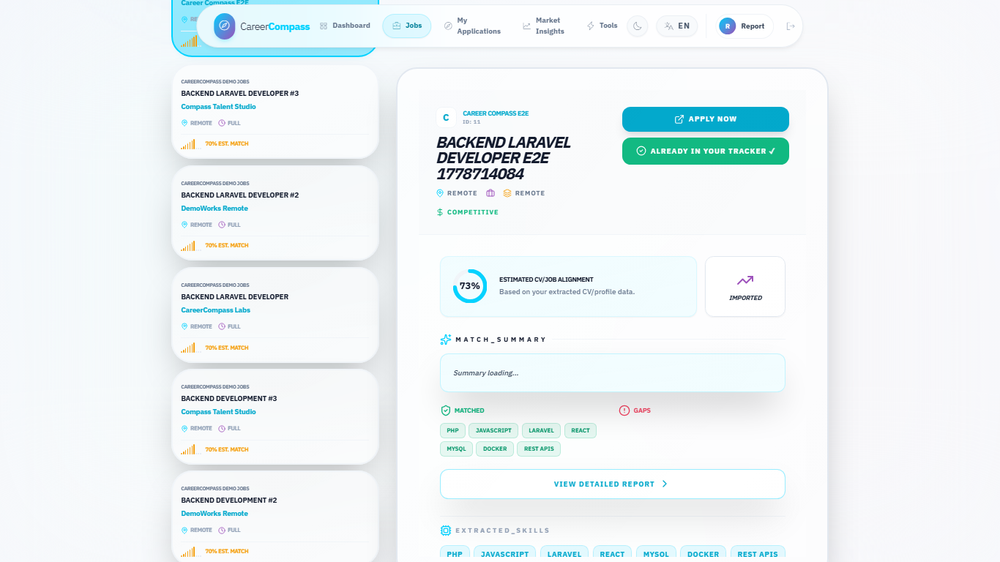

*Figure 39. Job detail and inline gap panel.*


*Figure 40. Gap analysis page.*


*Figure 41. Applications tracker page.*


*Figure 42. Tools Hub preview page.*


*Figure 43. System status page.*


*Figure 44. Admin dashboard.*
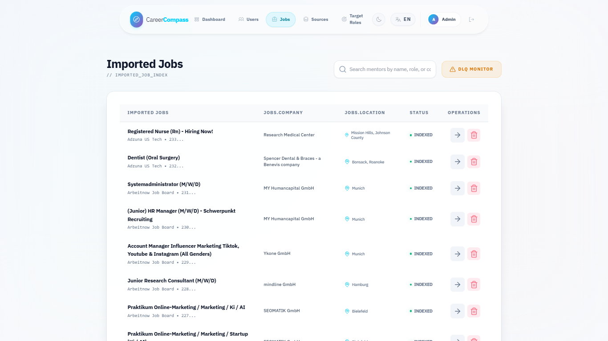

*Figure 45. Admin jobs page.*


*Figure 46. Admin sources diagnostics page.*


*Figure 47. Admin target roles page.*


*Figure 48. Docker services evidence.*


*Figure 49. Validation command evidence.*

## Appendix F: Test Cases

The manual test matrix in Chapter 8 should be repeated before final submission. Additional recommended tests include invalid CV uploads, banned user login, expired signed download URLs, failed AI service behavior, scraper token rejection, admin route rejection for normal users, and browser checks on a clean database.

The mini dataset evaluation files are:

- `evaluation/mini_cv_dataset.json`
- `evaluation/mini_jobs_dataset.json`
- `evaluation/expected_labels.json`
- `evaluation/run_mini_evaluation.py`
- `evaluation/mini_evaluation_results.json`
- `evaluation/mini_evaluation_summary.md`
- `evaluation/ai_cv_analyzer_smoke_samples.json`
- `evaluation/run_ai_cv_analyzer_smoke_eval.py`
- `evaluation/ai_cv_analyzer_smoke_results.json`
- `evaluation/ai_cv_analyzer_smoke_summary.md`

## Appendix G: GitHub Actions / CI Summary

The repository contains GitHub Actions workflow definitions. After the draft PR is opened, reviewers should inspect PR checks, rerun failed jobs if needed, and confirm that branch protection expectations are satisfied before merging. A CI screenshot was not embedded in this generated report because live PR checks were not available until after branch push.

## Appendix H: Demo Script

1. Start Docker Desktop.
2. Run `docker compose -f docker-compose.yml -f docker-compose.prod.yml up -d --build`.
3. Open `http://localhost`.
4. Register or login as a student.
5. Upload a sample PDF CV from the dashboard.
6. Review parsed profile and skills.
7. Open Jobs and select a recommendation.
8. Open Gap Analysis and explain matched/missing skills.
9. Save the job to Applications.
10. Login as the demo admin.
11. Open Admin Dashboard, Jobs, Sources, and Target Roles.
12. Open System Status and explain health checks.
13. Discuss limitations and future work honestly.

## Appendix I: AI CV Analyzer Deep Inventory

This appendix summarizes the code audit that supports Sections 5.5, Chapter 6, and Sections 8.8-8.11. The detailed companion notes are stored in `docs/graduation-book/model-analysis/` and should be kept with the generated book artifacts.

### I.1 Runtime Call Path

1. Laravel receives the CV upload and stores the file privately.
2. Laravel sends the uploaded file to the FastAPI analyzer `/api/parse-cv` endpoint.
3. `main.py` chooses image or PDF handling and wraps processing in timeout/error fallbacks.
4. `CVOrchestrator` extracts ordered text, triggers OCR fallback when needed, segments sections, runs NER, extracts contacts and dates, canonicalizes skills, and validates the strict output schema.
5. Layer 2 enriches the result with domain, seniority, and skill-category classification.
6. Laravel persists normalized profile, skills, experiences, and analysis metadata.
7. Recommendations and gap analysis reuse the stored profile together with Layer 3 matching and backend services.

### I.2 Function Inventory Summary

| Area | Classes and Functions Audited | Main Purpose |
|---|---|---|
| `main.py` | `_get_orchestrator`, `health_check`, `metrics`, `hybrid_match`, `analyze_cv`, `_process_with_timeout`, `process_file`, `_timeout_result`, `_error_result` | API endpoints, service lifecycle, timeout/fallback behavior, and hybrid match composition. |
| Layer 1 NER/contact/sections | `AdvancedNEREngine`, `extract_contacts`, `SemanticSegmenter`, `DataCanonicalizer`, `ExperienceEngine`, spatial/OCR helpers | Converts raw CV text into profile, skills, experience, and confidence-style structured data. |
| Layer 2 classification | `ClassificationOrchestrator`, `DomainEngine`, `SeniorityEngine`, `SkillEngine`, `load_taxonomy` | Adds domain, seniority, and skill-category interpretation. |
| Layer 3 matching | `SemanticEmbedder`, `IntelligentMatcher`, `ConstraintValidator`, `FitAnalysisGenerator`, `JobDescriptionEngine`, `RankingOrchestrator`, `tfidf.match_score` | Produces explainable job-fit scores, penalties, verdicts, and ranking behavior. |
| Training and diagnostics | `generate_tech_dataset.py`, `clean_dataset.py`, `train_ner.ipynb`, `verify_phase*.py`, `test_service_api.py`, `trace_cv.py` | Supports synthetic dataset generation, cleaning, notebook training, phase verification, service tests, and trace output. |

*Table 56. AI CV Analyzer function inventory summary.*

### I.3 Training Summary

The notebook trains a BERT-family token-classification model from `bert-base-cased`, maps character spans to BIO token labels, uses a 90/10 train/evaluation split with seed 42, trains for five epochs with learning rate 2e-5 and batch size 16, computes seqeval precision/recall/F1/accuracy, and exports `career_compass_ner_final`. The exported Colab PDF records overall final-epoch metrics: precision 0.933307, recall 0.940521, F1 0.936900, and accuracy 0.976376. The final cleaned dataset content and model weights are not committed.

### I.4 Generated Dataset Summary

The synthetic dataset script asks Google Gemini tooling to generate varied CV snippets across technical domains, rotates API keys/models from environment variables, includes negative decoys, and writes labeled examples for cleaning. The cleaner normalizes text, deduplicates exact samples, validates spans, and filters malformed or overly broad entities. This supports the training workflow, but it is separate from normal private CV upload processing.

### I.5 Local Artifact and Secrets Boundary

`.env` and `ai-cv-analyzer/models/` are ignored by Git. This protects secrets and avoids committing large model weights. Documentation may mention the runtime path and safe local metadata, but should not imply that the committed repository contains the model binary or private API keys.

## Appendix J: AI Job Miner Deep Inventory

The detailed scraping/job-mining audit files are stored in `docs/graduation-book/job-mining-analysis/`:

- `job_miner_source_inventory.md`
- `job_miner_function_inventory.md`
- `scraping_runtime_flow.md`
- `scraping_api_contracts.md`
- `scraping_evaluation_summary.md`
- `scraping_limitations.md`

These notes support Chapter 7. They summarize actual source adapters, FastAPI endpoints, Laravel queue jobs, import validation, database models, frontend admin integration, API contracts, evaluation boundaries, and ethical limitations without copying large code blocks into the report.
