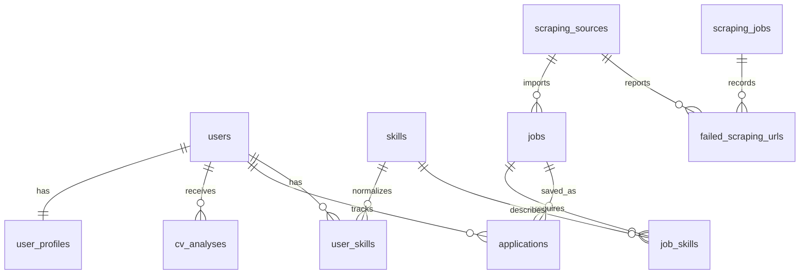

# Database ERD Notes

These notes describe the main CareerCompass entities and relationships for the
graduation report and defense. They intentionally avoid inventing a full column
catalog. Exact columns should be taken from the migrations if a formal ERD image
is prepared.

## Main Entities

| Entity | Graduation-Level Purpose |
| --- | --- |
| `users` | Stores student/admin accounts and authentication identity. |
| `user_profiles` | Stores structured profile details derived from user input and CV analysis. |
| `cv_analyses` | Stores the structured result/status of a CV parsing attempt for a user. |
| `skills` | Stores normalized skill names so matching can compare stable identifiers instead of noisy text. |
| `user_skills` | Pivot table connecting users to normalized skills, with optional confidence/evidence metadata. |
| `jobs` / `job_postings` | Logical job entity. In the project code, the `Job` model is backed by `job_postings`. |
| `job_skills` | Pivot table connecting jobs to normalized required skills and importance metadata. |
| `applications` | Tracks saved opportunities and user application workflow state. |
| `scraping_sources` | Stores configured demo/API/HTML/SPA job sources and their source classification. |
| `scraping_jobs` | Tracks scraping runs, status, counts, and execution metadata. |
| `failed_scraping_urls` / `scraping_failed_urls` | Tracks failed or blocked scraping URLs for diagnostics. |
| `target_job_roles` | Stores target roles used for market collection, recommendation context, or admin-managed scraping targets. |

## Relationship Notes

- One `user` has one `user_profile`.
- One `user` can have many `cv_analyses`.
- One `user` can have many `applications`.
- One `user` can have many `skills` through `user_skills`.
- One `skill` can belong to many users through `user_skills`.
- One `job` can have many `skills` through `job_skills`.
- One `skill` can belong to many jobs through `job_skills`.
- One `application` belongs to one `user`.
- One `application` can reference one `job`.
- One `job` can reference one `scraping_source`.
- One `scraping_source` can have many imported `jobs`.
- One `scraping_source` can have many failed URL records.
- One `scraping_job` can have many failed URL records.
- `target_job_roles` provide role targets for scraping and recommendation
  workflows, but they should be explained as a support entity rather than the
  central user profile.

## ERD Sketch

If the diagram is converted into a formal ERD, use the project's actual table
names from migrations. In particular, the logical `jobs` entity is implemented
as `job_postings`, and the failed URL table may appear as
`scraping_failed_urls` in the codebase.

## Why Normalization Matters

Skill normalization is central to the project. Without it, the system might
treat equivalent skills as different strings, for example:

- `JS`, `JavaScript`, and `Javascript`.
- `React.js`, `ReactJS`, and `React`.
- `SQL`, `MySQL`, and database-specific skill labels when they need different
  matching behavior.

Normalization matters for:

- Skill matching: user skills and job requirements can be compared through a
  stable `skills` entity and pivot tables.
- Gap analysis: missing skills can be identified more reliably when job skills
  and user skills use the same canonical records.
- Recommendations: ranking is more meaningful when overlap is based on
  normalized identifiers rather than duplicated noisy skill strings.
- Data quality: repeated scraped jobs and AI-extracted skills can be cleaned
  into a controlled set of terms.
- Explainability: the UI can show matched and missing skills in a consistent
  vocabulary.

The database design therefore supports both the user-facing workflow and the
academic explanation of the matching algorithm.
