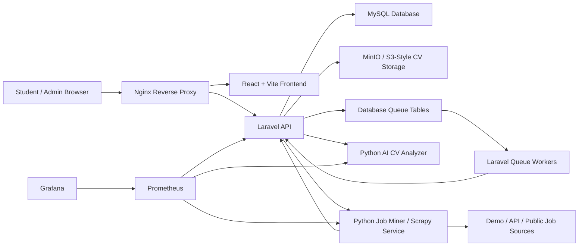
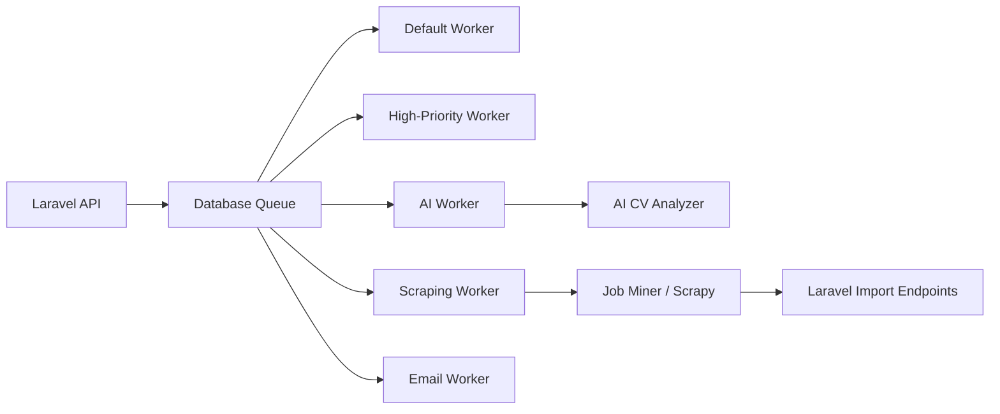
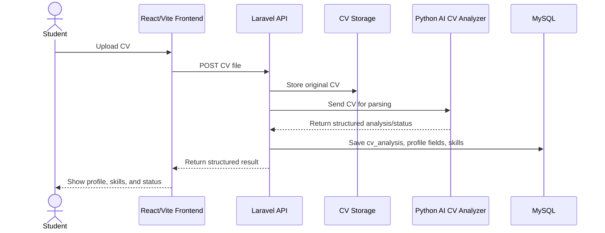
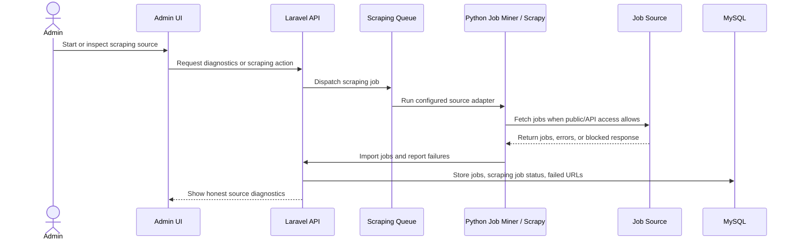

# System Architecture Overview

CareerCompass is a Docker-first distributed graduation project. Its value is not
only that users can upload a CV and see jobs; the project demonstrates how a
modern web system can connect an API, frontend, AI/NLP services, scraping
pipeline, relational database, queue workers, object storage, and monitoring.

This document describes the architecture in graduation-friendly terms. It is not
a production deployment plan.

## High-Level Architecture

## Service Responsibilities

| Service | Responsibility |
| --- | --- |
| React/Vite frontend | Presents the public site, user dashboard, CV upload flow, jobs, recommendations, gap analysis, applications tracker, and admin pages. |
| Laravel API | Owns authentication, user data, CV upload orchestration, persistence, recommendations, gap-analysis endpoints, application tracking, admin diagnostics, and integration with Python services. |
| Python AI CV Analyzer | Extracts structured information from CVs, including skills, role/domain signals, seniority, parsing status, and analysis metadata. It also supports matching-related AI behavior where integrated. |
| Python Job Miner/Scrapy service | Runs job-source collection and import flows, including reliable API/demo sources and public sources that may be blocked. |
| MySQL | Stores users, profiles, CV analyses, normalized skills, jobs, applications, scraping sources, scraping jobs, failed URLs, and related metadata. |
| Queue workers | Process background work such as scraping, AI-related tasks, emails, and other queued jobs without blocking the main API request path. |
| MinIO/S3-style storage | Demonstrates private object storage for CV files and signed/access-controlled file handling. |
| Prometheus/Grafana | Provide observability for service health, metrics, and defense-time diagnostics. |

## Data Flow

1. The browser sends requests to the React/Vite frontend and Laravel API through
   Nginx.
2. Laravel authenticates users and stores structured application data in MySQL.
3. CV files are stored using local or S3-style storage depending on the demo
   configuration.
4. Laravel sends CVs to the Python AI CV Analyzer for parsing.
5. Analyzer output is normalized into user profile, CV analysis, skills, and
   related records.
6. Jobs are read from the database, imported from scraper output, or created as
   demo baseline data.
7. Matching and gap-analysis views compare user skills/profile signals with job
   requirements.
8. Admin diagnostics expose source health, scraping results, failed URLs, and
   supporting system status.

## Queue Flow

Queues help demonstrate that CareerCompass is not a single synchronous script.
They separate user-facing API requests from background tasks that may be slower
or less predictable.

The graduation explanation should focus on design intent:

- Long-running scraping does not need to block normal browsing.
- AI-related work can be separated from normal API requests.
- Failed or slow background jobs can be monitored and diagnosed.
- Queue lanes show awareness of workload separation and system design.

## CV Analysis Sequence

Important defense points:

- The analyzer output is stored as structured data, not only displayed once.
- Parsing status matters because the system must handle successful parsing,
  fallbacks, low-text CVs, timeouts, and errors honestly.
- Extracted skill strings should be normalized before matching.

## Job Recommendation Sequence

1. The user has a profile and extracted skills from the CV analysis.
2. The Jobs page requests recommended jobs.
3. Laravel uses profile signals such as predicted role, title/headline, domain,
   and normalized skills.
4. The backend compares user skills against job requirements and available match
   metadata.
5. The frontend displays recommended jobs with match indicators.
6. A selected job can be used for gap analysis.

The recommendation sequence is academically valuable because it connects NLP
output, relational normalization, ranking logic, and explainable UI feedback.

## Scraping Diagnostics And Import Sequence

Important defense points:

- Reliable API/demo sources are the baseline for the live demo.
- Public HTML sources may fail because of blocking, layout changes, or access
  limits.
- The system should classify source failures honestly instead of hiding them.
- The project does not require login scraping, CAPTCHA bypass, or stealth
  fingerprint evasion.

## Monitoring And Observability Overview

Prometheus and Grafana are included to demonstrate service observability. During
the defense, they can support a short explanation of:

- API and service health checks.
- Metrics collection.
- Container/service visibility.
- Diagnostics for AI and scraping services.
- Why monitoring matters in distributed systems.

For graduation finalization, monitoring is used to show architecture maturity,
not to claim full production operations.

## Why This Design Fits A Computer Science Graduation Project

CareerCompass demonstrates several core Computer Science themes:

- Software architecture: separate frontend, API, AI service, scraping service,
  database, queue, storage, and monitoring responsibilities.
- Data modeling: normalized skills and relationship tables support matching and
  explainability.
- AI/NLP: CV parsing, skill extraction, role prediction, parsing status, and
  confidence-aware outputs.
- Algorithms: ranking, matching, gap analysis, baselines, and hybrid comparison
  plans.
- Systems design: Docker orchestration, service health, queues, and failure
  handling.
- Web engineering: user authentication, admin diagnostics, API integration, and
  browser-based workflows.
- Research thinking: evaluation plans, limitations, future work, and honest
  treatment of uncertainty.
