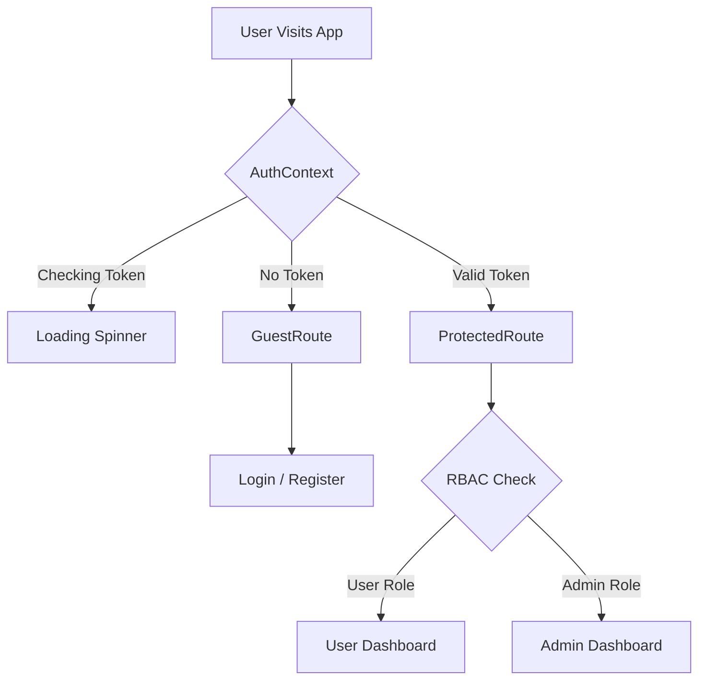
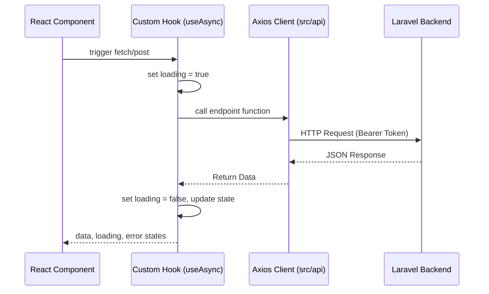

# CareerCompass Frontend 💻

> **React 19 + Vite + Tailwind CSS + Framer Motion + Recharts** — V3 UI for career skill gap analysis, job matching, and application tracking

## 📋 Overview

The CareerCompass frontend is a modern, responsive React application that provides a **SaaS-level** experience for users to upload CVs, browse jobs, analyze skill gaps, and receive personalized career recommendations. The V3 implementation delivers rich, data-driven UI components with robust error handling and a modular component architecture.

---

## 📐 System Architecture Diagrams

### Authentication & Routing Flow


### Data Lifecycle (Axios -> Hooks -> UI)


---

## ✨ V3 UI Features

### SaaS-Level Dashboard

| Feature | Implementation |
| ------- | -------------- |
| **Profile Completeness Circular Ring** | SVG-based progress ring (0–100%) — emerald ≥75%, amber ≥50%, slate below |
| **Top Skills Badges** | Sorted by `confidence_score` (descending); top 3–5 displayed in AI Insights Snapshot |
| **AI Insights Snapshot** | Headline, seniority, experience years, and top skills by confidence |
| **Market Readiness Score** | Pie/radar visualization; readiness percentage |
| **5s Discovery Animation** | `ProcessingAnimation` overlay when `is_new_role` triggers market discovery |

### Enhanced Profile Page

| Feature | Implementation |
| ------- | -------------- |
| **Experience Timeline** | Chronological work history (sorted by `end_date`), company, title, date ranges, description |
| **Skill Confidence Progress Bars** | Color-coded bars based on `confidence_score` (emerald ≥0.8, amber ≥0.6, orange ≥0.4) |
| **Evidence Tooltips** | Hover tooltips showing `evidence` (where the skill was found); safe optional chaining |
| **Rich Profile Pills** | Total experience years, seniority, primary domain |

### Market Intelligence

| Feature | Implementation |
| ------- | -------------- |
| **Interactive Skill Trends** | Rendered via Recharts `AreaChart` and `BarChart` to display dynamic data |
| **Live Quick Stats** | Live top-level indicators for active listings, unique roles, average skills per job |
| **Dynamic AI Summary** | Context-aware, AI-generated summary section synthesizing data across roles and skills |

### Gap Analysis — General CV Health

| Feature | Implementation |
| ------- | -------------- |
| **Strengths** | Green-themed list from `cv_analysis.strengths` |
| **Gaps** | Amber-themed list from `cv_analysis.gaps` (missing sections/info) |
| **Red Flags** | Rose-themed list from `cv_analysis.red_flags` (anomalies) |
| **Completeness Ring** | CV completeness score from `cv_analysis.completeness_score` |
| **Premium Match Gauge** | Radial bar representing the overall job match percentage utilizing Recharts |
| **Animated Recommendations** | `TypingEffect` component renders tailored AI advice dynamically |
| **Suggested Learning Paths** | Component mapping priority gaps to external curriculum links (Coursera/Udemy) |

### Robust Error Handling

| Feature | Implementation |
| ------- | -------------- |
| **Error Boundary** | Catches React render errors and unhandled promise rejections; displays fallback UI with refresh button |
| **Safe Optional Chaining** | `?.` and null checks throughout; safely scoped helpers prevent "White Screen of Death" |
| **Global Alerts** | Custom `ErrorAlert` and `SuccessAlert` wrappers handling visual push notifications |

### Internationalization (i18n)

| Feature | Implementation |
| ------- | -------------- |
| **Dynamic Translation Hooks** | Deployed with `react-i18next` and `i18next-browser-languagedetector` |
| **Localized UI Text** | Entire interface relies on the `useTranslation` hook pointing to local namespace files |

---

## 🏗️ Project Structure

```
frontend/
├── src/
│   ├── api/             # client.js, endpoints.js, scrapingSources.js, applications.js
│   ├── components/      # Navbar, ErrorBoundary, ProcessingAnimation, TypingEffect, Alerts, etc.
│   ├── context/         # AuthContext.jsx, ThemeContext.jsx
│   ├── hooks/           # useAsync, useAuthHandler, useOnDemandScraping, useScrapingStatus
│   ├── pages/
│   │   ├── admin/       # AdminSources, AdminDashboard, AdminJobs, AdminUsers, AdminTargets
│   │   └── user/        # Dashboard, Profile, GapAnalysis, Jobs, Applications, MarketIntelligence
│   ├── services/        # storageService.js
│   ├── App.jsx, main.jsx, index.css, i18n.js
│   └── ...
├── package.json
├── vite.config.js
├── tailwind.config.js
└── ...
```

---

## 🚀 Getting Started

### Prerequisites

- Node.js 18+
- Backend API on `http://127.0.0.1:8000`
- AI Gateway on `http://127.0.0.1:8001`
- AI CV Analyzer on `http://127.0.0.1:8002` (for full gap analysis)

### Installation

```bash
# 1. Clone & Enter Directory
cd frontend

# 2. Install Dependencies (Vite + React 19)
npm install

# 3. Environment Configuration
# MUST be configured for the frontend to communicate with Laravel
cp .env.example .env
```

**Required `.env` Variables:**
```env
VITE_API_URL=http://127.0.0.1:8000/api
```

### Run Development Server

```bash
npm run dev
```

App: http://localhost:5173

---

## 🗺️ Routes & Pages

Routing leverages `react-router-dom` enveloped in Framer Motion's `<AnimatePresence>` to orchestrate seamless page transitions.

| Route | Page | Description | Route Protection Logic |
| ----- | ---- | ----------- | ----------------------- |
| `/` | Home | Landing page | Public |
| `/login`, `/register` | Auth | Login / registration | `GuestRoute` (redirects existing sessions) |
| `/user/dashboard` | Dashboard | Profile completeness, top skills | `ProtectedRoute` |
| `/user/profile` | Profile | Experience timeline, skill updates | `ProtectedRoute` |
| `/user/jobs` | Jobs | Job listings, recommended jobs | `ProtectedRoute` |
| `/user/gap-analysis/:jobId` | GapAnalysis | Job-specific gap analysis | `ProtectedRoute` |
| `/user/market` | MarketIntelligence | Recharts trends, trending skills | `ProtectedRoute` |
| `/user/applications` | Applications | Job application tracker (Kanban) | `ProtectedRoute` |
| `/admin/*` | Admin | Scraping sources, jobs, users | `ProtectedRoute requireAdmin={true}` (Role RBAC) |

---

## 🧩 Key Components

| Component | Purpose |
| --------- | ------- |
| **ErrorBoundary** | Catches errors; prevents full-page crash; shows refresh option |
| **ProcessingAnimation** | Animated CV-processing overlay; 5s discovery message |
| **ProtectedRoute** | Modular Auth guard; supports standard and admin RBAC validation |
| **Navbar** | Scroll-aware glassmorphism; avatar dropdown; admin icon |
| **PremiumMatchGauge** | SVG-data radial representation visualization mapped from gap analysis score |
| **CompletenessRing** | Health indication SVG pie-chart mapping for general CV profile coverage |
| **TypingEffect** | Text rendering tool utilizing intervals for AI-generated advisory interactions |
| **LearningResource** | Direct resource navigation mapper querying strings against Udemy & Coursera |

### 🪝 The Hook Layer (Async State Management)

Instead of scattering `try/catch` and `loading` states across UI components, the application centralizes async operations via custom hooks:

| Hook | Purpose |
| ---- | ------- |
| **`useAsync`** | A generic wrapper for Axios calls. It manages `execute`, `status`, `value`, and `error` states, guaranteeing UI components automatically react to pending/resolved/rejected states. |
| **`useAuthHandler`** | Wraps `authAPI` methods to centralize Login, Register, and Logout logic, updating the `AuthContext` seamlessly. |
| **`useOnDemandScraping`** | Orchestrates the complex UI flow for scraping: triggering the job, initiating the `ProcessingAnimation`, and transitioning to polling. |
| **`useScrapingStatus`** | Polls the Laravel backend for background queue status (pending → processing → completed) and resolves the UI animation when finished. |

---

## 🛠️ Admin Tools & Management

The frontend provides dedicated, secure interfaces for users holding the `admin` role. These routes are protected by `<ProtectedRoute requireAdmin={true} />`.

| View | Purpose |
| ---- | ------- |
| **Admin Dashboard** | High-level system statistics, scraping batch progress, and Dead Letter Queue (DLQ) health tracking. |
| **Scraping Sources** | Full CRUD interface to toggle active job boards, configure API keys, and test endpoints directly. |
| **Target Roles** | Management of the self-expanding role registry (e.g., adding "AI Engineer" to the scheduled market scrape). |
| **User Management** | Interface to monitor platform users, view their details, and execute ban/unban commands. |

---

## 📡 API Integration

Centralized under `src/api`, utilizing a structured Axios configuration mapping.

- **client.js**: Maintains the core instance and defines the **Axios Interceptor** pipeline.
  - **Request Interceptor**: Auto-appends the required `Bearer {token}` logic derived from `localStorage`. 
  - **Response Interceptor**: Uniformly catches `401 Unauthorized` responses and enforces a complete authentication purge prior to redirect.
- **endpoints.js**: Maps abstract functions for endpoints like `authAPI`, `jobsAPI`, `cvAPI`, and `gapAnalysisAPI`.
- **scrapingSources.js & applications.js**: Dedicated APIs governing admin configurations and user tracker persistence.

---

## 📦 Technology Stack

| Technology | Purpose |
| ---------- | ------- |
| React 19 | Core UI library interface rendering framework |
| Vite 7 | Modern lightweight build tooling |
| Tailwind CSS | Utility-first styling methodology |
| Tailwind Merge & clsx | Dynamic CSS class deduplication and condition application utilities |
| Framer Motion | Specialized React animation primitives library |
| Recharts | Comprehensive SVG data visualization package |
| Axios | Reliable Promise-based HTTP protocol client |
| Lucide React | Clean minimalist SVG Icon Library Implementation |
| i18next & react-i18next | Multi-language scaling namespace controller suite  |
| SweetAlert2 | Pop-up styled modal alert notifications framework |

---

**Last Updated**: April 2026  
**Version**: 1.3.1  
**Status**: ✅ V3 UI — Dashboard, Profile, Gap Analysis, Market Intelligence, Protected Admin Routes
